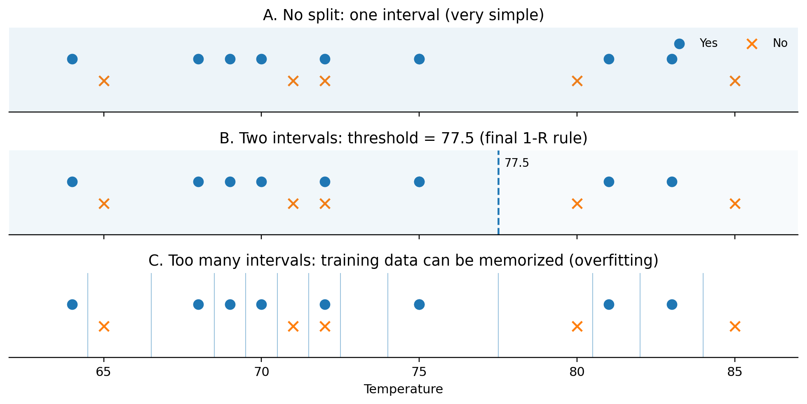

# Lecture 01 — 0-R, 1-R, and Naive Bayes Classification

> **Last Updated:** 2026-10-08
>
> Data Mining: Practical Machine Learning Tools and Techniques, Witten and Frank - Ch 4

> **Learning Objectives**:
> 1. Point out the instances, features, feature values, and class in the Weather dataset
> 2. Explain why the 0-R classifier serves as a baseline and compute its accuracy
> 3. Compute the rules and errors of each attribute with the 1-R algorithm, and explain why the total error of Outlook is 4/14
> 4. Explain how a numeric feature is discretized, and why splitting it into too many intervals lowers the training error while increasing overfitting
> 5. Distinguish the prior, likelihood, and posterior in Bayes' theorem
> 6. Classify a new instance with nominal and numeric features using Naive Bayes, and explain why P(feature | class) is multiplied

---

## Table of Contents

- [1. The Classification Problem and the Weather Dataset](#1-the-classification-problem-and-the-weather-dataset)
  - [1.1 The Starting Question](#11-the-starting-question)
  - [1.2 Shape of the Dataset and Terminology](#12-shape-of-the-dataset-and-terminology)
- [2. 0-R: Classifying Without Looking at Any Feature](#2-0-r-classifying-without-looking-at-any-feature)
- [3. 1-R: Classifying with a Single Feature](#3-1-r-classifying-with-a-single-feature)
  - [3.1 The Algorithm](#31-the-algorithm)
  - [3.2 Applying 1-R to the Weather Dataset](#32-applying-1-r-to-the-weather-dataset)
- [4. 1-R and Numeric Features](#4-1-r-and-numeric-features)
  - [4.1 Discretization](#41-discretization)
  - [4.2 How to Choose the Intervals](#42-how-to-choose-the-intervals)
  - [4.3 Why Overfitting Is a Problem](#43-why-overfitting-is-a-problem)
- [5. Bayes' Theorem](#5-bayes-theorem)
  - [5.1 The Theorem and Its Terms](#51-the-theorem-and-its-terms)
  - [5.2 Example: Meningitis and Stiff Neck](#52-example-meningitis-and-stiff-neck)
- [6. The Naive Bayesian Classifier](#6-the-naive-bayesian-classifier)
  - [6.1 The Naive Assumption](#61-the-naive-assumption)
  - [6.2 Counts and Probabilities of the Weather Data](#62-counts-and-probabilities-of-the-weather-data)
- [7. Weather Example: Classifying a New Instance](#7-weather-example-classifying-a-new-instance)
- [8. Promotion Data Example](#8-promotion-data-example)
- [9. Naive Bayes and Numeric Features](#9-naive-bayes-and-numeric-features)
  - [9.1 Gaussian Probability Density](#91-gaussian-probability-density)
  - [9.2 Numeric Weather Data](#92-numeric-weather-data)
  - [9.3 Classifying a New Instance](#93-classifying-a-new-instance)
  - [9.4 Assumptions, Strengths, and Weaknesses of Naive Bayes](#94-assumptions-strengths-and-weaknesses-of-naive-bayes)
- [10. Spam Email Classification Example](#10-spam-email-classification-example)
- [11. Wrap-Up: How Are Features Used?](#11-wrap-up-how-are-features-used)
- [Summary](#summary)
- [Review Questions](#review-questions)

---

<br>

## 1. The Classification Problem and the Weather Dataset

### 1.1 The Starting Question

**Classification** is the task of finding rules in data and using them to decide the class of a new instance. Let us start from the following question.

> **Starting question:** We have the training dataset below. When a new day (new instance) arrives, how do we decide whether its Play class is Yes or No?

**Weather dataset**

| Outlook | Temperature | Humidity | Windy | Play (class) |
|:--------|:------------|:---------|:------|:-------------|
| sunny | hot | high | false | no |
| sunny | hot | high | true | no |
| overcast | hot | high | false | yes |
| rainy | mild | high | false | yes |
| rainy | cool | normal | false | yes |
| rainy | cool | normal | true | no |
| overcast | cool | normal | true | yes |
| sunny | mild | high | false | no |
| sunny | cool | normal | false | yes |
| rainy | mild | normal | false | yes |
| sunny | mild | normal | true | yes |
| overcast | mild | high | true | yes |
| overcast | hot | normal | false | yes |
| rainy | mild | high | true | no |

Of the 14 days, Play = yes on 9 days and Play = no on 5 days. The 0-R, 1-R, and Naive Bayes classifiers of this chapter are all explained with this table as their training data.

### 1.2 Shape of the Dataset and Terminology

| Term | Meaning in this data |
|:-----|:---------------------|
| Instance / Example | One row: one day's observation |
| Feature / Attribute | Outlook, Temperature, Humidity, Windy |
| Feature value | sunny, hot, high, false, and so on |
| Class / Target | Play = yes or no |
| Classifier | A rule or model that looks at the features and decides the class of a new instance |

This chapter examines classifiers in three steps according to **how much feature information they use, and how**. 0-R uses no feature, 1-R uses one, and Naive Bayes uses all of them.

---

<br>

## 2. 0-R: Classifying Without Looking at Any Feature

The simplest idea is to predict the **most frequent class in the training data (the majority class)** for every new instance.

| Class | Count | Rule |
|:------|:-----:|:-----|
| Play = yes | 9 | Always predict Yes |
| Play = no | 5 | Not used |

> **0-R rule:** Play = Yes, whatever the Outlook, Temperature, Humidity, and Windy values of the new instance are.

| Accuracy | Error rate |
|:--------:|:----------:|
| 9/14 = 64.3% | 5/14 = 35.7% |

**Why start from 0-R**

- 0-R is the most basic **baseline** that any later classifier has to beat.
- It is the reference for checking whether adding features actually improves performance.

> **Think about it:** If a new model has 65% accuracy, can we call it clearly better than the 64.3% of 0-R?
>
> The absolute accuracy alone is not enough. Predicting the majority class without looking at any feature already gives 64.3%, so 65% means the features bought almost nothing. Performance is always judged against the baseline.

---

<br>

## 3. 1-R: Classifying with a Single Feature

### 3.1 The Algorithm

**1-R (One-R)** tests each attribute in turn. For each value of the attribute, it makes a rule that assigns the most frequent class, and then it chooses **the attribute with the smallest total error**. The result is a one-level set of rules on a single attribute.

```text
For each attribute:
    For each value of that attribute:
        count how often each class appears
        find the most frequent class
        make the rule assign that class to this value
    calculate the error rate of the rules
Choose the rules with the smallest error rate.
```

### 3.2 Applying 1-R to the Weather Dataset

| Attribute | Rules | Errors | Total Errors |
|:----------|:------|:------:|:------------:|
| outlook | sunny → no | 2/5 | **4/14** |
| | overcast → yes | 0/4 | |
| | rainy → yes | 2/5 | |
| temperature | hot → no | 2/4 | 5/14 |
| | mild → yes | 2/6 | |
| | cool → yes | 1/4 | |
| humidity | high → no | 3/7 | **4/14** |
| | normal → yes | 1/7 | |
| windy | false → yes | 2/8 | 5/14 |
| | true → no | 3/6 | |

The errors of Outlook are counted as follows. Of the 5 sunny days, 2 are yes and 3 are no, so the rule is sunny → no and it is wrong on 2 days. All 4 overcast days are yes, so there is no error. Of the 5 rainy days, 3 are yes and 2 are no, so the rule is rainy → yes and it is wrong on 2 days. The sum is 2 + 0 + 2 = 4, that is, **4/14**.

> **Chosen 1-R rule (Outlook):** sunny → no, overcast → yes, rainy → yes
>
> Training accuracy = 10/14 = 71.4%

Going from 64.3% with 0-R to 71.4% with 1-R, using just one feature reduces the error on the training data.

> **Note:** Outlook and Humidity both have a total error of 4/14. A tie can be broken arbitrarily, and Outlook is chosen here. A tie between classes within a value, such as hot in Temperature (2 yes, 2 no) and true in Windy (3 yes, 3 no), is also broken arbitrarily, which is why those rules are set to no.

---

<br>

## 4. 1-R and Numeric Features

### 4.1 Discretization

When Temperature is given as numbers, each number could be treated as a separate value. However, that creates too many values, and the rules may end up memorizing the training data.

**Temperature values of the Weather data** (values sorted, with the class of each value)

| 64 | 65 | 68 | 69 | 70 | 71 | 72 | 72 | 75 | 75 | 80 | 81 | 83 | 85 |
|:--:|:--:|:--:|:--:|:--:|:--:|:--:|:--:|:--:|:--:|:--:|:--:|:--:|:--:|
| yes | no | yes | yes | yes | no | no | yes | yes | yes | no | yes | yes | no |

**Discretization** groups numeric values into a few intervals and uses them like categorical values, that is, it converts numerical data into categorical data. For example, a feature such as age, which takes many different values between 0 and 120 such as 25, 39, 12, 58, 8, and so on, can be split into the following four intervals, with each interval replaced by a single category.

| Interval | Category |
|:--------:|:--------:|
| [0, 25] | y1 |
| (25, 35) | y2 |
| [35, 60] | y3 |
| [60, ∞) | y4 |

The age column then becomes a categorical feature that takes one of y1 to y4 instead of a number. Each interval collects several instances, so the 1-R rule that assigns a majority class to each interval becomes meaningful.

Varying the number of intervals for Temperature gives the following.



*Lecture 01, Page 4: Discretizing Temperature with different numbers of intervals (A one interval, B two intervals split at 77.5, C too many intervals)*

- **A. No split:** There is only one interval, which is very simple. It is the same as 0-R.
- **B. Two intervals:** The split is at threshold = 77.5. This is the final 1-R rule.
- **C. Too many intervals:** With too many intervals, the training data can be memorized (overfitting).

> **Key point:** With too few intervals, important differences can be missed (underfitting). With too many, the rules memorize the training instances almost one by one, and overfitting can occur.

### 4.2 How to Choose the Intervals

The textbook method puts a minimum limit so that **the majority class of each partition has at least a certain number of instances**, and **merges adjacent partitions that have the same majority class**.

**Example: minimum = 3**

1. **Initial class sequence:** Splitting at every change of class gives the following.

   `yes | no | yes yes yes | no no | yes yes yes | no | yes yes | no`

2. **Building partitions and merging adjacent partitions with the same majority class:** Each partition is widened until its majority class appears at least 3 times, and neighboring partitions with the same majority are merged.

   `yes no yes yes yes no no yes yes yes | no yes yes no`

3. **Final discretization:** The boundary is the midpoint between 75 and 80.

   - temperature ≤ 77.5 → yes
   - temperature > 77.5 → no

> **Note:** The last partition, `no yes yes no`, has two yes and two no, so it is a tie. The textbook assigns no to this partition.

### 4.3 Why Overfitting Is a Problem

1-R cuts the feature space into strips by the values of one attribute and chooses the attribute by the error rate of the strips. The nominal attributes of the Weather data have only 3 values for outlook, 3 for temperature, 2 for humidity, and 2 for windy, so each strip collects several instances. If temperature had 10 values, however, the space would be cut into very thin strips with only one or two instances each. An attribute with many values (a multi-valued feature) in this way makes the rules memorize the training data.

- A feature that almost uniquely identifies each instance, such as an **ID code** or a resident registration number, can produce rules with zero error on the training set. Since its value differs for every instance, such a feature is the least suitable kind of feature for classification.
- However, there is no rule for the new values in the test data, so it generalizes very poorly.
- In 1-R, the danger is not having many attributes but **a single attribute having too many distinct values**.

The difference can also be seen in the boundary of a model. A model that separates the two classes with a single straight line is a **generalized model**. A model that draws a winding boundary around every single training point is **overfitted to the training data**. Its training error is close to 0, but new data easily falls on the wrong side of that winding boundary.

> **Trade-off of discretization:** More intervals → the training error drops easily → the model complexity increases → the generalization on test data can actually get worse.

---

<br>

## 5. Bayes' Theorem

### 5.1 The Theorem and Its Terms

1-R selected only one feature. Now we want to decide the class by using Outlook, Temperature, Humidity, and Windy all together. To do this, we first look at **Bayes' theorem**.

$$
P(H \mid E) = \frac{P(E \mid H)\,P(H)}{P(E)}
$$

| Term | Notation | Meaning |
|:-----|:--------:|:--------|
| Prior probability | P(H) | Probability of the hypothesis before seeing the evidence |
| Conditional probability (likelihood) | P(E \| H) | Probability that the evidence appears when H is true |
| Posterior probability | P(H \| E) | Probability of H after seeing the evidence |

### 5.2 Example: Meningitis and Stiff Neck

A classic example of Bayes' theorem is meningitis and stiff neck.

- M: meningitis patient
- S: stiff neck if patient
- P(M) = 1/50000, P(S) = 1/20, P(S | M) = 0.5

Given P(S | M) = 0.5, what we want is the posterior probability, that is, **the probability of meningitis given a stiff neck**.

$$
P(M \mid S) = \frac{P(S \mid M)\,P(M)}{P(S)} = \frac{0.5 \times 1/50000}{1/20} = 0.0002
$$

> **Interpretation:** Even with the evidence of a stiff neck, the posterior probability of meningitis is only 0.0002. For rare events, the prior matters a great deal.

A model that classifies with Bayes' theorem in this way is a **Bayes classifier**, and the rule on which its classification is based is called the **Bayes rule**.

---

<br>

## 6. The Naive Bayesian Classifier

### 6.1 The Naive Assumption

Applying Bayes' theorem to classification, given the evidence E of a new instance, we can compute the posterior probability of each class H and choose the largest. When the evidence consists of the feature values x₁, …, xₙ, this becomes the following.

$$
P(C \mid x_1, \ldots, x_n) \propto P(C) \prod_{i=1}^{n} P(x_i \mid C)
$$

> **Naive assumption:** Given the class, each feature is assumed to be **independent** of the others. The likelihood of several features can therefore be factored into a product.

The denominator P(E) is common to all classes, so it does not have to be computed when choosing a class. That is why the formula uses proportionality (∝) instead of "=".

### 6.2 Counts and Probabilities of the Weather Data

**Textbook Table 4.2: The weather data, with counts and probabilities**

<table>
<thead>
<tr><th></th><th colspan="3">outlook</th><th colspan="3">temperature</th><th colspan="3">humidity</th><th colspan="3">windy</th><th colspan="2">play</th></tr>
<tr><th></th><th></th><th>yes</th><th>no</th><th></th><th>yes</th><th>no</th><th></th><th>yes</th><th>no</th><th></th><th>yes</th><th>no</th><th>yes</th><th>no</th></tr>
</thead>
<tbody>
<tr><th rowspan="3">Counts</th><td>sunny</td><td>2</td><td>3</td><td>hot</td><td>2</td><td>2</td><td>high</td><td>3</td><td>4</td><td>false</td><td>6</td><td>2</td><td>9</td><td>5</td></tr>
<tr><td>overcast</td><td>4</td><td>0</td><td>mild</td><td>4</td><td>2</td><td>normal</td><td>6</td><td>1</td><td>true</td><td>3</td><td>3</td><td></td><td></td></tr>
<tr><td>rainy</td><td>3</td><td>2</td><td>cool</td><td>3</td><td>1</td><td></td><td></td><td></td><td></td><td></td><td></td><td></td><td></td></tr>
<tr><th rowspan="3">Probabilities</th><td>sunny</td><td>2/9</td><td>3/5</td><td>hot</td><td>2/9</td><td>2/5</td><td>high</td><td>3/9</td><td>4/5</td><td>false</td><td>6/9</td><td>2/5</td><td>9/14</td><td>5/14</td></tr>
<tr><td>overcast</td><td>4/9</td><td>0/5</td><td>mild</td><td>4/9</td><td>2/5</td><td>normal</td><td>6/9</td><td>1/5</td><td>true</td><td>3/9</td><td>3/5</td><td></td><td></td></tr>
<tr><td>rainy</td><td>3/9</td><td>2/5</td><td>cool</td><td>3/9</td><td>1/5</td><td></td><td></td><td></td><td></td><td></td><td></td><td></td><td></td></tr>
</tbody>
</table>

The upper three rows are counts, and the lower three rows are the probabilities obtained by dividing those counts by the number of instances of each class (yes 9, no 5). For example, outlook = sunny has the counts yes 2 and no 3, and the probabilities 2/9 and 3/5. The values 9/14 and 5/14 in the play column are the class priors.

> **Caution:** We multiply **P(sunny | yes)**, not P(yes | sunny). In the table, yes appears twice when outlook = sunny. The probability is 2/9, not 2/5. In other words, it is **the probability of sunny given yes**, not the probability of yes given sunny. Two of the nine yes instances are sunny, so P(sunny | yes) = 2/9.

---

<br>

## 7. Weather Example: Classifying a New Instance

> **A new day:** Outlook = sunny, Temperature = cool, Humidity = high, Windy = true, Play = ???

**Likelihood × prior of Yes**

$$
\frac{2}{9} \times \frac{3}{9} \times \frac{3}{9} \times \frac{3}{9} \times \frac{9}{14} = 0.0053
$$

**Likelihood × prior of No**

$$
\frac{3}{5} \times \frac{1}{5} \times \frac{4}{5} \times \frac{3}{5} \times \frac{5}{14} = 0.0206
$$

**Normalized posterior probability**

$$
P(yes \mid E) = \frac{0.0053}{0.0053 + 0.0206} = 20.5\%, \qquad P(no \mid E) = 79.5\%
$$

> **Prediction:** No (79.5%)

For classification alone, we do not need to compute the common denominator P(E) of the two classes. Comparing P(E | class)P(class) selects the same class. The computation above writes out P(play = yes | E) as follows.

$$
P(yes \mid E) = \frac{2/9 \times 3/9 \times 3/9 \times 3/9 \times 9/14}{P(E)}
$$

In Bayes' formula P(H | e) = P(e | H)P(H) / P(e), P(e | H) is the **likelihood** and P(H) is the **prior probability**. Deciding play by comparing the posterior probabilities obtained in this way is an application of **Bayes's rule of conditional probability**.

---

<br>

## 8. Promotion Data Example

Consider an example in which several binary attributes are observed to classify the class Sex.

**Training data**

| Magazine Promotion | Watch Promotion | Life Insurance Promotion | Credit Card Insurance | Sex |
|:------------------:|:---------------:|:------------------------:|:---------------------:|:---:|
| Yes | No | No | No | Male |
| Yes | Yes | Yes | Yes | Female |
| No | No | No | No | Male |
| Yes | Yes | Yes | Yes | Male |
| Yes | No | Yes | No | Female |
| No | No | No | No | Female |
| Yes | Yes | Yes | Yes | Female |
| No | No | No | No | Male |
| Yes | No | No | No | Male |
| Yes | Yes | No | No | Female |

> **Instance to predict (Evidence):** Magazine Promotion = Yes, Watch Promotion = Yes, Life Insurance Promotion = No, Credit Card Insurance = No, Sex = ?

For each class, we multiply the conditional probabilities of this evidence by the prior and choose the larger. The table that summarizes this data with counts and ratios for each attribute (Table 10.5) is as follows.

**Table 10.5: Counts and Probabilities for Attribute Sex**

<table>
<thead>
<tr><th rowspan="2">Sex</th><th colspan="2">Magazine Promotion</th><th colspan="2">Watch Promotion</th><th colspan="2">Life Insurance Promotion</th><th colspan="2">Credit Card Insurance</th></tr>
<tr><th>Male</th><th>Female</th><th>Male</th><th>Female</th><th>Male</th><th>Female</th><th>Male</th><th>Female</th></tr>
</thead>
<tbody>
<tr><td>Yes</td><td>4</td><td>3</td><td>2</td><td>2</td><td>2</td><td>3</td><td>2</td><td>1</td></tr>
<tr><td>No</td><td>2</td><td>1</td><td>4</td><td>2</td><td>4</td><td>1</td><td>4</td><td>3</td></tr>
<tr><td>Ratio: yes/total</td><td>4/6</td><td>3/4</td><td>2/6</td><td>2/4</td><td>2/6</td><td>3/4</td><td>2/6</td><td>1/4</td></tr>
<tr><td>Ratio: no/total</td><td>2/6</td><td>1/4</td><td>4/6</td><td>2/4</td><td>4/6</td><td>1/4</td><td>4/6</td><td>3/4</td></tr>
</tbody>
</table>

In Table 10.5 there are 6 males and 4 females. Computing with these numbers gives the following.

$$
P(E \mid Male)\,P(Male) = \frac{4}{6} \times \frac{2}{6} \times \frac{4}{6} \times \frac{4}{6} \times \frac{6}{10} \approx 0.0593
$$

$$
P(E \mid Female)\,P(Female) = \frac{3}{4} \times \frac{2}{4} \times \frac{1}{4} \times \frac{3}{4} \times \frac{4}{10} \approx 0.0281
$$

Since 0.0593 > 0.0281, the instance is classified as **Sex = Male**. After normalization, the probability of Male is about 67.8%.

> **Note:** The training data table above differs from Table 10.5 in two rows. To match Table 10.5, the Sex of the 7th row should be Male and the Life Insurance Promotion of the 10th row should be Yes. Counting the table above as printed gives 5 males and 5 females, and the result flips to Female (0.0576 > 0.0384). The computation above follows the counts of Table 10.5.

---

<br>

## 9. Naive Bayes and Numeric Features

### 9.1 Gaussian Probability Density

If Temperature and Humidity are real numbers, instead of counting the frequency of each number, we assume a **Gaussian distribution for each class** and use the **probability density**. In other words, it uses a probability density function (PDF) to obtain the probabilities.

$$
f(x \mid C) = \frac{1}{\sigma_C \sqrt{2\pi}} \exp\!\left( -\frac{(x - \mu_C)^2}{2\sigma_C^2} \right)
$$

- e: the exponential function
- μ: the class mean for the given numerical attribute
- σ: the class standard deviation for the attribute
- x: the attribute value

### 9.2 Numeric Weather Data

Table 1.3 of the textbook is the weather data with Temperature and Humidity given as numbers.

**Textbook Table 1.3: Weather data with some numeric attributes**

| outlook | temperature | humidity | windy | play |
|:--------|:-----------:|:--------:|:-----:|:----:|
| sunny | 85 | 85 | false | no |
| sunny | 80 | 90 | true | no |
| overcast | 83 | 86 | false | yes |
| rainy | 70 | 96 | false | yes |
| rainy | 68 | 80 | false | yes |
| rainy | 65 | 70 | true | no |
| overcast | 64 | 65 | true | yes |
| sunny | 72 | 95 | false | no |
| sunny | 69 | 70 | false | yes |
| rainy | 75 | 80 | false | yes |
| sunny | 75 | 70 | true | yes |
| overcast | 72 | 90 | true | yes |
| overcast | 81 | 75 | false | yes |
| rainy | 71 | 91 | true | no |

In the summary of the numeric data (textbook Table 4.4), the nominal attributes are summarized with counts and probabilities as before, and the numeric attributes with the list of values, the mean, and the standard deviation for each class.

**Textbook Table 4.4: The numeric weather data with summary statistics**

<table>
<thead>
<tr><th colspan="3">outlook</th><th colspan="3">temperature</th><th colspan="3">humidity</th><th colspan="3">windy</th><th colspan="2">play</th></tr>
<tr><th></th><th>yes</th><th>no</th><th></th><th>yes</th><th>no</th><th></th><th>yes</th><th>no</th><th></th><th>yes</th><th>no</th><th>yes</th><th>no</th></tr>
</thead>
<tbody>
<tr><td>sunny</td><td>2</td><td>3</td><td></td><td>83</td><td>85</td><td></td><td>86</td><td>85</td><td>false</td><td>6</td><td>2</td><td>9</td><td>5</td></tr>
<tr><td>overcast</td><td>4</td><td>0</td><td></td><td>70</td><td>80</td><td></td><td>96</td><td>90</td><td>true</td><td>3</td><td>3</td><td></td><td></td></tr>
<tr><td>rainy</td><td>3</td><td>2</td><td></td><td>68</td><td>65</td><td></td><td>80</td><td>70</td><td></td><td></td><td></td><td></td><td></td></tr>
<tr><td></td><td></td><td></td><td></td><td>64</td><td>72</td><td></td><td>65</td><td>95</td><td></td><td></td><td></td><td></td><td></td></tr>
<tr><td></td><td></td><td></td><td></td><td>69</td><td>71</td><td></td><td>70</td><td>91</td><td></td><td></td><td></td><td></td><td></td></tr>
<tr><td></td><td></td><td></td><td></td><td>75</td><td></td><td></td><td>80</td><td></td><td></td><td></td><td></td><td></td><td></td></tr>
<tr><td></td><td></td><td></td><td></td><td>75</td><td></td><td></td><td>70</td><td></td><td></td><td></td><td></td><td></td><td></td></tr>
<tr><td></td><td></td><td></td><td></td><td>72</td><td></td><td></td><td>90</td><td></td><td></td><td></td><td></td><td></td><td></td></tr>
<tr><td></td><td></td><td></td><td></td><td>81</td><td></td><td></td><td>75</td><td></td><td></td><td></td><td></td><td></td><td></td></tr>
<tr><td>sunny</td><td>2/9</td><td>3/5</td><td>mean</td><td>73</td><td>74.6</td><td>mean</td><td>79.1</td><td>86.2</td><td>false</td><td>6/9</td><td>2/5</td><td>9/14</td><td>5/14</td></tr>
<tr><td>overcast</td><td>4/9</td><td>0/5</td><td>std dev</td><td>6.2</td><td>7.9</td><td>std dev</td><td>10.2</td><td>9.7</td><td>true</td><td>3/9</td><td>3/5</td><td></td><td></td></tr>
<tr><td>rainy</td><td>3/9</td><td>2/5</td><td></td><td></td><td></td><td></td><td></td><td></td><td></td><td></td><td></td><td></td><td></td></tr>
</tbody>
</table>

The mean and std dev at the bottom of the table are used as the μ and σ of the Gaussian formula. For example, Temperature has μ = 73 and σ = 6.2 for yes, and μ = 74.6 and σ = 7.9 for no.

### 9.3 Classifying a New Instance

> **A new day:** Outlook = sunny, Temperature = 66, Humidity = 90, Windy = true, Play = ???

The probability density of Temperature = 66 given the class yes is as follows.

$$
f(temperature = 66 \mid yes) = \frac{1}{\sqrt{2\pi} \cdot 6.2} \, e^{-\frac{(66 - 73)^2}{2 \cdot 6.2^2}} = 0.0340
$$

In the same way, the probability density of yes when humidity is 90 is as follows.

$$
f(humidity = 90 \mid yes) = 0.0221
$$

Therefore, the probabilities of the nominal attributes and the densities of the numeric attributes are multiplied together.

$$
P(E \mid yes)\,P(yes) = \frac{2}{9} \times 0.0340 \times 0.0221 \times \frac{3}{9} \times \frac{9}{14} = 0.000036
$$

$$
P(E \mid no)\,P(no) = \frac{3}{5} \times 0.0291 \times 0.0380 \times \frac{3}{5} \times \frac{5}{14} = 0.000136
$$

$$
P(yes \mid E) = \frac{0.000036}{0.000036 + 0.000136} = 20.9\%, \qquad P(no \mid E) = 79.1\%
$$

> **Prediction:** No

> **Note:** Plugging the numbers into the formula gives f(temperature = 66 | no) ≈ 0.0279. The value of P(E | no)P(no) computed with 0.0279 matches 0.000136, while 0.0291 gives about 0.000142, so 0.0291 appears to be a typo in the textbook. Either value predicts No.

If we draw the posterior probabilities P(Yes | e) and P(No | e) of the two classes as curves over the evidence e, the Naive Bayes decision at a given e is to choose, among H ∈ {Yes, No}, the class with the larger P(H | e). In the example above the values are 20.9% and 79.1%, so No is chosen.

### 9.4 Assumptions, Strengths, and Weaknesses of Naive Bayes

The nature of Naive Bayes can be summed up with the following question.

> **Does Naive Bayes model the relationships between features?**
>
> As a probabilistic model, Naive Bayes assumes that **every feature contributes with equal weight** and that **the features are independent of each other** given the class.
>
> General machine learning models, in contrast, treat features as differing in importance and do not assume independence between them.

These assumptions lead to the following strengths and weaknesses.

- **Strengths:** It only needs counts, means, and standard deviations, so training is very fast and simple. Even with many features, it just multiplies probabilities, and it gives the probabilities themselves as output.
- **Weaknesses:** Features in real data are often not independent, and it does not distinguish important features from less important ones. Also, if the probability of one feature is 0, the whole product becomes 0 (see Section 10).

---

<br>

## 10. Spam Email Classification Example

Consider an example that treats words as attributes and separates spam from valid email (ham).


*Lecture 01, Page 18: The spam example that uses words as attributes*

| Doc | Email text | Class |
|:---:|:-----------|:-----:|
| D1 | send us your password | spam |
| D2 | send us your review | ham |
| D3 | review your password | ham |
| D4 | review us | spam |
| D5 | send your password | spam |
| D6 | send us your account | spam |

> **New email:** "review us now"

**Prior**

| P(spam) | P(ham) |
|:-------:|:------:|
| 4/6 | 2/6 |

**Word probabilities**

| Word | P(word \| spam) | P(word \| ham) |
|:-----|:---------------:|:--------------:|
| password | 2/4 | 1/2 |
| review | 1/4 | 2/2 |
| send | 3/4 | 1/2 |
| us | 3/4 | 1/2 |
| your | 3/4 | 1/2 |
| account | 1/4 | 0/2 |

> **Think about it:** To classify the new email "review us now", which word probabilities should be used? How should "now", which does not appear in the training data, be handled?

This example shows how Naive Bayes in text classification **"treats words as features and combines several pieces of evidence probabilistically"**.

**Solution.** Treat each word as a binary attribute that is yes when the word appears and no when it does not. The vocabulary consists of the six words in the training data, and "now", which does not appear in the training data, gives no information to either class, so it is left out of the computation. The evidence is therefore as follows.

E = (password = no, review = yes, send = no, us = yes, your = no, account = no)

The probability that a word is absent is 1 minus the probability that it is present.

$$
P(E \mid spam)\,P(spam) = \frac{2}{4} \times \frac{1}{4} \times \frac{1}{4} \times \frac{3}{4} \times \frac{1}{4} \times \frac{3}{4} \times \frac{4}{6} = \frac{18}{4096} \times \frac{4}{6} \approx 0.00293
$$

$$
P(E \mid ham)\,P(ham) = \frac{1}{2} \times \frac{2}{2} \times \frac{1}{2} \times \frac{1}{2} \times \frac{1}{2} \times \frac{2}{2} \times \frac{2}{6} = \frac{1}{16} \times \frac{2}{6} \approx 0.02083
$$

$$
P(spam \mid E) = \frac{0.00293}{0.00293 + 0.02083} \approx 0.123
$$

Since P(spam | E) ≈ 12.3%, "review us now" is classified as **ham**.

> **Note:** The word probability table treats D3 as "review your password" (if D3 contained us, P(us | ham) would be 2/2). Also, counting the documents directly, your appears in both ham documents, so P(your | ham) = 2/2, while the probability table writes 1/2. With 2/2, P(your = no | ham) = 0 and the whole product for ham becomes 0. A single zero count that overrides all other evidence in this way is called the **zero-frequency problem**, and it is usually solved with the **Laplace estimator**, which adds 1 to every count (textbook Section 4.2).

---

<br>

## 11. Wrap-Up: How Are Features Used?

| Classifier | Features used | Decision method | Key issue |
|:-----------|:-------------:|:----------------|:----------|
| 0-R | 0 | majority class | baseline |
| 1-R | 1 | majority rule per value + error minimization | discretization, overfitting |
| Naive Bayes | many | prior × feature likelihoods | conditional independence assumption |

> **In one sentence:** 0-R → 1-R → Naive Bayes shows step by step "how much feature information we use, and in what way, when predicting the class from data".

**Self-check questions**

- Can you point out a new instance, a feature, a feature value, and the class in the Weather dataset?
- Can you explain why the error of Outlook is 4/14 in the 1-R table?
- Why does discretizing a numeric feature too finely lower the training error while increasing overfitting?
- Can you distinguish the prior, likelihood, and posterior in Bayes' formula?
- Can you explain why Naive Bayes multiplies P(feature | class)?

---

<br>

## Summary

| Concept | Key Points |
|:--------|:-----------|
| Classification | Find rules from the features and classes of the training data and decide the class of a new instance. |
| 0-R | Predict the majority class without looking at any feature. Its accuracy on Weather is 9/14 = 64.3%, and it is the baseline for every model. |
| 1-R | For each attribute, build a majority rule per value and choose the attribute with the smallest total error. On Weather, Outlook (4/14) is chosen, giving an accuracy of 71.4%. |
| Discretization | Group numeric values into intervals and use them like categories. Each interval's majority class must reach a minimum count, and neighboring intervals with the same majority are merged. |
| Overfitting | Too many intervals or values lower the training error but hurt generalization. A feature that differs for every instance, such as an ID, is the extreme case. |
| Bayes' theorem | P(H \| E) = P(E \| H)P(H) / P(E). For rare events, the prior strongly drives the result. |
| Naive Bayes | Assume the features are independent given the class and choose the class with the largest P(C)∏P(xᵢ \| C). Multiply P(value \| class), not P(class \| value). |
| Numeric features | Compute a Gaussian density from the class mean and standard deviation and multiply it in place of a probability. |
| Text classification | Treat words as binary attributes and multiply their probabilities. A zero probability is corrected with the Laplace estimator. |

---

<br>

## Review Questions

1. **Baseline:** A dataset has 70 instances of class A and 30 of class B. How should a new model with 72% accuracy be evaluated?

   > **Answer:** 0-R always predicts A and gets 70% accuracy. 72% is only 2 percentage points above the baseline, so the gain from using features is small. A model's performance must be judged against the 0-R baseline.

2. **1-R error:** Explain why the total error of Humidity in the Weather data is 4/14.

   > **Answer:** The 7 days with humidity = high have 3 yes and 4 no, so the rule is high → no and it is wrong on 3 days. The 7 normal days have 6 yes and 1 no, so the rule is normal → yes and it is wrong on 1 day. The sum is 3 + 1 = 4, which gives 4/14.

3. **Overfitting:** When each instance has a different ID number, what happens to the training error and the test performance if 1-R chooses the ID attribute?

   > **Answer:** Each ID value has only one instance, so the majority class of each value is the correct answer and the training error is 0. However, there is no rule for a new ID in the test data, so the generalization is very poor. 1-R must be careful with attributes that have too many distinct values.

4. **Bayes' theorem:** With P(M) = 1/50000, P(S) = 1/20, and P(S | M) = 0.5, compute P(M | S) and explain its meaning.

   > **Answer:** P(M | S) = 0.5 × (1/50000) / (1/20) = 0.0002. Even with the evidence of a stiff neck, the prior of meningitis is so small that the posterior is also very small.

5. **Direction of probability:** In the Weather data, what is P(sunny | yes), and how does it differ from P(yes | sunny)?

   > **Answer:** P(sunny | yes) is the fraction of the 9 yes days that are sunny, which is 2/9. P(yes | sunny) is the fraction of the 5 sunny days that are yes, which is 2/5. What Naive Bayes multiplies is the likelihood, P(sunny | yes).

6. **Naive Bayes computation:** Classify a day with Outlook = overcast, Temperature = mild, Humidity = high, and Windy = false in the Weather data.

   > **Answer:** yes: 4/9 × 4/9 × 3/9 × 6/9 × 9/14 ≈ 0.0282. no: 0/5 × 2/5 × 4/5 × 2/5 × 5/14 = 0. The day is therefore classified as yes. Here P(overcast | no) = 0 makes the whole product for no equal to 0, which the Laplace estimator can avoid.

7. **Numeric features:** When a numeric attribute is used in Naive Bayes, what must be computed for each class, and how is the probability of a new value obtained?

   > **Answer:** For each class, compute the mean μ and standard deviation σ of the attribute values. When a new value x arrives, compute the Gaussian density f(x | C) = (1 / (σ√(2π))) × exp(−(x − μ)² / (2σ²)) and multiply it together with the probabilities of the nominal attributes.

8. **Text classification:** In the spam example, why can the word "now", which is not in the training data, be left out of the computation?

   > **Answer:** "now" is not in the vocabulary, so it has no count in either spam or ham. It gives the same information to both classes, so it does not affect the comparison of the posteriors. The evidence is therefore built from the six words in the vocabulary only.

---
