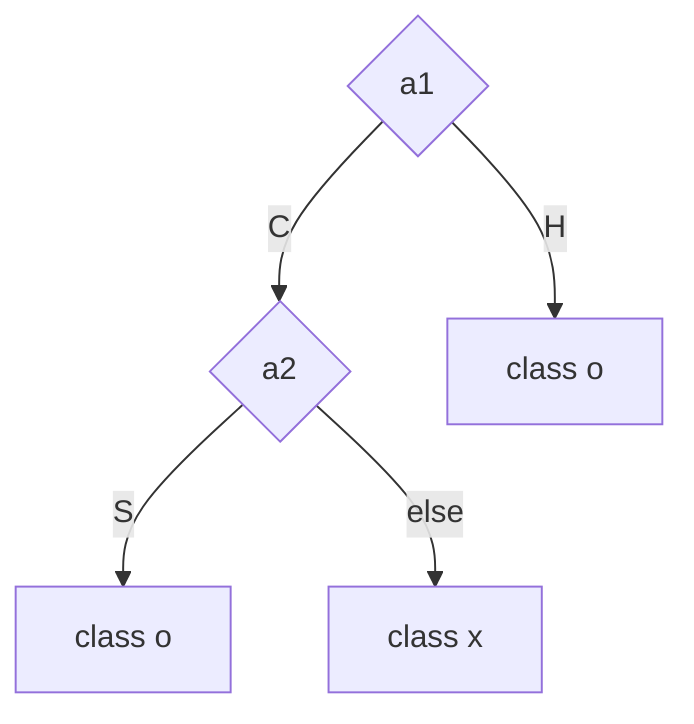
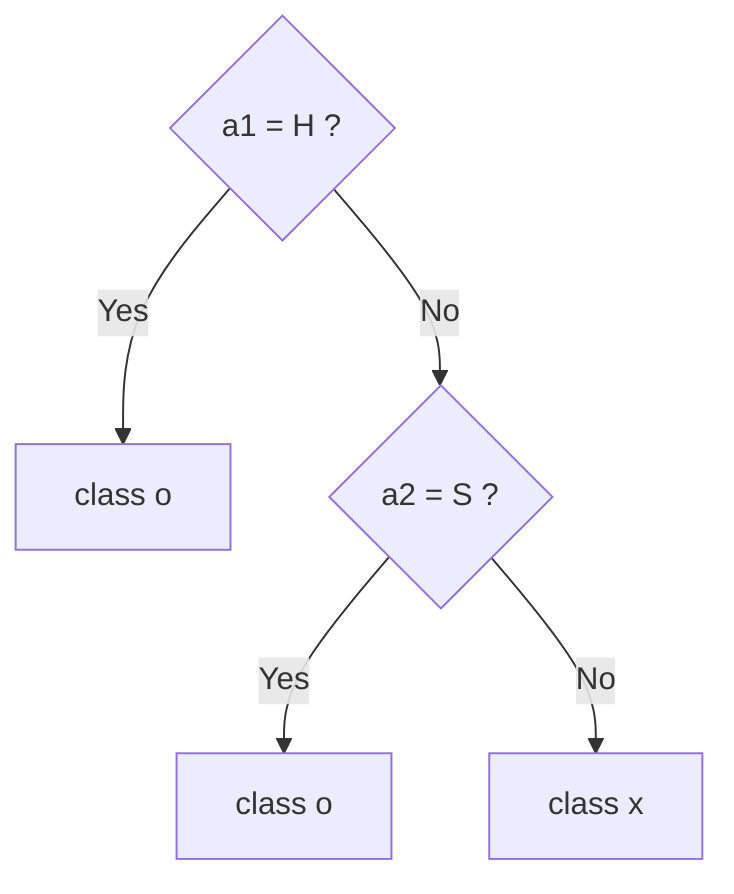
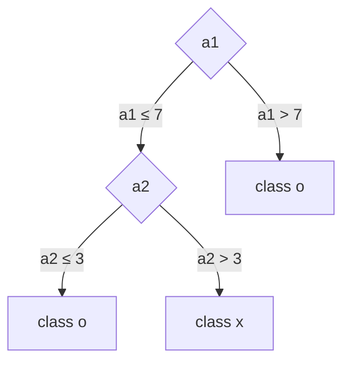

# 강의 02 — 정보, 불확실성, 엔트로피

> **최종 수정일:** 2026-10-08
>
> Data Mining: Practical Machine Learning Tools and Techniques, Witten and Frank - Ch 4

> **학습 목표**:
> 1. 정보의 가치를 정보를 얻기 전과 얻은 후의 불확실성 차이로 설명할 수 있다
> 2. 같은 확률의 결과가 M개일 때 불확실성 log₂M을 bit 단위로 계산할 수 있다
> 3. 결과마다 확률이 다를 때 entropy H = −Σ Pᵢ log₂ Pᵢ를 유도하고 계산할 수 있다
> 4. DNA 예제에서 관찰로 얻은 정보량을 계산할 수 있다
> 5. feature 자체의 entropy와, feature 값이 주어졌을 때 남은 class entropy를 구분하여 계산할 수 있다
> 6. entropy를 줄이는 방향으로 feature space를 나누는 아이디어가 decision tree로 이어지는 과정을 설명할 수 있다

---

## 목차

- [1. 정보는 불확실성을 얼마나 줄여 주는가](#1-정보는-불확실성을-얼마나-줄여-주는가)
- [2. 불확실성은 무엇인가](#2-불확실성은-무엇인가)
- [3. 가능한 결과의 수와 bit](#3-가능한-결과의-수와-bit)
- [4. 결과들의 확률이 서로 다를 때: Entropy](#4-결과들의-확률이-서로-다를-때-entropy)
  - [4.1 −log₂ P로 바꾸어 쓰기](#41-log₂-p로-바꾸어-쓰기)
  - [4.2 Entropy의 정의](#42-entropy의-정의)
  - [4.3 Entropy의 의미](#43-entropy의-의미)
- [5. 사례 1: DNA position의 Entropy](#5-사례-1-dna-position의-entropy)
- [6. 사례 2: 과일 데이터](#6-사례-2-과일-데이터)
  - [6.1 feature 자체의 엔트로피: Size의 예](#61-feature-자체의-엔트로피-size의-예)
  - [6.2 Size가 주어졌을 때 Class의 엔트로피](#62-size가-주어졌을-때-class의-엔트로피)
- [7. 세 feature가 주어졌을 때 A/B의 혼란도 비교](#7-세-feature가-주어졌을-때-ab의-혼란도-비교)
  - [7.1 Color가 주어졌을 때](#71-color가-주어졌을-때)
  - [7.2 Surface가 주어졌을 때](#72-surface가-주어졌을-때)
  - [7.3 비교](#73-비교)
- [8. 이 아이디어가 Decision Tree로 이어진다](#8-이-아이디어가-decision-tree로-이어진다)
  - [8.1 Categorical feature space](#81-categorical-feature-space)
  - [8.2 Continuous feature space](#82-continuous-feature-space)
- [9. 무엇을 기억해야 하는가](#9-무엇을-기억해야-하는가)
- [요약](#요약)
- [점검 문제](#점검-문제)

---

<br>

## 1. 정보는 불확실성을 얼마나 줄여 주는가

기계학습에서는 어떤 feature가 예측에 얼마나 도움이 되는지 판단해야 하는 경우가 많다. 예를 들어 분류 문제에서 여러 class가 섞여 있을 때, 어떤 feature의 값을 알게 되면(즉 어떤 정보를 알게 되면) class를 훨씬 더 잘 구별할 수 있다. 그렇다면 그 feature가 제공한 정보의 가치를 어떻게 수치로 표현할 수 있을까?

이 질문은 **불확실성(uncertainty)** 에서 출발한다. 여기서는 불확실성을 직관적으로 **혼란도** 라고 생각하자. 좋은 정보라면 그 정보를 얻은 뒤 혼란도가 크게 줄어들어야 한다.

> **Information reduces Uncertainty.** 정보의 가치는 **정보를 얻기 전과 얻은 후의 불확실성 차이** 로 생각할 수 있다.
>
> $$\text{Information} = H_{\text{before}} - H_{\text{after}}$$

---

<br>

## 2. 불확실성은 무엇인가

동전 하나가 있다고 하자. 동전을 던지기 전에 앞면이 나올지 뒷면이 나올지를 맞추어 보자. 앞면과 뒷면이 나올 확률이 같다면

$$
P(\text{앞면}) = P(\text{뒷면}) = \frac{1}{2}
$$

이다. 동전을 던지기 전에는 무엇이 나올지 알 수 없다. 즉 불확실성이 크다. 반대로 어떤 조작된 동전이 항상 앞면만 나온다고 알고 있다면

$$
P(\text{앞면}) = 1
$$

이고 결과는 이미 정해져 있다. 이 경우 불확실성은 0이라고 할 수 있다. 즉 "이 동전은 항상 앞면만 나온다"는 정보가 불확실성을 완전히 제거한 것이다.

> **불확실성의 직관**
> - 결과를 예측하기 어려울수록 불확실성이 크다.
> - 특정 결과가 거의 확실할수록 불확실성이 작다.
> - 결과가 완전히 정해져 있으면 불확실성은 0이다.

---

<br>

## 3. 가능한 결과의 수와 bit

먼저 모든 결과가 같은 확률로 발생하는 간단한 경우를 생각해 보자. 가능한 symbol의 수가 M개이고 각각이 동일한 확률로 발생한다면 불확실성은 다음과 같이 나타낼 수 있다.

$$
H = \log_2 M
$$

| 가능한 결과의 수 M | 예 | 불확실성 |
|:-----------------:|:---|:---------|
| 1 | 항상 앞면 | log₂ 1 = 0 bit |
| 2 | 공정한 동전 | log₂ 2 = 1 bit |
| 4 | 네 가지 symbol | log₂ 4 = 2 bits |
| 8 | 여덟 가지 symbol | log₂ 8 = 3 bits |

**Base 2 logarithm** 을 사용하면 단위가 **bit** 가 된다. 2가지 결과를 구별하려면 1 bit, 8가지 결과를 구별하려면 3 bits가 필요하다는 사실과도 연결된다.

---

<br>

## 4. 결과들의 확률이 서로 다를 때: Entropy

### 4.1 −log₂ P로 바꾸어 쓰기

지금까지는 모든 symbol이 같은 확률로 나타난다고 가정하였다. 이 경우 각 symbol이 나타날 확률은

$$
P = \frac{1}{M}
$$

이다. 따라서 다음과 같이 쓸 수 있다.

$$
\log_2 M = \log_2 \frac{1}{P} = -\log_2 P
$$

이 관계가 중요하다. 가능한 symbol의 수 M만 알고 있을 때 사용하던 log₂ M을, 이제는 **각 symbol이 실제로 나타날 확률** 을 사용하여 표현할 수 있기 때문이다.

현실에서는 symbol마다 확률이 다를 수 있으므로, i번째 symbol의 발생 확률을 Pᵢ라고 쓰자. 그러면 그 symbol과 관련된 불확실성의 크기를 −log₂ Pᵢ로 나타낼 수 있다. 예를 들어

$$
P_i = 1 \Rightarrow -\log_2 P_i = 0, \qquad P_i = \frac{1}{2} \Rightarrow -\log_2 P_i = 1, \qquad P_i = \frac{1}{4} \Rightarrow -\log_2 P_i = 2
$$

이다. **자주 나타나는 symbol은 혼란도 값이 작고, 드물게 나타나는 symbol은 값이 크다.**

### 4.2 Entropy의 정의

하지만 전체 데이터의 혼란도를 구하려면 symbol 하나만 보면 안 된다. 모든 symbol의 값을 종합해야 한다. M개의 symbol이 있고 각 확률이 P₁, P₂, …, P_M이라면

$$
\sum_{i=1}^{M} P_i = 1
$$

이고, 각 symbol의 −log₂ Pᵢ를 그 symbol이 실제로 나타날 확률 Pᵢ만큼 가중하여 평균하면 된다.

$$
H = -\sum_{i=1}^{M} P_i \log_2 P_i
$$

이 H를 **Entropy** 라고 한다.

### 4.3 Entropy의 의미

> **Entropy의 의미**
> - Entropy가 높다: 여러 결과가 비슷한 확률로 섞여 있어 예측하기 어렵다.
> - Entropy가 낮다: 특정 결과가 지배적이어서 어느 정도 예측할 수 있다.
> - Entropy가 0이다: 결과가 완전히 정해져 있다.

두 class 문제에서는 50:50일 때 entropy가 최대이고, 100:0 또는 0:100일 때 0이다.

$$
H(0.5,\ 0.5) = 1, \qquad H(1,\ 0) = 0
$$

> **참고:** H(1, 0)을 계산할 때 0 × log₂ 0이 나타난다. 확률이 0에 가까워질수록 P log₂ P는 0에 가까워지므로, entropy 계산에서는 0 log₂ 0 = 0으로 둔다.

---

<br>

## 5. 사례 1: DNA position의 Entropy

DNA의 어느 한 position에는 A, C, G, T 중 하나가 나타난다고 하자. 아무 정보가 없다면 네 symbol이 동일한 확률로 나타난다고 가정할 수 있다.

$$
P(A) = P(C) = P(G) = P(T) = \frac{1}{4}
$$

따라서 관찰 전 uncertainty는

$$
H_{\text{before}} = \log_2 4 = 2 \text{ bits}
$$

이다. 이제 여러 sequence를 관찰한 결과 그 position에서 다음과 같은 symbol들이 나타났다고 하자.

```text
ACATGAAC
```

8번의 관찰에서 A : 4, C : 2, G : 1, T : 1이므로

$$
P(A) = \frac{1}{2}, \qquad P(C) = \frac{1}{4}, \qquad P(G) = P(T) = \frac{1}{8}
$$

이다. 관찰 후 entropy는 symbol이 4개이므로

$$
\begin{aligned}
H_{\text{after}} &= -\frac{1}{2}\log_2\frac{1}{2} - \frac{1}{4}\log_2\frac{1}{4} - \frac{1}{8}\log_2\frac{1}{8} - \frac{1}{8}\log_2\frac{1}{8} \\
&= \frac{1}{2} + \frac{1}{2} + \frac{3}{8} + \frac{3}{8} \\
&= 1.75 \text{ bits}
\end{aligned}
$$

이다. 따라서 관찰을 통해 얻은 정보량은 다음과 같다.

$$
\text{Information} = 2 - 1.75 = 0.25 \text{ bits}
$$

> **해석:** 관찰하기 전에는 네 symbol이 모두 똑같이 가능하다고 생각했기 때문에 혼란도가 2 bits였다. 실제 관찰 결과 A가 더 자주 나타난다는 정보를 얻으면서 혼란도가 1.75 bits로 줄었다. 즉 관찰은 이 position에 대해 0.25 bit만큼 불확실성을 줄여 주었다.

---

<br>

## 6. 사례 2: 과일 데이터

다음 6개의 과일이 두 class A와 B로 분류되어 있다고 하자. 각 과일은 Size, Color, Surface의 세 feature를 가진다.

| No. | Size | Color | Surface | Class |
|:---:|:-----|:------|:--------|:-----:|
| 1 | Small | Yellow | Smooth | A |
| 2 | Medium | Red | Smooth | A |
| 3 | Medium | Red | Smooth | A |
| 4 | Big | Red | Rough | A |
| 5 | Medium | Yellow | Smooth | B |
| 6 | Medium | Yellow | Smooth | B |

먼저 데이터만 보고 Class A와 B를 예측하는 데 가장 도움이 되는 feature가 무엇인지, 그 이유는 무엇인지 생각해 볼 수 있다. 이 직관을 정량적으로 확인하는 방법이 엔트로피 값의 비교이다.

### 6.1 feature 자체의 엔트로피: Size의 예

Size의 값은 Small 1개, Medium 4개, Big 1개이다. 따라서 3개의 symbol에 대한 각각의 확률로 H를 계산하면

$$
H(\text{Size}) = -\frac{1}{6}\log_2\frac{1}{6} - \frac{4}{6}\log_2\frac{4}{6} - \frac{1}{6}\log_2\frac{1}{6} \approx 1.252 \text{ bits}
$$

가 되고, 이것은 Size라는 feature의 값들이 얼마나 다양하게 섞여 있는가를 나타낸다.

> **주의:** 그러나 우리의 분류 목표는 Size의 값을 예측하는 것이 아니다. 관심 있는 것은 **Class가 A인지 B인지** 이다. 따라서 실제로 알고 싶은 것은 "Size 값이 주어졌을 때 A와 B의 혼란도가 얼마나 남아 있는가"이다. 이때 entropy 식의 Pᵢ에서 i는 Size의 값이 아니라 **class A와 B** 를 뜻한다.

A와 B를 예측할 정보가 전혀 없을 때 혼란도는 가장 크다. 우리가 알고 싶은 것은 어떤 feature의 값을 알게 되었을 때 그 혼란도가 얼마나 줄어드는가이다. 이는 Naive Bayesian Classifier가 prior probability P(H)에서 출발하여 P(E | H) 정보를 하나씩 더해 가며 P(H | E)의 예측을 개선하는 것과 같은 발상이다.

이제 클래스 A와 B의 혼란도를 줄여 주는 feature를 엔트로피 값으로 찾는다.

### 6.2 Size가 주어졌을 때 Class의 엔트로피

예를 들어 size = medium이라는 정보가 주어지면 해당 instance는 4개(A 2개, B 2개)이다. 이 4개에 대한 혼란도는 두 symbol A와 B의 확률로 entropy를 구하면 된다.

$$
H(\text{Class} \mid \text{size} = \text{medium}) = -\sum_{i} P_i \log_2 P_i = -P_A \log_2 P_A - P_B \log_2 P_B = -\frac{1}{2}\log_2\frac{1}{2} - \frac{1}{2}\log_2\frac{1}{2} = 1 \text{ bit}
$$

같은 방식으로 size = big과 size = small의 entropy는 각각 0 bit이다(둘 다 A 하나뿐이다). H(Class | Size)는 세 값의 entropy를 각 값이 나타나는 비율로 가중 평균한 것이므로 다음과 같다.

$$
H(\text{Class} \mid \text{Size}) = \frac{1}{6}(0) + \frac{4}{6}(1) + \frac{1}{6}(0) = 0.667 \text{ bits}
$$

---

<br>

## 7. 세 feature가 주어졌을 때 A/B의 혼란도 비교

같은 방법으로 Color와 Surface에 대해서도, **그 feature의 값이 주어졌을 때 Class A/B의 entropy** 를 계산한다.

### 7.1 Color가 주어졌을 때

Yellow인 경우 A = 1, B = 2이므로

$$
H(\text{Class} \mid \text{Yellow}) = -\frac{1}{3}\log_2\frac{1}{3} - \frac{2}{3}\log_2\frac{2}{3} \approx 0.918
$$

Red인 경우 A = 3, B = 0이므로 entropy는 0이다. 두 값이 각각 3개씩이므로 다음과 같다.

$$
H(\text{Class} \mid \text{Color}) = \frac{3}{6}(0.918) + \frac{3}{6}(0) = 0.459 \text{ bits}
$$

### 7.2 Surface가 주어졌을 때

Smooth인 경우 A = 3, B = 2이므로

$$
H(\text{Class} \mid \text{Smooth}) = -\frac{3}{5}\log_2\frac{3}{5} - \frac{2}{5}\log_2\frac{2}{5} \approx 0.971
$$

Rough인 경우 A = 1, B = 0이므로 entropy는 0이다. 따라서 다음과 같다.

$$
H(\text{Class} \mid \text{Surface}) = \frac{5}{6}(0.971) + \frac{1}{6}(0) \approx 0.809 \text{ bits}
$$

### 7.3 비교

| 주어진 feature | 남아 있는 Class A/B의 평균 Entropy |
|:--------------|:---------------------------------:|
| Size | 0.667 bits |
| Color | **0.459 bits** |
| Surface | 0.809 bits |

> **핵심:** 이 표에서 계산한 것은 feature 자체의 entropy가 아니다. **그 feature의 값을 알게 되었을 때 A와 B를 구분하는 데 얼마나 혼란이 남아 있는가** 이다. 값이 작을수록 해당 feature가 class를 더 잘 구분해 준다. 이 예에서는 Color를 알았을 때 A/B의 혼란도가 가장 작다.

> **참고:** 분할 전 class 분포는 A = 4, B = 2이므로 H(Class) = −(4/6)log₂(4/6) − (2/6)log₂(2/6) ≈ 0.918 bits이고, 각 feature로 줄어든 혼란도는 Size 0.918 − 0.667 = 0.252, Color 0.918 − 0.459 = 0.459, Surface 0.918 − 0.809 = 0.109이다. 이 차이를 Decision Tree에서는 **Information Gain** 이라고 부르며, 강의 03에서 자세히 다룬다.

---

<br>

## 8. 이 아이디어가 Decision Tree로 이어진다

아이디어는 다음과 같다. n개의 feature들과 k개의 instance들이 있다고 하자. 그러면 그 feature들로 만들어진 **n차원의 공간** 안에 k개의 instance들이 흩어져 위치하고 있을 것이다. 이때 조건부 entropy가 낮은 feature의 관점에서 데이터를 보면, 그 feature의 값에 따라 A와 B가 잘 나뉘므로 혼란도가 낮다.

### 8.1 Categorical feature space

두 개의 feature a1, a2는 각각 2가지(C, H) 그리고 3가지(S, M, L)의 값을 가지고 있고, 데이터 instance는 30개가 섞여 있다고 하자. a1을 가로축, a2를 세로축에 두고 각 칸의 class를 세면 칸마다 5개씩이며, 다음과 같다.

<table>
<thead>
<tr><th rowspan="2">a2</th><th colspan="2">a1</th></tr>
<tr><th>C</th><th>H</th></tr>
</thead>
<tbody>
<tr><td>L</td><td>x 5개</td><td>o 5개</td></tr>
<tr><td>M</td><td>x 5개</td><td>o 5개</td></tr>
<tr><td>S</td><td>o 5개</td><td>o 5개</td></tr>
</tbody>
</table>

feature a1의 관점에서 보면 그 값에 따라서 두 개의 클래스 x와 o가 비교적 잘 구분되지만(즉 혼란스럽지 않지만), a2의 관점에서 보면 구분이 더 혼란스럽다. 이는 아래와 같이 entropy로 확인할 수 있다.

- a1 = H인 instance는 a2의 값과 상관없이 모두 o이다.
- a1 = C인 instance는 a2 = S에서 o, a2 = M과 L에서 x이다.
- 반대로 a2만 보면, M과 L에는 x와 o가 반씩 섞여 혼란이 남는다.

> **계산해 보기:** 전체는 x 10개, o 20개이므로 H(Class) = −(1/3)log₂(1/3) − (2/3)log₂(2/3) ≈ 0.918이다. a1으로 나누면 C(x 10, o 5)의 entropy는 0.918, H(o 15)는 0이므로 H(Class | a1) = (15/30)(0.918) + (15/30)(0) ≈ 0.459이다. a2로 나누면 L(x 5, o 5)과 M(x 5, o 5)은 각각 1, S(o 10)는 0이므로 H(Class | a2) = (10/30)(1) + (10/30)(1) + (10/30)(0) ≈ 0.667이다. a1을 알았을 때 남는 혼란이 더 작으므로 a1로 먼저 나눈다.

이런 경우에는 먼저 a1 = H인 것은 class o로 분리해 내고, 나머지 a1 = C인 것은 그다음 feature인 a2로 분리해 내면 된다. 이것을 decision tree 형태로 그리면 다음 두 가지 형태가 될 수 있다.

**왼쪽 트리: 값마다 가지를 내는 형태**



**오른쪽 트리: yes/no 질문 형태**



두 트리는 같은 규칙을 표현한다. 그리고 decision tree는 **feature space에 대해 class의 영역을 나누는 모델** 이 된다.

### 8.2 Continuous feature space

feature가 categorical 값이 아니라 continuous 값을 가지면, instance는 a1, a2 평면 위에 흩어진다. x는 a1이 작고 a2가 큰 왼쪽 위에 모여 있고, o는 오른쪽 전체와 왼쪽 아래에 있다. 이 경우에 decision tree는 다음과 같이 그려질 수 있다.



feature space는 다음 순서로 나뉜다.

1. **첫 번째 분할:** a1 = 7에서 공간을 세로로 나눈다. 오른쪽(a1 > 7)은 모두 o이다.
2. **두 번째 분할:** 아직 섞여 있는 왼쪽 영역만 a2 = 3에서 가로로 나눈다. 아래(a2 ≤ 3)는 o, 위(a2 > 3)는 x이다.

| 영역 | 조건 | 예측 class |
|:----:|:-----|:----------:|
| 1 | a1 > 7 | o |
| 2 | a1 ≤ 7 이고 a2 ≤ 3 | o |
| 3 | a1 ≤ 7 이고 a2 > 3 | x |

Decision tree는 class 공간을 **축에 평행한 직사각형 형태** 로 분리해 나간다. 각 분할이 한 feature의 한 값만 기준으로 하기 때문이다.

> **Decision Tree** 는 feature를 하나씩 선택하여 feature space를 반복적으로 나누고, 각 영역의 class가 가능한 한 잘 분리되도록 만드는 분류 방법이다.

---

<br>

## 9. 무엇을 기억해야 하는가

1. Shannon의 **Information Theory** 는 정보라는 추상적 대상을 확률과 불확실성을 통해 **정량적으로 측정** 할 수 있게 만들었다.
2. 모든 결과가 같은 확률이라면 H = log₂ M이다. P = 1/M이므로 log₂ M = −log₂ P로 바꿀 수 있다.
3. 결과별 확률이 다르면 H = −Σᵢ Pᵢ log₂ Pᵢ로 전체 불확실성, 즉 entropy를 구한다.
4. 정보의 가치는 정보를 얻기 전과 얻은 뒤의 불확실성 차이로 생각할 수 있다. Information = H_before − H_after.
5. 분류 문제에서 중요한 것은 feature 자체의 entropy가 아니라, **그 feature의 값이 주어졌을 때 class의 entropy가 얼마나 남는가** 이다.
6. Decision Tree는 class entropy를 줄이는 방향으로 feature space를 반복해서 나누는 대표적인 방법이다.

> **심화 문제:** dataset으로부터 feature를 고르는 기준은 1-R에서의 error rate, Bayesian에서의 조건부 확률, 그리고 entropy 등 다양할 수 있다. 이들의 특징과 장단점을 비교하라. (점검 문제 8 참고)

---

<br>

## 요약

| 개념 | 핵심 요약 |
|:-----|:----------|
| 정보와 불확실성 | 정보의 가치는 불확실성을 줄인 양이다. Information = H_before − H_after. |
| 같은 확률의 M개 결과 | H = log₂ M bits. 2가지는 1 bit, 4가지는 2 bits, 8가지는 3 bits이다. |
| symbol 하나의 불확실성 | −log₂ Pᵢ. 자주 나오는 symbol은 작고, 드문 symbol은 크다. |
| Entropy | H = −Σ Pᵢ log₂ Pᵢ. 각 symbol의 불확실성을 확률로 가중한 평균이다. 두 class에서 50:50이면 1, 100:0이면 0이다. |
| DNA 예제 | ACATGAAC를 관찰하면 entropy가 2 bits에서 1.75 bits로 줄어 0.25 bit의 정보를 얻는다. |
| feature 자체의 entropy | feature 값이 얼마나 다양하게 섞여 있는지를 나타낼 뿐 class 예측력과는 다르다. 예: H(Size) ≈ 1.252. |
| 조건부 class entropy | H(Class \| feature)는 값별 class entropy를 값의 비율로 가중 평균한 것이다. 작을수록 class를 잘 구분한다. 과일 데이터에서는 Color(0.459)가 가장 작다. |
| Decision Tree | 혼란도를 가장 많이 줄이는 feature로 공간을 나누고, 섞인 영역을 다시 나눈다. 결과 영역은 축에 평행한 직사각형이다. |

---

<br>

## 점검 문제

1. **bit:** 공정한 주사위(6면)를 던질 때의 불확실성은 몇 bit인가? 16가지 결과가 같은 확률이면 어떤가?

   > **정답:** 주사위는 H = log₂ 6 ≈ 2.585 bits이다. 16가지 결과는 log₂ 16 = 4 bits이며, 이는 16가지를 구별하는 데 4 bit가 필요하다는 뜻이다.

2. **symbol의 불확실성:** 확률이 1/8인 symbol과 1/2인 symbol의 −log₂ P는 각각 얼마이며, 어느 쪽이 더 "놀라운" 결과인가?

   > **정답:** 1/8이면 −log₂(1/8) = 3, 1/2이면 −log₂(1/2) = 1이다. 드물게 나타나는 1/8 쪽이 더 큰 값을 가지므로 더 놀라운 결과이다.

3. **Entropy 계산:** class 분포가 yes 9개, no 5개인 데이터의 entropy를 구하라.

   > **정답:** H = −(9/14)log₂(9/14) − (5/14)log₂(5/14) ≈ 0.410 + 0.530 = 0.940 bits이다. 50:50(1 bit)보다 조금 작은 값으로, 꽤 섞여 있는 상태이다.

4. **두 class의 극단:** 두 class 문제에서 entropy가 최대와 최소가 되는 경우와 그 값을 말하라.

   > **정답:** 50:50일 때 최대이며 H(0.5, 0.5) = 1 bit이다. 100:0 또는 0:100일 때 최소이며 H(1, 0) = 0이다.

5. **DNA:** 어떤 position에서 8번 관찰한 결과가 모두 A였다면 얻은 정보량은 얼마인가?

   > **정답:** 관찰 후에는 P(A) = 1이므로 H_after = 0이다. Information = 2 − 0 = 2 bits로, 관찰 전의 불확실성을 모두 제거했다.

6. **feature 자체의 entropy:** 과일 데이터에서 Color 자체의 entropy H(Color)와 H(Class | Color)는 각각 얼마이며, 무엇이 다른가?

   > **정답:** Color는 Yellow 3개, Red 3개이므로 H(Color) = 1 bit이다. H(Class | Color) = 0.459 bits이다. 앞의 값은 Color 값이 얼마나 다양하게 섞여 있는지를, 뒤의 값은 Color를 알았을 때 class A/B의 혼란이 얼마나 남는지를 나타낸다. 분류에 쓰는 것은 뒤의 값이다.

7. **조건부 entropy:** 과일 데이터에서 H(Class | Surface) ≈ 0.809인 과정을 설명하라.

   > **정답:** Smooth 5개는 A 3, B 2이므로 entropy가 약 0.971이고, Rough 1개는 A뿐이므로 0이다. 비율로 가중 평균하면 (5/6)(0.971) + (1/6)(0) ≈ 0.809이다.

8. **심화 문제:** feature를 고르는 기준으로 1-R의 error rate, Naive Bayes의 조건부 확률, entropy를 비교하라.

   > **정답:** error rate는 각 value의 majority class만 보고 틀린 개수를 세므로 계산이 쉽고 해석이 직관적이지만, class 분포가 어떻게 섞여 있는지는 반영하지 못한다(예: 6:4와 9:1이 같은 오류 1개 차이로 보일 수 있다). 조건부 확률은 feature를 하나 고르는 대신 모든 feature의 P(value | class)를 곱해 함께 쓰므로 정보를 버리지 않지만, feature 사이의 독립을 가정하고 feature 중요도를 구분하지 않는다. entropy는 값별 class 분포 전체를 반영해 혼란도의 감소량을 측정하므로 분할 기준으로 세밀하지만, 값이 많은 feature일수록 각 값의 instance가 적어져 entropy가 작게 나오는 경향이 있어 ID 같은 feature를 과대평가할 수 있다.

---
