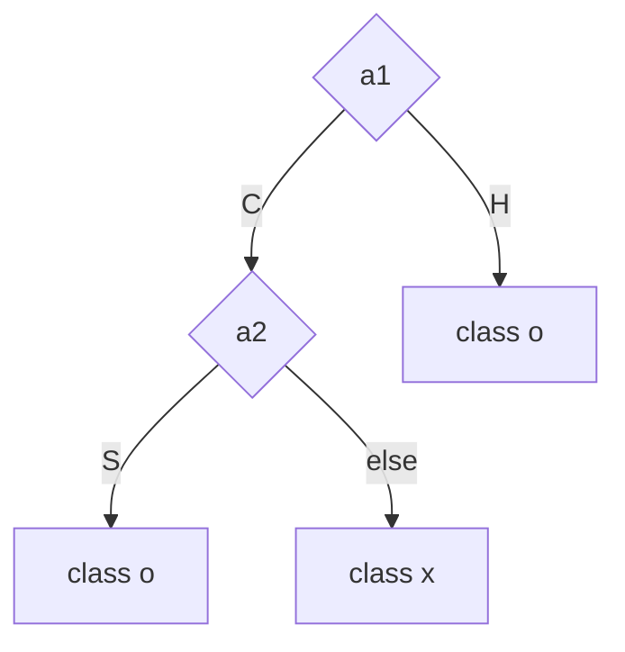
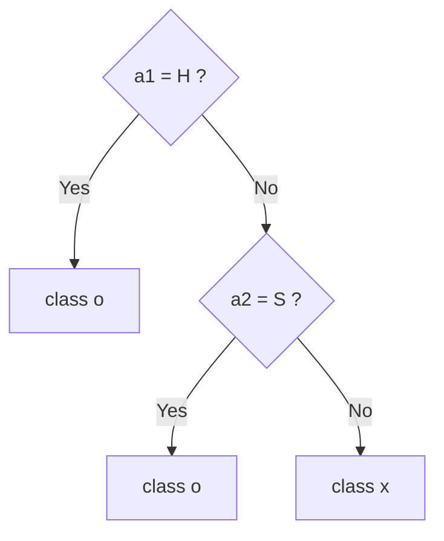
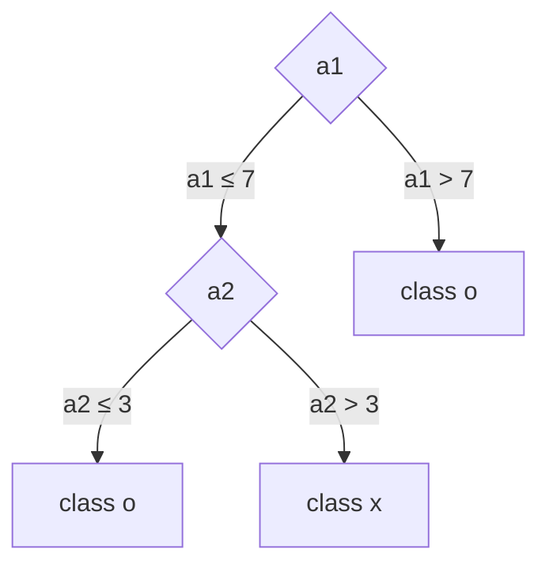

# Lecture 02 — Information, Uncertainty, and Entropy

> **Last Updated:** 2026-10-08
>
> Data Mining: Practical Machine Learning Tools and Techniques, Witten and Frank - Ch 4

> **Learning Objectives**:
> 1. Explain the value of information as the difference in uncertainty before and after obtaining it
> 2. Compute the uncertainty log₂M in bits when there are M equally likely outcomes
> 3. Derive and compute the entropy H = −Σ Pᵢ log₂ Pᵢ when the outcomes have different probabilities
> 4. Compute the amount of information gained from observation in the DNA example
> 5. Distinguish and compute the entropy of a feature itself and the class entropy that remains once the feature value is given
> 6. Explain how the idea of splitting the feature space to reduce entropy leads to the decision tree

---

## Table of Contents

- [1. How Much Does Information Reduce Uncertainty?](#1-how-much-does-information-reduce-uncertainty)
- [2. What Is Uncertainty?](#2-what-is-uncertainty)
- [3. The Number of Possible Outcomes and the Bit](#3-the-number-of-possible-outcomes-and-the-bit)
- [4. When Outcomes Have Different Probabilities: Entropy](#4-when-outcomes-have-different-probabilities-entropy)
  - [4.1 Rewriting as −log₂ P](#41-rewriting-as-log₂-p)
  - [4.2 Definition of Entropy](#42-definition-of-entropy)
  - [4.3 Meaning of Entropy](#43-meaning-of-entropy)
- [5. Case 1: Entropy of a DNA Position](#5-case-1-entropy-of-a-dna-position)
- [6. Case 2: The Fruit Data](#6-case-2-the-fruit-data)
  - [6.1 Entropy of a Feature Itself: The Size Example](#61-entropy-of-a-feature-itself-the-size-example)
  - [6.2 Entropy of the Class Given Size](#62-entropy-of-the-class-given-size)
- [7. Comparing the Remaining A/B Confusion for the Three Features](#7-comparing-the-remaining-ab-confusion-for-the-three-features)
  - [7.1 Given Color](#71-given-color)
  - [7.2 Given Surface](#72-given-surface)
  - [7.3 Comparison](#73-comparison)
- [8. This Idea Leads to the Decision Tree](#8-this-idea-leads-to-the-decision-tree)
  - [8.1 Categorical Feature Space](#81-categorical-feature-space)
  - [8.2 Continuous Feature Space](#82-continuous-feature-space)
- [9. What Should We Remember?](#9-what-should-we-remember)
- [Summary](#summary)
- [Review Questions](#review-questions)

---

<br>

## 1. How Much Does Information Reduce Uncertainty?

In machine learning, we often need to judge how much a feature helps prediction. For example, when several classes are mixed in a classification problem, knowing the value of some feature (that is, obtaining some information) lets us distinguish the classes much better. How, then, can we express the value of the information provided by that feature as a number?

This question starts from **uncertainty**. Here, think of uncertainty intuitively as **confusion**. Good information should greatly reduce the confusion after it is obtained.

> **Information reduces Uncertainty.** The value of information can be thought of as **the difference in uncertainty before and after obtaining the information**.
>
> $$\text{Information} = H_{\text{before}} - H_{\text{after}}$$

---

<br>

## 2. What Is Uncertainty?

Suppose we have a coin. Before tossing it, let us guess whether it will land heads or tails. If heads and tails are equally likely,

$$
P(\text{heads}) = P(\text{tails}) = \frac{1}{2}
$$

Before the toss, we cannot know what will come up. In other words, the uncertainty is large. Conversely, if we know that a rigged coin always lands heads,

$$
P(\text{heads}) = 1
$$

and the outcome is already decided. In this case the uncertainty can be said to be 0. In other words, the information "this coin always lands heads" has completely removed the uncertainty.

> **Intuition of uncertainty**
> - The harder the outcome is to predict, the larger the uncertainty.
> - The more certain a particular outcome is, the smaller the uncertainty.
> - If the outcome is completely decided, the uncertainty is 0.

---

<br>

## 3. The Number of Possible Outcomes and the Bit

First, consider the simple case in which all outcomes occur with the same probability. If there are M possible symbols and each occurs with equal probability, the uncertainty can be written as follows.

$$
H = \log_2 M
$$

| Number of possible outcomes M | Example | Uncertainty |
|:-----------------------------:|:--------|:------------|
| 1 | Always heads | log₂ 1 = 0 bit |
| 2 | Fair coin | log₂ 2 = 1 bit |
| 4 | Four symbols | log₂ 4 = 2 bits |
| 8 | Eight symbols | log₂ 8 = 3 bits |

With the **base 2 logarithm**, the unit becomes the **bit**. This connects to the fact that distinguishing 2 outcomes takes 1 bit and distinguishing 8 outcomes takes 3 bits.

---

<br>

## 4. When Outcomes Have Different Probabilities: Entropy

### 4.1 Rewriting as −log₂ P

So far we have assumed that every symbol appears with the same probability. In that case, the probability of each symbol is

$$
P = \frac{1}{M}
$$

Therefore,

$$
\log_2 M = \log_2 \frac{1}{P} = -\log_2 P
$$

This relation is important. The quantity log₂ M, which we used when we only knew the number of symbols M, can now be expressed with **the probability that each symbol actually appears**.

In reality, each symbol may have a different probability, so write the probability of the i-th symbol as Pᵢ. The uncertainty associated with that symbol can then be written as −log₂ Pᵢ. For example,

$$
P_i = 1 \Rightarrow -\log_2 P_i = 0, \qquad P_i = \frac{1}{2} \Rightarrow -\log_2 P_i = 1, \qquad P_i = \frac{1}{4} \Rightarrow -\log_2 P_i = 2
$$

**A frequent symbol has a small confusion value, and a rare symbol has a large one.**

### 4.2 Definition of Entropy

However, to find the confusion of the whole data, looking at a single symbol is not enough. The values of all symbols must be combined. If there are M symbols with probabilities P₁, P₂, …, P_M,

$$
\sum_{i=1}^{M} P_i = 1
$$

and we take the average of each symbol's −log₂ Pᵢ, weighted by the probability Pᵢ with which that symbol actually appears.

$$
H = -\sum_{i=1}^{M} P_i \log_2 P_i
$$

This H is called **entropy**.

### 4.3 Meaning of Entropy

> **Meaning of entropy**
> - High entropy: several outcomes are mixed with similar probabilities, so prediction is hard.
> - Low entropy: a particular outcome dominates, so prediction is possible to some extent.
> - Zero entropy: the outcome is completely decided.

In a two-class problem, entropy is maximal at 50:50 and 0 at 100:0 or 0:100.

$$
H(0.5,\ 0.5) = 1, \qquad H(1,\ 0) = 0
$$

> **Note:** Computing H(1, 0) involves 0 × log₂ 0. As a probability approaches 0, P log₂ P approaches 0, so entropy calculations set 0 log₂ 0 = 0.

---

<br>

## 5. Case 1: Entropy of a DNA Position

Suppose one of A, C, G, and T appears at a given position of DNA. Without any information, we can assume that the four symbols appear with equal probability.

$$
P(A) = P(C) = P(G) = P(T) = \frac{1}{4}
$$

The uncertainty before observation is therefore

$$
H_{\text{before}} = \log_2 4 = 2 \text{ bits}
$$

Now suppose that, after observing several sequences, the following symbols appeared at that position.

```text
ACATGAAC
```

In 8 observations, A : 4, C : 2, G : 1, and T : 1, so

$$
P(A) = \frac{1}{2}, \qquad P(C) = \frac{1}{4}, \qquad P(G) = P(T) = \frac{1}{8}
$$

With four symbols, the entropy after observation is

$$
\begin{aligned}
H_{\text{after}} &= -\frac{1}{2}\log_2\frac{1}{2} - \frac{1}{4}\log_2\frac{1}{4} - \frac{1}{8}\log_2\frac{1}{8} - \frac{1}{8}\log_2\frac{1}{8} \\
&= \frac{1}{2} + \frac{1}{2} + \frac{3}{8} + \frac{3}{8} \\
&= 1.75 \text{ bits}
\end{aligned}
$$

The amount of information gained from the observation is therefore

$$
\text{Information} = 2 - 1.75 = 0.25 \text{ bits}
$$

> **Interpretation:** Before observing, we thought all four symbols were equally possible, so the confusion was 2 bits. Learning from the observations that A appears more often reduced the confusion to 1.75 bits. In other words, the observation reduced the uncertainty of this position by 0.25 bit.

---

<br>

## 6. Case 2: The Fruit Data

Suppose the following 6 fruits are classified into two classes, A and B. Each fruit has three features: Size, Color, and Surface.

| No. | Size | Color | Surface | Class |
|:---:|:-----|:------|:--------|:-----:|
| 1 | Small | Yellow | Smooth | A |
| 2 | Medium | Red | Smooth | A |
| 3 | Medium | Red | Smooth | A |
| 4 | Big | Red | Rough | A |
| 5 | Medium | Yellow | Smooth | B |
| 6 | Medium | Yellow | Smooth | B |

Looking at the data alone, one can first consider which feature would help most in predicting class A or B, and why. Comparing entropy values is the way to verify this intuition quantitatively.

### 6.1 Entropy of a Feature Itself: The Size Example

Size takes the values Small once, Medium 4 times, and Big once. Computing H from the probabilities of these 3 symbols gives

$$
H(\text{Size}) = -\frac{1}{6}\log_2\frac{1}{6} - \frac{4}{6}\log_2\frac{4}{6} - \frac{1}{6}\log_2\frac{1}{6} \approx 1.252 \text{ bits}
$$

which shows how diversely the values of the feature Size are mixed.

> **Caution:** However, our classification goal is not to predict the value of Size. What we care about is **whether the class is A or B**. What we actually want to know is "how much confusion between A and B remains once the value of Size is given". Here the i in Pᵢ of the entropy formula refers to **the classes A and B**, not the values of Size.

With no information at all for predicting A or B, the confusion is at its maximum. What we want to know is how much that confusion decreases once the value of some feature is known. This is the same idea as the Naive Bayesian classifier starting from the prior probability P(H) and adding the P(E | H) information one at a time to improve its prediction of P(H | E).

We now use entropy values to find the feature that reduces the confusion between classes A and B.

### 6.2 Entropy of the Class Given Size

For example, given the information size = medium, 4 instances apply (2 A and 2 B). The confusion for these 4 is the entropy computed from the probabilities of the two symbols A and B.

$$
H(\text{Class} \mid \text{size} = \text{medium}) = -\sum_{i} P_i \log_2 P_i = -P_A \log_2 P_A - P_B \log_2 P_B = -\frac{1}{2}\log_2\frac{1}{2} - \frac{1}{2}\log_2\frac{1}{2} = 1 \text{ bit}
$$

In the same way, the entropy is 0 bit for size = big and for size = small (both contain a single A). H(Class | Size) is the average of the entropies of the three values, weighted by the proportion in which each value appears, so

$$
H(\text{Class} \mid \text{Size}) = \frac{1}{6}(0) + \frac{4}{6}(1) + \frac{1}{6}(0) = 0.667 \text{ bits}
$$

---

<br>

## 7. Comparing the Remaining A/B Confusion for the Three Features

In the same way, for Color and Surface we compute **the entropy of class A/B given the value of the feature**.

### 7.1 Given Color

For Yellow, A = 1 and B = 2, so

$$
H(\text{Class} \mid \text{Yellow}) = -\frac{1}{3}\log_2\frac{1}{3} - \frac{2}{3}\log_2\frac{2}{3} \approx 0.918
$$

For Red, A = 3 and B = 0, so the entropy is 0. Since each value occurs 3 times,

$$
H(\text{Class} \mid \text{Color}) = \frac{3}{6}(0.918) + \frac{3}{6}(0) = 0.459 \text{ bits}
$$

### 7.2 Given Surface

For Smooth, A = 3 and B = 2, so

$$
H(\text{Class} \mid \text{Smooth}) = -\frac{3}{5}\log_2\frac{3}{5} - \frac{2}{5}\log_2\frac{2}{5} \approx 0.971
$$

For Rough, A = 1 and B = 0, so the entropy is 0. Therefore,

$$
H(\text{Class} \mid \text{Surface}) = \frac{5}{6}(0.971) + \frac{1}{6}(0) \approx 0.809 \text{ bits}
$$

### 7.3 Comparison

| Given feature | Average remaining entropy of class A/B |
|:--------------|:--------------------------------------:|
| Size | 0.667 bits |
| Color | **0.459 bits** |
| Surface | 0.809 bits |

> **Key point:** What this table computes is not the entropy of each feature itself. It is **how much confusion remains in distinguishing A from B once the value of that feature is known**. The smaller the value, the better the feature separates the classes. In this example, knowing Color leaves the least A/B confusion.

> **Note:** Before any split, the class distribution is A = 4 and B = 2, so H(Class) = −(4/6)log₂(4/6) − (2/6)log₂(2/6) ≈ 0.918 bits, and the reduction in confusion is 0.918 − 0.667 = 0.252 for Size, 0.918 − 0.459 = 0.459 for Color, and 0.918 − 0.809 = 0.109 for Surface. In decision trees this difference is called **information gain**, which Lecture 03 covers in detail.

---

<br>

## 8. This Idea Leads to the Decision Tree

The idea is as follows. Suppose there are n features and k instances. The k instances are then scattered in the **n-dimensional space** formed by those features. If we look at the data from the viewpoint of a feature with low conditional entropy, A and B are well separated by its values, so the confusion is low.

### 8.1 Categorical Feature Space

Suppose two features a1 and a2 take 2 values (C, H) and 3 values (S, M, L), respectively, and 30 data instances are mixed together. Putting a1 on the horizontal axis and a2 on the vertical axis and counting the classes in each cell, every cell holds 5 instances, as follows.

<table>
<thead>
<tr><th rowspan="2">a2</th><th colspan="2">a1</th></tr>
<tr><th>C</th><th>H</th></tr>
</thead>
<tbody>
<tr><td>L</td><td>5 x</td><td>5 o</td></tr>
<tr><td>M</td><td>5 x</td><td>5 o</td></tr>
<tr><td>S</td><td>5 o</td><td>5 o</td></tr>
</tbody>
</table>

From the viewpoint of feature a1, the two classes x and o are separated relatively well by its values (that is, there is little confusion), but from the viewpoint of a2 the separation is more confusing. This can be confirmed with entropy as follows.

- Every instance with a1 = H is o, whatever its a2 value.
- Instances with a1 = C are o when a2 = S and x when a2 = M or L.
- Looking at a2 alone, M and L are half x and half o, so confusion remains.

> **Try computing it:** Overall there are 10 x and 20 o, so H(Class) = −(1/3)log₂(1/3) − (2/3)log₂(2/3) ≈ 0.918. Splitting by a1, C (10 x, 5 o) has entropy 0.918 and H (15 o) has 0, so H(Class | a1) = (15/30)(0.918) + (15/30)(0) ≈ 0.459. Splitting by a2, L (5 x, 5 o) and M (5 x, 5 o) have 1 each and S (10 o) has 0, so H(Class | a2) = (10/30)(1) + (10/30)(1) + (10/30)(0) ≈ 0.667. Knowing a1 leaves less confusion, so we split by a1 first.

In this case, we first separate the instances with a1 = H as class o, and then separate the remaining instances with a1 = C using the next feature, a2. Drawn as a decision tree, this can take the following two forms.

**Left tree: one branch per value**



**Right tree: yes/no questions**



The two trees express the same rules. The decision tree thus becomes **a model that divides the feature space into class regions**.

### 8.2 Continuous Feature Space

If the features take continuous values instead of categorical ones, the instances are scattered over the a1, a2 plane. The x instances gather in the upper left, where a1 is small and a2 is large, and the o instances lie in the whole right side and in the lower left. In this case, the decision tree can be drawn as follows.



The feature space is divided in the following order.

1. **First split:** The space is split vertically at a1 = 7. The right side (a1 > 7) is all o.
2. **Second split:** Only the left region, which is still mixed, is split horizontally at a2 = 3. The lower part (a2 ≤ 3) is o, and the upper part (a2 > 3) is x.

| Region | Condition | Predicted class |
|:------:|:----------|:---------------:|
| 1 | a1 > 7 | o |
| 2 | a1 ≤ 7 and a2 ≤ 3 | o |
| 3 | a1 ≤ 7 and a2 > 3 | x |

A decision tree separates the class space into **rectangles parallel to the axes**, because each split is based on a single value of a single feature.

> A **decision tree** is a classification method that selects features one at a time, splits the feature space repeatedly, and makes the classes of each region as well separated as possible.

---

<br>

## 9. What Should We Remember?

1. Shannon's **information theory** made it possible to **measure quantitatively** the abstract notion of information through probability and uncertainty.
2. If all outcomes are equally likely, H = log₂ M. Since P = 1/M, log₂ M can be rewritten as −log₂ P.
3. If the outcomes have different probabilities, the overall uncertainty, that is, the entropy, is H = −Σᵢ Pᵢ log₂ Pᵢ.
4. The value of information can be thought of as the difference in uncertainty before and after obtaining it. Information = H_before − H_after.
5. What matters in classification is not the entropy of a feature itself but **how much class entropy remains once the value of the feature is given**.
6. The decision tree is the representative method that repeatedly splits the feature space in the direction that reduces class entropy.

> **Advanced question:** The criteria for choosing a feature from a dataset can vary: the error rate in 1-R, the conditional probability in the Bayesian approach, entropy, and so on. Compare their characteristics, strengths, and weaknesses. (See Review Question 8.)

---

<br>

## Summary

| Concept | Key Points |
|:--------|:-----------|
| Information and uncertainty | The value of information is the amount by which it reduces uncertainty. Information = H_before − H_after. |
| M equally likely outcomes | H = log₂ M bits. 2 outcomes give 1 bit, 4 give 2 bits, and 8 give 3 bits. |
| Uncertainty of one symbol | −log₂ Pᵢ. It is small for a frequent symbol and large for a rare one. |
| Entropy | H = −Σ Pᵢ log₂ Pᵢ, the probability-weighted average of the uncertainty of each symbol. For two classes it is 1 at 50:50 and 0 at 100:0. |
| DNA example | Observing ACATGAAC lowers the entropy from 2 bits to 1.75 bits, gaining 0.25 bit of information. |
| Entropy of a feature itself | It only shows how diversely the feature values are mixed, which is different from the power to predict the class. Example: H(Size) ≈ 1.252. |
| Conditional class entropy | H(Class \| feature) is the average of the class entropy of each value, weighted by the proportion of the value. The smaller it is, the better the feature separates the classes. In the fruit data, Color (0.459) is the smallest. |
| Decision tree | Split the space with the feature that reduces confusion the most, and split the mixed regions again. The resulting regions are axis-parallel rectangles. |

---

<br>

## Review Questions

1. **Bits:** What is the uncertainty, in bits, of rolling a fair six-sided die? What about 16 equally likely outcomes?

   > **Answer:** For the die, H = log₂ 6 ≈ 2.585 bits. For 16 outcomes, log₂ 16 = 4 bits, which means 4 bits are needed to distinguish the 16 outcomes.

2. **Uncertainty of a symbol:** What is −log₂ P for a symbol with probability 1/8 and for one with probability 1/2, and which is the more "surprising" outcome?

   > **Answer:** For 1/8, −log₂(1/8) = 3, and for 1/2, −log₂(1/2) = 1. The rarer symbol with probability 1/8 has the larger value, so it is the more surprising outcome.

3. **Computing entropy:** Compute the entropy of data whose class distribution is 9 yes and 5 no.

   > **Answer:** H = −(9/14)log₂(9/14) − (5/14)log₂(5/14) ≈ 0.410 + 0.530 = 0.940 bits. This is slightly less than 50:50 (1 bit), a fairly mixed state.

4. **Extremes for two classes:** In a two-class problem, when are the entropy's maximum and minimum reached, and what are their values?

   > **Answer:** The maximum is at 50:50, with H(0.5, 0.5) = 1 bit. The minimum is at 100:0 or 0:100, with H(1, 0) = 0.

5. **DNA:** If all 8 observations at some position were A, how much information was gained?

   > **Answer:** After observation P(A) = 1, so H_after = 0. Information = 2 − 0 = 2 bits, which removes all of the uncertainty before observation.

6. **Entropy of a feature itself:** In the fruit data, what are H(Color) and H(Class | Color), and how do they differ?

   > **Answer:** Color has 3 Yellow and 3 Red, so H(Color) = 1 bit. H(Class | Color) = 0.459 bits. The former shows how diversely the Color values are mixed, and the latter shows how much class A/B confusion remains once Color is known. Classification uses the latter.

7. **Conditional entropy:** Explain how H(Class | Surface) ≈ 0.809 is obtained in the fruit data.

   > **Answer:** The 5 Smooth fruits have 3 A and 2 B, so their entropy is about 0.971, and the single Rough fruit is A only, so its entropy is 0. The weighted average by proportion is (5/6)(0.971) + (1/6)(0) ≈ 0.809.

8. **Advanced question:** Compare the 1-R error rate, the conditional probabilities of Naive Bayes, and entropy as criteria for choosing features.

   > **Answer:** The error rate only looks at the majority class of each value and counts the mistakes, so it is easy to compute and intuitive to interpret, but it does not reflect how the class distribution is mixed (for example, 6:4 and 9:1 can look alike when they differ by one error). Conditional probabilities do not pick a single feature but multiply P(value | class) for all features, so no information is discarded, but they assume independence between features and do not distinguish feature importance. Entropy reflects the whole class distribution of each value and measures the reduction in confusion, so it is a finer splitting criterion, but a feature with many values leaves few instances per value and tends to yield a small entropy, so it can overrate features such as an ID.

---
