# 강의 03 — 의사결정나무 (Decision Tree)

> **최종 수정일:** 2026-10-08
>
> Data Mining: Practical Machine Learning Tools and Techniques, Witten and Frank - Ch 4, 6

> **학습 목표**:
> 1. decision tree의 root, internal node, branch, leaf를 구분하고, tree가 feature space를 축에 평행한 영역으로 나누는 모델임을 설명할 수 있다
> 2. entropy 기반 Information Gain으로 과일 데이터와 Weather 데이터의 tree를 직접 만들 수 있다
> 3. ID code 문제를 설명하고, SplitInfo와 Gain Ratio로 이를 보정하는 과정을 계산할 수 있다
> 4. Gini impurity를 계산하고, CART가 weighted Gini로 binary split을 고르는 과정을 설명할 수 있다
> 5. misclassification error, Gini, entropy를 비교하고 ID3, C4.5, CART의 차이를 정리할 수 있다
> 6. tree의 overfitting과 pre-pruning, post-pruning, Random Forest의 아이디어를 설명할 수 있다

---

## 목차

- [1. 데이터에서 분류 규칙으로](#1-데이터에서-분류-규칙으로)
  - [1.1 과일 데이터와 decision tree](#11-과일-데이터와-decision-tree)
  - [1.2 트리는 질문의 연속이다](#12-트리는-질문의-연속이다)
  - [1.3 트리와 feature space](#13-트리와-feature-space)
  - [1.4 기본 알고리즘과 불순도](#14-기본-알고리즘과-불순도)
- [2. 데이터로 트리 만들어 보기: 과일 데이터](#2-데이터로-트리-만들어-보기-과일-데이터)
  - [2.1 분할 전 entropy](#21-분할-전-entropy)
  - [2.2 Size, Color, Surface로 나누기](#22-size-color-surface로-나누기)
  - [2.3 첫 분할과 완성된 트리](#23-첫-분할과-완성된-트리)
- [3. Weather 데이터: 더 큰 예제로 반복 과정 이해하기](#3-weather-데이터-더-큰-예제로-반복-과정-이해하기)
  - [3.1 Root 선택](#31-root-선택)
  - [3.2 Sunny branch 다시 나누기](#32-sunny-branch-다시-나누기)
  - [3.3 완성된 tree](#33-완성된-tree)
- [4. 계속 나누면 항상 좋은가: Identification Code 문제](#4-계속-나누면-항상-좋은가-identification-code-문제)
- [5. Gain Ratio: 지나치게 많은 branch에 벌점 주기](#5-gain-ratio-지나치게-많은-branch에-벌점-주기)
  - [5.1 SplitInfo와 Gain Ratio](#51-splitinfo와-gain-ratio)
  - [5.2 Weather 데이터의 Gain Ratio](#52-weather-데이터의-gain-ratio)
- [6. Gini index](#6-gini-index)
  - [6.1 Gini impurity의 정의](#61-gini-impurity의-정의)
  - [6.2 Decision Tree에서의 의미와 간단한 예](#62-decision-tree에서의-의미와-간단한-예)
  - [6.3 Split의 품질: weighted Gini](#63-split의-품질-weighted-gini)
  - [6.4 CART: 후보 split을 평가하기](#64-cart-후보-split을-평가하기)
- [7. 불순도 기준의 비교](#7-불순도-기준의-비교)
  - [7.1 Measures of impurity](#71-measures-of-impurity)
  - [7.2 p(A)에 따른 세 기준의 값](#72-pa에-따른-세-기준의-값)
  - [7.3 함수 모양의 차이](#73-함수-모양의-차이)
- [8. Decision Tree 알고리즘은 하나가 아니다](#8-decision-tree-알고리즘은-하나가-아니다)
- [9. Overfitting과 Pruning](#9-overfitting과-pruning)
  - [9.1 tree의 복잡도](#91-tree의-복잡도)
  - [9.2 예외 하나를 고립시키는 tree](#92-예외-하나를-고립시키는-tree)
  - [9.3 언제 멈출 것인가와 가지치기](#93-언제-멈출-것인가와-가지치기)
  - [9.4 하나의 트리가 갖는 장점과 한계](#94-하나의-트리가-갖는-장점과-한계)
- [10. 하나의 트리에서 Random Forest로](#10-하나의-트리에서-random-forest로)
- [11. 정리: Decision Tree를 이해하는 세 가지 질문](#11-정리-decision-tree를-이해하는-세-가지-질문)
  - [11.1 해석 가능성과 규칙 변환](#111-해석-가능성과-규칙-변환)
- [12. Decision Boundary의 특징과 한계](#12-decision-boundary의-특징과-한계)
- [요약](#요약)
- [점검 문제](#점검-문제)

---

<br>

## 1. 데이터에서 분류 규칙으로

**의사결정나무(decision tree)** 는 입력 특징에 관한 질문을 순서대로 적용하여 새로운 데이터 instance의 class를 예측하는 모델이다. 학습 과정에서는 class가 섞인 정도인 **불순도** 를 줄이도록 특징 공간을 나누며, 같은 작업을 각 부분 영역에서 반복한다. 이 장에서는 분할 기준의 계산, 트리와 공간의 대응, 과적합과 가지치기, Random Forest로의 확장을 살펴본다.

### 1.1 과일 데이터와 decision tree

다음은 강의 02에서 사용한 여섯 개의 과일 데이터이다. 새로운 과일의 Size, Color, Surface가 주어졌을 때 Class A와 B 중 어느 것으로 분류할 것인가? 학습의 목표는 관측된 사례로부터 새로운 instance에도 적용할 수 있는 규칙을 찾는 것이다.

| No. | Class | Size | Color | Surface |
|:---:|:-----:|:-----|:------|:--------|
| 1 | A | Small | Yellow | Smooth |
| 2 | A | Medium | Red | Smooth |
| 3 | A | Medium | Red | Smooth |
| 4 | A | Big | Red | Rough |
| 5 | B | Medium | Yellow | Smooth |
| 6 | B | Medium | Yellow | Smooth |

이 데이터는 다음과 같은 decision tree로 표현되며, 이 둘은 동치라고 볼 수 있다.

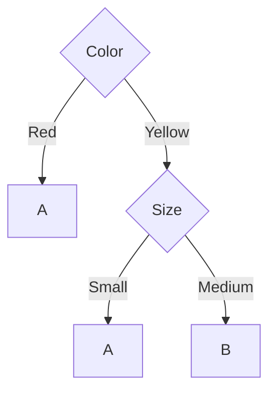

### 1.2 트리는 질문의 연속이다

데이터셋이 이러한 트리 형태로 표현되었을 때, 우리는 새로운 instance가 등장하면 이 tree를 이용하여 그 instance의 class를 예측할 수 있다. 예를 들어 먼저 Color를 확인하고, Yellow인 경우에만 Size를 추가로 확인할 수 있다.

| 트리의 요소 | 의미 |
|:------------|:-----|
| 내부 노드 (internal node) | 질문 |
| 가지 (branch) | 질문의 결과 |
| 잎 노드 (leaf node) | 최종 예측 class |
| 루트 (root node) | 첫 질문이 있는 노드 |

새 instance는 루트에서 출발하여 자신의 특징값에 해당하는 가지를 따라 내려간다. 도착한 잎의 class가 예측 출력이다. **학습은 이 질문들과 순서를 데이터로부터 결정하는 과정** 이다.

tree를 따라 내려가며 feature를 하나씩 검사하는 것은 feature 공간을 차례로 나누는 것과 같다. 결국 tree는 공간을 class별 영역으로 분리하는 모델이다.

### 1.3 트리와 feature space

두 개의 numeric feature x₁, x₂가 있다고 하자. 첫 node에서 x₁ < a를 검사하면 feature space에 수직 경계가 생긴다. 한 영역에서 다시 x₂ < b를 검사하면 수평 경계가 하나 더 생긴다. 결국 tree의 각 leaf는 feature space의 하나의 영역과 대응한다.

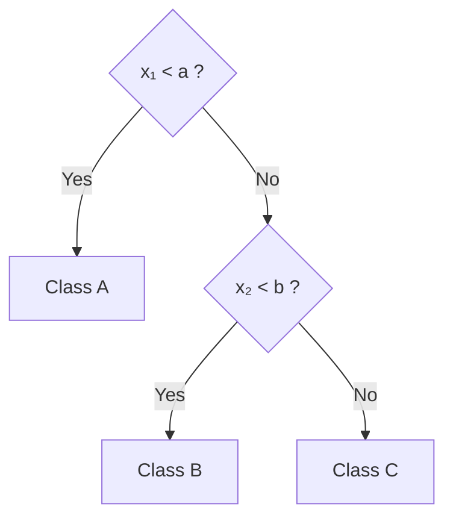

| leaf | feature space의 영역 |
|:----:|:---------------------|
| Class A | x₁ < a (수직 경계 a의 왼쪽 전체) |
| Class B | x₁ ≥ a 이고 x₂ < b (오른쪽 아래) |
| Class C | x₁ ≥ a 이고 x₂ ≥ b (오른쪽 위) |

> **핵심 관점:** Decision Tree는 단순한 if-then 규칙의 모음이 아니라, **feature space를 여러 영역으로 partition하는 classifier** 이다. 한 node가 추가될 때마다 feature space에 새로운 경계가 하나 생긴다고 생각할 수 있다.

### 1.4 기본 알고리즘과 불순도

기본 알고리즘은 다음과 같다.

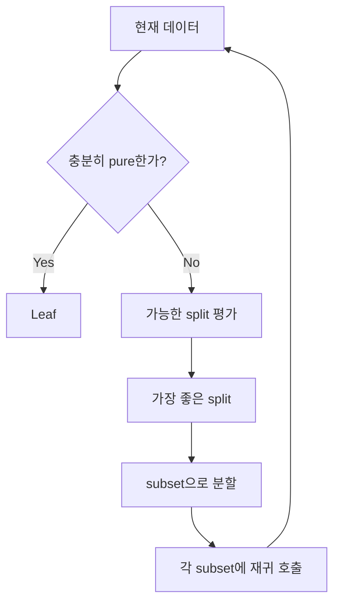

여기서 남는 핵심 질문은 하나이다.

> **여러 feature와 여러 split 중에서, 무엇을 선택해야 하는가?**

Decision Tree는 적절한 복잡도를 가져야 하며, 너무 간단해도, 너무 복잡해도 일반화된 분류 모델로서의 역할을 할 수 없다. 따라서 class가 섞여 있는 데이터셋을 어떤 기준으로 나누어 나갈 것인가가 중요하다. 그 기준이 **불순도(impurity)** 이다. 불순도는 강의 02의 혼란도와 같은 개념이며, 이를 측정하는 기준으로는 entropy뿐 아니라 **Gini index** 등도 쓰인다.

---

<br>

## 2. 데이터로 트리 만들어 보기: 과일 데이터

강의 02의 여섯 개 과일 데이터를 다시 가져오자. 이제는 단순히 각 feature 자체의 entropy를 계산하는 것이 아니라, **어떤 feature로 나누었을 때 class의 entropy가 얼마나 작아지는가** 를 비교한다.

### 2.1 분할 전 entropy

전체 class 분포는 A = 4, B = 2이므로 다음과 같다.

$$
H_{\text{before}} = -\frac{4}{6}\log_2\frac{4}{6} - \frac{2}{6}\log_2\frac{2}{6} \approx 0.918 \text{ bits}
$$

### 2.2 Size, Color, Surface로 나누기

**Size로 나누면.** Small은 A 한 개, Big도 A 한 개이므로 entropy가 0이다. Medium에는 A = 2, B = 2가 있어 entropy가 1이다.

$$
H_{\text{after}}(Size) = \frac{1}{6}(0) + \frac{4}{6}(1) + \frac{1}{6}(0) = 0.667, \qquad \text{Gain}(Size) = 0.918 - 0.667 = 0.252
$$

**Color로 나누면.** Red에는 A = 3, B = 0이므로 entropy가 0이다. Yellow에는 A = 1, B = 2가 있다.

$$
H(Yellow) = -\frac{1}{3}\log_2\frac{1}{3} - \frac{2}{3}\log_2\frac{2}{3} \approx 0.918
$$

$$
H_{\text{after}}(Color) = \frac{3}{6}(0) + \frac{3}{6}(0.918) = 0.459, \qquad \text{Gain}(Color) = 0.918 - 0.459 = 0.459
$$

**Surface로 나누면.** Rough에는 A 하나뿐이므로 entropy가 0이고, Smooth에는 A = 3, B = 2가 있다.

$$
H(Smooth) = -\frac{3}{5}\log_2\frac{3}{5} - \frac{2}{5}\log_2\frac{2}{5} \approx 0.971
$$

$$
H_{\text{after}}(Surface) = \frac{5}{6}(0.971) + \frac{1}{6}(0) = 0.809, \qquad \text{Gain}(Surface) = 0.918 - 0.809 = 0.109
$$

분할 전 entropy와 분할 후 entropy의 차이, 즉 혼란도가 줄어든 양을 **Information Gain** 이라고 한다.

$$
\text{Gain}(A) = H_{\text{before}} - H_{\text{after}}(A)
$$

### 2.3 첫 분할과 완성된 트리

| Feature | H_after | Information Gain | 선택 순위 |
|:--------|:-------:|:----------------:|:---------:|
| Color | 0.459 | **0.459** | 1 |
| Size | 0.667 | 0.252 | 2 |
| Surface | 0.809 | 0.109 | 3 |

따라서 첫 node에서는 **Color** 를 선택한다. Red branch는 모두 A이므로 바로 leaf가 된다. Yellow branch에는 A와 B가 섞여 있으므로 다시 나누어야 한다. Yellow만 남겨 보면 Size가 Small이면 A이고 Medium이면 B이므로 완전히 분리된다. 그 결과가 1.1절의 tree이다.

> **핵심:** 이 작은 예제는 Decision Tree 전체 알고리즘을 이미 보여준다. **가장 혼란도를 많이 줄이는 feature를 선택하고, 아직 class가 섞여 있는 branch에 대해서만 같은 계산을 반복한다.**

---

<br>

## 3. Weather 데이터: 더 큰 예제로 반복 과정 이해하기

대표적인 Weather Data에는 14개의 instance가 있고, class는 Yes = 9, No = 5이다. 따라서 root의 entropy는 다음과 같다.

$$
H([9, 5]) = -\frac{9}{14}\log_2\frac{9}{14} - \frac{5}{14}\log_2\frac{5}{14} = 0.940
$$

| Outlook | Temperature | Humidity | Windy | Play (class) |
|:--------|:------------|:---------|:------|:-------------|
| sunny | hot | high | false | no |
| sunny | hot | high | true | no |
| overcast | hot | high | false | yes |
| rainy | mild | high | false | yes |
| rainy | cool | normal | false | yes |
| rainy | cool | normal | true | no |
| overcast | cool | normal | true | yes |
| sunny | mild | high | false | no |
| sunny | cool | normal | false | yes |
| rainy | mild | normal | false | yes |
| sunny | mild | normal | true | yes |
| overcast | mild | high | true | yes |
| overcast | hot | normal | false | yes |
| rainy | mild | high | true | no |

### 3.1 Root 선택

Outlook으로 나누면 Sunny [2, 3], Overcast [4, 0], Rainy [3, 2]가 된다(괄호 안은 [Yes, No]의 개수).

$$
H_{\text{after}}(Outlook) = \frac{5}{14}(0.971) + \frac{4}{14}(0) + \frac{5}{14}(0.971) = 0.693
$$

따라서

$$
\text{Gain}(Outlook) = 0.940 - 0.693 = 0.247
$$

이다. 같은 방식으로 네 feature를 모두 계산하면 다음과 같다.

$$
\text{Gain}(Outlook) = 0.247, \quad \text{Gain}(Temperature) = 0.029, \quad \text{Gain}(Humidity) = 0.152, \quad \text{Gain}(Windy) = 0.048
$$

각 feature로 나누었을 때 branch별 [Yes, No] 분포는 교재 Figure 4.2(Tree stumps for the weather data)와 같다.

| Feature | branch별 [Yes, No] | H_after |
|:--------|:-------------------|:-------:|
| Outlook | Sunny [2, 3], Overcast [4, 0], Rainy [3, 2] | 0.693 |
| Temperature | Hot [2, 2], Mild [4, 2], Cool [3, 1] | 0.911 |
| Humidity | High [3, 4], Normal [6, 1] | 0.788 |
| Windy | False [6, 2], True [3, 3] | 0.892 |

따라서 root에는 **Outlook** 을 선택한다.

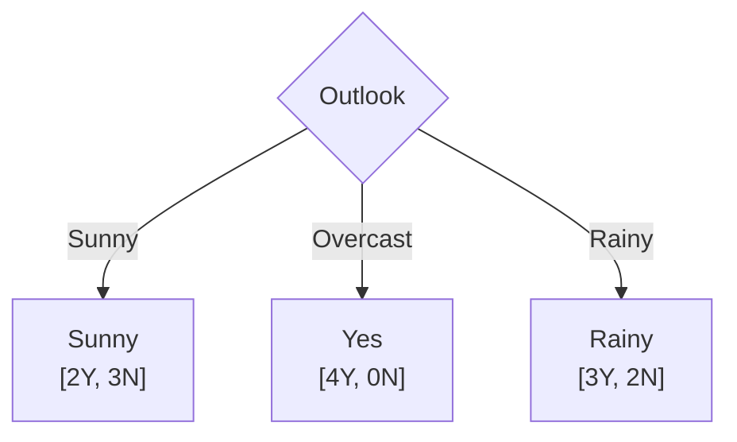

### 3.2 Sunny branch 다시 나누기

Overcast branch는 이미 pure하므로 끝난다. Sunny branch에는 아직 Yes와 No가 섞여 있다. Sunny에 도달한 instance만으로 다시 계산하면

$$
\text{Gain}(Temperature) = 0.571, \quad \text{Gain}(Humidity) = 0.971, \quad \text{Gain}(Windy) = 0.020
$$

이므로 **Humidity** 를 선택한다. Sunny의 5개는 Humidity = High이면 모두 No, Normal이면 모두 Yes라서 완전히 분리된다. Rainy branch에서도 같은 계산을 하면 **Windy** 가 False이면 모두 Yes, True이면 모두 No로 완전히 분리된다.

### 3.3 완성된 tree

같은 과정을 반복하면 다음 tree가 완성된다.

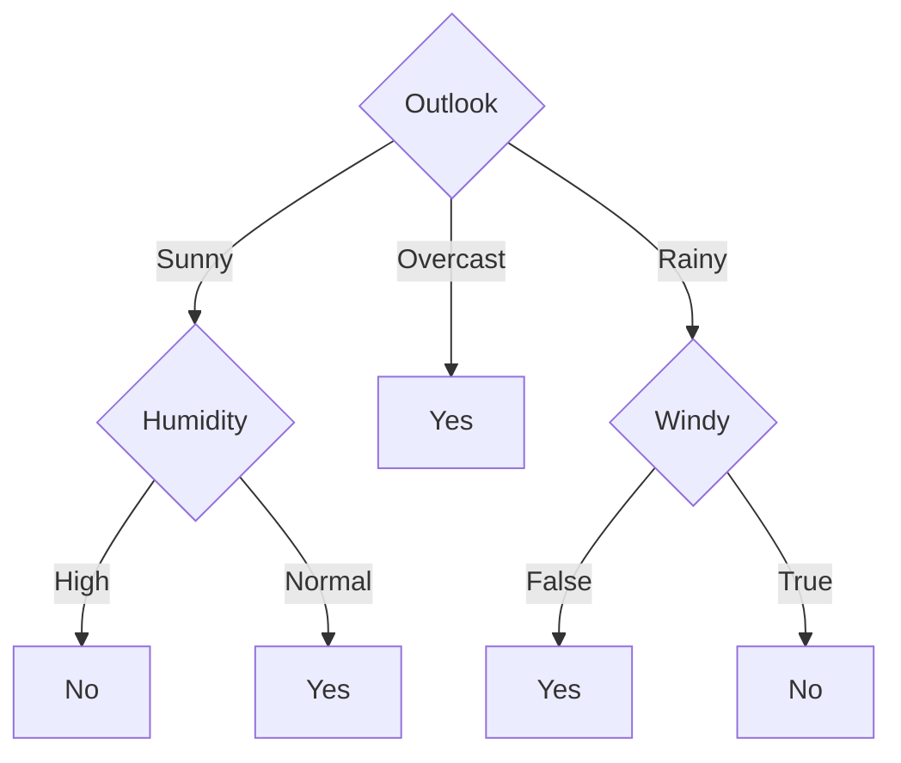

이 과정처럼 각 node에서 Information Gain이 가장 큰 feature를 고르고 재귀적으로 반복하는 것이 **ID3** 알고리즘의 학습 과정이다.

---

<br>

## 4. 계속 나누면 항상 좋은가: Identification Code 문제

Information Gain에는 한 가지 함정이 있다. **값의 종류가 많은 feature는 데이터를 아주 작은 subset으로 쉽게 나눌 수 있기 때문에 Gain이 커지는 경향** 이 있다.

각 instance마다 서로 다른 ID가 있다고 하자. ID로 split하면 각 branch에 instance 하나만 남으므로 모든 leaf가 pure하다.

$$
H_{\text{after}}(ID) = 0, \qquad \text{Gain}(ID) = 0.940
$$

즉 Outlook보다 훨씬 좋은 feature처럼 보인다. 그러나 새로운 instance는 새로운 ID를 가지므로 ID는 실제 예측에는 도움이 되지 않는다.

**교재 Table 4.6: The Weather Data with Identification Codes**

| ID Code | Outlook | Temperature | Humidity | Windy | Play |
|:-------:|:--------|:------------|:---------|:------|:-----|
| a | Sunny | Hot | High | False | No |
| b | Sunny | Hot | High | True | No |
| c | Overcast | Hot | High | False | Yes |
| d | Rainy | Mild | High | False | Yes |
| e | Rainy | Cool | Normal | False | Yes |
| f | Rainy | Cool | Normal | True | No |
| g | Overcast | Cool | Normal | True | Yes |
| h | Sunny | Mild | High | False | No |
| i | Sunny | Cool | Normal | False | Yes |
| j | Rainy | Mild | Normal | False | Yes |
| k | Sunny | Mild | Normal | True | Yes |
| l | Overcast | Mild | High | True | Yes |
| m | Overcast | Hot | Normal | False | Yes |
| n | Rainy | Mild | High | True | No |

교재 Figure 4.5(Tree stump for the ID code attribute)는 ID code로 나눈 tree stump이다. 14개의 가지가 각각 instance 하나로 끝난다.

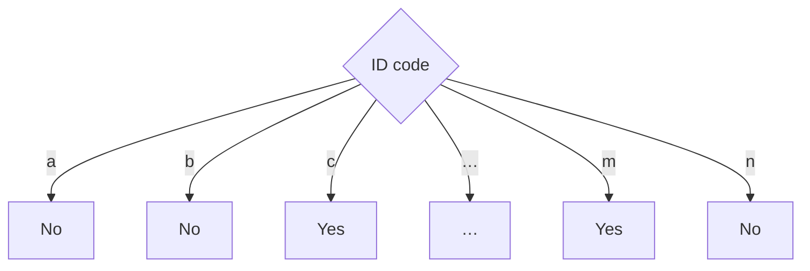

> **중요한 교훈:** Training data를 완벽하게 분리하는 feature가 반드시 좋은 predictive feature는 아니다. 이 문제는 Decision Tree의 **overfitting** 문제와 직접 연결된다.

---

<br>

## 5. Gain Ratio: 지나치게 많은 branch에 벌점 주기

### 5.1 SplitInfo와 Gain Ratio

**C4.5** 에서는 값의 종류가 많은 feature를 과도하게 선호하는 문제를 완화하기 위해 **Gain Ratio** 를 사용한다. 먼저 split 자체의 복잡도를

$$
SplitInfo(A) = -\sum_{j} \frac{|S_j|}{|S|}\log_2\frac{|S_j|}{|S|}
$$

로 정의하고, 다음과 같이 보정한다.

$$
GainRatio(A) = \frac{Gain(A)}{SplitInfo(A)}
$$

**SplitInfo는 분할 후 데이터가 각 가지(branch)에 어떻게 나뉘어 있는지를 나타내는 값** 이다. Class가 섞인 정도가 아니라, **각 가지에 배분된 데이터의 비율** 로 계산한다. 여기서 |S|는 전체 데이터 수, |Sⱼ|는 j번째 가지에 속한 데이터 수이다. 만약 ID 코드 문제처럼 k개의 instance가 각각 다른 가지에 하나씩 들어가 있다면 SplitInfo는 log₂ k가 된다.

같은 8개를 다른 방식으로 나누면 다음과 같다.

| 분할 결과 | SplitInfo |
|:----------|:---------:|
| 두 가지에 7개와 1개 | 약 0.544 |
| 두 가지에 4개씩 | 1 |
| 네 가지에 2개씩 | 2 |
| 여덟 가지에 1개씩 | 3 |

ID가 14개의 서로 다른 branch를 만든다면

$$
SplitInfo(ID) = \log_2 14 = 3.807
$$

이고

$$
GainRatio(ID) = \frac{0.940}{3.807} = 0.247
$$

이 된다. branch를 많이 만드는 것 자체가 분모를 크게 하므로 단순한 Information Gain보다 불리해진다.

> **핵심:** class의 불확실성을 얼마나 줄였는지(Gain)를, **데이터를 가지들로 나눈 정도(SplitInfo)에 비추어 평가하는 것** 이다.

### 5.2 Weather 데이터의 Gain Ratio

교재 Table 4.7은 Figure 4.2의 tree stump들에 대해 Gain Ratio를 계산한 것이다.

**교재 Table 4.7: Gain Ratio Calculations for the Tree Stumps of Fig. 4.2**

| | Outlook | Temperature | Humidity | Windy |
|:--|:--|:--|:--|:--|
| Info | 0.693 | 0.911 | 0.788 | 0.892 |
| Gain | 0.940 − 0.693 = 0.247 | 0.940 − 0.911 = 0.029 | 0.940 − 0.788 = 0.152 | 0.940 − 0.892 = 0.048 |
| Split info | info([5,4,5]) = 1.577 | info([4,6,4]) = 1.557 | info([7,7]) = 1.000 | info([8,6]) = 0.985 |
| Gain ratio | 0.247/1.577 = 0.156 | 0.029/1.557 = 0.019 | 0.152/1 = 0.152 | 0.048/0.985 = 0.049 |

Gain Ratio로도 Outlook(0.156)이 가장 크지만 Humidity(0.152)와의 차이는 크게 줄어든다. 가지가 셋인 Outlook의 SplitInfo(1.577)가 가지가 둘인 Humidity의 SplitInfo(1.000)보다 크기 때문이다. 그러나 ID code의 Gain Ratio는 0.247로 여전히 Outlook보다 크다. 그래서 실제로는 ID code처럼 쓸모없는 attribute를 미리 걸러 내는 별도의 검사를 함께 쓰며, 표준적인 방법은 Information Gain이 평균 이상인 attribute 가운데 Gain Ratio가 가장 큰 것을 고르는 것이다(교재 4.3절).

---

<br>

## 6. Gini index

### 6.1 Gini impurity의 정의

**Gini impurity** 는 한 node 안에 여러 class가 얼마나 다양하게 섞여 있는지를 측정하는 지표이다. 이 식은 생태학의 Simpson 계열 diversity index와 같은 형태를 가지며, 확률론적으로는 **두 번 뽑았을 때 같은 symbol이 반복되는 확률의 여집합** 으로 이해할 수 있다.

각 class의 비율을 p₁, p₂, …, p_k라 하자. 같은 집합에서 두 instance를 독립적으로 뽑았을 때 둘 다 class i일 확률은 pᵢ²이다. 따라서 두 instance가 같은 class일 전체 확률은

$$
\text{repeat rate} = \sum_i p_i^2
$$

이다. 그렇다면 서로 다른 class가 나올 확률은 그 여집합이므로

$$
\text{Gini} = 1 - \sum_i p_i^2
$$

가 된다. Simpson 계열 지수에서는 Σpᵢ²를 concentration 또는 dominance의 형태로, 1 − Σpᵢ²를 diversity의 형태로 사용한다. 암호학이나 randomness 분석에서 "one minus the repeat rate"라고 해석하는 직관도 이와 같다.

| 두 번 뽑았을 때 | 의미 | 식 |
|:----------------|:-----|:---|
| repeat rate | 같은 class가 두 번 나올 확률 | Σpᵢ² |
| diversity / impurity | 서로 다른 class가 나올 확률 | 1 − Σpᵢ² |

### 6.2 Decision Tree에서의 의미와 간단한 예

생태학의 종(species)이나 정보 이론의 symbol 자리에 Decision Tree에서는 class를 넣으면 된다. Gini impurity는 **한 node에서 두 instance를 무작위로 뽑았을 때 서로 다른 class일 확률** 로 해석할 수 있다. 따라서 Gini가 작으면 대부분의 instance가 같은 class에 속한다는 뜻이고, Gini가 크면 여러 class가 많이 섞여 있다는 뜻이다.

| Class 분포 | p(A) | p(B) | Gini |
|:----------:|:----:|:----:|:-----|
| A A A A | 1 | 0 | 0 |
| A A A B | 0.75 | 0.25 | 1 − (0.75² + 0.25²) = 0.375 |
| A A B B | 0.5 | 0.5 | 1 − (0.5² + 0.5²) = 0.5 |

모두 A이면 두 개를 뽑아도 항상 같은 class가 나오므로 Gini는 0이다. 반대로 A와 B가 50:50이면 두 번 뽑았을 때 서로 다른 class가 나올 가능성이 가장 커지므로 binary classification에서 Gini가 최대가 된다.

### 6.3 Split의 품질: weighted Gini

어떤 feature로 parent node를 여러 child node로 나누었다면, 각 child의 Gini를 계산한 뒤 child의 크기만큼 가중하여 평균한다.

$$
\text{Gini}_{\text{split}} = \sum_j \frac{|S_j|}{|S|}\,\text{Gini}(S_j)
$$

좋은 split은 이 weighted Gini를 작게 만드는 split이다. 다시 말해, 나눈 뒤 각 영역에서 서로 다른 class가 섞여 나올 가능성을 가장 많이 낮추는 feature를 선택한다.

Gini는 entropy와 근본적인 발상이 같다. Entropy는 결과에 대한 불확실성을 측정하고, Gini는 class가 섞여 있는 정도를 diversity 관점에서 측정한다. 둘 다 pure한 node에서는 0이고, class가 고르게 섞일수록 커진다.

예를 들어 parent node에 A 7개, B 9개(총 16개)가 있고, 이를 child 1(A 1개, B 5개, 총 6개)과 child 2(A 6개, B 4개, 총 10개)로 나눈다.

$$
\text{Gini}_{\text{parent}} = 1 - \left(\left(\frac{7}{16}\right)^2 + \left(\frac{9}{16}\right)^2\right) \approx 0.492
$$

$$
\text{Gini}_1 = 1 - \left(\left(\frac{1}{6}\right)^2 + \left(\frac{5}{6}\right)^2\right) \approx 0.278, \qquad \text{Gini}_2 = 1 - \left(\left(\frac{6}{10}\right)^2 + \left(\frac{4}{10}\right)^2\right) = 0.48
$$

$$
\text{Gini}_{\text{split}} = \frac{6 \cdot \text{Gini}_1 + 10 \cdot \text{Gini}_2}{16} \approx \frac{6(0.278) + 10(0.48)}{16} \approx 0.404
$$

split 후 불순도가 0.492에서 0.404로 줄었다.

### 6.4 CART: 후보 split을 평가하기

Gini를 이용해 가장 좋은 binary split을 찾는 방법은 **CART(Classification And Regression Trees)** 라는 알고리즘이다. CART의 핵심은 현재 node에서 가능한 split을 여러 개 시험해 보고, child node들의 weighted Gini가 가장 작은 split 하나를 선택하는 것이다.

구체적인 예로 split 하나를 평가해 보자. parent node에 Class A 40개, B 30개, C 20개, D 10개, 총 100개의 instance가 있다고 하자. 후보 split 중 하나가 Age < 65?이다.

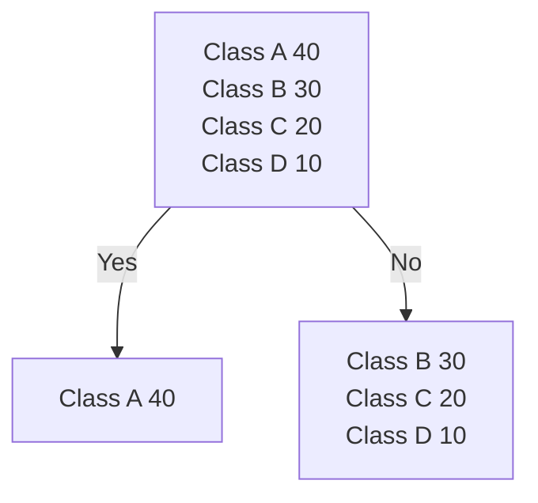

Parent node의 Gini는 다음과 같다.

$$
\text{Gini(parent)} = 1 - (0.4^2 + 0.3^2 + 0.2^2 + 0.1^2) = 0.70
$$

왼쪽 child는 모두 A이므로 완전히 pure하다.

$$
\text{Gini(left)} = 0
$$

오른쪽 child에는 B 30개, C 20개, D 10개가 있으므로 총 60개이다.

$$
\text{Gini(right)} = 1 - \left[\left(\frac{30}{60}\right)^2 + \left(\frac{20}{60}\right)^2 + \left(\frac{10}{60}\right)^2\right] \approx 0.611
$$

따라서 split 이후의 weighted Gini는 다음과 같다.

$$
\text{Gini(split)} = \frac{40}{100} \times 0 + \frac{60}{100} \times 0.611 \approx 0.367
$$

즉 impurity가 0.70에서 0.367로 크게 감소했다. 따라서 Age < 65는 꽤 좋은 후보 split이다.

CART는 Age < 65 하나만 시험하고 끝내지 않는다. 현재 node에서 사용할 수 있는 **모든 feature와 가능한 split 후보** 를 평가한다. Age처럼 numeric feature라면 값을 정렬한 뒤 가능한 threshold를 후보로 만든다. 서로 다른 값이 n개라면 최대 n − 1개의 threshold 후보가 생길 수 있다.

| 후보 split | weighted Gini | 평가 |
|:-----------|:-------------:|:-----|
| Age < 32 | 0.58 | 덜 좋음 |
| Age < 45 | 0.49 | 보통 |
| Age < 65 | 0.367 | 가장 좋음 |
| Income < 5,000 | 0.44 | 보통 |

이 예에서는 Age < 65의 weighted Gini가 가장 작으므로 그 split을 선택한다. 그리고 만들어진 left child와 right child에서 다시 같은 작업을 반복한다.

> **CART** 는 가능한 binary split들을 비교하여 child node의 weighted Gini impurity가 가장 작은 split을 선택하고, 그 과정을 재귀적으로 반복하는 **greedy decision tree 알고리즘** 이다.

후보 split 수가 많으면 계산량이 커질 수 있지만, 모든 가능한 tree를 탐색하는 것이 아니라 각 node에서 가장 좋은 local split만 선택하기 때문에 실제 규모의 데이터에서도 사용할 수 있다.

---

<br>

## 7. 불순도 기준의 비교

### 7.1 Measures of impurity

16개의 instance가 있는 두 node를 세 가지 판단 기준으로 비교해 보자. 왼쪽 node는 파란 점 15개와 빨간 점 1개, 오른쪽 node는 파란 점 8개와 빨간 점 8개이다.

| 기준 | 왼쪽 node (15 : 1) | 오른쪽 node (8 : 8) |
|:-----|:-------------------|:--------------------|
| Misclassification | 1/16 = 0.06 | 8/16 = 0.5 |
| Gini | 1 − [(1/16)² + (15/16)²] = 0.12 | 1 − [(8/16)² + (8/16)²] = 0.5 |
| Information (entropy) | −[1/16 × log₂(1/16) + 15/16 × log₂(15/16)] = 0.34 | −[8/16 × log₂(8/16) + 8/16 × log₂(8/16)] = 1 |

세 기준 모두 거의 pure한 왼쪽 node에서는 작고, 반반 섞인 오른쪽 node에서는 크다.

### 7.2 p(A)에 따른 세 기준의 값

예를 들어 두 class 문제에서 A의 비율이 다음과 같다고 하자.

| p(A) | Error | Gini | Entropy |
|:----:|:-----:|:----:|:-------:|
| 0.50 | 0.50 | 0.50 | 1.00 |
| 0.60 | 0.40 | 0.48 | 0.971 |
| 0.70 | 0.30 | 0.42 | 0.881 |
| 0.80 | 0.20 | 0.32 | 0.722 |
| 0.90 | 0.10 | 0.18 | 0.469 |
| 1.00 | 0 | 0 | 0 |

세 기준 모두 pure해질수록 감소한다.

### 7.3 함수 모양의 차이

하지만 함수 모양이 다르다.

| 기준 | 식 | 특징 |
|:-----|:---|:-----|
| Misclassification error | 1 − maxₖ pₖ | 가장 단순하고 piecewise linear하다. |
| Gini | 1 − Σ pₖ² | 더 부드럽다. |
| Entropy | −Σ pₖ log pₖ | 확률 변화에 더 민감한 부드러운 함수이다. |

그래서 tree 성장 과정에서는 Gini와 entropy가 split 후보 사이의 미세한 차이를 더 잘 구분한다.


*그림 1. p = P(Class A)에 따른 misclassification error, Gini impurity, entropy의 곡선 (16쪽)*

세 기준 모두 같은 방향을 본다. 다만 error rate는 "몇 개 틀리나"를 직접 보고, Gini와 Entropy는 "얼마나 섞여 있나"를 더 부드럽게 본다.

- Entropy는 "얼마나 불확실한가?"를 묻는다.
- Gini는 "얼마나 서로 다른 class가 섞여 있는가?"를 묻는다.

그러나 Decision Tree에서는 둘 다 impurity를 측정하는 기준이며, 실제로 비슷한 split을 선택하는 경우가 많다.

---

<br>

## 8. Decision Tree 알고리즘은 하나가 아니다

Decision Tree는 하나의 고정된 알고리즘 이름이라기보다, **어떤 split criterion을 사용하고, numeric과 missing value를 어떻게 처리하며, pruning을 어떻게 하는가** 에 따라 여러 알고리즘으로 구현된다.

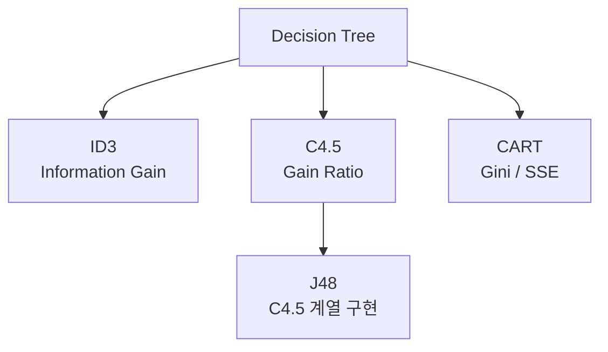

| | ID3 | C4.5 | CART |
|:--|:--|:--|:--|
| 주요 기준 | Information Gain | Gain Ratio | Gini(분류), 오차 감소(회귀) |
| Split 형태 | multiway 가능 | multiway 가능 | binary split |
| Numeric feature | 제한적 | 지원 | 지원 |
| Missing value | 기본형에서는 제한적 | 지원 | 구현에 따라 지원 |
| Pruning | 기본형 없음 | 지원 | 지원 |
| Regression | 아니오 | 아니오 | 예 |

- **ID3:** 각 node에서 모든 candidate feature의 Information Gain을 계산하고 가장 큰 Gain을 갖는 feature를 선택한 뒤 재귀적으로 반복한다. 3절에서 Weather Data로 수행한 계산이 전형적인 ID3의 학습 과정이다.
- **C4.5:** ID3를 실용적으로 확장한 알고리즘이다. Gain Ratio를 사용하고, numeric attribute, missing data, pruning, rule conversion 등을 지원한다. Weka의 J48은 C4.5 계열 구현으로 알려져 있다.
- **CART:** Classification And Regression Trees의 약자이다. 일반적으로 binary split을 사용하며, classification에서는 Gini를, regression에서는 squared error(SSE)와 같은 기준을 이용한다.

---

<br>

## 9. Overfitting과 Pruning

### 9.1 tree의 복잡도

Tree를 계속 키우면 training data를 점점 더 세밀하게 분류할 수 있다. 극단적으로 각 leaf에 instance 하나만 남도록 만들 수도 있다. 그러나 그 순간 tree는 일반적인 규칙보다 noise와 우연한 특성까지 학습할 수 있다.

**너무 단순** (질문 하나)

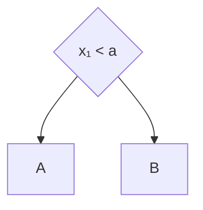

**적절한 복잡도** (질문 둘)

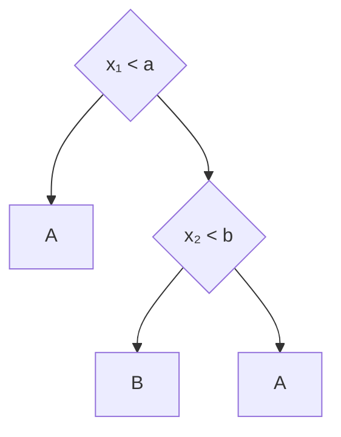

**과도하게 복잡** (질문 셋, leaf 넷)

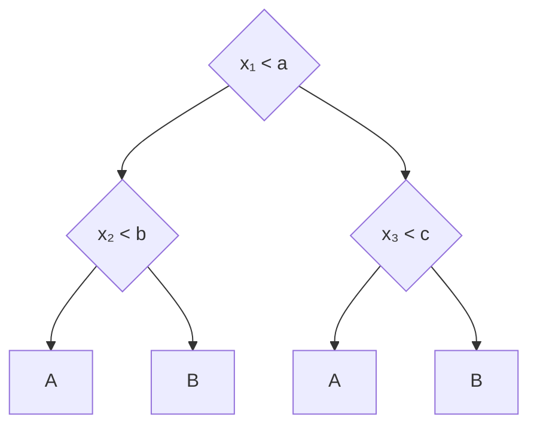

### 9.2 예외 하나를 고립시키는 tree

아래 데이터에서는 대체로 x₁ < 5이면 A, x₁ ≥ 5이면 B이다. 그런데 왼쪽 영역의 (3, 3)에 B 하나가 관측되었다고 하자. 이 관측치는 측정 오류나 우연한 예외일 수도 있고, 아직 충분히 관측하지 못한 실제 하위 집단일 수도 있다.


*그림 2. 같은 훈련 데이터에 대한 두 경계, 왼쪽은 단순한 경계(training error 1개), 오른쪽은 예외적인 B 하나를 고립시킨 경계(training error 0개) (17쪽)*

그림에서 원은 A, 삼각형은 B이며 배경색은 예측 class이다. 오른쪽은 B 하나를 고립시키기 위해 네 번의 분할을 추가한 예시이다.

왼쪽 트리는 x₁ < 5라는 한 번의 질문으로 15개 중 14개를 맞힌다. 예외적인 B 하나는 A로 예측한다. 오른쪽 트리는 그 하나까지 맞히려고 x₁ = 2.6, x₁ = 3.4, x₂ = 2.6, x₂ = 3.4 부근에서 부분 영역을 더 나눈다. 작은 B 영역이 만들어져 훈련 오류는 0이 되지만 잎은 2개에서 6개로 늘어난다.

문제는 이 작은 영역 전체를 B로 예측할 근거가 관측치 하나뿐이라는 점이다. 새 A instance가 (3.1, 3.1)에 나타나면 단순한 트리는 A로 예측하지만 복잡한 트리는 B로 예측한다. 추가 경계가 실제 class 구조가 아니라 우연한 사례의 위치를 따라 만들어졌다면 일반화 성능이 나빠질 수 있다.

> **훈련 데이터의 순수함과 일반화는 다르다.** 모든 잎의 불순도를 0으로 만드는 것은 훈련 데이터의 혼합을 제거하는 목표이다. 새로운 데이터에서도 잘 예측하는 목표와 같지 않다. 마지막 몇 개의 instance까지 구분하려고 매우 좁은 영역을 만들면 데이터가 조금만 달라져도 예측이 달라질 수 있다. 이것이 **과적합(overfitting)** 의 전형적인 양상이다.

다만 깊거나 복잡한 트리라는 이유만으로 과적합이라고 단정하지 않는다. 실제 경계가 복잡할 수도 있다. 추가 분할이 유용한지는 검증 데이터에서 확인해야 한다. 그림의 좌표와 경계는 설명을 위한 예시이며 특정 학습 알고리즘의 최적 분할 결과를 뜻하지 않는다.

### 9.3 언제 멈출 것인가와 가지치기

**Pre-pruning은 트리를 만드는 도중 멈춘다.** 최대 깊이(max depth), 잎의 최소 표본 수(minimum samples per leaf), 최소 불순도 감소량 등을 제한한다. 예를 들어 잎에 적어도 여러 instance가 남도록 하면 앞의 그림처럼 한 관측치만을 위한 작은 영역의 생성을 억제할 수 있다. 다만 너무 일찍 멈추면 필요한 구조까지 학습하지 못해 과소적합될 수 있다.

**Post-pruning은 만든 트리를 단순화한다.** 먼저 비교적 큰 트리를 학습한 뒤 불필요한 하위 트리를 하나의 잎으로 바꾼다. 앞의 예에서는 작은 B 영역을 만드는 하위 트리를 A 잎으로 바꾸어 복잡도를 줄일 수 있다. 이때 훈련 오류는 증가할 수 있지만 검증 성능은 유지되거나 좋아질 수 있다.

검증 데이터나 교차검증을 사용하여 적절한 복잡도를 선택한다. **비용 복잡도 가지치기(cost-complexity pruning)** 는 예측 오차와 잎 수에 대한 벌점을 함께 고려한다. 최종 평가용 테스트 데이터는 이 선택 과정과 분리한다.

### 9.4 하나의 트리가 갖는 장점과 한계

작은 트리는 예측 경로를 따라가며 판단 근거를 이해하기 쉽고, 특징 사이의 조건부 관계를 규칙으로 표현할 수 있다. 그러나 데이터 일부가 바뀌면 처음 선택되는 split이 달라지고 그 아래 구조도 크게 바뀔 수 있다. 이러한 불안정성을 **높은 분산(high variance)** 이라고 한다.

또한 축 정렬 분할은 대각선이나 곡선 경계를 여러 직사각형으로 근사해야 한다. 단순한 실제 경계도 많은 질문을 요구할 수 있다. 깊이를 늘리면 표현력은 커지지만 과적합의 위험과 해석의 부담도 커진다.

| 복잡도 선택 | 훈련 데이터에서의 양상 | 새 데이터에서 확인할 점 |
|:------------|:-----------------------|:------------------------|
| 너무 작은 트리 | 중요한 구분까지 놓침 | 과소적합 가능성 |
| 적절한 트리 | 일부 예외는 남을 수 있음 | 안정적인 일반화 |
| 너무 큰 트리 | 우연한 예외까지 세밀하게 분리 | 과적합 가능성 |

트리의 목적은 개별 관측치를 끝까지 설명하는 것이 아니라 **반복해서 나타나는 class 구조를 추정하는 것** 이다. 분할 기준과 종료 기준을 함께 설계해야 한다.

---

<br>

## 10. 하나의 트리에서 Random Forest로

단일 트리의 불안정성을 줄이는 대표적인 방법은 서로 다른 여러 트리의 예측을 결합하는 것이다. 여러 모델을 함께 사용하는 방식을 **앙상블 학습(ensemble learning)** 이라고 하며, **Random Forest** 는 그 대표적인 방법이다.

**서로 다른 트리를 만들고 예측을 결합한다.** 표준적인 Random Forest는 원래 훈련 데이터에서 복원추출한 **bootstrap 표본** 으로 각 트리를 학습한다. 또한 각 노드에서 전체 특징 가운데 **무작위로 선택한 일부 특징만 분할 후보** 로 고려한다. 데이터와 특징 선택에 무작위성을 주어 트리들이 지나치게 비슷해지는 것을 줄인다.

분류에서는 여러 트리의 class 투표를 모아 최종 class를 정할 수 있다. 예를 들어 다섯 트리의 출력이 A, A, B, A, B이면 다수결 예측은 A이다. 구현에 따라 트리별 class 확률을 평균하고 가장 큰 확률의 class를 선택하기도 한다.

| 모델 | 학습과 예측에서의 역할 |
|:-----|:-----------------------|
| 트리 1 | 서로 다른 표본과 특징 후보로 학습 → A |
| 트리 2 | 서로 다른 표본과 특징 후보로 학습 → A |
| 트리 3 | 서로 다른 표본과 특징 후보로 학습 → B |
| 결합 예측 | 다수결의 예 → A |

한 트리가 특정 표본의 우연한 특성에 민감하더라도 다른 트리들이 같은 오류를 반복하지 않으면 결합 예측은 더 안정적일 수 있다. 트리 사이의 상관을 낮추는 무작위 특징 선택이 중요한 이유이다. 단순히 같은 트리를 여러 번 복제하는 것은 이러한 효과를 주지 못한다.

여러 트리를 사용한다고 모두 Random Forest인 것은 아니다. Random Forest는 표본 추출과 무작위 특징 선택을 결합하는 구체적인 앙상블 방법이다. 계산량이 늘고 단일 트리처럼 전체 예측을 한 경로로 설명하기 어려워지며, 데이터의 편향이나 분포 변화까지 자동으로 해결하지는 않는다.

---

<br>

## 11. 정리: Decision Tree를 이해하는 세 가지 질문

1. **어떻게 문제를 해결하는가?** Feature space를 recursive divide-and-conquer 방식으로 나눈다.
2. **어디를 나눌 것인가?** Information Gain, Gain Ratio, Gini와 같은 기준으로 class의 혼란도를 가장 많이 줄이는 split을 찾는다.
3. **언제 그만 나눌 것인가?** 너무 깊게 나누면 overfitting이 발생하므로 pre-pruning 또는 post-pruning으로 model complexity를 조절한다.

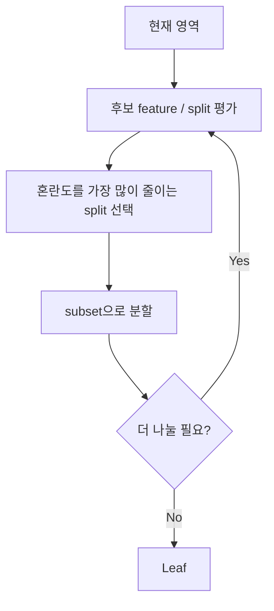

> **Decision Tree 학습** = 현재 feature space에서 가장 좋은 split을 찾고, 데이터를 나누고, 필요한 만큼 반복하여 class별 영역을 만들어 가는 과정

### 11.1 해석 가능성과 규칙 변환

이 모델의 장점 중의 하나는 **interpretable** 하다는 것이다. 3.3절의 Weather tree는 다음과 같은 규칙으로 변환할 수 있다.

```text
IF Outlook = Sunny AND Humidity = High
THEN Play = No

IF Outlook = Sunny AND Humidity = Normal
THEN Play = Yes

IF Outlook = Overcast
THEN Play = Yes

IF Outlook = Rainy AND Windy = False
THEN Play = Yes

IF Outlook = Rainy AND Windy = True
THEN Play = No
```

root에서 leaf까지의 경로 하나가 규칙 하나가 되며, 경로 위의 질문들이 AND로 연결된다. 다만 결정 경계가 직사각형 모양이어서, 영역의 모서리 근처에 있는 data point에서는 오류가 커질 수 있다.

---

<br>

## 12. Decision Boundary의 특징과 한계

일반적인 Decision Tree의 한 node는 feature 하나의 threshold를 사용한다. 따라서 2차원 feature space에서는 **축에 평행한 경계** 를 만든다. 복잡한 비선형 영역도 많은 직사각형 조각으로 근사할 수 있지만, 대각선처럼 단순한 경계조차 여러 split이 필요할 수 있다.

예를 들어 Decision Tree는 x₁의 한 값에서 세로 경계를 긋고, 그 오른쪽 영역을 x₂에서 가로로, 다시 아래쪽을 x₁에서 세로로 나누어 네 영역 A, B, C, D를 만든다. 반면 두 class가 대각선 방향으로 나뉘어 있다면 linear boundary는 대각선 하나로 충분하다. x가 왼쪽 위, o가 오른쪽 아래에 모여 있는 데이터에서 Decision Tree(DT)는 이 경계를 가로선과 세로선을 번갈아 그은 계단 모양으로 따라가야 하지만, Linear Model(LM)은 직선 하나로 나눈다.


*그림 3. 대각선으로 나뉘는 데이터에 대한 축 정렬 근사(Decision Tree의 계단 모양 경계)와 선형 경계의 비교 (22쪽)*

왼쪽의 axis-aligned approximation은 대각선 경계를 따라가기 위해 여러 번의 가로 분할과 세로 분할을 쌓은 계단을 만든다. 오른쪽의 linear boundary는 직선 하나로 같은 두 class를 분리한다.

이 한계 때문에 **oblique tree** 처럼 여러 feature의 선형 조합으로 split을 만드는 연구도 존재한다. 다만 기본 Decision Tree의 가장 큰 장점은 여전히 **해석 가능성과 단순성** 이다. 직선 경계를 학습하는 모델은 다음 강의의 Linear Model로 이어진다.

---

<br>

## 요약

| 개념 | 핵심 요약 |
|:-----|:----------|
| Decision Tree | 질문(internal node), 결과(branch), 예측 class(leaf)로 이루어진 모델이다. feature space를 축에 평행한 영역으로 partition하는 classifier이다. |
| 기본 알고리즘 | 충분히 pure하면 leaf로 만들고, 아니면 가장 좋은 split으로 나누어 각 subset에서 재귀적으로 반복한다. |
| Information Gain | Gain(A) = H_before − H_after(A). 과일 데이터에서는 Color(0.459), Weather 데이터의 root에서는 Outlook(0.247)이 선택된다. |
| ID3 | 각 node에서 Information Gain이 가장 큰 feature를 고른다. Weather 데이터의 tree는 Outlook, Sunny에서 Humidity, Rainy에서 Windy이다. |
| ID code 문제 | 값이 많은 feature는 pure한 작은 subset을 만들어 Gain이 커 보인다(Gain(ID) = 0.940). training data를 완벽하게 나누는 feature가 좋은 예측 feature는 아니다. |
| Gain Ratio | Gain을 SplitInfo(각 branch로 나뉜 데이터 비율의 entropy)로 나누어 branch가 많은 split에 벌점을 준다. C4.5가 사용한다. |
| Gini impurity | 1 − Σpᵢ². 두 instance를 뽑았을 때 서로 다른 class일 확률이다. split은 child 크기로 가중한 weighted Gini로 평가한다. |
| CART | 가능한 binary split 중 weighted Gini가 가장 작은 것을 고르는 greedy 알고리즘이다. regression에서는 squared error를 쓴다. |
| 불순도 기준 | error는 piecewise linear, Gini와 entropy는 부드러워 split 사이의 미세한 차이를 더 잘 구분한다. 셋 다 pure할수록 작다. |
| Overfitting과 pruning | 예외까지 나누면 훈련 오류는 0이 되지만 일반화가 나빠질 수 있다. pre-pruning은 도중에 멈추고, post-pruning은 큰 트리를 단순화한다. 복잡도는 검증 데이터로 고른다. |
| Random Forest | bootstrap 표본과 무작위 특징 후보로 여러 트리를 만들고 다수결로 결합해 단일 트리의 높은 분산을 줄인다. |
| 장점과 한계 | 규칙으로 바꿀 수 있어 해석이 쉽다. 경계가 축에 평행해서 대각선 경계는 계단 모양으로 근사해야 한다. |

---

<br>

## 점검 문제

1. **트리와 공간:** 두 numeric feature x₁, x₂에 대해 root가 x₁ < a, 그 No 가지가 x₂ < b인 tree는 feature space를 몇 개의 영역으로 나누며, 경계는 어떤 모양인가?

   > **정답:** leaf가 3개이므로 영역도 3개이다. x₁ = a에서 수직 경계 하나, 그 오른쪽 영역에서 x₂ = b의 수평 경계 하나가 생긴다. 모든 경계가 축에 평행하다.

2. **Information Gain:** 과일 데이터에서 Gain(Color) = 0.459임을 계산 과정과 함께 보여라.

   > **정답:** 분할 전 H = −(4/6)log₂(4/6) − (2/6)log₂(2/6) ≈ 0.918이다. Red(A 3)는 0, Yellow(A 1, B 2)는 약 0.918이므로 H_after = (3/6)(0) + (3/6)(0.918) = 0.459이다. Gain = 0.918 − 0.459 = 0.459이다.

3. **Weather root:** Weather 데이터에서 Gain(Humidity) = 0.152를 계산하라.

   > **정답:** High [3, 4]의 entropy는 약 0.985, Normal [6, 1]은 약 0.592이다. H_after = (7/14)(0.985) + (7/14)(0.592) ≈ 0.788이므로 Gain = 0.940 − 0.788 = 0.152이다.

4. **ID code 문제:** Gain(ID) = 0.940인데도 ID를 root로 쓰면 안 되는 이유는 무엇이며, Gain Ratio는 이를 어떻게 완화하는가?

   > **정답:** ID는 instance마다 다른 값이라 모든 leaf가 instance 하나로 pure해지지만, 새 instance는 새 ID를 가지므로 예측에 쓸 수 없다. Gain Ratio는 Gain을 SplitInfo(ID) = log₂ 14 ≈ 3.807로 나누어 0.247로 낮춘다. branch를 많이 만드는 split일수록 분모가 커져 불리해진다.

5. **SplitInfo:** 8개의 instance를 두 가지에 6개와 2개로 나누면 SplitInfo는 얼마인가?

   > **정답:** −(6/8)log₂(6/8) − (2/8)log₂(2/8) ≈ 0.311 + 0.5 = 0.811이다. 7과 1(약 0.544)보다는 크고, 4와 4(1)보다는 작다.

6. **Gini:** class 분포가 A 2개, B 2개, C 4개인 node의 Gini를 구하라.

   > **정답:** 비율은 0.25, 0.25, 0.5이다. Gini = 1 − (0.25² + 0.25² + 0.5²) = 1 − (0.0625 + 0.0625 + 0.25) = 0.625이다.

7. **CART:** parent가 A 40, B 30, C 20, D 10일 때 Age < 65로 나누면 weighted Gini가 0.367이 되는 과정을 설명하라.

   > **정답:** 왼쪽 child는 A 40개뿐이라 Gini = 0이다. 오른쪽 child는 B 30, C 20, D 10(총 60)이므로 Gini = 1 − (0.5² + 0.333² + 0.167²) ≈ 0.611이다. weighted Gini = 0.4 × 0 + 0.6 × 0.611 ≈ 0.367이다.

8. **불순도 기준:** p(A) = 0.8인 두 class node에서 error, Gini, entropy를 구하고, tree 성장에 Gini나 entropy를 더 많이 쓰는 이유를 말하라.

   > **정답:** error = 1 − 0.8 = 0.2, Gini = 1 − (0.64 + 0.04) = 0.32, entropy ≈ 0.722이다. error는 piecewise linear라서 서로 다른 split이 같은 error를 주는 경우가 많지만, Gini와 entropy는 부드러운 함수라서 split 후보 사이의 미세한 차이를 구분한다.

9. **Pruning:** pre-pruning과 post-pruning의 차이를 설명하고, 각각의 위험을 말하라.

   > **정답:** pre-pruning은 최대 깊이, leaf의 최소 표본 수, 최소 불순도 감소량 같은 조건으로 트리를 만드는 도중 멈추며, 너무 일찍 멈추면 과소적합될 수 있다. post-pruning은 큰 트리를 먼저 만든 뒤 불필요한 하위 트리를 잎으로 바꾸며, 훈련 오류는 늘 수 있지만 검증 성능이 유지되거나 좋아지는지를 검증 데이터로 확인해야 한다.

10. **Random Forest:** Random Forest가 단일 트리보다 안정적인 이유를 두 가지 무작위성과 함께 설명하라.

    > **정답:** 각 트리를 bootstrap 표본으로 학습하고, 각 노드에서 무작위로 고른 일부 특징만 분할 후보로 쓴다. 이 두 무작위성이 트리 사이의 상관을 낮추므로, 한 트리가 우연한 특성에 민감해도 다른 트리들이 같은 오류를 반복하지 않아 다수결 예측이 안정적이 된다.

---
