# Lecture 03 — Decision Tree

> **Last Updated:** 2026-10-08
>
> Data Mining: Practical Machine Learning Tools and Techniques, Witten and Frank - Ch 4, 6

> **Learning Objectives**:
> 1. Distinguish the root, internal nodes, branches, and leaves of a decision tree, and explain that a tree divides the feature space into axis-parallel regions
> 2. Build the trees for the fruit data and the Weather data by hand using entropy-based information gain
> 3. Explain the ID code problem and compute how SplitInfo and the gain ratio correct it
> 4. Compute the Gini impurity and explain how CART chooses a binary split by the weighted Gini
> 5. Compare misclassification error, Gini, and entropy, and summarize the differences among ID3, C4.5, and CART
> 6. Explain overfitting of trees, pre-pruning and post-pruning, and the idea of Random Forest

---

## Table of Contents

- [1. From Data to Classification Rules](#1-from-data-to-classification-rules)
  - [1.1 The Fruit Data and Its Decision Tree](#11-the-fruit-data-and-its-decision-tree)
  - [1.2 A Tree Is a Sequence of Questions](#12-a-tree-is-a-sequence-of-questions)
  - [1.3 The Tree and the Feature Space](#13-the-tree-and-the-feature-space)
  - [1.4 The Basic Algorithm and Impurity](#14-the-basic-algorithm-and-impurity)
- [2. Building a Tree from Data: The Fruit Data](#2-building-a-tree-from-data-the-fruit-data)
  - [2.1 Entropy Before the Split](#21-entropy-before-the-split)
  - [2.2 Splitting by Size, Color, and Surface](#22-splitting-by-size-color-and-surface)
  - [2.3 The First Split and the Finished Tree](#23-the-first-split-and-the-finished-tree)
- [3. Weather Data: Understanding the Repeated Process with a Larger Example](#3-weather-data-understanding-the-repeated-process-with-a-larger-example)
  - [3.1 Choosing the Root](#31-choosing-the-root)
  - [3.2 Splitting the Sunny Branch Again](#32-splitting-the-sunny-branch-again)
  - [3.3 The Finished Tree](#33-the-finished-tree)
- [4. Is Splitting More Always Better? The Identification Code Problem](#4-is-splitting-more-always-better-the-identification-code-problem)
- [5. Gain Ratio: Penalizing Too Many Branches](#5-gain-ratio-penalizing-too-many-branches)
  - [5.1 SplitInfo and Gain Ratio](#51-splitinfo-and-gain-ratio)
  - [5.2 Gain Ratio of the Weather Data](#52-gain-ratio-of-the-weather-data)
- [6. Gini Index](#6-gini-index)
  - [6.1 Definition of the Gini Impurity](#61-definition-of-the-gini-impurity)
  - [6.2 Meaning in Decision Trees and a Simple Example](#62-meaning-in-decision-trees-and-a-simple-example)
  - [6.3 Quality of a Split: Weighted Gini](#63-quality-of-a-split-weighted-gini)
  - [6.4 CART: Evaluating Candidate Splits](#64-cart-evaluating-candidate-splits)
- [7. Comparing Impurity Measures](#7-comparing-impurity-measures)
  - [7.1 Measures of Impurity](#71-measures-of-impurity)
  - [7.2 Values of the Three Measures by p(A)](#72-values-of-the-three-measures-by-pa)
  - [7.3 Differences in the Shape of the Functions](#73-differences-in-the-shape-of-the-functions)
- [8. Decision Tree Is Not a Single Algorithm](#8-decision-tree-is-not-a-single-algorithm)
- [9. Overfitting and Pruning](#9-overfitting-and-pruning)
  - [9.1 Complexity of a Tree](#91-complexity-of-a-tree)
  - [9.2 A Tree That Isolates a Single Exception](#92-a-tree-that-isolates-a-single-exception)
  - [9.3 When to Stop, and Pruning](#93-when-to-stop-and-pruning)
  - [9.4 Strengths and Limits of a Single Tree](#94-strengths-and-limits-of-a-single-tree)
- [10. From a Single Tree to Random Forest](#10-from-a-single-tree-to-random-forest)
- [11. Wrap-Up: Three Questions for Understanding Decision Trees](#11-wrap-up-three-questions-for-understanding-decision-trees)
  - [11.1 Interpretability and Rule Conversion](#111-interpretability-and-rule-conversion)
- [12. Characteristics and Limits of the Decision Boundary](#12-characteristics-and-limits-of-the-decision-boundary)
- [Summary](#summary)
- [Review Questions](#review-questions)

---

<br>

## 1. From Data to Classification Rules

A **decision tree** is a model that predicts the class of a new data instance by applying questions about the input features in order. During learning, it splits the feature space so as to reduce the **impurity**, the degree to which classes are mixed, and repeats the same work in each subregion. This chapter covers how the split criteria are computed, how a tree corresponds to the space, overfitting and pruning, and the extension to Random Forest.

### 1.1 The Fruit Data and Its Decision Tree

The following is the six-fruit data used in Lecture 02. Given the Size, Color, and Surface of a new fruit, should it be classified as class A or B? The goal of learning is to find rules from the observed cases that also apply to new instances.

| No. | Class | Size | Color | Surface |
|:---:|:-----:|:-----|:------|:--------|
| 1 | A | Small | Yellow | Smooth |
| 2 | A | Medium | Red | Smooth |
| 3 | A | Medium | Red | Smooth |
| 4 | A | Big | Red | Rough |
| 5 | B | Medium | Yellow | Smooth |
| 6 | B | Medium | Yellow | Smooth |

This data can be represented by the following decision tree, and the two can be regarded as equivalent.

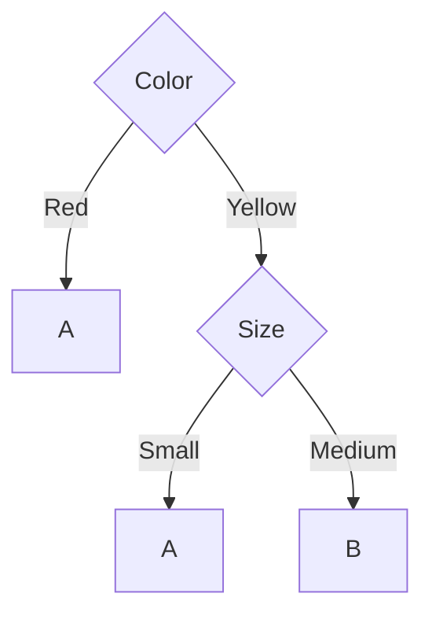

### 1.2 A Tree Is a Sequence of Questions

Once the dataset is represented as such a tree, we can use it to predict the class of any new instance. For example, we first check Color and check Size only when it is Yellow.

| Element of the tree | Meaning |
|:--------------------|:--------|
| Internal node | A question |
| Branch | An outcome of the question |
| Leaf node | The final predicted class |
| Root node | The node with the first question |

A new instance starts at the root and follows the branch that matches its feature value. The class of the leaf it reaches is the predicted output. **Learning is the process of determining these questions and their order from the data.**

Going down the tree and testing one feature at a time is the same as dividing the feature space step by step. In the end, a tree is a model that separates the space into regions by class.

### 1.3 The Tree and the Feature Space

Suppose there are two numeric features, x₁ and x₂. Testing x₁ < a at the first node creates a vertical boundary in the feature space. Testing x₂ < b again in one region creates one more horizontal boundary. In the end, each leaf of the tree corresponds to one region of the feature space.

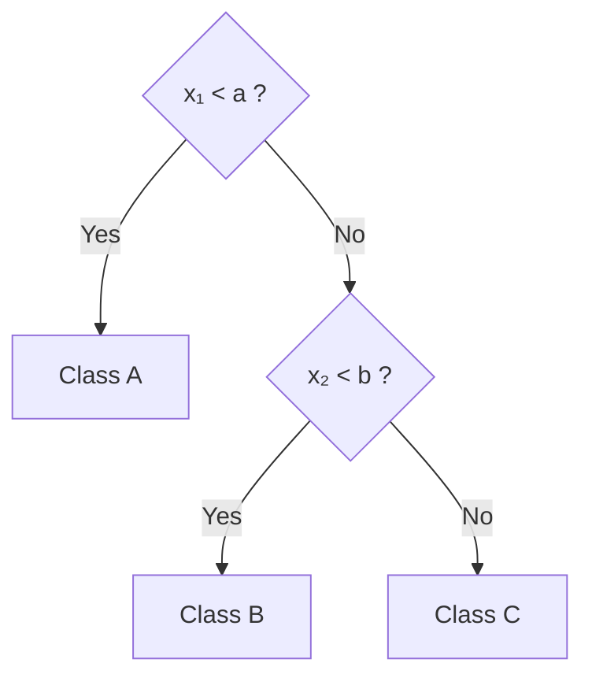

| Leaf | Region of the feature space |
|:----:|:----------------------------|
| Class A | x₁ < a (the whole area left of the vertical boundary a) |
| Class B | x₁ ≥ a and x₂ < b (lower right) |
| Class C | x₁ ≥ a and x₂ ≥ b (upper right) |

> **Key viewpoint:** A decision tree is not just a collection of if-then rules but **a classifier that partitions the feature space into several regions**. Each time a node is added, one new boundary appears in the feature space.

### 1.4 The Basic Algorithm and Impurity

The basic algorithm is as follows.

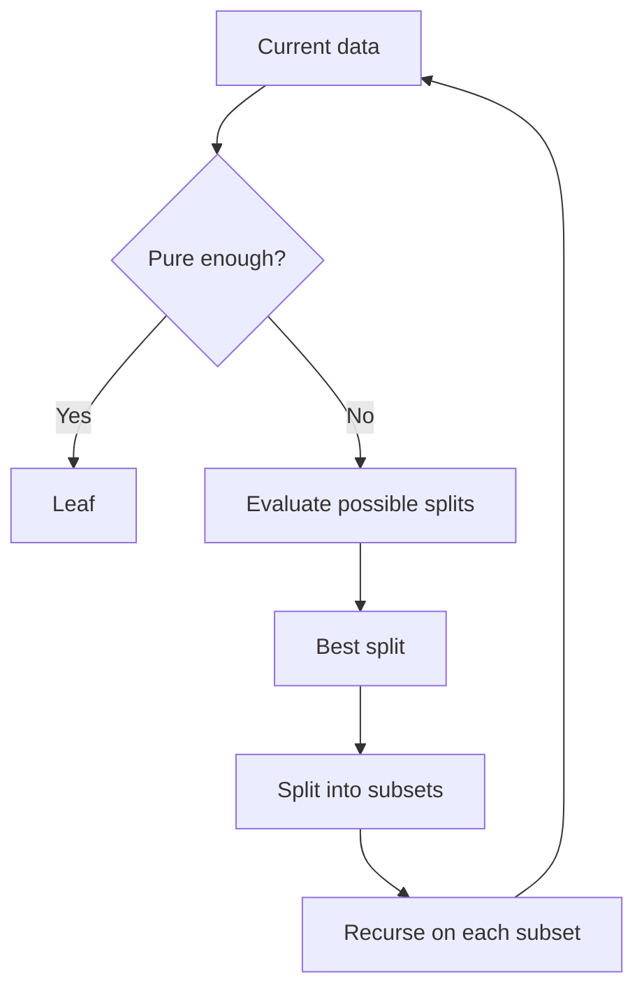

One key question remains.

> **Among many features and many splits, which one should we choose?**

A decision tree must have an appropriate complexity; if it is too simple or too complex, it cannot serve as a generalized classification model. The criterion by which a dataset with mixed classes is split is therefore important. That criterion is the **impurity**. Impurity is the same concept as the confusion of Lecture 02, and besides entropy, measures such as the **Gini index** are used to quantify it.

---

<br>

## 2. Building a Tree from Data: The Fruit Data

Let us bring back the six-fruit data of Lecture 02. This time we do not simply compute the entropy of each feature itself; we compare **how much the class entropy decreases when the data is split by each feature**.

### 2.1 Entropy Before the Split

The overall class distribution is A = 4 and B = 2, so

$$
H_{\text{before}} = -\frac{4}{6}\log_2\frac{4}{6} - \frac{2}{6}\log_2\frac{2}{6} \approx 0.918 \text{ bits}
$$

### 2.2 Splitting by Size, Color, and Surface

**Splitting by Size.** Small has one A and Big also has one A, so their entropy is 0. Medium has A = 2 and B = 2, so its entropy is 1.

$$
H_{\text{after}}(Size) = \frac{1}{6}(0) + \frac{4}{6}(1) + \frac{1}{6}(0) = 0.667, \qquad \text{Gain}(Size) = 0.918 - 0.667 = 0.252
$$

**Splitting by Color.** Red has A = 3 and B = 0, so its entropy is 0. Yellow has A = 1 and B = 2.

$$
H(Yellow) = -\frac{1}{3}\log_2\frac{1}{3} - \frac{2}{3}\log_2\frac{2}{3} \approx 0.918
$$

$$
H_{\text{after}}(Color) = \frac{3}{6}(0) + \frac{3}{6}(0.918) = 0.459, \qquad \text{Gain}(Color) = 0.918 - 0.459 = 0.459
$$

**Splitting by Surface.** Rough has only one A, so its entropy is 0, and Smooth has A = 3 and B = 2.

$$
H(Smooth) = -\frac{3}{5}\log_2\frac{3}{5} - \frac{2}{5}\log_2\frac{2}{5} \approx 0.971
$$

$$
H_{\text{after}}(Surface) = \frac{5}{6}(0.971) + \frac{1}{6}(0) = 0.809, \qquad \text{Gain}(Surface) = 0.918 - 0.809 = 0.109
$$

The difference between the entropy before the split and after the split, that is, the amount by which the confusion decreases, is called the **information gain**.

$$
\text{Gain}(A) = H_{\text{before}} - H_{\text{after}}(A)
$$

### 2.3 The First Split and the Finished Tree

| Feature | H_after | Information Gain | Rank |
|:--------|:-------:|:----------------:|:----:|
| Color | 0.459 | **0.459** | 1 |
| Size | 0.667 | 0.252 | 2 |
| Surface | 0.809 | 0.109 | 3 |

The first node therefore chooses **Color**. The Red branch is all A, so it becomes a leaf right away. The Yellow branch has A and B mixed, so it must be split again. Looking only at Yellow, Size = Small gives A and Medium gives B, so the classes are completely separated. The result is the tree of Section 1.1.

> **Key point:** This small example already shows the whole decision tree algorithm. **Choose the feature that reduces the confusion the most, and repeat the same computation only for the branches whose classes are still mixed.**

---

<br>

## 3. Weather Data: Understanding the Repeated Process with a Larger Example

The well-known Weather Data has 14 instances, with the classes Yes = 9 and No = 5. The entropy at the root is therefore

$$
H([9, 5]) = -\frac{9}{14}\log_2\frac{9}{14} - \frac{5}{14}\log_2\frac{5}{14} = 0.940
$$

| Outlook | Temperature | Humidity | Windy | Play (class) |
|:--------|:------------|:---------|:------|:-------------|
| sunny | hot | high | false | no |
| sunny | hot | high | true | no |
| overcast | hot | high | false | yes |
| rainy | mild | high | false | yes |
| rainy | cool | normal | false | yes |
| rainy | cool | normal | true | no |
| overcast | cool | normal | true | yes |
| sunny | mild | high | false | no |
| sunny | cool | normal | false | yes |
| rainy | mild | normal | false | yes |
| sunny | mild | normal | true | yes |
| overcast | mild | high | true | yes |
| overcast | hot | normal | false | yes |
| rainy | mild | high | true | no |

### 3.1 Choosing the Root

Splitting by Outlook gives Sunny [2, 3], Overcast [4, 0], and Rainy [3, 2] (the brackets give the counts [Yes, No]).

$$
H_{\text{after}}(Outlook) = \frac{5}{14}(0.971) + \frac{4}{14}(0) + \frac{5}{14}(0.971) = 0.693
$$

Therefore,

$$
\text{Gain}(Outlook) = 0.940 - 0.693 = 0.247
$$

Computing all four features in the same way gives the following.

$$
\text{Gain}(Outlook) = 0.247, \quad \text{Gain}(Temperature) = 0.029, \quad \text{Gain}(Humidity) = 0.152, \quad \text{Gain}(Windy) = 0.048
$$

The [Yes, No] distribution of each branch for each feature is as in textbook Figure 4.2 (Tree stumps for the weather data).

| Feature | [Yes, No] per branch | H_after |
|:--------|:---------------------|:-------:|
| Outlook | Sunny [2, 3], Overcast [4, 0], Rainy [3, 2] | 0.693 |
| Temperature | Hot [2, 2], Mild [4, 2], Cool [3, 1] | 0.911 |
| Humidity | High [3, 4], Normal [6, 1] | 0.788 |
| Windy | False [6, 2], True [3, 3] | 0.892 |

The root therefore chooses **Outlook**.

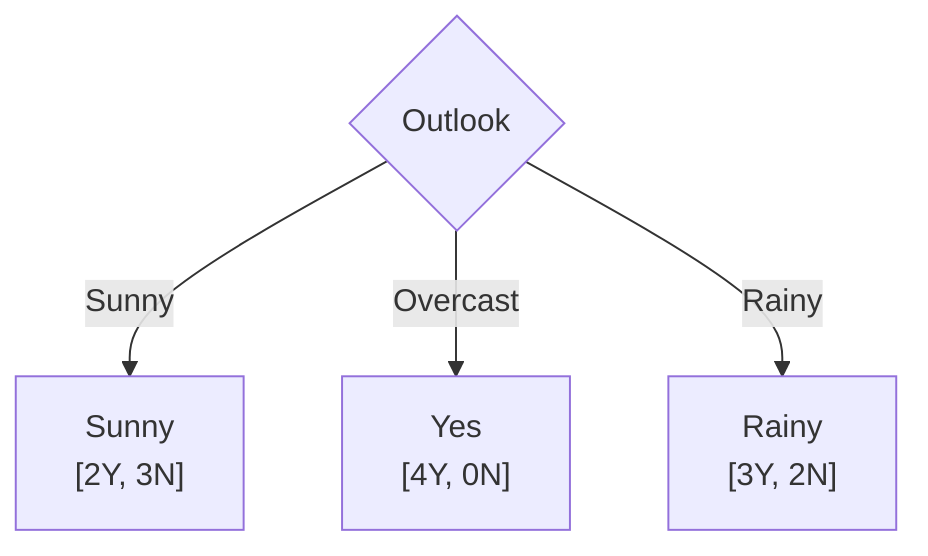

### 3.2 Splitting the Sunny Branch Again

The Overcast branch is already pure, so it ends. The Sunny branch still has Yes and No mixed. Recomputing with only the instances that reach Sunny gives

$$
\text{Gain}(Temperature) = 0.571, \quad \text{Gain}(Humidity) = 0.971, \quad \text{Gain}(Windy) = 0.020
$$

so **Humidity** is chosen. Among the 5 Sunny instances, Humidity = High is all No and Normal is all Yes, so they are completely separated. The same computation in the Rainy branch shows that **Windy** separates it completely, with False all Yes and True all No.

### 3.3 The Finished Tree

Repeating the same process completes the following tree.

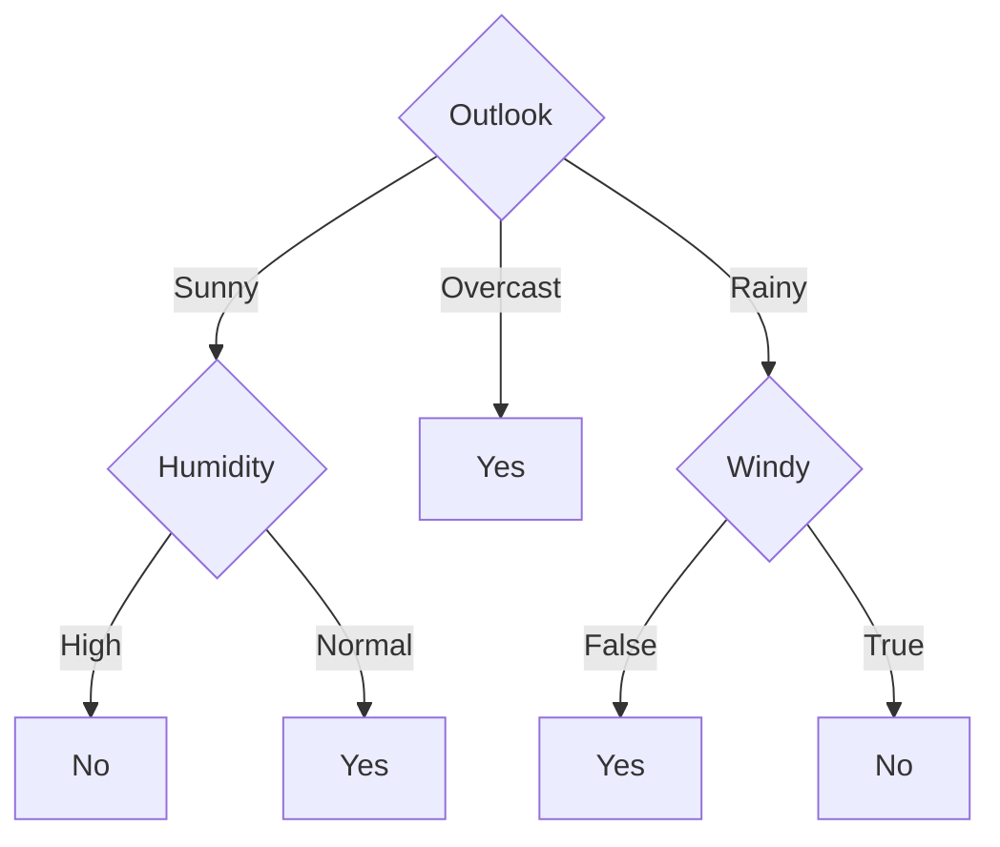

Choosing the feature with the largest information gain at each node and repeating recursively, as in this process, is the learning process of the **ID3** algorithm.

---

<br>

## 4. Is Splitting More Always Better? The Identification Code Problem

Information gain has a pitfall. **A feature with many kinds of values tends to have a large gain, because it can easily split the data into very small subsets.**

Suppose each instance has a different ID. Splitting by ID leaves a single instance in each branch, so every leaf is pure.

$$
H_{\text{after}}(ID) = 0, \qquad \text{Gain}(ID) = 0.940
$$

That is, ID looks like a far better feature than Outlook. However, a new instance has a new ID, so ID does not help actual prediction.

**Textbook Table 4.6: The Weather Data with Identification Codes**

| ID Code | Outlook | Temperature | Humidity | Windy | Play |
|:-------:|:--------|:------------|:---------|:------|:-----|
| a | Sunny | Hot | High | False | No |
| b | Sunny | Hot | High | True | No |
| c | Overcast | Hot | High | False | Yes |
| d | Rainy | Mild | High | False | Yes |
| e | Rainy | Cool | Normal | False | Yes |
| f | Rainy | Cool | Normal | True | No |
| g | Overcast | Cool | Normal | True | Yes |
| h | Sunny | Mild | High | False | No |
| i | Sunny | Cool | Normal | False | Yes |
| j | Rainy | Mild | Normal | False | Yes |
| k | Sunny | Mild | Normal | True | Yes |
| l | Overcast | Mild | High | True | Yes |
| m | Overcast | Hot | Normal | False | Yes |
| n | Rainy | Mild | High | True | No |

Textbook Figure 4.5 (Tree stump for the ID code attribute) is the tree stump split by ID code. Each of the 14 branches ends with a single instance.

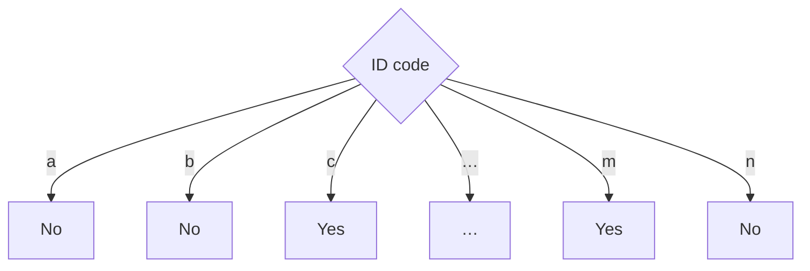

> **Important lesson:** A feature that perfectly separates the training data is not necessarily a good predictive feature. This problem is directly connected to the **overfitting** problem of decision trees.

---

<br>

## 5. Gain Ratio: Penalizing Too Many Branches

### 5.1 SplitInfo and Gain Ratio

**C4.5** uses the **gain ratio** to ease the problem of overly favoring features with many kinds of values. It first defines the complexity of the split itself as

$$
SplitInfo(A) = -\sum_{j} \frac{|S_j|}{|S|}\log_2\frac{|S_j|}{|S|}
$$

and corrects the gain with

$$
GainRatio(A) = \frac{Gain(A)}{SplitInfo(A)}
$$

**SplitInfo measures how the data is divided among the branches after the split.** It is computed not from how mixed the classes are but from **the proportion of the data assigned to each branch**. Here |S| is the total number of instances and |Sⱼ| is the number of instances in the j-th branch. If k instances each go into a different branch, as in the ID code problem, SplitInfo becomes log₂ k.

Splitting the same 8 instances in different ways gives the following.

| Split result | SplitInfo |
|:-------------|:---------:|
| Two branches with 7 and 1 | about 0.544 |
| Two branches with 4 each | 1 |
| Four branches with 2 each | 2 |
| Eight branches with 1 each | 3 |

If ID makes 14 different branches,

$$
SplitInfo(ID) = \log_2 14 = 3.807
$$

and

$$
GainRatio(ID) = \frac{0.940}{3.807} = 0.247
$$

Making many branches itself enlarges the denominator, so such a split is penalized compared with plain information gain.

> **Key point:** It evaluates how much the class uncertainty was reduced (Gain) **in light of how finely the data was divided into branches (SplitInfo)**.

### 5.2 Gain Ratio of the Weather Data

Textbook Table 4.7 computes the gain ratio for the tree stumps of Figure 4.2.

**Textbook Table 4.7: Gain Ratio Calculations for the Tree Stumps of Fig. 4.2**

| | Outlook | Temperature | Humidity | Windy |
|:--|:--|:--|:--|:--|
| Info | 0.693 | 0.911 | 0.788 | 0.892 |
| Gain | 0.940 − 0.693 = 0.247 | 0.940 − 0.911 = 0.029 | 0.940 − 0.788 = 0.152 | 0.940 − 0.892 = 0.048 |
| Split info | info([5,4,5]) = 1.577 | info([4,6,4]) = 1.557 | info([7,7]) = 1.000 | info([8,6]) = 0.985 |
| Gain ratio | 0.247/1.577 = 0.156 | 0.029/1.557 = 0.019 | 0.152/1 = 0.152 | 0.048/0.985 = 0.049 |

With the gain ratio, Outlook (0.156) is still the largest, but its lead over Humidity (0.152) shrinks greatly. This is because the SplitInfo of Outlook with three branches (1.577) is larger than that of Humidity with two branches (1.000). However, the gain ratio of the ID code is 0.247, still larger than Outlook's. In practice, therefore, a separate test that filters out useless attributes such as an ID code is used as well, and the standard approach chooses the attribute with the largest gain ratio among those whose information gain is at least the average (textbook Section 4.3).

---

<br>

## 6. Gini Index

### 6.1 Definition of the Gini Impurity

The **Gini impurity** measures how diversely the classes are mixed within a node. Its formula has the same form as the Simpson-type diversity index of ecology, and probabilistically it can be understood as **the complement of the probability that the same symbol repeats when drawing twice**.

Let the class proportions be p₁, p₂, …, p_k. When two instances are drawn independently from the same set, the probability that both are class i is pᵢ². The total probability that the two instances have the same class is therefore

$$
\text{repeat rate} = \sum_i p_i^2
$$

The probability of drawing different classes is its complement, so

$$
\text{Gini} = 1 - \sum_i p_i^2
$$

Simpson-type indices use Σpᵢ² as a measure of concentration or dominance and 1 − Σpᵢ² as a measure of diversity. The intuition of "one minus the repeat rate" used in cryptography and randomness analysis is the same.

| Drawing twice | Meaning | Formula |
|:--------------|:--------|:--------|
| repeat rate | Probability of drawing the same class twice | Σpᵢ² |
| diversity / impurity | Probability of drawing different classes | 1 − Σpᵢ² |

### 6.2 Meaning in Decision Trees and a Simple Example

In decision trees, classes take the place of the species of ecology or the symbols of information theory. The Gini impurity can be interpreted as **the probability that two instances drawn at random from a node belong to different classes**. A small Gini therefore means that most instances belong to the same class, and a large Gini means that several classes are heavily mixed.

| Class distribution | p(A) | p(B) | Gini |
|:------------------:|:----:|:----:|:-----|
| A A A A | 1 | 0 | 0 |
| A A A B | 0.75 | 0.25 | 1 − (0.75² + 0.25²) = 0.375 |
| A A B B | 0.5 | 0.5 | 1 − (0.5² + 0.5²) = 0.5 |

If all are A, drawing two always gives the same class, so the Gini is 0. Conversely, if A and B are 50:50, the chance of drawing different classes is the greatest, so the Gini is at its maximum in binary classification.

### 6.3 Quality of a Split: Weighted Gini

When a feature splits a parent node into several child nodes, we compute the Gini of each child and average them, weighted by the size of each child.

$$
\text{Gini}_{\text{split}} = \sum_j \frac{|S_j|}{|S|}\,\text{Gini}(S_j)
$$

A good split makes this weighted Gini small. In other words, we choose the feature that most lowers the chance of drawing mixed classes in each region after the split.

Gini rests on essentially the same idea as entropy. Entropy measures the uncertainty about the outcome, and Gini measures how mixed the classes are from the viewpoint of diversity. Both are 0 at a pure node and grow as the classes are mixed more evenly.

For example, suppose a parent node has 7 A and 9 B (16 in total) and is split into child 1 (1 A and 5 B, 6 in total) and child 2 (6 A and 4 B, 10 in total).

$$
\text{Gini}_{\text{parent}} = 1 - \left(\left(\frac{7}{16}\right)^2 + \left(\frac{9}{16}\right)^2\right) \approx 0.492
$$

$$
\text{Gini}_1 = 1 - \left(\left(\frac{1}{6}\right)^2 + \left(\frac{5}{6}\right)^2\right) \approx 0.278, \qquad \text{Gini}_2 = 1 - \left(\left(\frac{6}{10}\right)^2 + \left(\frac{4}{10}\right)^2\right) = 0.48
$$

$$
\text{Gini}_{\text{split}} = \frac{6 \cdot \text{Gini}_1 + 10 \cdot \text{Gini}_2}{16} \approx \frac{6(0.278) + 10(0.48)}{16} \approx 0.404
$$

The impurity drops from 0.492 to 0.404 after the split.

### 6.4 CART: Evaluating Candidate Splits

The method that finds the best binary split using Gini is the algorithm called **CART (Classification And Regression Trees)**. The core of CART is to try several possible splits at the current node and choose the one split whose child nodes have the smallest weighted Gini.

As a concrete example, let us evaluate one split. Suppose a parent node has 100 instances: 40 of class A, 30 of B, 20 of C, and 10 of D. One of the candidate splits is Age < 65?.

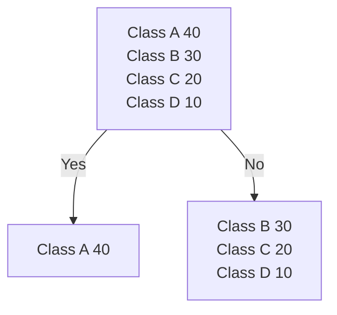

The Gini of the parent node is as follows.

$$
\text{Gini(parent)} = 1 - (0.4^2 + 0.3^2 + 0.2^2 + 0.1^2) = 0.70
$$

The left child is all A, so it is completely pure.

$$
\text{Gini(left)} = 0
$$

The right child has 30 B, 20 C, and 10 D, 60 in total.

$$
\text{Gini(right)} = 1 - \left[\left(\frac{30}{60}\right)^2 + \left(\frac{20}{60}\right)^2 + \left(\frac{10}{60}\right)^2\right] \approx 0.611
$$

The weighted Gini after the split is therefore as follows.

$$
\text{Gini(split)} = \frac{40}{100} \times 0 + \frac{60}{100} \times 0.611 \approx 0.367
$$

That is, the impurity drops sharply from 0.70 to 0.367. Age < 65 is therefore a fairly good candidate split.

CART does not stop after testing Age < 65 alone. It evaluates **all features and possible split candidates** available at the current node. For a numeric feature such as Age, it sorts the values and makes the possible thresholds into candidates. With n distinct values, there can be at most n − 1 threshold candidates.

| Candidate split | Weighted Gini | Evaluation |
|:----------------|:-------------:|:-----------|
| Age < 32 | 0.58 | Less good |
| Age < 45 | 0.49 | Moderate |
| Age < 65 | 0.367 | Best |
| Income < 5,000 | 0.44 | Moderate |

In this example, Age < 65 has the smallest weighted Gini, so that split is chosen. The same work is then repeated in the resulting left child and right child.

> **CART** is a **greedy decision tree algorithm** that compares the possible binary splits, chooses the split with the smallest weighted Gini impurity of the child nodes, and repeats the process recursively.

With many candidate splits the computation can grow, but since it does not search all possible trees and only chooses the best local split at each node, it can be used on data of practical size.

---

<br>

## 7. Comparing Impurity Measures

### 7.1 Measures of Impurity

Let us compare two nodes of 16 instances with the three criteria. The left node has 15 blue points and 1 red point, and the right node has 8 blue points and 8 red points.

| Criterion | Left node (15 : 1) | Right node (8 : 8) |
|:----------|:-------------------|:-------------------|
| Misclassification | 1/16 = 0.06 | 8/16 = 0.5 |
| Gini | 1 − [(1/16)² + (15/16)²] = 0.12 | 1 − [(8/16)² + (8/16)²] = 0.5 |
| Information (entropy) | −[1/16 × log₂(1/16) + 15/16 × log₂(15/16)] = 0.34 | −[8/16 × log₂(8/16) + 8/16 × log₂(8/16)] = 1 |

All three criteria are small for the nearly pure left node and large for the half-and-half right node.

### 7.2 Values of the Three Measures by p(A)

For example, suppose the proportion of A in a two-class problem is as follows.

| p(A) | Error | Gini | Entropy |
|:----:|:-----:|:----:|:-------:|
| 0.50 | 0.50 | 0.50 | 1.00 |
| 0.60 | 0.40 | 0.48 | 0.971 |
| 0.70 | 0.30 | 0.42 | 0.881 |
| 0.80 | 0.20 | 0.32 | 0.722 |
| 0.90 | 0.10 | 0.18 | 0.469 |
| 1.00 | 0 | 0 | 0 |

All three criteria decrease as the node becomes purer.

### 7.3 Differences in the Shape of the Functions

However, the shapes of the functions differ.

| Criterion | Formula | Characteristic |
|:----------|:--------|:---------------|
| Misclassification error | 1 − maxₖ pₖ | The simplest, and piecewise linear. |
| Gini | 1 − Σ pₖ² | Smoother. |
| Entropy | −Σ pₖ log pₖ | A smooth function that is more sensitive to changes in probability. |

That is why, while a tree is growing, Gini and entropy distinguish small differences between split candidates better.

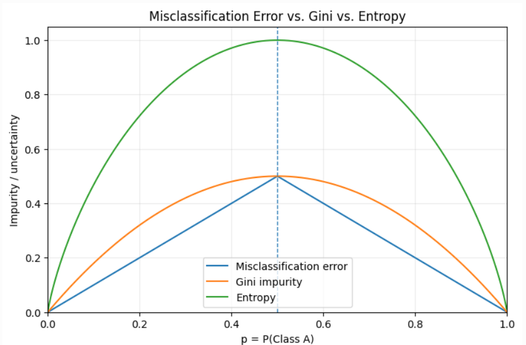

*Lecture 03, Page 16: Curves of misclassification error, Gini impurity, and entropy over p = P(Class A)*

All three criteria look in the same direction. The error rate looks directly at "how many are wrong", while Gini and entropy look more smoothly at "how mixed it is".

- Entropy asks "how uncertain is it?"
- Gini asks "how much are different classes mixed?"

In decision trees, however, both are criteria for measuring impurity, and in practice they often choose similar splits.

---

<br>

## 8. Decision Tree Is Not a Single Algorithm

"Decision tree" is less the name of one fixed algorithm than a family of algorithms implemented differently according to **which split criterion they use, how they handle numeric and missing values, and how they prune**.

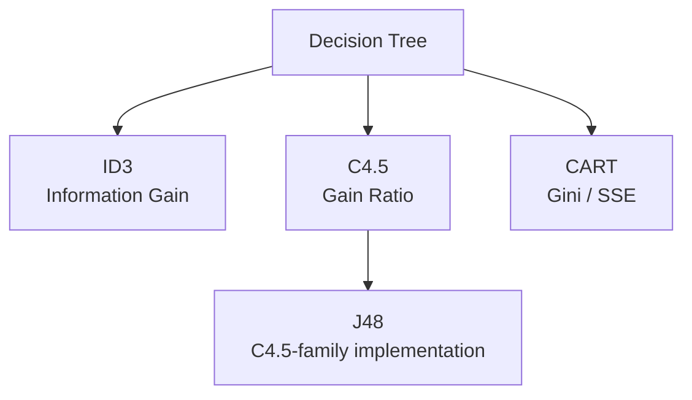

| | ID3 | C4.5 | CART |
|:--|:--|:--|:--|
| Main criterion | Information Gain | Gain Ratio | Gini (classification), error reduction (regression) |
| Split form | Multiway possible | Multiway possible | Binary split |
| Numeric feature | Limited | Supported | Supported |
| Missing value | Limited in the basic form | Supported | Supported depending on the implementation |
| Pruning | None in the basic form | Supported | Supported |
| Regression | No | No | Yes |

- **ID3:** At each node, it computes the information gain of every candidate feature, chooses the feature with the largest gain, and repeats recursively. The computation on the Weather Data in Section 3 is the typical learning process of ID3.
- **C4.5:** A practical extension of ID3. It uses the gain ratio and supports numeric attributes, missing data, pruning, rule conversion, and more. Weka's J48 is known as a C4.5-family implementation.
- **CART:** Short for Classification And Regression Trees. It generally uses binary splits, with Gini for classification and criteria such as squared error (SSE) for regression.

---

<br>

## 9. Overfitting and Pruning

### 9.1 Complexity of a Tree

If we keep growing a tree, it can classify the training data more and more finely. In the extreme, we can make each leaf hold only one instance. At that point, however, the tree may learn noise and accidental characteristics rather than general rules.

**Too simple** (one question)

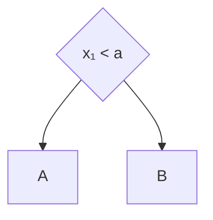

**Appropriate complexity** (two questions)

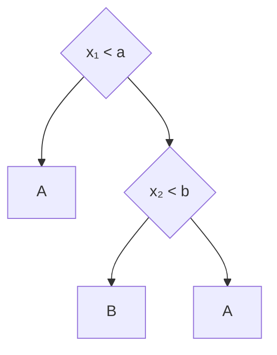

**Overly complex** (three questions, four leaves)

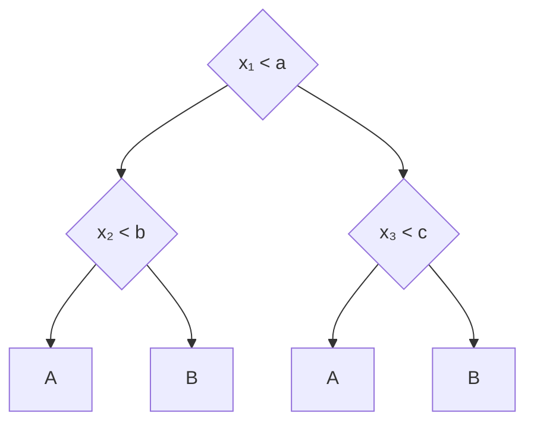

### 9.2 A Tree That Isolates a Single Exception

In the data below, it is generally A when x₁ < 5 and B when x₁ ≥ 5. Now suppose a single B is observed at (3, 3) in the left region. This observation may be a measurement error or an accidental exception, or it may be a real subgroup that has not yet been observed enough.

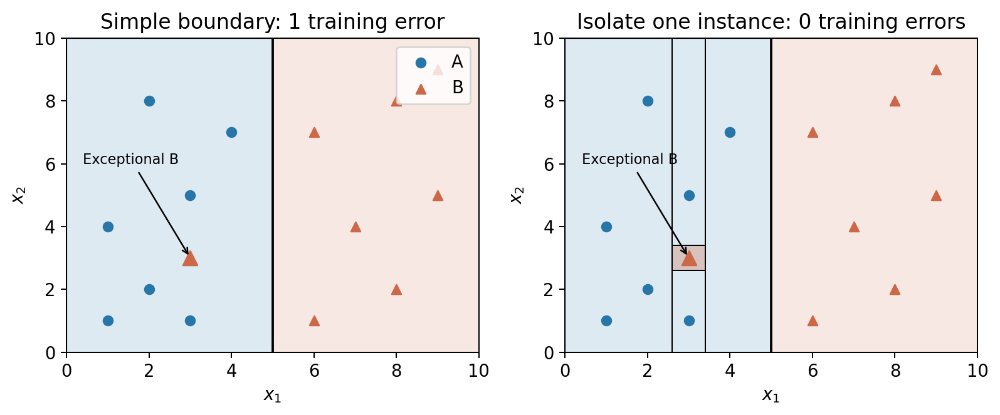

*Lecture 03, Page 17: Two boundaries for the same training data, a simple boundary on the left (1 training error) and a boundary that isolates the exceptional B on the right (0 training errors)*

In the figure, circles are A, triangles are B, and the background color is the predicted class. The right side adds four more splits to isolate the single B.

The left tree gets 14 of the 15 correct with the single question x₁ < 5. It predicts the exceptional B as A. The right tree, to get even that one correct, further splits subregions around x₁ = 2.6, x₁ = 3.4, x₂ = 2.6, and x₂ = 3.4. A small B region is created and the training error becomes 0, but the number of leaves grows from 2 to 6.

The problem is that the only evidence for predicting this whole small region as B is a single observation. If a new A instance appears at (3.1, 3.1), the simple tree predicts A but the complex tree predicts B. If the extra boundaries follow the location of an accidental case rather than the real class structure, the generalization performance can worsen.

> **Purity on the training data differs from generalization.** Making the impurity of every leaf 0 is a goal of removing the mixing in the training data. It is not the same as the goal of predicting well on new data. If very narrow regions are created to separate the last few instances, the predictions can change when the data changes only slightly. This is the typical pattern of **overfitting**.

However, a tree is not judged overfitted just because it is deep or complex. The real boundary may be complex. Whether an extra split is useful must be checked on validation data. The coordinates and boundaries in the figure are examples for explanation and do not represent the optimal splits of a particular learning algorithm.

### 9.3 When to Stop, and Pruning

**Pre-pruning stops while the tree is being built.** It limits the maximum depth, the minimum samples per leaf, the minimum impurity decrease, and so on. For example, requiring each leaf to keep at least several instances can suppress the creation of a small region for a single observation, as in the figure above. However, stopping too early may fail to learn even the needed structure, which leads to underfitting.

**Post-pruning simplifies a tree that has already been built.** It first learns a relatively large tree and then replaces unnecessary subtrees with a single leaf. In the example above, the subtree that creates the small B region can be replaced with an A leaf to reduce complexity. The training error may then increase, but the validation performance can stay the same or improve.

An appropriate complexity is chosen using validation data or cross-validation. **Cost-complexity pruning** considers the prediction error together with a penalty on the number of leaves. The test data for the final evaluation is kept separate from this selection process.

### 9.4 Strengths and Limits of a Single Tree

A small tree is easy to understand by following its prediction path, and it can express conditional relationships between features as rules. However, if part of the data changes, the first split chosen can change, and the structure below it can change greatly as well. This instability is called **high variance**.

In addition, axis-aligned splits must approximate diagonal or curved boundaries with many rectangles. Even a simple real boundary can require many questions. Increasing the depth increases the expressive power, but it also increases the risk of overfitting and the burden of interpretation.

| Complexity choice | Pattern on training data | What to check on new data |
|:------------------|:-------------------------|:--------------------------|
| Too small a tree | Misses even important distinctions | Possible underfitting |
| Appropriate tree | Some exceptions may remain | Stable generalization |
| Too large a tree | Finely separates even accidental exceptions | Possible overfitting |

The purpose of a tree is not to explain every individual observation but **to estimate the class structure that appears repeatedly**. The splitting criterion and the stopping criterion must be designed together.

---

<br>

## 10. From a Single Tree to Random Forest

The representative way to reduce the instability of a single tree is to combine the predictions of several different trees. Using several models together is called **ensemble learning**, and **Random Forest** is its representative method.

**Build different trees and combine their predictions.** A standard Random Forest trains each tree on a **bootstrap sample** drawn with replacement from the original training data. In addition, at each node it considers **only a randomly chosen subset of all features as split candidates**. Giving randomness to both the data and the feature selection keeps the trees from becoming too similar.

In classification, the final class can be decided by collecting the class votes of the trees. For example, if five trees output A, A, B, A, and B, the majority vote predicts A. Depending on the implementation, the class probabilities of the trees may be averaged and the class with the largest probability chosen.

| Model | Role in learning and prediction |
|:------|:--------------------------------|
| Tree 1 | Trained with a different sample and feature candidates → A |
| Tree 2 | Trained with a different sample and feature candidates → A |
| Tree 3 | Trained with a different sample and feature candidates → B |
| Combined prediction | Example of a majority vote → A |

Even if one tree is sensitive to accidental characteristics of a particular sample, the combined prediction can be more stable as long as the other trees do not repeat the same error. This is why random feature selection, which lowers the correlation between trees, is important. Simply copying the same tree many times gives no such effect.

Not everything that uses several trees is a Random Forest. Random Forest is a specific ensemble method that combines sampling with random feature selection. It increases computation, makes it harder to explain the whole prediction as a single path as with a single tree, and does not automatically solve data bias or distribution shift.

---

<br>

## 11. Wrap-Up: Three Questions for Understanding Decision Trees

1. **How does it solve the problem?** It splits the feature space by recursive divide-and-conquer.
2. **Where should it split?** It finds the split that reduces the class confusion the most, using criteria such as information gain, gain ratio, and Gini.
3. **When should it stop splitting?** Splitting too deep causes overfitting, so the model complexity is controlled by pre-pruning or post-pruning.

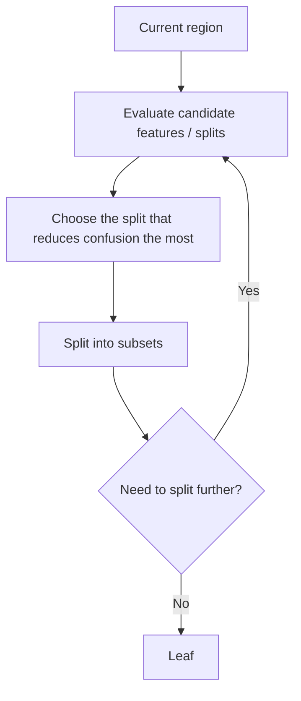

> **Decision tree learning** = the process of finding the best split in the current feature space, dividing the data, and repeating as needed to build a region for each class

### 11.1 Interpretability and Rule Conversion

One of the strengths of this model is that it is **interpretable**. The Weather tree of Section 3.3 can be converted into the following rules.

```text
IF Outlook = Sunny AND Humidity = High
THEN Play = No

IF Outlook = Sunny AND Humidity = Normal
THEN Play = Yes

IF Outlook = Overcast
THEN Play = Yes

IF Outlook = Rainy AND Windy = False
THEN Play = Yes

IF Outlook = Rainy AND Windy = True
THEN Play = No
```

Each path from the root to a leaf becomes one rule, and the questions on the path are joined by AND. However, because the decision boundary is rectangular, the error can grow for data points near the corners of the regions.

---

<br>

## 12. Characteristics and Limits of the Decision Boundary

A node of a typical decision tree uses a threshold on a single feature. In a two-dimensional feature space it therefore creates **boundaries parallel to the axes**. Complex nonlinear regions can be approximated with many rectangular pieces, but even a simple diagonal boundary may need many splits.

For example, a decision tree draws a vertical boundary at one value of x₁, splits the region to its right horizontally at x₂, and splits the lower part vertically at x₁ again, making four regions A, B, C, and D. In contrast, if the two classes are divided along a diagonal, a linear boundary needs only that one diagonal. For data in which x gathers in the upper left and o in the lower right, a decision tree (DT) must follow the boundary with a staircase of alternating horizontal and vertical lines, while a linear model (LM) divides it with a single straight line.

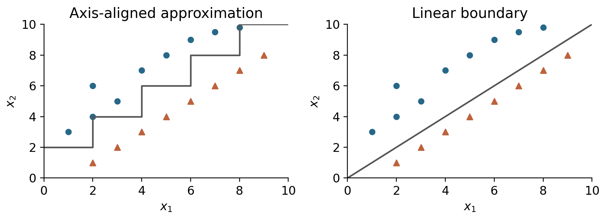

*Lecture 03, Page 22: Axis-aligned approximation (the staircase boundary of a decision tree) versus a linear boundary for data divided along a diagonal*

The axis-aligned approximation on the left builds a staircase of many horizontal and vertical splits to follow the diagonal boundary. The linear boundary on the right separates the same two classes with a single straight line.

Because of this limit, there is also research on splits made from linear combinations of several features, such as the **oblique tree**. Still, the greatest strengths of the basic decision tree remain **interpretability and simplicity**. Models that learn straight boundaries lead to the Linear Model of the next lecture.

---

<br>

## Summary

| Concept | Key Points |
|:--------|:-----------|
| Decision tree | A model made of questions (internal nodes), outcomes (branches), and predicted classes (leaves). It is a classifier that partitions the feature space into axis-parallel regions. |
| Basic algorithm | If a node is pure enough, make it a leaf; otherwise split it by the best split and repeat recursively on each subset. |
| Information gain | Gain(A) = H_before − H_after(A). Color (0.459) is chosen for the fruit data, and Outlook (0.247) at the root of the Weather data. |
| ID3 | Chooses the feature with the largest information gain at each node. The Weather tree is Outlook, then Humidity under Sunny and Windy under Rainy. |
| ID code problem | A feature with many values creates small pure subsets and looks like a large gain (Gain(ID) = 0.940). A feature that perfectly splits the training data is not a good predictive feature. |
| Gain ratio | Divides the gain by SplitInfo (the entropy of the proportions of data sent to each branch) to penalize splits with many branches. C4.5 uses it. |
| Gini impurity | 1 − Σpᵢ², the probability that two drawn instances belong to different classes. A split is evaluated by the weighted Gini, weighted by the child sizes. |
| CART | A greedy algorithm that chooses, among the possible binary splits, the one with the smallest weighted Gini. It uses squared error for regression. |
| Impurity measures | Error is piecewise linear, while Gini and entropy are smooth and distinguish small differences between splits better. All three are smaller for purer nodes. |
| Overfitting and pruning | Splitting even the exceptions makes the training error 0 but can hurt generalization. Pre-pruning stops early, and post-pruning simplifies a large tree. The complexity is chosen with validation data. |
| Random Forest | Builds many trees with bootstrap samples and random feature candidates and combines them by majority vote, reducing the high variance of a single tree. |
| Strengths and limits | It can be converted into rules and is easy to interpret. Its boundaries are axis-parallel, so a diagonal boundary must be approximated with a staircase. |

---

<br>

## Review Questions

1. **Tree and space:** For two numeric features x₁ and x₂, a tree has root x₁ < a and the question x₂ < b on its No branch. How many regions does it divide the feature space into, and what do the boundaries look like?

   > **Answer:** There are 3 leaves, so there are 3 regions. One vertical boundary appears at x₁ = a, and one horizontal boundary at x₂ = b appears in the region to its right. All boundaries are parallel to the axes.

2. **Information gain:** Show the computation that gives Gain(Color) = 0.459 for the fruit data.

   > **Answer:** Before the split, H = −(4/6)log₂(4/6) − (2/6)log₂(2/6) ≈ 0.918. Red (3 A) has 0 and Yellow (1 A, 2 B) has about 0.918, so H_after = (3/6)(0) + (3/6)(0.918) = 0.459. Gain = 0.918 − 0.459 = 0.459.

3. **Weather root:** Compute Gain(Humidity) = 0.152 for the Weather data.

   > **Answer:** The entropy of High [3, 4] is about 0.985 and that of Normal [6, 1] is about 0.592. H_after = (7/14)(0.985) + (7/14)(0.592) ≈ 0.788, so Gain = 0.940 − 0.788 = 0.152.

4. **ID code problem:** Why should ID not be used as the root even though Gain(ID) = 0.940, and how does the gain ratio ease this?

   > **Answer:** ID has a different value for every instance, so every leaf becomes pure with a single instance, but a new instance has a new ID, so it cannot be used for prediction. The gain ratio divides the gain by SplitInfo(ID) = log₂ 14 ≈ 3.807, lowering it to 0.247. The more branches a split makes, the larger the denominator and the more it is penalized.

5. **SplitInfo:** What is the SplitInfo when 8 instances are split into two branches of 6 and 2?

   > **Answer:** −(6/8)log₂(6/8) − (2/8)log₂(2/8) ≈ 0.311 + 0.5 = 0.811. It is larger than for 7 and 1 (about 0.544) and smaller than for 4 and 4 (1).

6. **Gini:** Compute the Gini of a node whose class distribution is 2 A, 2 B, and 4 C.

   > **Answer:** The proportions are 0.25, 0.25, and 0.5. Gini = 1 − (0.25² + 0.25² + 0.5²) = 1 − (0.0625 + 0.0625 + 0.25) = 0.625.

7. **CART:** With a parent of 40 A, 30 B, 20 C, and 10 D, explain how splitting by Age < 65 gives a weighted Gini of 0.367.

   > **Answer:** The left child has only the 40 A, so its Gini = 0. The right child has 30 B, 20 C, and 10 D (60 in total), so its Gini = 1 − (0.5² + 0.333² + 0.167²) ≈ 0.611. The weighted Gini = 0.4 × 0 + 0.6 × 0.611 ≈ 0.367.

8. **Impurity measures:** For a two-class node with p(A) = 0.8, compute the error, Gini, and entropy, and explain why Gini or entropy is used more for growing trees.

   > **Answer:** Error = 1 − 0.8 = 0.2, Gini = 1 − (0.64 + 0.04) = 0.32, and entropy ≈ 0.722. Error is piecewise linear, so different splits often give the same error, while Gini and entropy are smooth functions that distinguish small differences between split candidates.

9. **Pruning:** Explain the difference between pre-pruning and post-pruning, and state the risk of each.

   > **Answer:** Pre-pruning stops while building the tree using conditions such as the maximum depth, the minimum samples per leaf, and the minimum impurity decrease; stopping too early can cause underfitting. Post-pruning first builds a large tree and then replaces unnecessary subtrees with leaves; the training error may increase, so whether the validation performance stays the same or improves must be checked with validation data.

10. **Random Forest:** Explain why Random Forest is more stable than a single tree, with its two kinds of randomness.

    > **Answer:** Each tree is trained on a bootstrap sample, and at each node only a randomly chosen subset of features is used as split candidates. These two kinds of randomness lower the correlation between the trees, so even if one tree is sensitive to accidental characteristics, the others do not repeat the same error, and the majority vote becomes stable.

---
