# 강의 04 — 선형 모델에서 신경망까지

> **최종 수정일:** 2026-10-08
>
> Data Mining: Practical Machine Learning Tools and Techniques, Witten and Frank - Ch 4, 7

> **학습 목표**:
> 1. 선형 회귀의 비용 함수를 정의하고, 정규방정식과 경사하강법으로 파라미터를 찾는 원리를 설명할 수 있다
> 2. 경사하강법의 업데이트 식에서 기울기와 learning rate의 역할을 설명하고, 간단한 예를 손으로 반복 계산할 수 있다
> 3. sigmoid, threshold, decision boundary, log-odds를 이용해 logistic regression의 구조와 이름을 설명할 수 있다
> 4. 분류에서 MSE 대신 cross entropy를 쓰는 이유를 설명하고 binary, categorical cross entropy를 계산할 수 있다
> 5. perceptron learning rule과 delta rule로 가중치를 갱신하고, OR 문제의 decision boundary 이동을 계산할 수 있다
> 6. 단일 perceptron이 XOR을 풀 수 없는 이유와, 여러 perceptron을 연결한 MLP가 비선형 경계를 만드는 원리를 설명할 수 있다

---

## 목차

- [1. 선형 모델에서 신경망까지의 지도](#1-선형-모델에서-신경망까지의-지도)
- [2. 선형 회귀](#2-선형-회귀)
  - [2.1 데이터를 가장 잘 설명하는 직선](#21-데이터를-가장-잘-설명하는-직선)
  - [2.2 다중 선형 회귀](#22-다중-선형-회귀)
  - [2.3 어떤 직선이 가장 좋은가](#23-어떤-직선이-가장-좋은가)
  - [2.4 비용 함수: 오차를 하나의 숫자로](#24-비용-함수-오차를-하나의-숫자로)
- [3. w와 b를 찾는 두 가지 방법](#3-w와-b를-찾는-두-가지-방법)
- [4. 경사하강법](#4-경사하강법)
  - [4.1 직관: 오차가 줄어드는 방향으로 조금씩](#41-직관-오차가-줄어드는-방향으로-조금씩)
  - [4.2 어느 방향으로, 얼마나 움직일까](#42-어느-방향으로-얼마나-움직일까)
  - [4.3 Learning rate에 따른 수렴](#43-learning-rate에-따른-수렴)
  - [4.4 단순 선형 회귀 예시](#44-단순-선형-회귀-예시)
  - [4.5 여러 변수와 편미분](#45-여러-변수와-편미분)
- [5. Logistic Regression](#5-logistic-regression)
  - [5.1 선형 회귀로 분류를 하면 생기는 문제](#51-선형-회귀로-분류를-하면-생기는-문제)
  - [5.2 Sigmoid 함수](#52-sigmoid-함수)
  - [5.3 Threshold와 decision boundary](#53-threshold와-decision-boundary)
  - [5.4 확률 공간으로 보기](#54-확률-공간으로-보기)
  - [5.5 왜 이름이 Logistic Regression인가](#55-왜-이름이-logistic-regression인가)
- [6. Cross Entropy](#6-cross-entropy)
  - [6.1 왜 MSE가 아니라 Cross Entropy인가](#61-왜-mse가-아니라-cross-entropy인가)
  - [6.2 Entropy와 Cross Entropy](#62-entropy와-cross-entropy)
  - [6.3 Binary와 Categorical Cross Entropy](#63-binary와-categorical-cross-entropy)
- [7. Logistic Regression의 학습](#7-logistic-regression의-학습)
- [8. Linear Regression과 Logistic Regression의 비교](#8-linear-regression과-logistic-regression의-비교)
- [9. Perceptron](#9-perceptron)
  - [9.1 Logistic Regression 다음에 Perceptron](#91-logistic-regression-다음에-perceptron)
  - [9.2 구조와 계산](#92-구조와-계산)
  - [9.3 Perceptron learning rule](#93-perceptron-learning-rule)
  - [9.4 Delta rule](#94-delta-rule)
- [10. OR 문제를 Perceptron으로 학습시키기](#10-or-문제를-perceptron으로-학습시키기)
- [11. XOR 문제와 단일 Perceptron의 한계](#11-xor-문제와-단일-perceptron의-한계)
- [12. 여러 Perceptron을 연결하면: MLP로](#12-여러-perceptron을-연결하면-mlp로)
  - [12.1 Perceptron을 배우는 이유](#121-perceptron을-배우는-이유)
  - [12.2 두 개의 perceptron으로 XOR 풀기](#122-두-개의-perceptron으로-xor-풀기)
  - [12.3 직선과 layer를 늘리면](#123-직선과-layer를-늘리면)
  - [12.4 MLP라는 이름](#124-mlp라는-이름)
- [요약](#요약)
- [점검 문제](#점검-문제)

---

 

## 1. 선형 모델에서 신경망까지의 지도

**선형 모델(linear model)** 은 feature들의 **선형 결합(linear combination of features)** 으로 출력을 계산한다.

$$
y = w_1 x_1 + w_2 x_2 + \cdots + w_0
$$

데이터의 관계가 직선(또는 평면)으로 설명되면 선형 모델로 충분하지만, 곡선처럼 휘어 있으면 **비선형 모델(non-linear model)** 이 필요하다. 이 장은 선형 모델에서 출발해 신경망까지 이어지는 흐름을 따라간다.

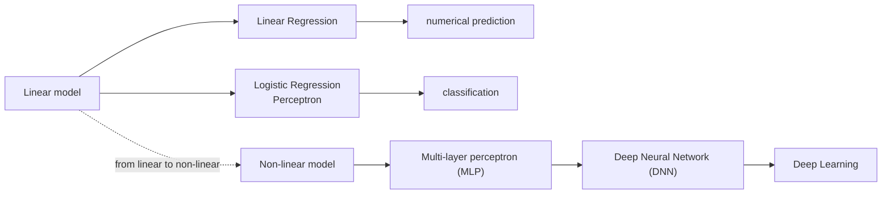

- **Linear Regression** 은 수치를 예측하고(numerical prediction), **Logistic Regression** 과 **Perceptron** 은 분류(classification)에 쓰인다.
- MLP, DNN, Deep Learning은 모두 **Neural Network(신경망)** 에 속한다. 신경망은 많은 layer와 비선형 activation을 쌓아 복잡한 비선형 함수를 모델링할 수 있다.
- layer가 많을수록 표현력(expressive power)이 커지며, 이것이 deep learning으로 이어진다.

---

 

## 2. 선형 회귀

### 2.1 데이터를 가장 잘 설명하는 직선

**선형 회귀(Linear Regression)** 는 데이터를 가장 잘 설명하는 직선을 찾는 문제이다. 입력 x와 정답 y의 쌍으로 이루어진 데이터가 있을 때, 표의 한 줄은 그래프의 점 하나가 된다.

| x (크기) | y (가격) |
|:--------:|:--------:|
| 1 | 2 |
| 2 | 4 |
| 3 | 5 |
| 4 | 4 |
| 5 | 6 |

선형 회귀 모델은 다음과 같은 직선이다. w₁은 기울기, w₀는 절편이며, x가 주어지면 y를 예측한다.

$$
\hat{y} = w_1 x + w_0
$$

각 데이터 점 (xᵢ, yᵢ)와 직선 사이의 세로 거리 yᵢ − ŷᵢ를 **오차(잔차, residual)** 라고 한다. 가장 좋은 직선은 모든 데이터에 대해 예측 오차가 가장 작아지는 직선이며, 이를 위해 **제곱 오차의 합을 최소화** 한다. 이 방법을 **최소제곱법(Least Squares)** 이라 한다.

$$
\sum_{i=1}^{n} (y_i - \hat{y}_i)^2 = \sum_{i=1}^{n} \bigl(y_i - (w_1 x_i + w_0)\bigr)^2
$$

오차를 제곱하는 이유는 다음과 같다.

- 양수로 만들어 +오차와 −오차가 서로 상쇄되지 않게 한다.
- 큰 오차에 더 큰 페널티를 준다.
- 수학적으로 다루기 편리하다(미분이 쉽다).

그 결과 최적의 w₁, w₀를 찾아 데이터를 가장 잘 설명하는 직선을 얻고, 새로운 x가 주어지면 y를 수치로 예측할 수 있다.

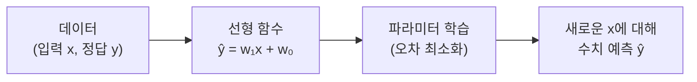

### 2.2 다중 선형 회귀

**다중 선형 회귀(Multiple Linear Regression)** 는 여러 개의 설명변수를 사용하여 연속값(수치)을 예측하는 선형 모델이다.

| 집 크기 x₁ (m²) | 방 개수 x₂ | 건축 연도 x₃ | 가격 y (억 원) |
|:---------------:|:----------:|:------------:|:--------------:|
| 84 | 3 | 2010 | 6.5 |
| 59 | 2 | 2015 | 4.2 |
| 120 | 4 | 2008 | 9.8 |
| 95 | 3 | 2020 | 7.1 |
| 70 | 2 | 2018 | 5.0 |

데이터를 n차원 공간에 놓으면 직선 대신 데이터를 가장 잘 설명하는 **평면(초평면)** 을 찾는 문제가 된다.

$$
\hat{y} = w_1 x_1 + w_2 x_2 + w_3 x_3 + \cdots + w_0
$$

w₁, w₂, w₃는 각각 집 크기, 방 개수, 건축 연도의 영향이고, w₀는 절편(기본값)이다. x가 여러 개여도 각 x의 **선형 결합(가중합)** 으로 y를 예측한다는 점은 같다. 학습은 단순 선형 회귀와 마찬가지로 모든 데이터에 대해 예측 오차가 가장 작아지도록 w₁, w₂, …, w₀를 찾는 것이다.

$$
\text{minimize} \; \sum_{i=1}^{n} (y_i - \hat{y}_i)^2
$$

예를 들어 학습된 모델이 ŷ = 0.06x₁ + 0.8x₂ − 0.02x₃ + 10이라면, 집 크기 100 m², 방 3개, 2018년에 지어진 새 집의 가격은 ŷ = 0.06(100) + 0.8(3) − 0.02(2018) + 10으로 예측한다.

> **참고:** 위 식을 그대로 계산하면 6 + 2.4 − 40.36 + 10 = −21.96이 되어, 예측 가격으로 제시된 7.3억 원과 맞지 않는다. 이 계수는 계산 방법을 보이기 위한 예이다. 건축 연도처럼 값의 크기가 큰 feature가 있으면 그 계수와 절편도 이에 맞는 크기로 학습된다.

### 2.3 어떤 직선이 가장 좋은가

선형 회귀의 학습은 **데이터에 맞는 w와 b를 찾는 과정** 이다. 이제부터 모델을 ŷ = wx + b로 쓰고, w를 기울기, b를 절편이라 하자. 예를 들어 집 크기로 집 가격을 예측하는 데이터가 다음과 같다고 하자.

| 집 크기 x (m²) | 집 가격 y (억 원) |
|:--------------:|:-----------------:|
| 50 | 3.0 |
| 70 | 4.2 |
| 90 | 5.1 |
| 110 | 6.0 |
| 130 | 7.1 |

같은 데이터를 두고도 w와 b가 다르면 여러 직선을 그릴 수 있다.

| 직선 | 특징 | 결과 |
|:----:|:-----|:-----|
| A | 기울기가 너무 작음 | 잘 안 맞음 |
| B | 적절한 기울기 | 더 잘 맞음 |
| C | 기울기가 너무 큼 | 잘 안 맞음 |

w와 b가 달라지면 직선의 모양도 달라진다. 그렇다면 어떤 직선이 가장 좋은 직선일까? 선형 회귀에서 "학습한다"는 것은 새로운 식을 만들어 내는 것이 아니라, 이 데이터에 가장 잘 맞는 w와 b를 찾는 과정이다. 좋은 직선은 오차가 작은 직선이므로, 이제 "잘 맞는다"는 것을 객관적으로 판단하기 위해 **오차를 숫자로** 정의해야 한다.

### 2.4 비용 함수: 오차를 하나의 숫자로

각 데이터 점에서 실제값 yᵢ와 직선이 예측한 값 ŷᵢ의 차이를 **오차** 라고 한다.

$$
e_i = y_i - \hat{y}_i
$$

| 데이터 i | 실제값 yᵢ | 예측값 ŷᵢ | 오차 eᵢ = yᵢ − ŷᵢ |
|:--------:|:---------:|:---------:|:------------------:|
| 1 | 3.0 | 2.7 | 0.3 |
| 2 | 4.2 | 4.5 | −0.3 |
| 3 | 5.1 | 4.8 | 0.3 |

그런데 데이터가 여러 개이기 때문에 오차도 여러 개 생긴다. 이 오차들을 하나의 숫자로 합치는 가장 대표적인 방법은 **오차를 제곱한 뒤 모두 더해 평균을 내는 것** 이다(오차 → 제곱 → 합 → 평균).

$$
J(w, b) = \frac{1}{n}\sum_{i=1}^{n} (y_i - \hat{y}_i)^2 = \frac{1}{n}\sum_{i=1}^{n} \bigl(y_i - (w x_i + b)\bigr)^2
$$

여기서 n은 데이터 개수이다. 이 값을 **비용 함수(cost function)** 라고 한다. 제곱을 하는 이유는 양수와 음수 오차가 서로 상쇄되지 않게 하고(항상 양수가 됨), 큰 오차에는 더 큰 벌점을 주기 위해서이다(오차가 두 배면 제곱은 네 배).

같은 데이터라도 직선이 달라지면 J 값이 달라진다.

| 직선 | 모양 | J |
|:----:|:-----|:-:|
| A | 너무 평평한 직선 | 20.4 |
| B | 데이터에 가장 잘 맞음 | **3.2** |
| C | 너무 가파른 직선 | 15.7 |

J가 가장 작은 직선 B가 데이터를 가장 잘 설명하는 직선이다.

> **핵심:** 모델 학습 = **J(w, b)를 최소로 하는 w와 b를 찾는 것**. 그렇다면 그 w와 b를 실제로 어떻게 찾을까?

---

 

## 3. w와 b를 찾는 두 가지 방법

선형 회귀의 학습은 비용 함수 J(w, b)를 최소로 하는 w와 b를 찾는 것이다. 이 값을 찾는 방법은 크게 두 가지이다.

**방법 1: 수학적으로 한 번에 구하기 (closed-form solution).** 정규방정식(normal equation)에 데이터를 넣어 최적의 w를 직접 계산한다. 필요하면 b도 함께 계산한다.

$$
\mathbf{w} = (X^T X)^{-1} X^T \mathbf{y}
$$

- 장점: 반복 없이 한 번에 계산한다.
- 한계: 데이터가 크거나 변수 수가 많으면 계산이 부담스럽다(계산 비용이 큼).

**방법 2: 조금씩 찾아가기 (Gradient Descent).** 처음에 임의의 w(예: w = 0)에서 시작한 뒤, 오차가 줄어드는 방향으로 조금씩 이동하면서 가장 작은 값을 찾는다. 현재 w → 더 좋은 w → 더 좋은 w → …와 같이 반복하면 점점 더 좋은 w에 가까워진다.

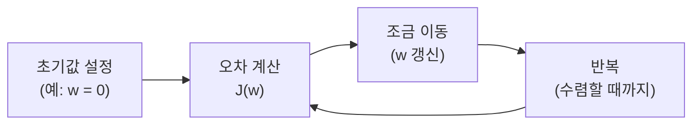

| Closed-form solution | Gradient Descent |
|:---------------------|:-----------------|
| 직접 계산 | 조금씩 이동 |
| 반복 없음 | 반복 학습 |
| 선형 회귀에서 가능 | 다양한 모델에 적용 가능 |
| 데이터가 크면 계산이 부담 | 이후의 복잡한 모델 학습에서도 핵심 |

첫 번째 방법은 "한 번에 계산하는 방법"이고, 두 번째 방법은 "반복하면서 점점 좋아지는 방향으로 이동하는 방법"이다. 경사하강법은 선형 회귀뿐 아니라 앞으로 배울 더 복잡한 모델에서도 매우 중요하므로 이 장은 경사하강법에 초점을 맞춘다.

> **핵심:** 모델 학습이란, **오차를 줄이도록 파라미터를 찾아가는 과정** 이다.

---

 

## 4. 경사하강법

### 4.1 직관: 오차가 줄어드는 방향으로 조금씩

**경사하강법(Gradient Descent)** 은 현재 w에서 시작하여 비용 함수 J(w)가 줄어드는 쪽으로 이동하는 방법이다. 직관을 위해 b는 잠시 무시하고 간단한 모델 ŷ = wx를 생각하자.

같은 데이터를 두고도 w가 달라지면 직선의 모양이 달라지고, 예측이 달라지므로 비용 J(w)도 달라진다.

| w | 직선 | J(w) |
|:-:|:-----|:----:|
| 0.5 | 너무 완만 | 20 |
| 1.0 | 더 잘 맞음 | 3 |
| 1.5 | 너무 가파름 | 15 |

w에 따른 비용 J(w)를 그래프로 그리면 **U자 모양** 이 된다. 위 예에서는 (0.5, 20), (1.0, 3), (1.5, 15)가 그 곡선 위의 점이며, 가장 작은 지점은 w = 1.0 부근이다. 좋은 모델을 찾는 문제는 결국 **J(w)가 가장 작은 w를 찾는 문제** 이다.

그런데 우리는 처음부터 최적의 w를 알지 못한다. 그래서 경사하강법은 시작점 w₀에서 출발해 w₁, w₂, w₃, …로 오차가 줄어드는 방향으로 조금씩 이동한다. 한 번에 답을 아는 것이 아니라, 더 낮아지는 쪽으로 한 걸음씩 찾아간다.

**산 내려가기 비유.** 현재 서 있는 위치에서 어느 쪽이 더 낮은지를 보고 그 방향으로 조금씩 이동하면, 점점 더 낮은 곳에 가까워진다.

| 산 내려가기 | 경사하강법 |
|:------------|:-----------|
| 현재 위치 | 현재 w |
| 높이 | J(w) |
| 경사 | gradient |
| 가장 낮은 곳 | minimum |

> **핵심:** 현재 w 선택 → J(w) 확인 → 더 낮아지는 방향으로 이동 → 반복 → 더 좋은 w. 경사하강법은 **비용을 줄이는 방향으로 파라미터를 조금씩 업데이트하는 방법** 이다.

### 4.2 어느 방향으로, 얼마나 움직일까

**방향: 기울기가 알려준다.** 기울기, 즉 미분값 dJ/dw는 현재 w 지점에서 비용 함수 J(w)가 얼마나 가파른지를 나타내며, 그 점에서 접하는 접선의 기울기이다.

- dJ/dw < 0이면 w를 증가시킬 때 J(w)가 감소한다(오른쪽으로 이동).
- dJ/dw > 0이면 w를 감소시킬 때 J(w)가 감소한다(왼쪽으로 이동).
- 기울기는 J가 가장 빠르게 증가하는 방향(올라가는 방향)을 가리킨다. 우리는 그 **반대 방향** 으로 이동해야 하므로 업데이트 식에 **"−"가 붙는다**.

**크기: learning rate가 정한다.** 업데이트 식은 다음과 같다.

$$
w_{\text{new}} = w_{\text{old}} - \eta \frac{dJ}{dw}
$$

| 기호 | 의미 |
|:-----|:-----|
| w_new | 새로운 값 |
| w_old | 현재 값(지금 서 있는 위치) |
| dJ/dw | 기울기(어느 방향으로 움직일지) |
| η | 학습률(learning rate, 얼마나 크게 움직일지) |

**η(learning rate)** 는 한 번에 얼마나 크게 움직일지를 정하는 값이다. 너무 작으면 매우 느리게 수렴하고, 너무 크면 최솟값을 지나쳐서 수렴하지 않을 수 있다.

**한 번 직접 계산해 보자.** 현재 w = 0.6, 기울기 dJ/dw = −4, 학습률 η = 0.1이라면

$$
w_{\text{new}} = 0.6 - 0.1(-4) = 0.6 + 0.4 = 1.0
$$

이다. 기울기가 음수이므로 w가 증가하는 쪽(오른쪽)으로 이동해 최솟값에 가까워진다.

중요한 점은 이동량이 learning rate뿐 아니라 **기울기의 크기에도 영향을 받는다** 는 것이다. 최솟값에서 멀리 있을 때는 곡선이 가파르기 때문에 |기울기|가 커서 한 번에 비교적 크게 이동한다. 반대로 최솟값에 가까워지면 곡선이 평평해지고 기울기가 작아져서 자연스럽게 이동 폭도 작아진다. 즉 경사하강법은 처음에는 빠르게 움직이고, 최솟값 근처에서는 점점 조심스럽게 움직인다.

### 4.3 Learning rate에 따른 수렴

| η의 크기 | 수렴 모습 |
|:---------|:----------|
| 너무 작을 때 (η too small) | 매우 천천히 수렴한다. |
| 적절할 때 (η appropriate) | 빠르게 수렴한다. |
| 너무 클 때 (η too large) | 최솟값을 지나쳐서 계속 왔다 갔다 할 수 있다(수렴하지 않을 수도 있다). |

> **한눈에 정리:** 새로운 w = 현재 w − learning rate × gradient. **기울기로 방향을 정하고, learning rate로 이동 크기를 정한다.** 변수가 여러 개면 각 변수에 대한 편미분(∂J/∂w, ∂J/∂b, …)을 사용한다.

### 4.4 단순 선형 회귀 예시

아주 간단한 두 점 데이터로 w가 어떻게 바뀌는지 보자. 데이터는 (1, 2), (2, 4)이다. 즉 x = 1일 때 y = 2, x = 2일 때 y = 4이며, 두 점을 가장 잘 설명하는 직선을 찾는 것이 목표이다.

**모델.** 절편 b는 0으로 고정하고(원점을 지나는 직선만 고려), 기울기 w 하나만 찾는다.

$$
\hat{y} = wx
$$

이 데이터의 경우 두 점을 정확히 지나는 직선은 y = 2x이므로 최적의 해는 w = 2이다. 하지만 경사하강법은 처음에는 이 값을 모르고, 반복하면서 서서히 찾아간다.

**비용 함수와 기울기.** 평균 제곱 오차를 사용하되, 여기서는 1/2을 곱해서 계산한다.

$$
J(w) = \frac{1}{2}\left[(2 - w)^2 + (4 - 2w)^2\right] = 2.5(w - 2)^2
$$

이 비용 함수를 미분하면 다음과 같다.

$$
\frac{dJ}{dw} = 5(w - 2)
$$

기울기는 w가 2보다 작으면 음수, 2보다 크면 양수가 된다. 즉 현재 w를 넣으면 오차 J(w)와 기울기를 계산할 수 있고, 기울기가 어느 방향으로 움직여야 하는지를 알려준다.

**경사하강법 진행.** 업데이트 식 w_new = w_old − η(dJ/dw)에서 η = 0.1을 사용하고, 초기값 w = 0에서 시작한다.

| 반복 | 현재 w | J(w) | 기울기 | 다음 w |
|:----:|:------:|:----:|:------:|:------:|
| 0 | 0.000 | 10.000 | −10.000 | 1.000 |
| 1 | 1.000 | 2.500 | −5.000 | 1.500 |
| 2 | 1.500 | 0.625 | −2.500 | 1.750 |
| 3 | 1.750 | 0.156 | −1.250 | 1.875 |
| 4 | 1.875 | 0.039 | −0.625 | 1.938 |

처음 w = 0에서 비용은 10이고 기울기는 −10이므로 다음 값은 w = 0 − 0.1(−10) = 1이다. 그다음 w = 1에서 비용은 2.5, 기울기는 −5이므로 w = 1.5가 된다. 이런 식으로 반복하면 J(w)는 계속 감소하고, w는 점점 2에 가까워진다.

- **직선의 변화:** w = 0(y = 0)일 때는 많이 틀리고, w = 1.0에서 조금 좋아지고, w = 1.5에서 더 좋아지며, w ≈ 2에서 거의 정답(y = 2x)이 된다.
- **J(w) 그래프에서의 변화:** J(w) = 2.5(w − 2)² 위의 점이 (0, 10) → (1.0, 2.5) → (1.5, 0.625) → (1.75, 0.156) → (1.875, 0.039)로 내려가 최솟값 (2, 0)에 다가간다. 멀리 있으면 기울기가 커서 크게 이동하고, 최솟값 근처에서는 기울기가 작아져 조금씩 이동한다.

> **핵심:** 경사하강법은 처음에는 크게, 나중에는 조금씩 이동한다. 최솟값에 가까워질수록 기울기와 이동량이 작아진다. 같은 학습 과정을 직선의 변화로도, J(w)의 감소로도 볼 수 있다.

### 4.5 여러 변수와 편미분

입력 변수가 여러 개인 경우 선형 회귀 모델은 입력 변수의 가중합에 절편을 더한 형태이다.

$$
\hat{y} = w_1 x_1 + w_2 x_2 + \cdots + w_d x_d + b = \mathbf{w}^T\mathbf{x} + b
$$

| x₁ | x₂ | x₃ | … | ŷ |
|:--:|:--:|:--:|:-:|:-:|
| 2 | 1 | 0 | … | 2.3 |
| 0 | 1 | 3 | … | 1.1 |
| 1 | 0 | 1 | … | 0.8 |

비용 함수는 모든 데이터에 대한 평균 제곱 오차이다.

$$
J(\mathbf{w}, b) = \frac{1}{n}\sum_{i=1}^{n} (\hat{y}_i - y_i)^2
$$

J(w, b)는 모델의 예측이 실제 값과 얼마나 다른지를 나타내는 비용 함수이고, w와 b는 우리가 찾고 싶은 파라미터, n은 데이터 개수이다.

**편미분(gradient).** 변수가 여러 개인 경우 각 변수에 대한 편미분을 사용한다. 편미분 ∂J/∂wⱼ는 현재 지점에서 wⱼ 방향으로의 기울기를 의미한다(다른 변수는 고정). J(w, b)를 여러 변수 위의 그릇 모양 곡면으로 생각하면, 각 변수에 대해 기울기를 계산하여 오차가 줄어드는 방향으로 이동한다.

**업데이트 식.** 모든 파라미터를 다음과 같이 동시에 업데이트한다.

$$
w_j \leftarrow w_j - \eta \frac{\partial J}{\partial w_j} \quad (j = 1, 2, \ldots, d), \qquad b \leftarrow b - \eta \frac{\partial J}{\partial b}
$$

η(learning rate)는 한 번에 얼마나 크게 움직일지를 결정하는 값이다.

**학습 과정.** 다음 과정을 반복하면서 J(w, b)를 점점 줄인다.

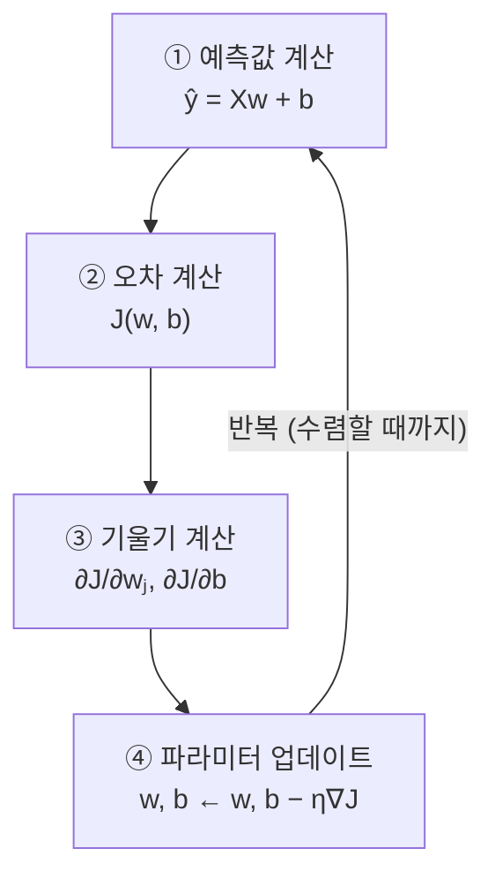

반복할수록 파라미터 (w, b)가 최적값에 가까워지고, 직선은 데이터에 점점 더 잘 맞게 된다. 초기(무작위 값)에는 J가 매우 크지만, 학습 중에는 J가 점점 감소하고, 학습이 끝나면 J가 충분히 작아진다.

> **핵심 정리**
> - 선형 회귀는 입력 변수들의 가중합으로 출력을 예측한다.
> - 평균 제곱 오차를 최소화하는 파라미터 (w, b)를 찾는다.
> - 경사하강법은 각 변수에 대한 편미분(기울기)을 계산하여, 오차가 줄어드는 방향으로 조금씩 이동한다.
> - 이 과정을 반복하면 J(w, b)가 점점 감소하고, 데이터를 가장 잘 설명하는 직선을 얻을 수 있다.
>
> 즉 선형 회귀의 학습은 **예측하고, 오차를 계산하고, 기울기를 구하고, 파라미터를 수정하는 과정을 반복하는 것** 이다. 이제 같은 아이디어를 분류 문제에 적용한 Logistic Regression으로 넘어간다.

---

 

## 5. Logistic Regression

### 5.1 선형 회귀로 분류를 하면 생기는 문제

공부 시간을 입력으로 받아서 시험 합격 여부를 예측하는 문제를 생각해 보자. 출력은 연속적인 값이 아니라 **불합격 0, 합격 1** 두 가지이다.

| 공부 시간 x (시간) | 합격 여부 y |
|:------------------:|:-----------:|
| 1 | 0 |
| 2 | 0 |
| 3 | 0 |
| 4 | 1 |
| 5 | 1 |
| 6 | 1 |

데이터를 점으로 찍으면 x = 1, 2, 3은 y = 0, x = 4, 5, 6은 y = 1에 놓인다(출력값은 0 또는 1의 이산적인 값). 공부 시간이 많을수록 합격할 가능성이 높아 보인다. 이 데이터에 선형 회귀를 그대로 적용하면 ŷ = wx + b 형태의 직선을 얻는데, 이 직선을 그대로 쓰면 0과 1 사이가 아닌 실수값도 예측한다(x가 작으면 예측값 < 0, x가 크면 예측값 > 1).

**무엇이 문제일까?**

1. **예측값이 0보다 작거나 1보다 클 수 있다.** 하지만 합격 여부는 0 또는 1이어야 한다.
2. **확률로 해석하기 어렵다.** 예측값이 실수값이므로 이것을 확률이라고 보기 어렵다.
3. **분류 문제에 바로 쓰기 불편하다.** 예측값을 임의의 기준으로 잘라야 하는 등 추가적인 처리가 필요하다.

우리는 단순한 숫자가 아니라 "합격할 가능성이 얼마나 되는가"를 **0과 1 사이의 확률** 로 표현하고 싶다. 그래서 아이디어는 선형식을 버리는 것이 아니라, 먼저 z = wx + b를 계산한 뒤 그 값을 0과 1 사이로 변환하는 함수를 붙이는 것이다.

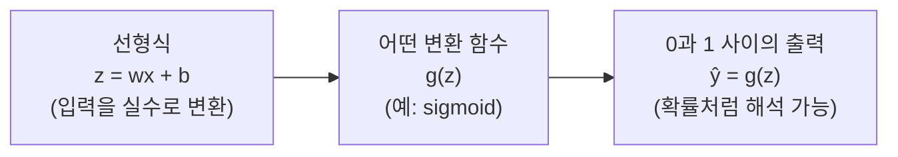

> **핵심:** 선형 회귀는 분류 문제에 직접 쓰기 어렵고, 출력을 확률처럼 바꾸는 새로운 모델이 필요하다.

### 5.2 Sigmoid 함수

Logistic Regression도 선형식 자체는 그대로 사용한다.

$$
z = wx + b
$$

x는 입력(예: 공부 시간), w는 가중치, b는 절편(bias)이다. z는 입력 x에 대해 계산된 **선형 점수(linear score)** 로, 음수부터 양수까지 아무 실수값이나 가질 수 있다. 분류에서는 이 값을 0과 1 사이의 값, 즉 확률처럼 해석할 수 있는 값으로 바꾸고 싶다. 그래서 사용하는 함수가 **sigmoid 함수** 이다.

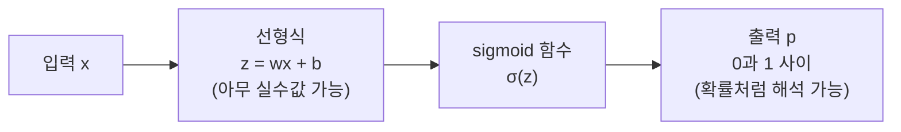

$$
\sigma(z) = \frac{1}{1 + e^{-z}}
$$

이 함수는 어떤 실수 z가 들어와도 출력이 항상 0과 1 사이이다.

| z | σ(z) |
|:--|:-----|
| 큰 음수 (z → −∞) | 0에 가까움 (σ(z) → 0) |
| 0 | σ(0) = 1/(1 + 1) = 0.5 |
| 큰 양수 (z → ∞) | 1에 가까움 (σ(z) → 1) |

sigmoid는 S자 모양의 곡선(sigmoid curve)이다. 예를 들어 σ(−2) ≈ 0.12, σ(0) = 0.5, σ(2) ≈ 0.88이다.

그래서 Logistic Regression은 다음처럼 쓸 수 있다.

$$
P(y = 1 \mid x) = \sigma(wx + b)
$$

즉 입력 x가 주어졌을 때 **class 1일 확률을 출력하는 모델** 로 해석할 수 있다. 공부 시간 x를 넣으면 p를 합격할 확률로 해석한다.

- x = 5 (공부 시간 5시간) → p = 0.82 → 합격 가능성이 높다.
- x = 1 (공부 시간 1시간) → p = 0.23 → 불합격 가능성이 높다.
- x = 2 → p = 0.5 → 합격과 불합격의 중간점(어느 쪽이라고 하기 어려운 상태)이다.

p가 클수록 y = 1(합격)일 가능성이 크다.

> **핵심:** Logistic Regression은 선형식 z = wx + b는 유지하되, sigmoid 함수를 통과시켜 출력을 0과 1 사이의 확률로 바꾸는 모델이다.

### 5.3 Threshold와 decision boundary

Logistic Regression은 확률을 출력하고, 이 확률을 class 0 또는 class 1로 변환한다. 모델의 출력 p = σ(z)는 항상 0과 1 사이의 값이며, 주어진 입력 x에 대해 class 1(양성 클래스)에 속할 확률로 해석할 수 있다. 반대로 class 0의 확률은 1 − p이다. 즉 Logistic Regression은 각 데이터에 대해 "얼마나 1에 가까운지"를 확률로 알려 준다.

**Threshold로 class 결정.** 확률을 실제 class로 바꾸기 위해 기준값, 즉 **threshold** 를 둔다. 보통 0.5를 사용한다.

$$
p \ge 0.5 \Rightarrow \text{class } 1 \ (\text{양성}), \qquad p < 0.5 \Rightarrow \text{class } 0 \ (\text{음성})
$$

예를 들어 p = 0.82이면 0.82 ≥ 0.5이므로 합격(1), p = 0.23이면 0.23 < 0.5이므로 불합격(0)이다. 문제에 따라 0.5가 아닌 다른 threshold를 사용할 수도 있다.

**1차원 예시.** 다음은 또 다른 예시 모델에서 공부 시간에 따른 p = P(y = 1 | x)이며, 공부 시간이 증가할수록 p가 커진다.

| x (공부 시간) | 0 | 2 | 4 | 6 | 8 | 10 |
|:--|:--:|:--:|:--:|:--:|:--:|:--:|
| p | 0.08 | 0.20 | 0.40 | **0.5** | 0.70 | 0.92 |

p가 0.5가 되는 x = 6이 class가 바뀌는 경계이다. sigmoid 함수에서 p = 0.5가 되는 지점은 z = 0이므로(σ(0) = 0.5), 경계점은 z = wx + b = 0인 곳이다.

$$
wx + b = 0
$$

이 되는 지점이 바로 **decision boundary** 이다.

**2차원 이상.** 2차원(또는 그 이상)에서도 마찬가지로 p = 0.5인 점들의 집합이 하나의 직선(또는 초평면)을 이룬다.

$$
w_1 x_1 + w_2 x_2 + b = 0 \quad (\text{또는 } \mathbf{w}^T\mathbf{x} + b = 0)
$$

이 선이 decision boundary이며, 선의 한쪽은 p < 0.5(class 0), 다른 쪽은 p ≥ 0.5(class 1)이다. 즉 1차원에서는 하나의 경계점, 2차원에서는 하나의 직선이 된다.

> **핵심:** 확률 p는 입력에 따라 부드럽게 변화하지만, 최종 분류 결과는 이 경계를 기준으로 갑자기 바뀐다. Logistic Regression은 확률 p를 출력하고 threshold를 사용해 최종 class를 결정하며, p = 0.5인 점들의 집합이 decision boundary이다.

### 5.4 확률 공간으로 보기

Logistic Regression은 특징공간의 각 점마다 확률값 p = P(y = 1 | x)를 대응시킨다.

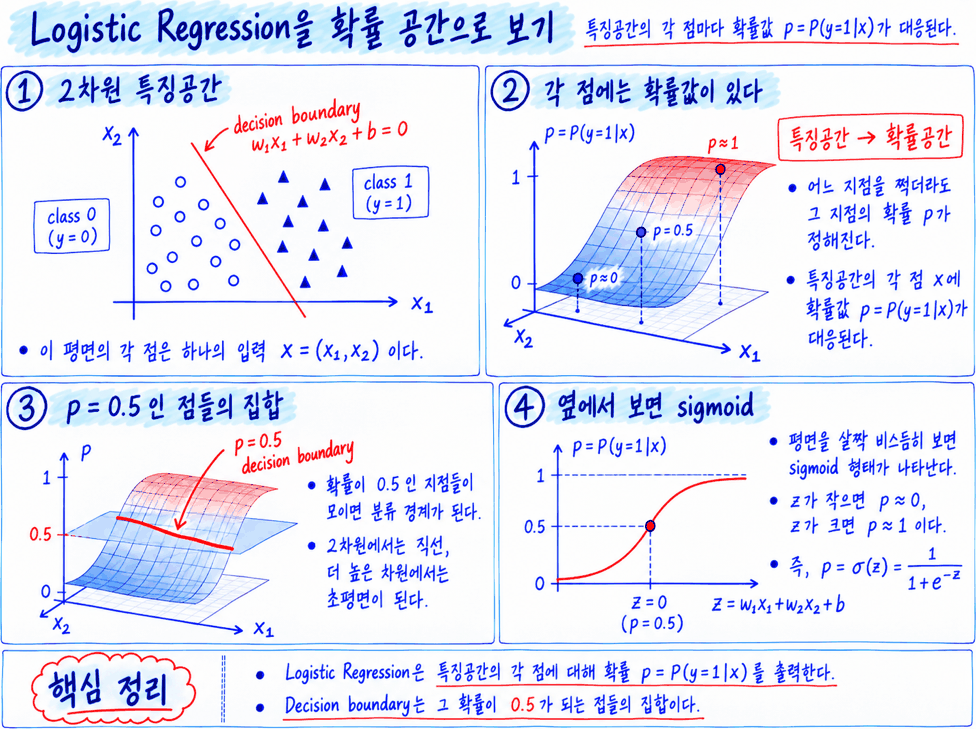

*Lecture 04, Page 16: 2차원 특징공간과 그 위의 확률 표면, p = 0.5인 점들의 집합인 decision boundary와 옆에서 본 sigmoid 모양*

1. **2차원 특징공간:** 이 평면의 각 점은 하나의 입력 x = (x₁, x₂)이다. 보통 우리는 이 평면 위에서 class 0과 class 1이 decision boundary w₁x₁ + w₂x₂ + b = 0으로 어떻게 나뉘는지만 본다.
2. **각 점에는 확률값이 있다:** Logistic Regression은 경계만 주는 것이 아니라 특징공간의 모든 점마다 확률값 p = P(y = 1 | x)를 계산한다. 이 2차원 특징공간을 위로 들어 올려 세 번째 축에 p를 놓으면, 특징공간 전체가 하나의 **확률 표면** 으로 바뀐다(특징공간 → 확률공간).
3. **p = 0.5인 점들의 집합:** 이 표면 위에서 확률이 0.5인 점들을 모으면 분류 경계가 된다. 즉 분류 경계는 확률 표면을 p = 0.5라는 높이에서 잘랐을 때 나타나는 경계선이다. 2차원에서는 직선, 더 높은 차원에서는 초평면이 된다.
4. **옆에서 보면 sigmoid:** 이 표면을 옆에서 보면 S자 모양이 나타나며, 이것이 sigmoid 함수의 모습이다. z = w₁x₁ + w₂x₂ + b가 작을 때 p ≈ 0, z = 0일 때 p = 0.5, z가 클 때 p ≈ 1이다.

> **핵심:** Logistic Regression은 특징공간의 각 점에 대해 확률값 p = P(y = 1 | x)를 부여하는 모델이고, decision boundary는 그 확률이 0.5가 되는 점들의 집합이다.

### 5.5 왜 이름이 Logistic Regression인가

분류 문제인데 왜 regression이라는 이름을 쓸까?

**① 예측하는 것은 확률이다.** Logistic Regression이 직접 예측하는 것은 먼저 class 1일 확률 p = P(y = 1 | x)이다. 확률이므로 항상 0 ≤ p ≤ 1이다(p = 0이면 항상 class 0, 0.5이면 어느 쪽인지 판단할 수 없음, 1이면 항상 class 1). 그런데 확률 p는 0과 1 사이에 갇혀 있기 때문에 그대로는 선형식으로 표현하기 어렵다.

**② Odds: 두 클래스의 가능성 비율.** 그래서 확률을 먼저 **odds** 로 바꾼다.

$$
\text{odds} = \frac{p}{1 - p}
$$

odds는 "class 1이 될 가능성"을 "class 0이 될 가능성"으로 나눈 값이다. 즉 class 1이 class 0보다 얼마나 더 가능성이 큰지를 나타낸다.

| p | odds = p/(1 − p) | 해석 |
|:-:|:-----------------|:-----|
| 0.8 | 0.8/0.2 = 4 | class 1이 class 0보다 4배 더 가능성이 큼 |
| 0.5 | 0.5/0.5 = 1 | 두 클래스의 가능성이 같음 |
| 0.2 | 0.2/0.8 = 0.25 | class 1이 class 0보다 가능성이 작음 |

**③ log-odds (logit): 모든 실수로 확장.** odds에 로그를 취한 값을 **log-odds(또는 logit)** 라고 한다.

$$
\text{log-odds} = \log\left(\frac{p}{1 - p}\right)
$$

| p | odds | log(odds) |
|:-:|:----:|:----------|
| 0.8 | 4 | log(4) ≈ 1.39 |
| 0.5 | 1 | log(1) = 0 |
| 0.2 | 0.25 | log(0.25) ≈ −1.39 |

p → 1이면 odds → ∞, log-odds → +∞이고, p → 0이면 odds → 0, log-odds → −∞이다. 즉 p가 0과 1 사이에 있으면 log-odds는 −∞에서 +∞까지의 모든 실수 값을 가질 수 있다. **log-odds는 제한이 없는 실수 값이므로 선형식으로 모델링하기에 적절하다.**

**④ 선형식으로 모델링한다(regression이라는 이름의 근거).**

$$
\log\left(\frac{p}{1 - p}\right) = wx + b
$$

Logistic Regression은 확률 자체를 선형회귀하는 것이 아니라, **확률의 log-odds를 입력 x의 선형결합으로 모델링** 한다. 여기서의 "regression"은 log-odds(연속적인 실수 값)를 선형식으로 표현한다는 의미이다.

**⑤ 다시 확률로 변환하면 sigmoid가 된다.** 위 식을 p에 대해 풀면 p/(1 − p) = e^(wx + b)이므로

$$
p = \frac{e^{wx + b}}{1 + e^{wx + b}} = \frac{1}{1 + e^{-(wx + b)}}
$$

이다. 즉 선형식의 출력값 z = wx + b를 0과 1 사이의 확률로 변환하는 함수가 바로 sigmoid(logistic) 함수이며, 그래서 이 방법을 Logistic Regression이라고 부른다.

> **핵심:** Logistic Regression = 선형식으로 log-odds를 모델링 → 확률로 변환 → 분류.

---

 

## 6. Cross Entropy

### 6.1 왜 MSE가 아니라 Cross Entropy인가

Logistic Regression의 출력은 수치 자체가 아니라 확률 p = P(y = 1 | x)이다(모델이 예측한 0~1 사이의 값). p가 1에 가까우면 y = 1(양성)일 가능성이 높고, 0에 가까우면 y = 0(음성)일 가능성이 높다. 따라서 학습의 목표도 단순히 숫자 차이를 줄이는 것이 아니라, **정답 class에 높은 확률을 주도록 만드는 것** 이다.

여러 경우를 직관적으로 살펴보자.

| 상황 | 예측 | loss가 어때야 하는가 |
|:-----|:-----|:---------------------|
| y = 1, p = 0.9 | 좋은 예측 | 작아야 한다 |
| y = 1, p = 0.1 | 나쁜 예측 | 커야 한다 |
| y = 0, p = 0.1 | 좋은 예측 | 작아야 한다 |
| y = 0, p = 0.9 | 나쁜 예측 | 커야 한다 |

**Binary Cross Entropy** 는 바로 이 성질을 갖는다.

$$
L = -\bigl[y \log p + (1 - y)\log(1 - p)\bigr]
$$

p = P(y = 1 | x)는 모델이 예측한 확률이고 y ∈ {0, 1}은 실제 정답이다. 정답이 1이면 사실상 −log p만 남고, 정답이 0이면 −log(1 − p)만 남는다.

- 정답 class의 확률이 높을수록(p가 1에 가까울수록) loss가 작아진다.
- 정답 class의 확률이 낮을수록(p가 0에 가까울수록) loss가 커진다.
- 즉 모델이 정답 class에 높은 확률을 주도록 학습된다.

**확신한 잘못된 예측은 큰 페널티.** y = 1일 때 loss = −log p는 p가 0에 가까워지면 매우 커지고, y = 0일 때 loss = −log(1 − p)는 p가 1에 가까워지면 매우 커진다.

| | MSE | Cross Entropy |
|:--|:--|:--|
| 식 | L = (y − p)² | L = −[y log p + (1 − y)log(1 − p)] |
| 주된 용도 | 회귀 문제(연속적인 수치 예측) | 분류 문제 |
| 특징 | 예측값과 정답의 차이를 제곱해서 사용한다. 분류 문제에도 사용할 수는 있지만, 확률을 학습하기에는 적절하지 않다. | 확률(p)을 직접 다루며, 정답 class에 높은 확률을 주도록 학습한다. 틀렸는데 확신하는 경우(예: y = 1인데 p = 0.01)에 매우 큰 페널티를 준다. 실무의 거의 모든 분류 모델에서 기본적으로 사용한다. |

이 때문에 확률을 출력하는 분류 문제에서는 MSE보다 Cross Entropy가 훨씬 자연스럽고 적합한 손실 함수이다.

> **핵심:** Cross Entropy는 모델이 정답 class에 높은 확률을 주도록 학습시키는 loss이다.

### 6.2 Entropy와 Cross Entropy

| 개념 | 식 | 의미 |
|:-----|:---|:-----|
| Entropy | −Σ Pᵢ log Pᵢ | 실제 분포 자체의 불확실성 |
| Cross Entropy | −Σ Pᵢ log Qᵢ | 실제 분포 P와 예측분포 Q의 차이 |
| Binary CE | −[y log p + (1 − y)log(1 − p)] | 두 class인 경우 |
| Categorical CE | −Σₖ yₖ log pₖ | 여러 class인 경우 |

강의 03의 Decision Tree와 연결하면 다음과 같다.

- Decision Tree에서 entropy는 **현재 node 안에 class들이 얼마나 섞여 있는가** 를 측정했다.
- Logistic Regression에서 cross entropy는 **실제 정답의 분포와 모델의 예측 확률분포가 얼마나 잘 맞는가** 를 측정한다.

Entropy는 하나의 분포가 얼마나 불확실한지를 나타내고, Cross Entropy는 실제 분포와 예측 분포가 얼마나 잘 맞는지를 나타낸다. 분류에서는 정답 class에 높은 확률을 줄수록 Cross Entropy가 작아진다.

**예: 고양이/강아지 이진 분류.** 실제 정답이 고양이라면 실제 분포는 P = [1, 0]이다. 모델이 Q = [0.9, 0.1]로 예측했다면

$$
H(P, Q) = -[1 \log 0.9 + 0 \log 0.1] = -\log 0.9 \approx 0.105
$$

이다. 정답 class에 준 확률만 남으며, 모델이 정답 class에 0.9를 주었으므로 loss는 작다. 반대로 Q = [0.1, 0.9]로 예측하면

$$
H(P, Q) = -\log 0.1 \approx 2.303
$$

이 되어 매우 커진다. 그래서 Cross Entropy가 정답 class에 높은 확률을 주도록 모델을 학습시키는 loss가 된다(여기서 log는 자연로그이다).

### 6.3 Binary와 Categorical Cross Entropy

**Binary Cross Entropy의 유도.** Binary classification에서는 class가 두 개이므로 실제 분포를 [y, 1 − y], 모델의 예측분포를 [p, 1 − p]로 표현할 수 있다. 이를 Cross Entropy 정의 H(P, Q) = −Σ Pᵢ log Qᵢ에 그대로 넣으면

$$
L = -\bigl[y \log p + (1 - y)\log(1 - p)\bigr]
$$

가 된다. 즉 Binary Cross Entropy는 별도로 갑자기 만들어진 식이 아니라, 일반적인 Cross Entropy 식을 두 class에 적용한 것이다.

**다중분류.** class가 고양이, 강아지, 토끼 세 개라고 하자. 실제 정답이 강아지라면 one-hot vector로 P = [0, 1, 0]이다. 모델의 softmax 출력이 Q = [0.1, 0.7, 0.2]라면

$$
H(P, Q) = -[0 \log 0.1 + 1 \log 0.7 + 0 \log 0.2] = -\log 0.7 \approx 0.357
$$

이다. 역시 정답 class의 예측확률만 남는다. 그래서 다중분류에서는 보통 다음 식을 사용하며, 이것을 **Categorical Cross Entropy** 라고 한다.

$$
L = -\sum_{k=1}^{K} y_k \log p_k
$$

출력층과 loss는 보통 다음과 같이 짝을 이룬다. 이 짝은 MLP의 출력층과 loss function에서도 그대로 다시 사용된다.

| 문제 | 출력 함수 | Loss |
|:-----|:----------|:-----|
| Binary classification | sigmoid | Binary Cross Entropy |
| Multi-class classification | softmax | Categorical Cross Entropy |

---

 

## 7. Logistic Regression의 학습

Logistic Regression은 데이터와 정답을 보고 loss를 줄이도록 w, b를 반복해서 갱신한다. 전체 학습 파이프라인은 다음과 같다.

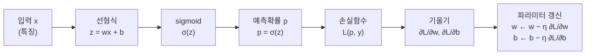

1. **예측(모델의 출력):** z = wx + b는 입력 x의 선형 조합(linear score)이고, sigmoid 함수를 통과하면 0~1 사이의 확률 p = σ(z) = 1/(1 + e^(−z))가 된다. p는 주어진 입력 x에 대해 y = 1일 확률을 의미한다.
2. **손실 함수(Loss):** Binary Cross Entropy L(p, y) = −[y log p + (1 − y)log(1 − p)]를 사용한다. 정답 y ∈ {0, 1}에 대해 예측확률 p가 정답에 가까울수록 작아지며, 모든 학습 데이터에 대해 평균을 내어 사용한다(평균 손실).
3. **기울기 계산:** 손실 함수를 w, b에 대해 편미분한 ∂L/∂w, ∂L/∂b는 현재 (w, b)에서 손실이 얼마나 증가하거나 감소하는지를 나타내는 기울기(slope)이다. 기울기가 음수이면 그 방향으로 가면 loss가 감소하고, 양수이면 반대 방향으로 가야 loss가 감소한다.
4. **파라미터 갱신(Gradient Descent):** w ← w − η(∂L/∂w), b ← b − η(∂L/∂b). η(eta)는 학습률(learning rate)로, 얼마나 크게 갱신할지를 정하는 값이다. 기울기 방향의 반대 방향으로 조금씩 이동하여 loss를 줄인다.

이 과정을 모든 학습 데이터를 사용하여 여러 번 반복한다(**epoch**). 매 반복마다 loss가 점점 줄어들도록 w와 b가 업데이트되며, 손실이 충분히 작아지거나 더 이상 크게 줄어들지 않으면 학습을 멈춘다.

> **참고:** sigmoid와 Binary Cross Entropy를 함께 쓰면 기울기가 ∂L/∂w = (p − y)x, ∂L/∂b = p − y로 간단해진다. 예측확률과 정답의 차이에 입력을 곱한 형태로, 9.4절의 delta rule과 같은 모양이다.

| | 선형회귀 (연속값 예측) | 로지스틱 회귀 (확률 예측) |
|:--|:--|:--|
| 예측 | ŷ = wx + b | p = σ(wx + b) |
| 손실 | MSE (평균 제곱 오차) | Binary Cross Entropy |
| 학습 | gradient descent로 w, b 갱신 | gradient descent로 w, b 갱신 |

모델의 출력과 loss 함수는 달라졌지만, 학습의 원리는 선형회귀와 같다(예측 → loss → gradient → update).

> **핵심:** Logistic Regression의 학습 = 확률 예측 → loss 계산 → gradient descent로 w, b 갱신.

---

 

## 8. Linear Regression과 Logistic Regression의 비교

| 항목 | Linear Regression | Logistic Regression |
|:-----|:------------------|:--------------------|
| 목적 | 수치 예측(연속형 값 예측) | 분류(클래스 예측) |
| 출력 | 실수 값(연속적인 수치) | 클래스의 확률(0~1 사이) |
| 모델식 | ŷ = wx + b | p = σ(wx + b) |
| 출력 범위 | −∞ ~ ∞(제한 없음) | 0 ~ 1(확률) |
| Loss 함수 | MSE(평균제곱오차) | Cross Entropy(교차 엔트로피) |
| 결정 경계 | 해당 없음(수치 예측이므로) | wx + b = 0(p = 0.5인 지점) |

두 모델은 구조적으로 매우 비슷하지만 목적이 다르다. 선형회귀는 수치 예측, 로지스틱 회귀는 분류에 사용된다. 그리고 여기서 다음 모델인 **퍼셉트론** 으로 자연스럽게 연결된다.

| | Logistic Regression (확률적 분류) | Perceptron (직접적인 분류) |
|:--|:--|:--|
| 흐름 | 입력 x → 선형결합 z = wx + b → sigmoid σ(z) → 확률 p (0~1) → threshold (예: 0.5) → class 결정 | 입력 x → 선형결합 z = wx + b → step 함수(계단 함수) → class 결정(y = 1 또는 y = 0) |
| 출력 함수 | σ(z) = 1/(1 + e^(−z)), 부드러운 곡선(확률로 해석 가능) | g(z) = 1 (z ≥ 0), 0 (z < 0), 날카로운 경계(바로 0 또는 1) |
| 클래스 결정 | y = 1 (p ≥ 0.5), y = 0 (p < 0.5) | g(z)의 값이 곧 class |

- 두 모델 모두 입력의 선형결합 z = wx + b를 사용한다.
- Logistic Regression은 선형결합 z를 sigmoid 함수에 통과시켜 0~1 사이의 확률을 출력하고, threshold를 적용하여 클래스를 결정한다.
- Perceptron은 선형결합 z에 대해 계단 함수(임계값)를 적용하여 바로 0 또는 1의 클래스를 출력한다.
- 즉 Logistic Regression은 "부드러운 확률적 분류", Perceptron은 "단순한 임계값 분류"로, 둘 다 선형 모델을 기반으로 한 분류 방법이다.

> **최종 정리:** Logistic Regression = 선형결합(z = wx + b) + sigmoid(0~1의 확률로 변환) + 확률적 분류(threshold를 통해 클래스 결정). Logistic Regression은 Perceptron의 "부드럽고 확률적인 버전"으로 볼 수 있다.

---

 

## 9. Perceptron

### 9.1 Logistic Regression 다음에 Perceptron

같은 흐름에 있으면서 더 단순한 모델인 perceptron으로 넘어간다.

| | Logistic Regression | Perceptron |
|:--|:--|:--|
| 흐름 | 입력 x = [x₁, x₂, …, x_d] → 가중합 z = wᵀx + b → sigmoid 함수 σ(z) → 확률 출력 P(y = 1 \| x) | 입력 x = [x₁, x₂, …, x_d] → 가중합 z = wᵀx + b → step 함수(계단 함수) g(z) → class 0/1 |
| 출력 | 부드러운 확률 출력(0~1 사이의 값). 예: 0.73(고양이일 확률 73%) | 확률이 아니라 바로 class 결정(hard decision). g(z) = 1 (z ≥ 0), 0 (z < 0). 예: 고양이(class 1) 또는 강아지(class 0) |

**공통 구조는 weighted sum + activation** 이고, **차이점은 sigmoid는 확률, step은 바로 분류** 라는 것이다.

**간단한 역사적 배경.** Rosenblatt(1957/1958)가 제안한 **Perceptron** 은 최초의 신경망 모델 중 하나이며, 생물학적 신경에서 영감을 받아 제안되었다. 핵심 아이디어는 가중합과 임계값으로 분류한다는 단순하지만 강력한 발상이다.

이 weighted sum + activation 구조 자체를 하나의 계산 unit으로 볼 수 있으며, **이것이 신경망의 기본 unit이다.**

### 9.2 구조와 계산

Perceptron은 여러 개의 입력을 받아 가중합을 계산하고, 임계값을 기준으로 0 또는 1을 출력하는 가장 단순한 신경망의 한 unit이다.

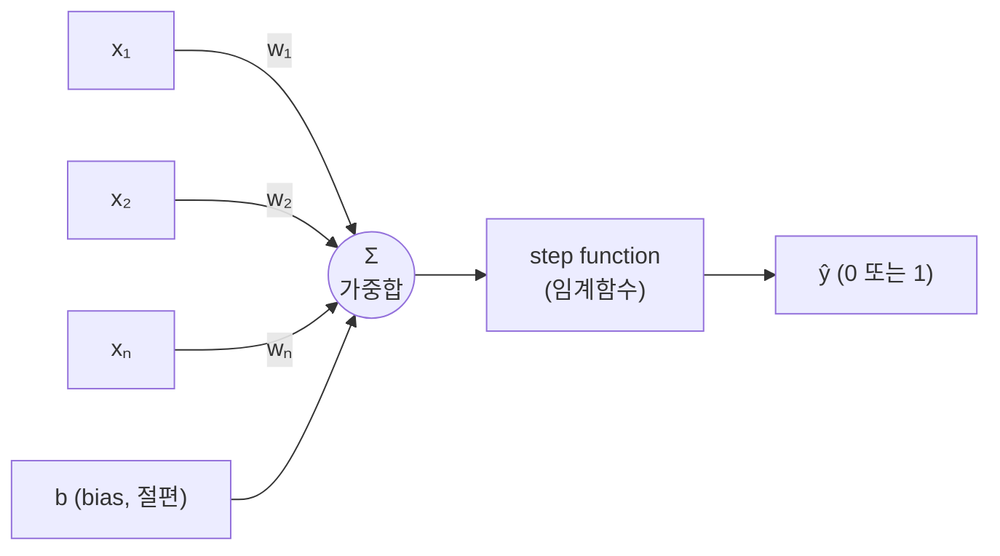

수식으로 표현하면 다음과 같다. z는 입력의 가중합(linear combination)이다.

$$
z = \sum_{i=1}^{n} w_i x_i + b = \mathbf{w}^T\mathbf{x} + b, \qquad \hat{y} = \begin{cases} 1 & \text{if } z > 0 \\ 0 & \text{if } z \le 0 \end{cases}
$$

z = 0에서 어느 class로 둘지는 정의에 따라 다르며(z ≥ 0을 1로 두기도 한다), 이 장의 OR 예제는 z > 0일 때 1로 둔다. **Perceptron = 가중합 + 임계값** 이며, 이것이 신경망의 가장 기본적인 계산 단위이다.

**결정 경계(Decision Boundary).** 입력이 2차원인 경우 (x₁, x₂), 결정 경계는 직선이 된다.

$$
w_1 x_1 + w_2 x_2 + b = 0
$$

이 직선이 클래스 0과 1을 나누는 경계이다.

> **핵심 포인트**
> - Perceptron은 입력의 선형결합에 대해 임계값을 적용하여 0 또는 1을 출력한다.
> - 따라서 하나의 직선(또는 초평면)으로 데이터를 구분한다.
> - 이 구조가 바로 이후 신경망의 기본 unit이 된다.

### 9.3 Perceptron learning rule

Perceptron은 틀린 데이터를 만나면 가중치를 수정하여 결정 경계를 움직인다.

**학습 상황.** 훈련 데이터 (x, y)에서 x는 입력 벡터 (x₁, x₂, …, xₙ), y는 정답 레이블(0 또는 1)이다. 현재 모델은 x → wᵀx + b → step → ŷ이며, 예측이 틀리면 가중치와 절편을 수정한다.

**학습 규칙(Perceptron Learning Rule).**

$$
\mathbf{w} \leftarrow \mathbf{w} + \eta (y - \hat{y})\mathbf{x}, \qquad b \leftarrow b + \eta (y - \hat{y})
$$

η는 학습률, (y − ŷ)는 오차(정답 − 예측), x는 입력 벡터이다.

- 예측이 맞으면 (y = ŷ) ⇒ y − ŷ = 0 ⇒ 가중치 변화 없음
- 예측이 틀리면 (y ≠ ŷ) ⇒ y − ŷ = ±1 ⇒ 가중치 수정
- 틀린 방향을 줄이기 위해 결정 경계를 이동시킨다.

**예시.** 입력 x = (0, 1), 정답 y = 1, 현재 예측 ŷ = 0(틀림), η = 1, 초기값 w₁ = 0, w₂ = 0, b = 0이라면, 업데이트 후 w₁ = 0 + 1 × 1 × 0 = 0, w₂ = 0 + 1 × 1 × 1 = 1, b = 0 + 1 × 1 = 1이 된다. 틀린 데이터(class 1인데 class 0으로 예측된 점)를 반영하여 결정 경계가 그 점을 class 1 쪽에 두도록 이동한다.

**Delta rule과의 관계.**

| Perceptron Rule | Delta Rule |
|:----------------|:-----------|
| step function 사용 | 연속적 출력 사용 |
| 맞았는지/틀렸는지 중심 | squared error 최소화 |
| 오분류 시 update | gradient descent에서 유도 |

형태는 비슷하지만 완전히 같은 것은 아니다. Delta rule은 경사하강법 기반의 weight update이고, perceptron learning rule은 오분류를 바로잡는 방향으로 경계를 이동시키는 규칙이다.

> **핵심:** 반복하면 모든 훈련 데이터를 올바르게 분류하는 결정 경계를 찾을 수 있다(단, 데이터가 선형 분리 가능한 경우).

### 9.4 Delta rule

**왜 Delta Rule이 필요한가?** Perceptron의 step function은 0 또는 1로 갑자기 변하는 비연속 함수라서 매끄럽지 않다. 이렇게 매끄럽지 않은 함수는 gradient descent를 직접 적용하기 어렵다. 그래서 delta rule은 **연속적인 출력 뉴런** 을 사용하고, **squared error를 최소화** 하도록 학습한다.

| Perceptron (step function) | Delta Rule (연속 출력 뉴런) |
|:---------------------------|:----------------------------|
| x → wᵀx + b → step(0 또는 1) → ŷ (0/1) | x → wᵀx + b → ŷ |
| 매끄럽지 않은 출력(미분 불가능) | 연속적인 출력(실수값) |

Delta Rule = 경사하강법 기반 weight update이다. step function을 미분해서 얻는 것이 아니다.

**모델과 오차.**

$$
z = \mathbf{w}^T\mathbf{x} + b, \qquad \hat{y} = z \ (\text{선형 출력}), \qquad L = \frac{1}{2}(y - \hat{y})^2
$$

x는 입력 벡터 (x₁, x₂, …, xₙ), y는 실제 정답(타깃), ŷ는 현재 예측값(실수), L은 squared error이다. 흐름은 입력 x → 선형결합 z = wᵀx + b → 예측 ŷ = z → 오차 계산 L = ½(y − ŷ)²이다.

**Gradient descent로 유도.**

$$
\frac{\partial L}{\partial w_i} = \frac{\partial L}{\partial \hat{y}} \cdot \frac{\partial \hat{y}}{\partial w_i} = -(y - \hat{y})\,x_i \qquad \left(\because \frac{\partial L}{\partial \hat{y}} = -(y - \hat{y}), \ \frac{\partial \hat{y}}{\partial w_i} = x_i\right)
$$

따라서 weight update는 다음과 같다.

$$
w_i \leftarrow w_i - \eta\frac{\partial L}{\partial w_i} = w_i + \eta (y - \hat{y})x_i, \qquad b \leftarrow b + \eta (y - \hat{y})
$$

$$
\Delta w_i = \eta (y - \hat{y})x_i \ (\text{delta rule}), \qquad \delta = (y - \hat{y}) \ (\text{오차 신호})
$$

**직관적으로 보면.**

- 오차가 크면 update도 크다(|y − ŷ|가 클수록 더 크게 이동).
- 입력 xᵢ가 크면 그 weight는 더 많이 수정된다.
- xᵢ = 0이면 그 weight는 바뀌지 않는다.
- 예측이 정답에 가까워질수록 update는 작아진다(오차가 0에 가까워지면 더 이상 많이 업데이트하지 않음).

**간단한 수치 예.** x = (0, 1), y = 1, 현재 w₁ = 0.2, w₂ = 0.3, b = 0, 학습률 η = 0.1이라 하자.

- ŷ = 0.2 × 0 + 0.3 × 1 + 0 = 0.3, 오차 e = y − ŷ = 1 − 0.3 = 0.7
- Δw₁ = 0.1 × 0.7 × 0 = 0 (x₁ = 0이므로 w₁은 바뀌지 않음)
- Δw₂ = 0.1 × 0.7 × 1 = 0.07
- Δb = 0.1 × 0.7 = 0.07
- 업데이트 후: w₁ = 0.2, w₂ = 0.37, b = 0.07

> **핵심:** Delta Rule은 squared error를 줄이기 위해, 오차와 입력의 크기에 비례하여 가중치를 조금씩 수정하는 경사하강법 기반 학습 규칙이다. Perceptron Rule은 맞음/틀림 중심이고, Delta Rule은 연속적인 오차 크기까지 반영한다.

---

 

## 10. OR 문제를 Perceptron으로 학습시키기

가장 간단한 논리 문제로 퍼셉트론을 이해해 보자.

**OR 데이터셋.** (0, 0)만 0이고 나머지는 1이다.

| x₁ | x₂ | y |
|:--:|:--:|:-:|
| 0 | 0 | 0 |
| 0 | 1 | 1 |
| 1 | 0 | 1 |
| 1 | 1 | 1 |

특징공간에서 (0, 0)은 class 0, (0, 1), (1, 0), (1, 1)은 class 1이다.

**초기 퍼셉트론(시작 값).** 두 개의 입력으로 OR을 학습하는 퍼셉트론을 w₁ = 0.1, w₂ = 0.5, bias b = −0.8로 시작한다.

$$
z = 0.1x_1 + 0.5x_2 - 0.8, \qquad y = \begin{cases} 1 & (z > 0) \\ 0 & (z \le 0) \end{cases}
$$

**초기 결정경계.** z = 0으로 두면

$$
0.1x_1 + 0.5x_2 - 0.8 = 0 \;\Rightarrow\; x_2 = -0.2x_1 + 1.6
$$

이다. 초기 결정경계가 너무 위에 있어서 class 1인 (0, 1), (1, 1), (1, 0)을 모두 0으로 잘못 분류한다.

**학습 규칙.** 정답을 T(target), 출력을 O(output)라 하면 학습률 η = 0.2로 다음과 같이 갱신한다.

$$
w_i \leftarrow w_i + \eta (T - O)x_i, \qquad b \leftarrow b + \eta (T - O)
$$

오분류가 발생하면 가중치와 바이어스가 업데이트되고, 그 결과 결정경계가 점차 올바른 위치로 이동한다. 데이터를 (0, 0), (0, 1), (1, 0), (1, 1) 순서로 반복해서 넣으면 다음과 같다.

| 단계 | 사용한 샘플 | 현재 출력 | 갱신량 (η = 0.2) | 새 가중치 (w₁, w₂, b) | 새 결정경계 |
|:-----|:------------|:----------|:-----------------|:----------------------|:------------|
| 첫 번째 업데이트 | (0, 1) → T = 1 | z = −0.3, O = 0, error = 1 | Δw₁ = 0.2 × 1 × 0 = 0, Δw₂ = 0.2 × 1 × 1 = 0.2, Δb = 0.2 | (0.1, 0.7, −0.6) | x₂ = −0.143x₁ + 0.857 |
| 두 번째 업데이트 | (1, 0) → T = 1 | z = −0.5, O = 0, error = 1 | Δw₁ = 0.2 × 1 × 1 = 0.2, Δw₂ = 0, Δb = 0.2 | (0.3, 0.7, −0.4) | x₂ = −0.429x₁ + 0.571 |
| 마지막 업데이트 | (1, 0) → T = 1 | z = 0.3(1) + 0.7(0) − 0.4 = −0.1, O = 0, error = 1 | Δw₁ = 0.2, Δw₂ = 0, Δb = 0.2 | (0.5, 0.7, −0.2) | x₂ = −0.714x₁ + 0.286 |

첫 번째 업데이트 뒤 결정경계는 아래로 내려오고, 두 번째 업데이트 뒤에는 더 내려가고 기울기도 변한다. 정리하면 가중치는 다음 순서로 학습된다.

| 상태 | w₁ | w₂ | b | Decision boundary |
|:-----|:--:|:--:|:-:|:------------------|
| 초기 | 0.1 | 0.5 | −0.8 | x₂ = −0.200x₁ + 1.600 |
| 1차 update | 0.1 | 0.7 | −0.6 | x₂ = −0.143x₁ + 0.857 |
| 2차 update | 0.3 | 0.7 | −0.4 | x₂ = −0.429x₁ + 0.571 |
| 3차 update | 0.5 | 0.7 | −0.2 | x₂ = −0.714x₁ + 0.286 |

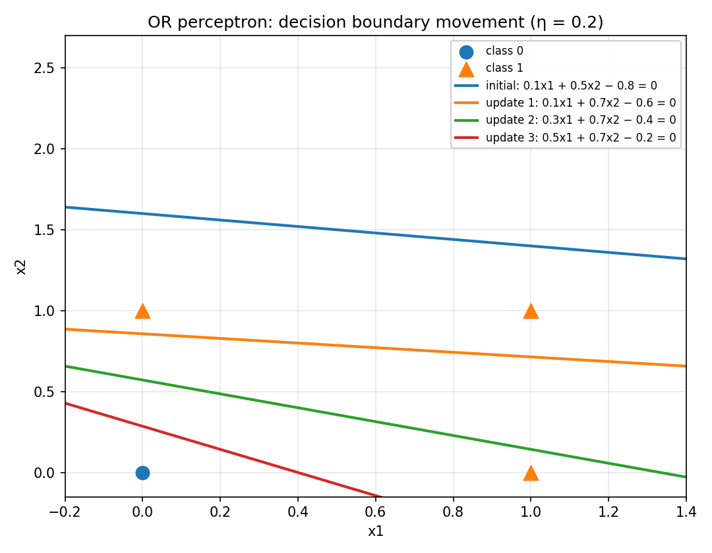

*Lecture 04, Page 33: OR 퍼셉트론의 결정경계 이동 (η = 0.2), 초기 경계에서 세 번의 업데이트를 거쳐 (0, 0)과 나머지 세 점을 나누는 경계로 내려옴*

**최종 분류 확인.** 최종 식 z = 0.5x₁ + 0.7x₂ − 0.2로 모든 입력을 확인하면 다음과 같다.

| x₁ | x₂ | z = 0.5x₁ + 0.7x₂ − 0.2 | O | 정답 T | 결과 |
|:--:|:--:|:-----------------------:|:-:|:------:|:----:|
| 0 | 0 | −0.2 | 0 | 0 | 맞음 |
| 0 | 1 | 0.5 | 1 | 1 | 맞음 |
| 1 | 0 | 0.3 | 1 | 1 | 맞음 |
| 1 | 1 | 1.0 | 1 | 1 | 맞음 |

모든 입력이 올바르게 분류되었다. 첫 번째 epoch에서 두 번, 두 번째 epoch에서 한 번 업데이트가 일어나고, 세 번째 epoch에서는 오분류가 없으므로 **3 epoch 후 수렴** 한다. 최종 가중치는 (w₁, w₂, b) = (0.5, 0.7, −0.2)이며, 최종 경계가 (0, 0)과 나머지 세 점을 올바르게 분리한다.

> **핵심:** 가중치가 바뀐다는 것은 단순히 숫자가 바뀌는 것이 아니라, **feature space에서 decision boundary의 위치와 기울기가 실제로 바뀐다** 는 뜻이다. 퍼셉트론 학습은 오분류된 데이터를 만날 때마다 가중치와 bias를 수정하여 decision boundary를 조금씩 이동시키는 과정이다.

---

 

## 11. XOR 문제와 단일 Perceptron의 한계

**XOR 데이터셋.** x₁과 x₂가 서로 다를 때 1(class 1), 같을 때 0(class 0)이 나오는 문제이다.

| x₁ | x₂ | y |
|:--:|:--:|:-:|
| 0 | 0 | 0 |
| 0 | 1 | 1 |
| 1 | 0 | 1 |
| 1 | 1 | 0 |

특징공간에서 보면 class가 **대각선 방향으로 갈린다**. (0, 0)과 (1, 1)은 class 0, (0, 1)과 (1, 0)은 class 1이므로 **한 직선으로는 두 class를 완전히 나눌 수 없다.**

**왜 single perceptron은 실패할까?** 퍼셉트론 z = w₁x₁ + w₂x₂ + b에서 결정경계는 w₁x₁ + w₂x₂ + b = 0, 즉 **결국 직선 1개** 이다. Logistic Regression도 마찬가지이다. p = σ(w₁x₁ + w₂x₂ + b)에서 p = 0.5인 경계(w₁x₁ + w₂x₂ + b = 0)는 직선이므로 XOR에 실패한다. 즉 모델 자체가 이 문제를 표현하기에 너무 단순하다.

**여러 직선을 시도해도** 항상 일부가 틀린다.

| 시도한 직선 | 결과 |
|:------------|:-----|
| 수평선 x₂ = 0.5 | 위쪽에는 (0, 1)과 (1, 1)이, 아래쪽에는 (0, 0)과 (1, 0)이 섞여 위아래 모두 틀린다. |
| 수직선 x₁ = 0.5 | 왼쪽에는 (0, 0)과 (0, 1)이, 오른쪽에는 (1, 0)과 (1, 1)이 섞여 양쪽 모두 틀린다. |
| 대각선 x₂ = −x₁ + 0.5 | (0, 0)만 한쪽에 남고, 반대쪽에는 (0, 1), (1, 0)과 함께 class 0인 (1, 1)이 섞여 틀린다. |

> **핵심:** 문제는 학습 규칙이 아니라 **모델의 표현력** 이다. 아무리 학습해도 한 개의 퍼셉트론으로는 XOR을 풀 수 없다. 그렇다면 perceptron을 여러 개 연결하면 어떻게 될까? 이 질문이 MLP로 이어진다.

---

 

## 12. 여러 Perceptron을 연결하면: MLP로

### 12.1 Perceptron을 배우는 이유

| | Logistic Regression (확률 출력) | Perceptron (이진 출력) |
|:--|:--|:--|
| 계산 | z = w₁x₁ + w₂x₂ + b, p = σ(z) = 1/(1 + e^(−z)) | z = w₁x₁ + w₂x₂ + b, y = 1 (z > 0), 0 (z ≤ 0) |
| 출력 | 0~1 사이의 확률, 로지스틱 함수(연속적인 값) | 0 또는 1(이진값), step 함수(불연속적) |

둘 다 핵심 구조는 **weighted sum + activation** 이다.

**Perceptron의 교육적 의미.**

1. **신경망의 가장 기본 unit** 이다. 모든 복잡한 신경망도 결국 이것에서 시작한다.
2. **single unit의 선형 한계를 가장 단순하게 보여 준다.** 하나의 직선으로 나눌 수 있는 문제만 해결할 수 있다.
3. **XOR 실패를 통해 MLP의 필요성을 설명한다.** XOR은 unit 하나로는 풀 수 없다.

중요한 것은 오래된 알고리즘이라는 점이 아니라, **neural network의 출발점** 이라는 점이다.

**Single Perceptron의 한계.**

| 문제 | 단일 perceptron |
|:-----|:----------------|
| AND | 가능(선형 분리 가능) |
| OR | 가능(선형 분리 가능) |
| XOR | 불가능(선형 분리 불가능) |

학습을 아무리 반복해도 XOR은 풀리지 않는다. 문제는 학습 규칙이 아니라 표현력이므로, unit 하나로 부족하면 **여러 개를 조합** 한다. 여러 unit을 연결하면 더 복잡한 문제도 해결할 수 있다.

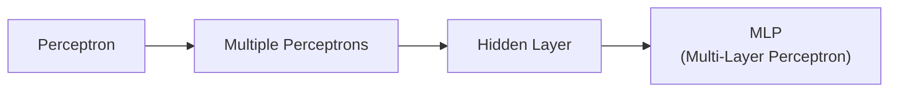

입력층(input layer)의 x₁, x₂가 은닉층(hidden layer)의 여러 unit에 모두 연결되고, 은닉층의 출력이 출력층(output layer)으로 모여 y를 만든다.

**짧은 역사로 보는 연결고리.**

| 연도 | 사건 |
|:-----|:-----|
| 1957/58 | Rosenblatt: perceptron (생물학적 신경에서 영감) |
| 1969 | Minsky & Papert: single-layer limitation (퍼셉트론의 한계 지적) |
| 1986 | backpropagation: multilayer learning 확산 (다층 신경망의 부활) |

이 흐름은 지금도 이어지고 있으며, 오늘날 AI의 기초가 여기에서 시작되었다.

### 12.2 두 개의 perceptron으로 XOR 풀기

**아이디어: 여러 개의 선형 경계를 조합하자.** XOR은 두 입력이 다르면 1, 같으면 0이므로 직선 1개로는 분리가 불가능하다. 그러나 직선 두 개를 쓰면 된다.

- **첫 번째 직선** (예: x₁ + x₂ > 0.5): 이 직선으로 일부 영역을 나눈다. (0, 0)을 나머지와 분리한다.
- **두 번째 직선** (예: x₁ + x₂ < 1.5): 다른 방향의 직선으로 또 다른 영역을 나눈다. (1, 1)을 나머지와 분리한다.
- **두 직선을 조합하면:** 여러 perceptron의 출력을 합치면 두 직선 사이의 띠 모양 영역이 class 1이 되는 **비선형 경계** 가 가능하다.

**두 개의 perceptron이 hidden layer를 만드는 구조.**

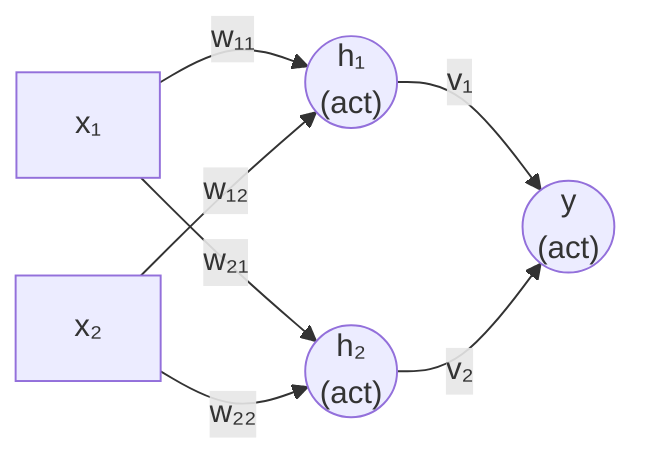

$$
h_1 = \text{act}(w_{11}x_1 + w_{12}x_2 + b_1), \quad h_2 = \text{act}(w_{21}x_1 + w_{22}x_2 + b_2), \quad y = \text{act}(v_1 h_1 + v_2 h_2 + c)
$$

act()는 활성화(activation) 함수로, step, sigmoid, ReLU 등 다양한 비선형 함수를 사용할 수 있다. 입력층 → 은닉층(hidden layer) → 출력층의 구조이다.

**구체적인 예.** act를 step 함수(z > 0이면 1)로 두고, 위의 두 직선을 그대로 사용하면 다음과 같이 XOR을 풀 수 있다.

$$
h_1 = \text{step}(x_1 + x_2 - 0.5), \qquad h_2 = \text{step}(x_1 + x_2 - 1.5), \qquad y = \text{step}(h_1 - h_2 - 0.5)
$$

| x₁ | x₂ | h₁ (OR) | h₂ (AND) | y = step(h₁ − h₂ − 0.5) | XOR |
|:--:|:--:|:-------:|:--------:|:-----------------------:|:---:|
| 0 | 0 | 0 | 0 | 0 | 0 |
| 0 | 1 | 1 | 0 | 1 | 1 |
| 1 | 0 | 1 | 0 | 1 | 1 |
| 1 | 1 | 1 | 1 | 0 | 0 |

h₁은 "적어도 하나가 1"(OR), h₂는 "둘 다 1"(AND)을 계산하고, 출력은 "h₁이지만 h₂는 아님"을 계산한다.

> **핵심 메시지**
> 1. single perceptron → 직선 1개
> 2. multiple perceptrons → 직선 여러 개 조합
> 3. hidden layer가 생기면 더 복잡한 결정경계가 가능하다
> 4. 이것이 바로 Multi-Layer Perceptron(MLP)의 아이디어이다
>
> XOR을 풀기 위한 첫 아이디어는 perceptron을 여러 개 연결하는 것이다.

### 12.3 직선과 layer를 늘리면

하나의 perceptron은 하나의 직선(선형 경계)만 만들 수 있지만, 여러 개의 perceptron(선형 직선)을 조합하면 더 복잡한 비선형 경계를 만들 수 있다.

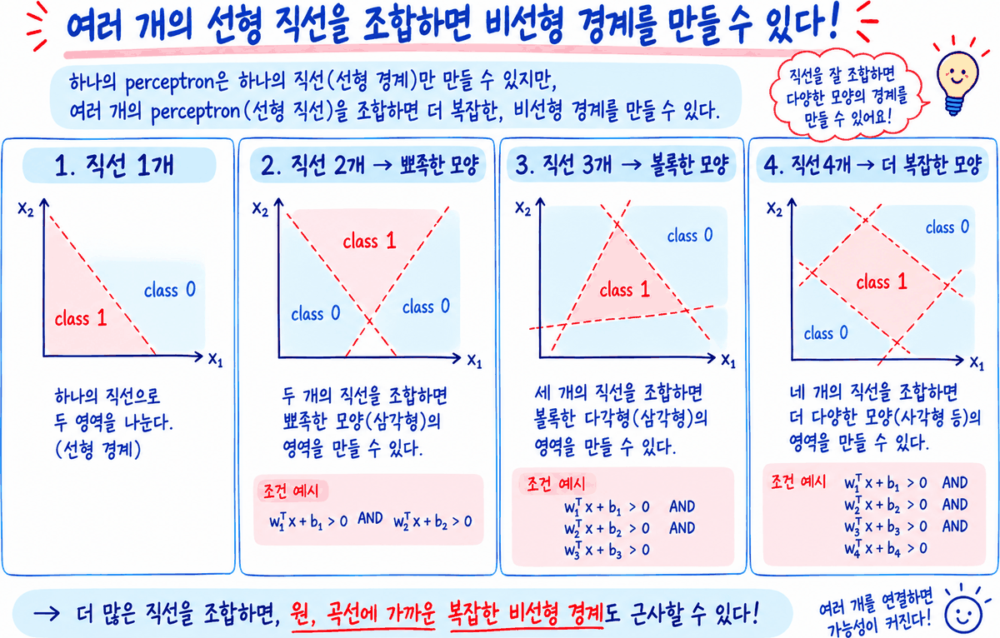

*Lecture 04, Page 37: 직선 1개, 2개, 3개, 4개를 조합할 때 만들어지는 class 1 영역의 모양*

| 직선의 수 | 만들 수 있는 영역 | 조건 예시 |
|:---------:|:------------------|:----------|
| 1개 | 하나의 직선으로 두 영역을 나눈다(선형 경계). | |
| 2개 | 두 개의 직선을 조합하면 뾰족한 모양(삼각형)의 영역을 만들 수 있다. | w₁ᵀx + b₁ > 0 AND w₂ᵀx + b₂ > 0 |
| 3개 | 세 개의 직선을 조합하면 볼록한 다각형(삼각형)의 영역을 만들 수 있다. | w₁ᵀx + b₁ > 0 AND w₂ᵀx + b₂ > 0 AND w₃ᵀx + b₃ > 0 |
| 4개 | 네 개의 직선을 조합하면 더 다양한 모양(사각형 등)의 영역을 만들 수 있다. | w₁ᵀx + b₁ > 0 AND … AND w₄ᵀx + b₄ > 0 |

더 많은 직선을 조합하면 원, 곡선에 가까운 복잡한 비선형 경계도 근사할 수 있다.

**Layer를 추가하면 더 복잡한 영역을 표현할 수 있다.** 깊이가 깊을수록(더 많은 layer) 더 복잡한 결정경계를 만들 수 있다.

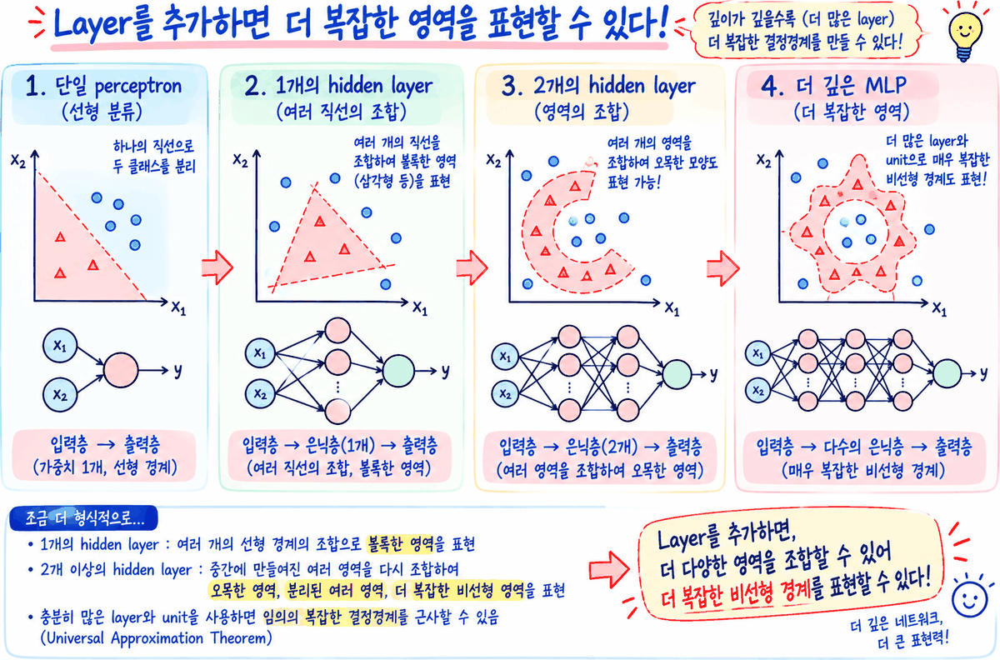

*Lecture 04, Page 37: 단일 perceptron, 1개와 2개의 hidden layer, 더 깊은 MLP가 표현하는 결정 영역의 비교*

| 구조 | 네트워크 | 표현하는 영역 |
|:-----|:---------|:--------------|
| 단일 perceptron (선형 분류) | 입력층 → 출력층 | 하나의 직선으로 두 클래스를 분리(가중치 1개, 선형 경계) |
| 1개의 hidden layer (여러 직선의 조합) | 입력층 → 은닉층(1개) → 출력층 | 여러 개의 직선을 조합하여 볼록한 영역(삼각형 등)을 표현 |
| 2개의 hidden layer (영역의 조합) | 입력층 → 은닉층(2개) → 출력층 | 여러 개의 영역을 조합하여 오목한 모양도 표현 가능 |
| 더 깊은 MLP (더 복잡한 영역) | 입력층 → 다수의 은닉층 → 출력층 | 더 많은 layer와 unit으로 매우 복잡한 비선형 경계도 표현 |

조금 더 형식적으로 쓰면 다음과 같다.

- 1개의 hidden layer: 여러 개의 선형 경계의 조합으로 볼록한 영역을 표현한다.
- 2개 이상의 hidden layer: 중간에 만들어진 여러 영역을 다시 조합하여 오목한 영역, 분리된 여러 영역, 더 복잡한 비선형 영역을 표현한다.
- 충분히 많은 layer와 unit을 사용하면 임의의 복잡한 결정경계를 근사할 수 있다(**Universal Approximation Theorem**).

> **핵심:** Layer를 추가하면 더 다양한 영역을 조합할 수 있어 더 복잡한 비선형 경계를 표현할 수 있다. 네트워크가 깊을수록 표현력이 커진다.

### 12.4 MLP라는 이름

MLP라는 이름에는 perceptron이 남아 있지만, 실제 hidden unit은 고전 퍼셉트론의 step function을 쓰지 않는다. 오늘날 MLP의 hidden unit은 보통

$$
z = \mathbf{w}^T\mathbf{x} + b
$$

뒤에 sigmoid, tanh, ReLU 같은 **미분 가능한 비선형 activation** 을 붙인다. 즉 구조만 보면 hidden unit 하나는 x → wᵀx + b → σ(z) 형태이다.

다만 이름은 역사적으로 Multi-Layer Perceptron이 굳어졌다. 여기서 "perceptron"은 좁은 의미의 "step function을 쓰는 고전 퍼셉트론"이라기보다, **weighted sum + activation을 수행하는 신경망 unit** 이라는 넓은 의미로 쓰인다.

> **핵심:** MLP의 핵심은 weighted sum 뒤에 미분 가능한 비선형 activation을 두고, 여러 층을 backpropagation으로 학습하는 데 있다.

---

 

## 요약

| 개념 | 핵심 요약 |
|:-----|:----------|
| 선형 회귀 | ŷ = wᵀx + b로 수치를 예측한다. 학습은 비용 함수 J(w, b) = (1/n)Σ(yᵢ − ŷᵢ)²를 최소로 하는 w, b를 찾는 것이다. |
| 제곱 오차 | +오차와 −오차의 상쇄를 막고, 큰 오차에 더 큰 벌점을 주며, 미분이 쉽다. |
| 정규방정식 | w = (XᵀX)⁻¹Xᵀy로 한 번에 계산한다. 반복이 없지만 데이터나 변수가 많으면 계산이 부담스럽다. |
| 경사하강법 | w_new = w_old − η(dJ/dw). 기울기의 반대 방향으로 이동하며, 이동량은 η와 기울기 크기로 정해진다. 최솟값 근처에서는 저절로 조금씩 움직인다. |
| Learning rate | 너무 작으면 느리게, 적절하면 빠르게 수렴하고, 너무 크면 최솟값을 지나쳐 수렴하지 않을 수 있다. |
| Logistic Regression | p = P(y = 1 \| x) = σ(wx + b). sigmoid로 선형 점수를 0~1의 확률로 바꾸고 threshold(보통 0.5)로 class를 정한다. |
| Decision boundary | p = 0.5, 즉 wᵀx + b = 0인 점들의 집합이다. 1차원에서는 점, 2차원에서는 직선, 그 이상에서는 초평면이다. |
| log-odds | log(p/(1 − p)) = wx + b. 확률의 log-odds를 선형식으로 모델링하므로 regression이라는 이름이 붙는다. |
| Cross Entropy | 정답 class에 높은 확률을 주도록 학습시키는 loss이다. Binary: −[y log p + (1 − y)log(1 − p)], Categorical: −Σyₖ log pₖ. 확신한 오답에 큰 벌점을 준다. |
| Perceptron | 가중합 + step 함수로 바로 0 또는 1을 출력하는 신경망의 기본 unit이다. 학습 규칙 w ← w + η(y − ŷ)x는 오분류일 때만 경계를 옮긴다. |
| Delta rule | 연속 출력과 squared error에서 경사하강법으로 유도한 Δwᵢ = η(y − ŷ)xᵢ이다. 오차와 입력의 크기에 비례해 조금씩 수정한다. |
| OR과 XOR | OR은 선형 분리 가능해 단일 perceptron이 3 epoch 만에 학습한다. XOR은 선형 분리 불가능해 직선 하나로는 풀 수 없다. |
| MLP | perceptron을 여러 개 연결해 hidden layer를 만들면 직선들의 조합으로 비선형 경계를 만든다. layer가 깊을수록 더 복잡한 영역을 표현한다. |

---

 

## 점검 문제

1. **비용 함수:** 데이터 (1, 2), (2, 4)와 모델 ŷ = wx에서 w = 1일 때 J(w) = ½[(2 − w)² + (4 − 2w)²]의 값을 구하라.

   > **정답:** J(1) = ½[(2 − 1)² + (4 − 2)²] = ½(1 + 4) = 2.5이다. J(w) = 2.5(w − 2)²에 w = 1을 넣어도 2.5(1)² = 2.5로 같다.

2. **경사하강법 한 단계:** 같은 예에서 w = 1.5, η = 0.1일 때 다음 w를 구하라.

   > **정답:** 기울기 dJ/dw = 5(1.5 − 2) = −2.5이다. w_new = 1.5 − 0.1(−2.5) = 1.75이다. 기울기가 음수이므로 w가 증가하는 쪽으로 이동한다.

3. **Learning rate:** 같은 예에서 η = 0.5로 w = 0에서 시작하면 어떻게 되는가?

   > **정답:** 기울기는 −10이므로 w = 0 − 0.5(−10) = 5가 된다. 다음 기울기는 5(5 − 2) = 15이므로 w = 5 − 0.5(15) = −2.5가 되어 최솟값 2를 계속 크게 지나친다. |w − 2|가 매번 1.5배로 커지므로 발산한다. learning rate가 너무 크면 수렴하지 않을 수 있다는 예이다.

4. **Sigmoid와 decision boundary:** 모델 p = σ(2x − 6)에서 decision boundary는 어디이며, x = 4일 때 p는 0.5보다 큰가?

   > **정답:** p = 0.5는 z = 0일 때이므로 2x − 6 = 0, 즉 x = 3이 경계이다. x = 4이면 z = 2 > 0이므로 p = σ(2) ≈ 0.88 > 0.5이고 class 1로 분류한다.

5. **log-odds:** p = 0.75일 때 odds와 log-odds를 구하라.

   > **정답:** odds = 0.75/0.25 = 3이고, log-odds = log 3 ≈ 1.10이다. class 1이 class 0보다 3배 더 가능성이 크다.

6. **Cross entropy:** y = 1일 때 p = 0.9와 p = 0.1에 대한 Binary Cross Entropy를 비교하라.

   > **정답:** p = 0.9이면 L = −log 0.9 ≈ 0.105, p = 0.1이면 L = −log 0.1 ≈ 2.303이다. 정답 class에 낮은 확률을 준 예측에 약 22배 큰 loss가 주어진다.

7. **Categorical cross entropy:** 정답이 class 3인 3-class 문제에서 softmax 출력이 [0.2, 0.3, 0.5]이면 loss는 얼마인가?

   > **정답:** one-hot 정답 [0, 0, 1]에 대해 L = −log 0.5 ≈ 0.693이다. 정답 class의 예측확률만 남는다.

8. **Perceptron rule:** w = (0.1, 0.5), b = −0.8, η = 0.2에서 샘플 (0, 1)의 정답이 1일 때 갱신 결과를 구하라.

   > **정답:** z = 0.5 − 0.8 = −0.3 ≤ 0이므로 출력 0, 오차 1이다. w₁ = 0.1 + 0.2 × 1 × 0 = 0.1, w₂ = 0.5 + 0.2 × 1 × 1 = 0.7, b = −0.8 + 0.2 = −0.6이다. 새 경계는 x₂ = −0.143x₁ + 0.857이다.

9. **Delta rule:** x = (1, 2), y = 1, w = (0.1, 0.2), b = 0, η = 0.1일 때 delta rule로 한 번 갱신하라.

   > **정답:** ŷ = 0.1 + 0.4 = 0.5, 오차 0.5이다. Δw₁ = 0.1 × 0.5 × 1 = 0.05, Δw₂ = 0.1 × 0.5 × 2 = 0.1, Δb = 0.05이므로 w = (0.15, 0.3), b = 0.05이다. 입력이 큰 x₂의 가중치가 더 많이 바뀐다.

10. **XOR:** 단일 perceptron이 XOR을 풀 수 없는 이유와, hidden layer가 이를 해결하는 방식을 설명하라.

    > **정답:** 단일 perceptron의 결정경계는 w₁x₁ + w₂x₂ + b = 0인 직선 하나인데, XOR은 (0, 0), (1, 1)과 (0, 1), (1, 0)이 대각선으로 엇갈려 있어 직선 하나로 나눌 수 없다. hidden layer에 x₁ + x₂ − 0.5(OR)와 x₁ + x₂ − 1.5(AND)의 두 perceptron을 두고 출력에서 "OR이지만 AND는 아님"을 계산하면, 두 직선 사이의 띠 영역이 class 1이 되어 XOR을 풀 수 있다.

---
