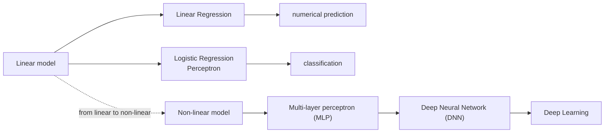
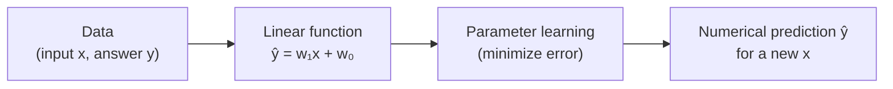
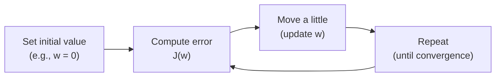
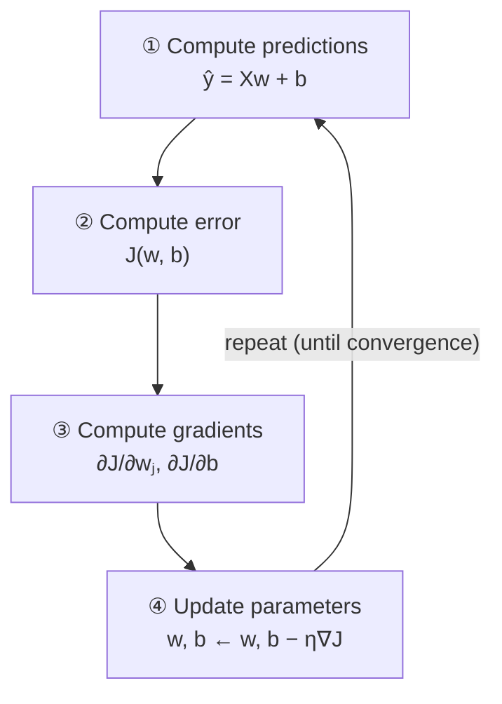
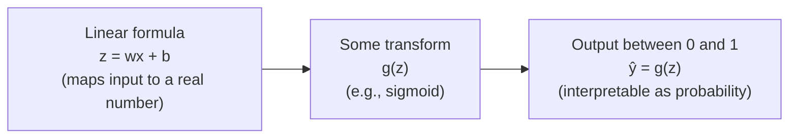
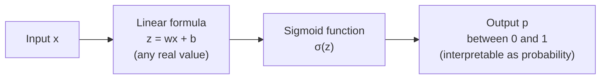
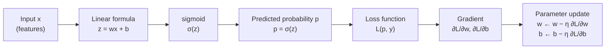
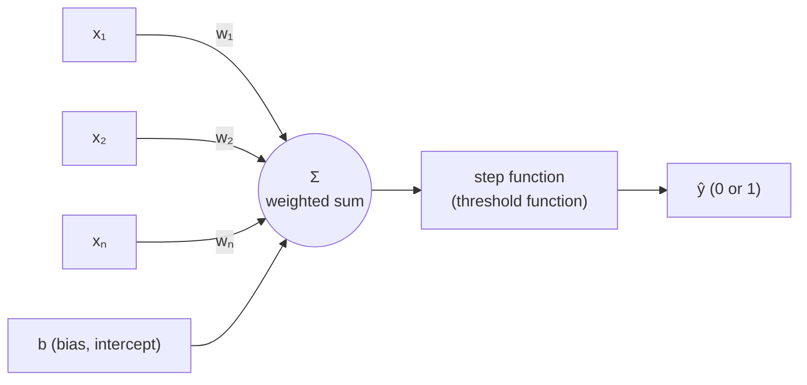
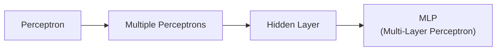
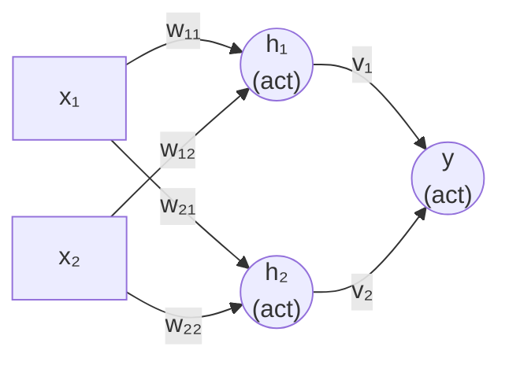

# Lecture 04 — From Linear Models to Neural Networks

> **Last Updated:** 2026-10-08
>
> Data Mining: Practical Machine Learning Tools and Techniques, Witten and Frank - Ch 4, 7

> **Learning Objectives**:
> 1. Define the cost function of linear regression and explain how the normal equation and gradient descent find its parameters
> 2. Explain the roles of the gradient and the learning rate in the gradient descent update, and iterate a simple example by hand
> 3. Explain the structure and the name of logistic regression using the sigmoid, threshold, decision boundary, and log-odds
> 4. Explain why classification uses cross entropy instead of MSE, and compute binary and categorical cross entropy
> 5. Update weights with the perceptron learning rule and the delta rule, and compute how the decision boundary of the OR problem moves
> 6. Explain why a single perceptron cannot solve XOR and how an MLP that connects several perceptrons creates nonlinear boundaries

---

## Table of Contents

- [1. A Map from Linear Models to Neural Networks](#1-a-map-from-linear-models-to-neural-networks)
- [2. Linear Regression](#2-linear-regression)
  - [2.1 The Line That Best Explains the Data](#21-the-line-that-best-explains-the-data)
  - [2.2 Multiple Linear Regression](#22-multiple-linear-regression)
  - [2.3 Which Line Is the Best?](#23-which-line-is-the-best)
  - [2.4 The Cost Function: Errors as a Single Number](#24-the-cost-function-errors-as-a-single-number)
- [3. Two Ways to Find w and b](#3-two-ways-to-find-w-and-b)
- [4. Gradient Descent](#4-gradient-descent)
  - [4.1 Intuition: Small Steps in the Direction That Reduces the Error](#41-intuition-small-steps-in-the-direction-that-reduces-the-error)
  - [4.2 Which Direction, and How Far?](#42-which-direction-and-how-far)
  - [4.3 Convergence by Learning Rate](#43-convergence-by-learning-rate)
  - [4.4 A Simple Linear Regression Example](#44-a-simple-linear-regression-example)
  - [4.5 Several Variables and Partial Derivatives](#45-several-variables-and-partial-derivatives)
- [5. Logistic Regression](#5-logistic-regression)
  - [5.1 Problems with Using Linear Regression for Classification](#51-problems-with-using-linear-regression-for-classification)
  - [5.2 The Sigmoid Function](#52-the-sigmoid-function)
  - [5.3 Threshold and Decision Boundary](#53-threshold-and-decision-boundary)
  - [5.4 Viewing It as a Probability Space](#54-viewing-it-as-a-probability-space)
  - [5.5 Why Is It Called Logistic Regression?](#55-why-is-it-called-logistic-regression)
- [6. Cross Entropy](#6-cross-entropy)
  - [6.1 Why Cross Entropy Instead of MSE?](#61-why-cross-entropy-instead-of-mse)
  - [6.2 Entropy and Cross Entropy](#62-entropy-and-cross-entropy)
  - [6.3 Binary and Categorical Cross Entropy](#63-binary-and-categorical-cross-entropy)
- [7. Training Logistic Regression](#7-training-logistic-regression)
- [8. Comparing Linear Regression and Logistic Regression](#8-comparing-linear-regression-and-logistic-regression)
- [9. Perceptron](#9-perceptron)
  - [9.1 From Logistic Regression to the Perceptron](#91-from-logistic-regression-to-the-perceptron)
  - [9.2 Structure and Computation](#92-structure-and-computation)
  - [9.3 The Perceptron Learning Rule](#93-the-perceptron-learning-rule)
  - [9.4 The Delta Rule](#94-the-delta-rule)
- [10. Training a Perceptron on the OR Problem](#10-training-a-perceptron-on-the-or-problem)
- [11. The XOR Problem and the Limit of a Single Perceptron](#11-the-xor-problem-and-the-limit-of-a-single-perceptron)
- [12. Connecting Several Perceptrons: Toward the MLP](#12-connecting-several-perceptrons-toward-the-mlp)
  - [12.1 Why Learn the Perceptron?](#121-why-learn-the-perceptron)
  - [12.2 Solving XOR with Two Perceptrons](#122-solving-xor-with-two-perceptrons)
  - [12.3 Adding Lines and Layers](#123-adding-lines-and-layers)
  - [12.4 The Name MLP](#124-the-name-mlp)
- [Summary](#summary)
- [Review Questions](#review-questions)

---

 

## 1. A Map from Linear Models to Neural Networks

A **linear model** computes its output as a **linear combination of features**.

$$
y = w_1 x_1 + w_2 x_2 + \cdots + w_0
$$

If the relationship in the data can be explained by a straight line (or plane), a linear model is enough, but if it is curved, a **non-linear model** is needed. This chapter follows the path from linear models to neural networks.

- **Linear regression** predicts numbers (numerical prediction), while **logistic regression** and the **perceptron** are used for classification.
- MLPs, DNNs, and deep learning all belong to **neural networks**. Neural networks can model complex non-linear functions by stacking many layers and non-linear activations.
- More layers give more expressive power, which leads to deep learning.

---

 

## 2. Linear Regression

### 2.1 The Line That Best Explains the Data

**Linear regression** is the problem of finding the line that best explains the data. When the data consists of pairs of an input x and an answer y, each row of the table becomes one point on the graph.

| x (size) | y (price) |
|:--------:|:---------:|
| 1 | 2 |
| 2 | 4 |
| 3 | 5 |
| 4 | 4 |
| 5 | 6 |

The linear regression model is the following line. w₁ is the slope and w₀ is the intercept, and given x the model predicts y.

$$
\hat{y} = w_1 x + w_0
$$

The vertical distance yᵢ − ŷᵢ between each data point (xᵢ, yᵢ) and the line is called the **error (residual)**. The best line is the one whose prediction error over all data is the smallest, and to find it we **minimize the sum of squared errors**. This method is called **least squares**.

$$
\sum_{i=1}^{n} (y_i - \hat{y}_i)^2 = \sum_{i=1}^{n} \bigl(y_i - (w_1 x_i + w_0)\bigr)^2
$$

The errors are squared for the following reasons.

- Squaring makes them positive, so positive and negative errors do not cancel out.
- It gives a larger penalty to larger errors.
- It is mathematically convenient (easy to differentiate).

As a result, we find the optimal w₁ and w₀, obtain the line that best explains the data, and can predict y as a number whenever a new x is given.

### 2.2 Multiple Linear Regression

**Multiple linear regression** is a linear model that predicts a continuous value (a number) using several explanatory variables.

| House size x₁ (m²) | Rooms x₂ | Year built x₃ | Price y (100M KRW) |
|:------------------:|:--------:|:-------------:|:------------------:|
| 84 | 3 | 2010 | 6.5 |
| 59 | 2 | 2015 | 4.2 |
| 120 | 4 | 2008 | 9.8 |
| 95 | 3 | 2020 | 7.1 |
| 70 | 2 | 2018 | 5.0 |

Placing the data in an n-dimensional space, the problem becomes finding the **plane (hyperplane)** that best explains the data instead of a line.

$$
\hat{y} = w_1 x_1 + w_2 x_2 + w_3 x_3 + \cdots + w_0
$$

w₁, w₂, and w₃ are the effects of house size, number of rooms, and year built, and w₀ is the intercept (base value). Even with several x's, y is still predicted as a **linear combination (weighted sum)** of the x's. As in simple linear regression, learning finds w₁, w₂, …, w₀ so that the prediction error over all data is the smallest.

$$
\text{minimize} \; \sum_{i=1}^{n} (y_i - \hat{y}_i)^2
$$

For example, if the learned model is ŷ = 0.06x₁ + 0.8x₂ − 0.02x₃ + 10, the price of a new house of 100 m² with 3 rooms built in 2018 is predicted as ŷ = 0.06(100) + 0.8(3) − 0.02(2018) + 10.

> **Note:** Computing the formula above as written gives 6 + 2.4 − 40.36 + 10 = −21.96, which does not match the predicted price of 7.3 (100M KRW) given with it. These coefficients are an example to show the calculation. When a feature has large values, such as the year built, its coefficient and the intercept are learned at a matching scale.

### 2.3 Which Line Is the Best?

Learning in linear regression is **the process of finding the w and b that fit the data**. From here on we write the model as ŷ = wx + b, with w the slope and b the intercept. For example, suppose the data for predicting house prices from house sizes is as follows.

| House size x (m²) | House price y (100M KRW) |
|:-----------------:|:------------------------:|
| 50 | 3.0 |
| 70 | 4.2 |
| 90 | 5.1 |
| 110 | 6.0 |
| 130 | 7.1 |

For the same data, different w and b give different lines.

| Line | Characteristic | Result |
|:----:|:---------------|:-------|
| A | Slope too small | Poor fit |
| B | Appropriate slope | Better fit |
| C | Slope too large | Poor fit |

When w and b change, the shape of the line changes too. Which line, then, is the best? In linear regression, "learning" does not mean creating a new formula but finding the w and b that best fit this data. A good line is one with small error, so to judge "fitting well" objectively we must now define **the error as a number**.

### 2.4 The Cost Function: Errors as a Single Number

The difference between the actual value yᵢ at each data point and the value ŷᵢ predicted by the line is called the **error**.

$$
e_i = y_i - \hat{y}_i
$$

| Data i | Actual yᵢ | Predicted ŷᵢ | Error eᵢ = yᵢ − ŷᵢ |
|:------:|:---------:|:------------:|:-------------------:|
| 1 | 3.0 | 2.7 | 0.3 |
| 2 | 4.2 | 4.5 | −0.3 |
| 3 | 5.1 | 4.8 | 0.3 |

Since there are many data points, there are many errors. The most common way to combine them into a single number is **to square the errors, add them all up, and take the average** (error → square → sum → average).

$$
J(w, b) = \frac{1}{n}\sum_{i=1}^{n} (y_i - \hat{y}_i)^2 = \frac{1}{n}\sum_{i=1}^{n} \bigl(y_i - (w x_i + b)\bigr)^2
$$

Here n is the number of data points. This value is called the **cost function**. Squaring keeps positive and negative errors from canceling each other (the result is always positive) and gives a larger penalty to larger errors (doubling the error quadruples its square).

For the same data, a different line gives a different value of J.

| Line | Shape | J |
|:----:|:------|:-:|
| A | Too flat | 20.4 |
| B | Best fit to the data | **3.2** |
| C | Too steep | 15.7 |

Line B, with the smallest J, is the line that best explains the data.

> **Key point:** Model learning = **finding the w and b that minimize J(w, b)**. How, then, do we actually find those w and b?

---

 

## 3. Two Ways to Find w and b

Learning in linear regression is finding the w and b that minimize the cost function J(w, b). There are two main ways to find them.

**Method 1: Solve it mathematically at once (closed-form solution).** Put the data into the normal equation and compute the optimal w directly. If needed, b is computed together.

$$
\mathbf{w} = (X^T X)^{-1} X^T \mathbf{y}
$$

- Strength: it computes the answer at once, without iteration.
- Limit: with large data or many variables, the computation becomes burdensome (high computational cost).

**Method 2: Find it little by little (gradient descent).** Start from an arbitrary w (for example, w = 0) and move little by little in the direction that reduces the error to find the smallest value. Repeating current w → better w → better w → … brings us closer and closer to a good w.

| Closed-form solution | Gradient descent |
|:---------------------|:-----------------|
| Direct computation | Moves little by little |
| No iteration | Iterative learning |
| Available for linear regression | Applicable to many models |
| Burdensome with large data | Central to training the more complex models to come |

The first method "computes at once", and the second "moves step by step in the direction that keeps improving". Gradient descent is very important not only for linear regression but also for the more complex models to come, so this chapter focuses on it.

> **Key point:** Model learning is **the process of searching for parameters that reduce the error**.

---

 

## 4. Gradient Descent

### 4.1 Intuition: Small Steps in the Direction That Reduces the Error

**Gradient descent** starts from the current w and moves toward where the cost function J(w) decreases. For intuition, ignore b for a moment and consider the simple model ŷ = wx.

For the same data, a different w gives a differently shaped line, different predictions, and therefore a different cost J(w).

| w | Line | J(w) |
|:-:|:-----|:----:|
| 0.5 | Too flat | 20 |
| 1.0 | Better fit | 3 |
| 1.5 | Too steep | 15 |

Plotting the cost J(w) against w gives a **U-shaped** curve. In the example above, (0.5, 20), (1.0, 3), and (1.5, 15) are points on that curve, and the lowest point is near w = 1.0. Finding a good model is ultimately **the problem of finding the w with the smallest J(w)**.

However, we do not know the optimal w from the start. Gradient descent therefore starts from a starting point w₀ and moves little by little to w₁, w₂, w₃, … in the direction that reduces the error. It does not know the answer at once; it walks toward the lower side one step at a time.

**The mountain-descent analogy.** If we look at which side is lower from where we stand and move a little in that direction, we get closer and closer to a lower place.

| Descending a mountain | Gradient descent |
|:----------------------|:-----------------|
| Current position | Current w |
| Height | J(w) |
| Slope | Gradient |
| Lowest place | Minimum |

> **Key point:** Choose the current w → check J(w) → move in the downhill direction → repeat → better w. Gradient descent is **the method of updating the parameters little by little in the direction that reduces the cost**.

### 4.2 Which Direction, and How Far?

**Direction: the gradient tells us.** The gradient, that is, the derivative dJ/dw, shows how steep the cost function J(w) is at the current w, and it is the slope of the tangent line at that point.

- If dJ/dw < 0, increasing w decreases J(w) (move right).
- If dJ/dw > 0, decreasing w decreases J(w) (move left).
- The gradient points in the direction in which J increases fastest (uphill). We must move in the **opposite direction**, which is why the update formula **has a "−" sign**.

**Size: the learning rate decides.** The update formula is as follows.

$$
w_{\text{new}} = w_{\text{old}} - \eta \frac{dJ}{dw}
$$

| Symbol | Meaning |
|:-------|:--------|
| w_new | New value |
| w_old | Current value (where we stand now) |
| dJ/dw | Gradient (which direction to move) |
| η | Learning rate (how far to move) |

The **learning rate η** decides how far to move at once. If it is too small, convergence is very slow; if it is too large, the update may overshoot the minimum and fail to converge.

**Let us compute one step directly.** With the current w = 0.6, gradient dJ/dw = −4, and learning rate η = 0.1,

$$
w_{\text{new}} = 0.6 - 0.1(-4) = 0.6 + 0.4 = 1.0
$$

Since the gradient is negative, w moves in the increasing direction (right) and gets closer to the minimum.

Importantly, the step size depends not only on the learning rate but also **on the magnitude of the gradient**. Far from the minimum, the curve is steep, so |gradient| is large and the step is relatively large. Near the minimum, the curve flattens, the gradient becomes small, and the step naturally shrinks. Gradient descent thus moves quickly at first and more and more carefully near the minimum.

### 4.3 Convergence by Learning Rate

| Size of η | Convergence |
|:----------|:------------|
| Too small (η too small) | Converges very slowly. |
| Appropriate (η appropriate) | Converges quickly. |
| Too large (η too large) | May overshoot the minimum and keep bouncing back and forth (it may not converge). |

> **At a glance:** new w = current w − learning rate × gradient. **The gradient sets the direction, and the learning rate sets the step size.** With several variables, the partial derivative for each variable (∂J/∂w, ∂J/∂b, …) is used.

### 4.4 A Simple Linear Regression Example

Let us see how w changes with a very simple two-point dataset. The data is (1, 2) and (2, 4); that is, y = 2 when x = 1 and y = 4 when x = 2, and the goal is to find the line that best explains the two points.

**Model.** Fix the intercept b at 0 (consider only lines through the origin) and find only the slope w.

$$
\hat{y} = wx
$$

For this data, the line that passes exactly through both points is y = 2x, so the optimal solution is w = 2. Gradient descent, however, does not know this value at first and finds it gradually by iterating.

**Cost function and gradient.** We use the mean squared error, multiplied by 1/2 here.

$$
J(w) = \frac{1}{2}\left[(2 - w)^2 + (4 - 2w)^2\right] = 2.5(w - 2)^2
$$

Differentiating this cost function gives the following.

$$
\frac{dJ}{dw} = 5(w - 2)
$$

The gradient is negative when w is less than 2 and positive when w is greater than 2. Plugging in the current w gives the error J(w) and the gradient, and the gradient tells us which way to move.

**Running gradient descent.** In the update w_new = w_old − η(dJ/dw), use η = 0.1 and start from the initial value w = 0.

| Iteration | Current w | J(w) | Gradient | Next w |
|:---------:|:---------:|:----:|:--------:|:------:|
| 0 | 0.000 | 10.000 | −10.000 | 1.000 |
| 1 | 1.000 | 2.500 | −5.000 | 1.500 |
| 2 | 1.500 | 0.625 | −2.500 | 1.750 |
| 3 | 1.750 | 0.156 | −1.250 | 1.875 |
| 4 | 1.875 | 0.039 | −0.625 | 1.938 |

At the first w = 0, the cost is 10 and the gradient is −10, so the next value is w = 0 − 0.1(−10) = 1. At w = 1, the cost is 2.5 and the gradient is −5, so w becomes 1.5. Repeating this way, J(w) keeps decreasing and w gets closer and closer to 2.

- **Change of the line:** At w = 0 (y = 0) the line is far off, it improves somewhat at w = 1.0, further at w = 1.5, and at w ≈ 2 it is almost the answer (y = 2x).
- **Change on the J(w) graph:** The point on J(w) = 2.5(w − 2)² goes down (0, 10) → (1.0, 2.5) → (1.5, 0.625) → (1.75, 0.156) → (1.875, 0.039) toward the minimum (2, 0). Far away, the gradient is large and the step is large; near the minimum, the gradient is small and the steps are small.

> **Key point:** Gradient descent moves a lot at first and little later. The closer it gets to the minimum, the smaller the gradient and the step. The same learning process can be seen both as the change of the line and as the decrease of J(w).

### 4.5 Several Variables and Partial Derivatives

With several input variables, the linear regression model is the weighted sum of the inputs plus an intercept.

$$
\hat{y} = w_1 x_1 + w_2 x_2 + \cdots + w_d x_d + b = \mathbf{w}^T\mathbf{x} + b
$$

| x₁ | x₂ | x₃ | … | ŷ |
|:--:|:--:|:--:|:-:|:-:|
| 2 | 1 | 0 | … | 2.3 |
| 0 | 1 | 3 | … | 1.1 |
| 1 | 0 | 1 | … | 0.8 |

The cost function is the mean squared error over all data.

$$
J(\mathbf{w}, b) = \frac{1}{n}\sum_{i=1}^{n} (\hat{y}_i - y_i)^2
$$

J(w, b) is the cost function that measures how different the model's predictions are from the actual values, w and b are the parameters we want to find, and n is the number of data points.

**Partial derivatives (gradient).** With several variables, we use the partial derivative for each variable. The partial derivative ∂J/∂wⱼ is the slope in the wⱼ direction at the current point (with the other variables fixed). Thinking of J(w, b) as a bowl-shaped surface over several variables, we compute the slope for each variable and move in the direction that reduces the error.

**Update formula.** All parameters are updated simultaneously as follows.

$$
w_j \leftarrow w_j - \eta \frac{\partial J}{\partial w_j} \quad (j = 1, 2, \ldots, d), \qquad b \leftarrow b - \eta \frac{\partial J}{\partial b}
$$

The learning rate η decides how far to move at once.

**Learning process.** The following process is repeated to reduce J(w, b) step by step.

The more it repeats, the closer the parameters (w, b) get to their optimal values and the better the line fits the data. At the start (random values) J is very large, during learning J keeps decreasing, and when learning is done J is small enough.

> **Key summary**
> - Linear regression predicts the output as the weighted sum of the input variables.
> - It finds the parameters (w, b) that minimize the mean squared error.
> - Gradient descent computes the partial derivative (gradient) for each variable and moves little by little in the direction that reduces the error.
> - Repeating this process steadily lowers J(w, b) and yields the line that best explains the data.
>
> In short, learning in linear regression is **repeating the process of predicting, computing the error, computing the gradient, and correcting the parameters**. Next, we apply the same idea to classification with logistic regression.

---

 

## 5. Logistic Regression

### 5.1 Problems with Using Linear Regression for Classification

Consider predicting whether a student passes an exam from the hours studied. The output is not a continuous value but one of two values: **fail 0 and pass 1**.

| Study hours x | Pass y |
|:-------------:|:------:|
| 1 | 0 |
| 2 | 0 |
| 3 | 0 |
| 4 | 1 |
| 5 | 1 |
| 6 | 1 |

Plotted as points, x = 1, 2, 3 lie at y = 0 and x = 4, 5, 6 lie at y = 1 (the outputs are discrete values, 0 or 1). The more hours studied, the more likely the student seems to pass. Applying linear regression to this data as is gives a line of the form ŷ = wx + b, and using that line as is predicts real values outside 0 and 1 (the prediction is < 0 for small x and > 1 for large x).

**What is the problem?**

1. **The prediction can be less than 0 or greater than 1.** But pass or fail must be 0 or 1.
2. **It is hard to interpret as a probability.** The prediction is a real value, so it is hard to see it as a probability.
3. **It is inconvenient to use directly for classification.** Extra processing is needed, such as cutting the prediction at an arbitrary threshold.

We want to express not just a number but "how likely the student is to pass" as **a probability between 0 and 1**. The idea is therefore not to throw away the linear formula but to first compute z = wx + b and then attach a function that converts that value into the range between 0 and 1.

> **Key point:** Linear regression is hard to use directly for classification, and a new model that turns the output into something like a probability is needed.

### 5.2 The Sigmoid Function

Logistic regression still uses the linear formula as is.

$$
z = wx + b
$$

x is the input (for example, study hours), w is the weight, and b is the intercept (bias). z is the **linear score** computed for the input x and can take any real value from negative to positive. In classification, we want to turn this value into a value between 0 and 1 that can be interpreted like a probability. The function used for this is the **sigmoid function**.

$$
\sigma(z) = \frac{1}{1 + e^{-z}}
$$

Whatever real z comes in, the output of this function is always between 0 and 1.

| z | σ(z) |
|:--|:-----|
| Large negative (z → −∞) | Close to 0 (σ(z) → 0) |
| 0 | σ(0) = 1/(1 + 1) = 0.5 |
| Large positive (z → ∞) | Close to 1 (σ(z) → 1) |

The sigmoid is an S-shaped curve (sigmoid curve). For example, σ(−2) ≈ 0.12, σ(0) = 0.5, and σ(2) ≈ 0.88.

Logistic regression can therefore be written as follows.

$$
P(y = 1 \mid x) = \sigma(wx + b)
$$

That is, it can be interpreted as **a model that outputs the probability of class 1** given the input x. Given study hours x, p is interpreted as the probability of passing.

- x = 5 (5 hours of study) → p = 0.82 → likely to pass.
- x = 1 (1 hour of study) → p = 0.23 → likely to fail.
- x = 2 → p = 0.5 → the midpoint between pass and fail (hard to say either way).

The larger p is, the more likely y = 1 (pass) is.

> **Key point:** Logistic regression keeps the linear formula z = wx + b but passes it through the sigmoid function to turn the output into a probability between 0 and 1.

### 5.3 Threshold and Decision Boundary

Logistic regression outputs a probability and converts it into class 0 or class 1. The model output p = σ(z) is always between 0 and 1 and can be interpreted as the probability that the given input x belongs to class 1 (the positive class). Conversely, the probability of class 0 is 1 − p. Logistic regression thus tells us, for each data point, "how close it is to 1" as a probability.

**Deciding the class with a threshold.** To turn the probability into an actual class, we set a reference value, the **threshold**. Usually 0.5 is used.

$$
p \ge 0.5 \Rightarrow \text{class } 1 \ (\text{positive}), \qquad p < 0.5 \Rightarrow \text{class } 0 \ (\text{negative})
$$

For example, p = 0.82 gives 0.82 ≥ 0.5, so pass (1), and p = 0.23 gives 0.23 < 0.5, so fail (0). Depending on the problem, a threshold other than 0.5 may also be used.

**A one-dimensional example.** The following is p = P(y = 1 | x) by study hours for another example model; as study hours increase, p grows.

| x (study hours) | 0 | 2 | 4 | 6 | 8 | 10 |
|:--|:--:|:--:|:--:|:--:|:--:|:--:|
| p | 0.08 | 0.20 | 0.40 | **0.5** | 0.70 | 0.92 |

x = 6, where p becomes 0.5, is the boundary where the class changes. In the sigmoid, p = 0.5 occurs at z = 0 (σ(0) = 0.5), so the boundary point is where z = wx + b = 0.

$$
wx + b = 0
$$

The point where this holds is exactly the **decision boundary**.

**Two or more dimensions.** In two (or more) dimensions as well, the set of points with p = 0.5 forms a single line (or hyperplane).

$$
w_1 x_1 + w_2 x_2 + b = 0 \quad (\text{or } \mathbf{w}^T\mathbf{x} + b = 0)
$$

This line is the decision boundary; one side has p < 0.5 (class 0) and the other has p ≥ 0.5 (class 1). It is a single boundary point in one dimension and a single line in two dimensions.

> **Key point:** The probability p changes smoothly with the input, but the final classification changes abruptly at this boundary. Logistic regression outputs the probability p and decides the final class with a threshold, and the set of points with p = 0.5 is the decision boundary.

### 5.4 Viewing It as a Probability Space

Logistic regression assigns a probability p = P(y = 1 | x) to every point of the feature space.

*Figure 1. The two-dimensional feature space and the probability surface above it, the decision boundary as the set of points with p = 0.5, and the sigmoid shape seen from the side (p. 16)*

1. **Two-dimensional feature space:** Each point of this plane is one input x = (x₁, x₂). Usually we only look at how class 0 and class 1 are divided on this plane by the decision boundary w₁x₁ + w₂x₂ + b = 0.
2. **Every point has a probability:** Logistic regression does not just give a boundary; it computes a probability p = P(y = 1 | x) for every point of the feature space. Lifting this two-dimensional feature space and putting p on a third axis turns the whole feature space into a single **probability surface** (feature space → probability space).
3. **The set of points with p = 0.5:** Collecting the points on this surface where the probability is 0.5 gives the classification boundary. That is, the classification boundary is the line that appears when the probability surface is cut at height p = 0.5. It is a line in two dimensions and a hyperplane in higher dimensions.
4. **Seen from the side, a sigmoid:** Viewed from the side, the surface shows an S shape, which is exactly the sigmoid function. When z = w₁x₁ + w₂x₂ + b is small, p ≈ 0; when z = 0, p = 0.5; and when z is large, p ≈ 1.

> **Key point:** Logistic regression is a model that assigns a probability p = P(y = 1 | x) to each point of the feature space, and the decision boundary is the set of points where that probability is 0.5.

### 5.5 Why Is It Called Logistic Regression?

It is a classification problem, so why does the name say regression?

**① What it predicts is a probability.** What logistic regression directly predicts first is the probability of class 1, p = P(y = 1 | x). Being a probability, it is always 0 ≤ p ≤ 1 (p = 0 means always class 0, 0.5 means neither class can be favored, and 1 means always class 1). But since p is confined between 0 and 1, it is hard to express it directly with a linear formula.

**② Odds: the ratio of the two classes' chances.** So we first turn the probability into **odds**.

$$
\text{odds} = \frac{p}{1 - p}
$$

The odds divide "the chance of being class 1" by "the chance of being class 0". In other words, they show how much more likely class 1 is than class 0.

| p | odds = p/(1 − p) | Interpretation |
|:-:|:-----------------|:---------------|
| 0.8 | 0.8/0.2 = 4 | Class 1 is 4 times as likely as class 0 |
| 0.5 | 0.5/0.5 = 1 | The two classes are equally likely |
| 0.2 | 0.2/0.8 = 0.25 | Class 1 is less likely than class 0 |

**③ Log-odds (logit): extending to all real numbers.** Taking the log of the odds gives the **log-odds (or logit)**.

$$
\text{log-odds} = \log\left(\frac{p}{1 - p}\right)
$$

| p | odds | log(odds) |
|:-:|:----:|:----------|
| 0.8 | 4 | log(4) ≈ 1.39 |
| 0.5 | 1 | log(1) = 0 |
| 0.2 | 0.25 | log(0.25) ≈ −1.39 |

As p → 1, odds → ∞ and log-odds → +∞; as p → 0, odds → 0 and log-odds → −∞. That is, when p is between 0 and 1, the log-odds can take any real value from −∞ to +∞. **Since the log-odds is an unrestricted real value, it is suitable for modeling with a linear formula.**

**④ Modeling it with a linear formula (the reason for the name regression).**

$$
\log\left(\frac{p}{1 - p}\right) = wx + b
$$

Logistic regression does not perform linear regression on the probability itself; it **models the log-odds of the probability as a linear combination of the input x**. The "regression" here means expressing the log-odds (a continuous real value) with a linear formula.

**⑤ Converting back to a probability gives the sigmoid.** Solving the formula above for p gives p/(1 − p) = e^(wx + b), so

$$
p = \frac{e^{wx + b}}{1 + e^{wx + b}} = \frac{1}{1 + e^{-(wx + b)}}
$$

That is, the function that converts the linear output z = wx + b into a probability between 0 and 1 is exactly the sigmoid (logistic) function, which is why this method is called logistic regression.

> **Key point:** Logistic regression = model the log-odds with a linear formula → convert to a probability → classify.

---

 

## 6. Cross Entropy

### 6.1 Why Cross Entropy Instead of MSE?

The output of logistic regression is not a number itself but the probability p = P(y = 1 | x) (a value between 0 and 1 predicted by the model). If p is close to 1, y = 1 (positive) is likely; if it is close to 0, y = 0 (negative) is likely. The goal of learning is therefore not simply to reduce a numerical difference but **to make the model give a high probability to the correct class**.

Let us look at several cases intuitively.

| Situation | Prediction | What the loss should be |
|:----------|:-----------|:------------------------|
| y = 1, p = 0.9 | Good prediction | Small |
| y = 1, p = 0.1 | Bad prediction | Large |
| y = 0, p = 0.1 | Good prediction | Small |
| y = 0, p = 0.9 | Bad prediction | Large |

**Binary cross entropy** has exactly this property.

$$
L = -\bigl[y \log p + (1 - y)\log(1 - p)\bigr]
$$

p = P(y = 1 | x) is the probability predicted by the model, and y ∈ {0, 1} is the actual answer. If the answer is 1, only −log p effectively remains; if the answer is 0, only −log(1 − p) remains.

- The higher the probability of the correct class (the closer p is to 1), the smaller the loss.
- The lower the probability of the correct class (the closer p is to 0), the larger the loss.
- In other words, the model learns to give a high probability to the correct class.

**A confident wrong prediction gets a large penalty.** When y = 1, the loss −log p grows very large as p approaches 0, and when y = 0, the loss −log(1 − p) grows very large as p approaches 1.

| | MSE | Cross Entropy |
|:--|:--|:--|
| Formula | L = (y − p)² | L = −[y log p + (1 − y)log(1 − p)] |
| Main use | Regression problems (continuous numerical prediction) | Classification problems |
| Characteristics | Uses the squared difference between the prediction and the answer. It can be used for classification, but it is not suitable for learning probabilities. | Deals with the probability p directly and learns to give a high probability to the correct class. Gives a very large penalty when the model is wrong but confident (e.g., y = 1 but p = 0.01). Used by default in almost all classification models in practice. |

This is why cross entropy is a much more natural and suitable loss function than MSE for classification problems that output probabilities.

> **Key point:** Cross entropy is the loss that trains the model to give a high probability to the correct class.

### 6.2 Entropy and Cross Entropy

| Concept | Formula | Meaning |
|:--------|:--------|:--------|
| Entropy | −Σ Pᵢ log Pᵢ | The uncertainty of the actual distribution itself |
| Cross Entropy | −Σ Pᵢ log Qᵢ | The difference between the actual distribution P and the predicted distribution Q |
| Binary CE | −[y log p + (1 − y)log(1 − p)] | The two-class case |
| Categorical CE | −Σₖ yₖ log pₖ | The multi-class case |

Connecting this with the decision tree of Lecture 03:

- In a decision tree, entropy measured **how mixed the classes are within the current node**.
- In logistic regression, cross entropy measures **how well the distribution of the actual answer matches the model's predicted probability distribution**.

Entropy expresses how uncertain a single distribution is, while cross entropy expresses how well the actual distribution and the predicted distribution match. In classification, the higher the probability given to the correct class, the smaller the cross entropy.

**Example: binary cat/dog classification.** If the actual answer is a cat, the actual distribution is P = [1, 0]. If the model predicts Q = [0.9, 0.1],

$$
H(P, Q) = -[1 \log 0.9 + 0 \log 0.1] = -\log 0.9 \approx 0.105
$$

Only the probability given to the correct class remains, and since the model gave 0.9 to the correct class, the loss is small. Conversely, predicting Q = [0.1, 0.9] gives

$$
H(P, Q) = -\log 0.1 \approx 2.303
$$

which is very large. This is how cross entropy becomes a loss that trains the model to give a high probability to the correct class (log here is the natural log).

### 6.3 Binary and Categorical Cross Entropy

**Deriving binary cross entropy.** In binary classification there are two classes, so the actual distribution can be written as [y, 1 − y] and the model's predicted distribution as [p, 1 − p]. Substituting these directly into the definition of cross entropy, H(P, Q) = −Σ Pᵢ log Qᵢ, gives

$$
L = -\bigl[y \log p + (1 - y)\log(1 - p)\bigr]
$$

That is, binary cross entropy is not a formula that appeared out of nowhere but the general cross entropy formula applied to two classes.

**Multi-class classification.** Suppose there are three classes: cat, dog, and rabbit. If the actual answer is a dog, its one-hot vector is P = [0, 1, 0]. If the model's softmax output is Q = [0.1, 0.7, 0.2],

$$
H(P, Q) = -[0 \log 0.1 + 1 \log 0.7 + 0 \log 0.2] = -\log 0.7 \approx 0.357
$$

Again, only the predicted probability of the correct class remains. Multi-class classification therefore usually uses the following formula, which is called **categorical cross entropy**.

$$
L = -\sum_{k=1}^{K} y_k \log p_k
$$

The output layer and the loss usually pair up as follows. These pairs are used again as they are for the output layer and loss function of an MLP.

| Problem | Output function | Loss |
|:--------|:----------------|:-----|
| Binary classification | sigmoid | Binary Cross Entropy |
| Multi-class classification | softmax | Categorical Cross Entropy |

---

 

## 7. Training Logistic Regression

Logistic regression looks at the data and the answers and repeatedly updates w and b to reduce the loss. The whole training pipeline is as follows.

1. **Prediction (model output):** z = wx + b is a linear combination (linear score) of the input x, and passing it through the sigmoid function gives a probability between 0 and 1, p = σ(z) = 1/(1 + e^(−z)). p means the probability that y = 1 for the given input x.
2. **Loss function:** Binary cross entropy L(p, y) = −[y log p + (1 − y)log(1 − p)] is used. For an answer y ∈ {0, 1}, it gets smaller the closer the predicted probability p is to the answer, and it is averaged over all training data (mean loss).
3. **Gradient computation:** The partial derivatives of the loss with respect to w and b, ∂L/∂w and ∂L/∂b, are the slopes that show how much the loss increases or decreases at the current (w, b). If the slope is negative, moving in that direction decreases the loss; if it is positive, we must move the opposite way to decrease the loss.
4. **Parameter update (gradient descent):** w ← w − η(∂L/∂w), b ← b − η(∂L/∂b). η (eta) is the learning rate, which decides how large each update is. We move little by little in the direction opposite to the gradient to reduce the loss.

This process is repeated many times using all training data (each pass is an **epoch**). In each repetition, w and b are updated so that the loss keeps decreasing, and training stops when the loss is small enough or no longer decreases much.

> **Note:** When the sigmoid and binary cross entropy are used together, the gradients simplify to ∂L/∂w = (p − y)x and ∂L/∂b = p − y. This is the difference between the predicted probability and the answer, multiplied by the input, which has the same shape as the delta rule of Section 9.4.

| | Linear regression (continuous prediction) | Logistic regression (probability prediction) |
|:--|:--|:--|
| Prediction | ŷ = wx + b | p = σ(wx + b) |
| Loss | MSE (mean squared error) | Binary cross entropy |
| Learning | Update w, b by gradient descent | Update w, b by gradient descent |

The model output and the loss function changed, but the learning principle is the same as in linear regression (prediction → loss → gradient → update).

> **Key point:** Training logistic regression = predict probabilities → compute the loss → update w, b by gradient descent.

---

 

## 8. Comparing Linear Regression and Logistic Regression

| Item | Linear Regression | Logistic Regression |
|:-----|:------------------|:--------------------|
| Purpose | Numerical prediction (continuous values) | Classification (predicting classes) |
| Output | A real value (continuous number) | A class probability (between 0 and 1) |
| Model | ŷ = wx + b | p = σ(wx + b) |
| Output range | −∞ to ∞ (unrestricted) | 0 to 1 (probability) |
| Loss function | MSE (mean squared error) | Cross entropy |
| Decision boundary | None (it predicts numbers) | wx + b = 0 (where p = 0.5) |

The two models are structurally very similar but have different purposes. Linear regression is used for numerical prediction, and logistic regression for classification. From here we move naturally to the next model, the **perceptron**.

| | Logistic Regression (probabilistic classification) | Perceptron (direct classification) |
|:--|:--|:--|
| Flow | Input x → linear combination z = wx + b → sigmoid σ(z) → probability p (0 to 1) → threshold (e.g., 0.5) → class decision | Input x → linear combination z = wx + b → step function → class decision (y = 1 or y = 0) |
| Output function | σ(z) = 1/(1 + e^(−z)), a smooth curve (interpretable as probability) | g(z) = 1 (z ≥ 0), 0 (z < 0), a sharp boundary (directly 0 or 1) |
| Class decision | y = 1 (p ≥ 0.5), y = 0 (p < 0.5) | The value of g(z) is the class |

- Both models use the linear combination of the inputs, z = wx + b.
- Logistic regression passes the linear combination z through the sigmoid function to output a probability between 0 and 1, then applies a threshold to decide the class.
- The perceptron applies a step function (threshold) to the linear combination z and outputs class 0 or 1 directly.
- Logistic regression is "smooth probabilistic classification" and the perceptron is "simple threshold classification"; both are classification methods based on a linear model.

> **Final summary:** Logistic regression = linear combination (z = wx + b) + sigmoid (conversion to a probability in 0 to 1) + probabilistic classification (deciding the class through a threshold). Logistic regression can be seen as "the smooth, probabilistic version" of the perceptron.

---

 

## 9. Perceptron

### 9.1 From Logistic Regression to the Perceptron

We now move to the perceptron, a simpler model on the same path.

| | Logistic Regression | Perceptron |
|:--|:--|:--|
| Flow | Input x = [x₁, x₂, …, x_d] → weighted sum z = wᵀx + b → sigmoid σ(z) → probability output P(y = 1 \| x) | Input x = [x₁, x₂, …, x_d] → weighted sum z = wᵀx + b → step function g(z) → class 0/1 |
| Output | Smooth probability output (a value between 0 and 1). E.g., 0.73 (73% probability of a cat) | Not a probability but a direct class decision (hard decision). g(z) = 1 (z ≥ 0), 0 (z < 0). E.g., cat (class 1) or dog (class 0) |

**The common structure is weighted sum + activation**, and **the difference is that the sigmoid gives a probability while the step classifies directly**.

**Brief history.** The **perceptron** proposed by Rosenblatt (1957/1958) is one of the earliest neural network models, inspired by biological neurons. Its core is the simple but powerful idea of classifying by a weighted sum and a threshold.

This weighted sum + activation structure can itself be seen as one computing unit, and **that is the basic unit of a neural network.**

### 9.2 Structure and Computation

The perceptron is a single unit of the simplest neural network: it takes several inputs, computes their weighted sum, and outputs 0 or 1 based on a threshold.

In formulas, it is as follows. z is the weighted sum (linear combination) of the inputs.

$$
z = \sum_{i=1}^{n} w_i x_i + b = \mathbf{w}^T\mathbf{x} + b, \qquad \hat{y} = \begin{cases} 1 & \text{if } z > 0 \\ 0 & \text{if } z \le 0 \end{cases}
$$

Which class to assign at z = 0 depends on the definition (z ≥ 0 is sometimes mapped to 1), and the OR example of this chapter outputs 1 when z > 0. **Perceptron = weighted sum + threshold**, and it is the most basic computing unit of a neural network.

**Decision boundary.** When the input is two-dimensional, (x₁, x₂), the decision boundary is a line.

$$
w_1 x_1 + w_2 x_2 + b = 0
$$

This line is the boundary that divides class 0 and class 1.

> **Key points**
> - The perceptron applies a threshold to the linear combination of its inputs and outputs 0 or 1.
> - It therefore separates the data with a single line (or hyperplane).
> - This structure becomes the basic unit of later neural networks.

### 9.3 The Perceptron Learning Rule

When the perceptron meets a misclassified example, it corrects its weights to move the decision boundary.

**Learning setting.** In the training data (x, y), x is the input vector (x₁, x₂, …, xₙ) and y is the answer label (0 or 1). The current model is x → wᵀx + b → step → ŷ, and when a prediction is wrong, the weights and bias are corrected.

**Learning rule (perceptron learning rule).**

$$
\mathbf{w} \leftarrow \mathbf{w} + \eta (y - \hat{y})\mathbf{x}, \qquad b \leftarrow b + \eta (y - \hat{y})
$$

η is the learning rate, (y − ŷ) is the error (answer − prediction), and x is the input vector.

- If the prediction is right (y = ŷ) ⇒ y − ŷ = 0 ⇒ no weight change
- If the prediction is wrong (y ≠ ŷ) ⇒ y − ŷ = ±1 ⇒ weights are corrected
- The decision boundary moves to reduce the wrong direction.

**Example.** With input x = (0, 1), answer y = 1, current prediction ŷ = 0 (wrong), η = 1, and initial values w₁ = 0, w₂ = 0, b = 0, the update gives w₁ = 0 + 1 × 1 × 0 = 0, w₂ = 0 + 1 × 1 × 1 = 1, and b = 0 + 1 × 1 = 1. Reflecting the misclassified example (a class 1 point predicted as class 0), the decision boundary moves so that the point lies on the class 1 side.

**Relation to the delta rule.**

| Perceptron rule | Delta rule |
|:----------------|:-----------|
| Uses the step function | Uses a continuous output |
| Focuses on right or wrong | Minimizes squared error |
| Updates on misclassification | Derived from gradient descent |

They look similar but are not exactly the same. The delta rule is a gradient-descent-based weight update, while the perceptron learning rule moves the boundary in the direction that corrects misclassifications.

> **Key point:** Repeating it finds a decision boundary that classifies all training data correctly (provided the data is linearly separable).

### 9.4 The Delta Rule

**Why is the delta rule needed?** The perceptron's step function jumps abruptly between 0 and 1, so it is discontinuous and not smooth. Gradient descent is hard to apply directly to such a non-smooth function. The delta rule therefore uses **a continuous output neuron** and learns to **minimize the squared error**.

| Perceptron (step function) | Delta rule (continuous output neuron) |
|:---------------------------|:--------------------------------------|
| x → wᵀx + b → step (0 or 1) → ŷ (0/1) | x → wᵀx + b → ŷ |
| Non-smooth output (not differentiable) | Continuous output (real value) |

Delta rule = a gradient-descent-based weight update. It is not obtained by differentiating the step function.

**Model and error.**

$$
z = \mathbf{w}^T\mathbf{x} + b, \qquad \hat{y} = z \ (\text{linear output}), \qquad L = \frac{1}{2}(y - \hat{y})^2
$$

x is the input vector (x₁, x₂, …, xₙ), y is the actual answer (target), ŷ is the current prediction (a real value), and L is the squared error. The flow is input x → linear combination z = wᵀx + b → prediction ŷ = z → error L = ½(y − ŷ)².

**Derivation by gradient descent.**

$$
\frac{\partial L}{\partial w_i} = \frac{\partial L}{\partial \hat{y}} \cdot \frac{\partial \hat{y}}{\partial w_i} = -(y - \hat{y})\,x_i \qquad \left(\because \frac{\partial L}{\partial \hat{y}} = -(y - \hat{y}), \ \frac{\partial \hat{y}}{\partial w_i} = x_i\right)
$$

The weight update is therefore as follows.

$$
w_i \leftarrow w_i - \eta\frac{\partial L}{\partial w_i} = w_i + \eta (y - \hat{y})x_i, \qquad b \leftarrow b + \eta (y - \hat{y})
$$

$$
\Delta w_i = \eta (y - \hat{y})x_i \ (\text{delta rule}), \qquad \delta = (y - \hat{y}) \ (\text{error signal})
$$

**Intuitively.**

- A large error gives a large update (the larger |y − ŷ|, the bigger the move).
- A large input xᵢ means its weight is corrected more.
- If xᵢ = 0, its weight does not change.
- The closer the prediction is to the answer, the smaller the update (as the error approaches 0, the weights are hardly updated any more).

**A simple numerical example.** Let x = (0, 1), y = 1, current w₁ = 0.2, w₂ = 0.3, b = 0, and learning rate η = 0.1.

- ŷ = 0.2 × 0 + 0.3 × 1 + 0 = 0.3, error e = y − ŷ = 1 − 0.3 = 0.7
- Δw₁ = 0.1 × 0.7 × 0 = 0 (w₁ does not change because x₁ = 0)
- Δw₂ = 0.1 × 0.7 × 1 = 0.07
- Δb = 0.1 × 0.7 = 0.07
- After the update: w₁ = 0.2, w₂ = 0.37, b = 0.07

> **Key point:** The delta rule is a gradient-descent-based learning rule that corrects the weights little by little in proportion to the error and the size of the inputs to reduce the squared error. The perceptron rule focuses on right or wrong, while the delta rule also reflects the continuous size of the error.

---

 

## 10. Training a Perceptron on the OR Problem

Let us understand the perceptron with the simplest logic problem.

**The OR dataset.** Only (0, 0) is 0, and the rest are 1.

| x₁ | x₂ | y |
|:--:|:--:|:-:|
| 0 | 0 | 0 |
| 0 | 1 | 1 |
| 1 | 0 | 1 |
| 1 | 1 | 1 |

In the feature space, (0, 0) is class 0, and (0, 1), (1, 0), and (1, 1) are class 1.

**Initial perceptron (starting values).** The perceptron that learns OR from two inputs starts with w₁ = 0.1, w₂ = 0.5, and bias b = −0.8.

$$
z = 0.1x_1 + 0.5x_2 - 0.8, \qquad y = \begin{cases} 1 & (z > 0) \\ 0 & (z \le 0) \end{cases}
$$

**Initial decision boundary.** Setting z = 0 gives

$$
0.1x_1 + 0.5x_2 - 0.8 = 0 \;\Rightarrow\; x_2 = -0.2x_1 + 1.6
$$

The initial decision boundary is too high, so it misclassifies all of the class 1 points (0, 1), (1, 1), and (1, 0) as 0.

**Learning rule.** With the answer T (target) and the output O, the weights are updated with learning rate η = 0.2 as follows.

$$
w_i \leftarrow w_i + \eta (T - O)x_i, \qquad b \leftarrow b + \eta (T - O)
$$

When a misclassification occurs, the weights and bias are updated, and as a result the decision boundary gradually moves to the right position. Feeding the data repeatedly in the order (0, 0), (0, 1), (1, 0), (1, 1) gives the following.

| Step | Sample used | Current output | Change (η = 0.2) | New weights (w₁, w₂, b) | New boundary |
|:-----|:------------|:---------------|:-----------------|:------------------------|:-------------|
| First update | (0, 1) → T = 1 | z = −0.3, O = 0, error = 1 | Δw₁ = 0.2 × 1 × 0 = 0, Δw₂ = 0.2 × 1 × 1 = 0.2, Δb = 0.2 | (0.1, 0.7, −0.6) | x₂ = −0.143x₁ + 0.857 |
| Second update | (1, 0) → T = 1 | z = −0.5, O = 0, error = 1 | Δw₁ = 0.2 × 1 × 1 = 0.2, Δw₂ = 0, Δb = 0.2 | (0.3, 0.7, −0.4) | x₂ = −0.429x₁ + 0.571 |
| Last update | (1, 0) → T = 1 | z = 0.3(1) + 0.7(0) − 0.4 = −0.1, O = 0, error = 1 | Δw₁ = 0.2, Δw₂ = 0, Δb = 0.2 | (0.5, 0.7, −0.2) | x₂ = −0.714x₁ + 0.286 |

After the first update the decision boundary comes down, and after the second it comes down further and its slope changes. In summary, the weights are learned in the following order.

| State | w₁ | w₂ | b | Decision boundary |
|:------|:--:|:--:|:-:|:------------------|
| Initial | 0.1 | 0.5 | −0.8 | x₂ = −0.200x₁ + 1.600 |
| 1st update | 0.1 | 0.7 | −0.6 | x₂ = −0.143x₁ + 0.857 |
| 2nd update | 0.3 | 0.7 | −0.4 | x₂ = −0.429x₁ + 0.571 |
| 3rd update | 0.5 | 0.7 | −0.2 | x₂ = −0.714x₁ + 0.286 |

*Figure 2. Movement of the decision boundary of the OR perceptron (η = 0.2), coming down from the initial boundary through three updates to a boundary that separates (0, 0) from the other three points (p. 33)*

**Checking the final classification.** Checking every input with the final formula z = 0.5x₁ + 0.7x₂ − 0.2 gives the following.

| x₁ | x₂ | z = 0.5x₁ + 0.7x₂ − 0.2 | O | Answer T | Result |
|:--:|:--:|:-----------------------:|:-:|:--------:|:------:|
| 0 | 0 | −0.2 | 0 | 0 | Correct |
| 0 | 1 | 0.5 | 1 | 1 | Correct |
| 1 | 0 | 0.3 | 1 | 1 | Correct |
| 1 | 1 | 1.0 | 1 | 1 | Correct |

All inputs are classified correctly. Two updates happen in the first epoch and one in the second, and the third epoch has no misclassification, so it **converges after 3 epochs**. The final weights are (w₁, w₂, b) = (0.5, 0.7, −0.2), and the final boundary correctly separates (0, 0) from the other three points.

> **Key point:** Changing the weights does not just change numbers; it **actually changes the position and slope of the decision boundary in the feature space**. Perceptron learning is the process of correcting the weights and bias whenever a misclassified example is met, moving the decision boundary little by little.

---

 

## 11. The XOR Problem and the Limit of a Single Perceptron

**The XOR dataset.** The output is 1 (class 1) when x₁ and x₂ differ and 0 (class 0) when they are the same.

| x₁ | x₂ | y |
|:--:|:--:|:-:|
| 0 | 0 | 0 |
| 0 | 1 | 1 |
| 1 | 0 | 1 |
| 1 | 1 | 0 |

In the feature space, **the classes are split along the diagonals**. (0, 0) and (1, 1) are class 0, and (0, 1) and (1, 0) are class 1, so **no single line can completely separate the two classes.**

**Why does a single perceptron fail?** For the perceptron z = w₁x₁ + w₂x₂ + b, the decision boundary is w₁x₁ + w₂x₂ + b = 0, which is **just one line**. Logistic regression is the same: the boundary p = 0.5 of p = σ(w₁x₁ + w₂x₂ + b) (w₁x₁ + w₂x₂ + b = 0) is a line, so it fails on XOR. In other words, the model itself is too simple to express this problem.

**Even trying several lines,** some points are always wrong.

| Line tried | Result |
|:-----------|:-------|
| Horizontal line x₂ = 0.5 | (0, 1) and (1, 1) are mixed above and (0, 0) and (1, 0) below, so both sides are wrong. |
| Vertical line x₁ = 0.5 | (0, 0) and (0, 1) are mixed on the left and (1, 0) and (1, 1) on the right, so both sides are wrong. |
| Diagonal x₂ = −x₁ + 0.5 | Only (0, 0) is on one side, and the other side mixes (0, 1) and (1, 0) with (1, 1) of class 0, so it is wrong. |

> **Key point:** The problem is not the learning rule but **the expressive power of the model**. However much it learns, a single perceptron cannot solve XOR. What happens, then, if several perceptrons are connected? This question leads to the MLP.

---

 

## 12. Connecting Several Perceptrons: Toward the MLP

### 12.1 Why Learn the Perceptron?

| | Logistic Regression (probability output) | Perceptron (binary output) |
|:--|:--|:--|
| Computation | z = w₁x₁ + w₂x₂ + b, p = σ(z) = 1/(1 + e^(−z)) | z = w₁x₁ + w₂x₂ + b, y = 1 (z > 0), 0 (z ≤ 0) |
| Output | A probability between 0 and 1, the logistic function (continuous values) | 0 or 1 (binary value), the step function (discontinuous) |

The core structure of both is **weighted sum + activation**.

**The educational meaning of the perceptron.**

1. **It is the most basic unit of a neural network.** Every complex neural network ultimately starts from it.
2. **It shows the linear limit of a single unit in the simplest way.** It can solve only problems that one line can separate.
3. **Its failure on XOR explains why the MLP is needed.** XOR cannot be solved with a single unit.

What matters is not that it is an old algorithm but that it is **the starting point of neural networks**.

**The limit of a single perceptron.**

| Problem | Single perceptron |
|:--------|:------------------|
| AND | Possible (linearly separable) |
| OR | Possible (linearly separable) |
| XOR | Impossible (not linearly separable) |

No amount of training solves XOR. The problem is not the learning rule but the expressive power, so if one unit is not enough, **several are combined**. Connecting several units can solve even more complex problems.

The inputs x₁ and x₂ of the input layer connect to every unit of the hidden layer, and the outputs of the hidden layer gather in the output layer to produce y.

**The links through a short history.**

| Year | Event |
|:-----|:------|
| 1957/58 | Rosenblatt: perceptron (inspired by biological neurons) |
| 1969 | Minsky & Papert: single-layer limitation (pointing out the limits of the perceptron) |
| 1986 | Backpropagation: spread of multilayer learning (revival of multilayer neural networks) |

This line of work continues today, and the foundations of modern AI began here.

### 12.2 Solving XOR with Two Perceptrons

**Idea: combine several linear boundaries.** XOR is 1 when the two inputs differ and 0 when they are the same, so it cannot be separated by one line. Two lines, however, are enough.

- **First line** (e.g., x₁ + x₂ > 0.5): This line divides off part of the region. It separates (0, 0) from the rest.
- **Second line** (e.g., x₁ + x₂ < 1.5): A line in another direction divides off another region. It separates (1, 1) from the rest.
- **Combining the two lines:** Combining the outputs of several perceptrons makes possible a **nonlinear boundary** in which the band between the two lines is class 1.

**The structure in which two perceptrons form a hidden layer.**

$$
h_1 = \text{act}(w_{11}x_1 + w_{12}x_2 + b_1), \quad h_2 = \text{act}(w_{21}x_1 + w_{22}x_2 + b_2), \quad y = \text{act}(v_1 h_1 + v_2 h_2 + c)
$$

act() is the activation function, and various nonlinear functions such as step, sigmoid, and ReLU can be used. The structure is input layer → hidden layer → output layer.

**A concrete example.** With act as the step function (1 if z > 0) and the two lines above as they are, XOR can be solved as follows.

$$
h_1 = \text{step}(x_1 + x_2 - 0.5), \qquad h_2 = \text{step}(x_1 + x_2 - 1.5), \qquad y = \text{step}(h_1 - h_2 - 0.5)
$$

| x₁ | x₂ | h₁ (OR) | h₂ (AND) | y = step(h₁ − h₂ − 0.5) | XOR |
|:--:|:--:|:-------:|:--------:|:-----------------------:|:---:|
| 0 | 0 | 0 | 0 | 0 | 0 |
| 0 | 1 | 1 | 0 | 1 | 1 |
| 1 | 0 | 1 | 0 | 1 | 1 |
| 1 | 1 | 1 | 1 | 0 | 0 |

h₁ computes "at least one is 1" (OR), h₂ computes "both are 1" (AND), and the output computes "h₁ but not h₂".

> **Key messages**
> 1. single perceptron → one line
> 2. multiple perceptrons → a combination of several lines
> 3. with a hidden layer, more complex decision boundaries become possible
> 4. this is exactly the idea of the Multi-Layer Perceptron (MLP)
>
> The first idea for solving XOR is to connect several perceptrons.

### 12.3 Adding Lines and Layers

A single perceptron can make only one line (a linear boundary), but combining several perceptrons (linear lines) can make more complex nonlinear boundaries.

*Figure 3. Shapes of the class 1 region made by combining one, two, three, and four lines (p. 37)*

| Number of lines | Region that can be made | Example condition |
|:---------------:|:------------------------|:------------------|
| 1 | One line divides the space into two regions (a linear boundary). | |
| 2 | Combining two lines makes a pointed (wedge-shaped) region. | w₁ᵀx + b₁ > 0 AND w₂ᵀx + b₂ > 0 |
| 3 | Combining three lines makes a convex polygonal (triangular) region. | w₁ᵀx + b₁ > 0 AND w₂ᵀx + b₂ > 0 AND w₃ᵀx + b₃ > 0 |
| 4 | Combining four lines makes more varied shapes (such as quadrilaterals). | w₁ᵀx + b₁ > 0 AND … AND w₄ᵀx + b₄ > 0 |

Combining more lines can even approximate complex nonlinear boundaries close to circles and curves.

**Adding layers can express more complex regions.** The deeper the network (the more layers), the more complex the decision boundaries it can make.

*Figure 4. Decision regions expressed by a single perceptron, one and two hidden layers, and a deeper MLP (p. 37)*

| Structure | Network | Region expressed |
|:----------|:--------|:-----------------|
| Single perceptron (linear classification) | Input layer → output layer | Separates two classes with one line (one set of weights, a linear boundary) |
| One hidden layer (a combination of lines) | Input layer → hidden layer (1) → output layer | Combines several lines to express a convex region (such as a triangle) |
| Two hidden layers (a combination of regions) | Input layer → hidden layers (2) → output layer | Combines several regions so that even concave shapes can be expressed |
| Deeper MLP (more complex regions) | Input layer → many hidden layers → output layer | Expresses even very complex nonlinear boundaries with more layers and units |

Stated a bit more formally:

- One hidden layer: expresses a convex region as a combination of several linear boundaries.
- Two or more hidden layers: recombine the regions formed in between to express concave regions, several separated regions, and more complex nonlinear regions.
- With enough layers and units, any complex decision boundary can be approximated (the **Universal Approximation Theorem**).

> **Key point:** Adding layers allows more varied regions to be combined, so more complex nonlinear boundaries can be expressed. A deeper network means greater expressive power.

### 12.4 The Name MLP

The name MLP still contains "perceptron", but the actual hidden units do not use the step function of the classical perceptron. A hidden unit of today's MLP usually attaches

$$
z = \mathbf{w}^T\mathbf{x} + b
$$

to a **differentiable nonlinear activation** such as sigmoid, tanh, or ReLU. In terms of structure, a hidden unit has the form x → wᵀx + b → σ(z).

The name Multi-Layer Perceptron simply became established historically. Here "perceptron" is used not in the narrow sense of "the classical perceptron that uses a step function" but in the broad sense of **a neural network unit that performs weighted sum + activation**.

> **Key point:** The core of the MLP is placing a differentiable nonlinear activation after the weighted sum and training many layers with backpropagation.

---

 

## Summary

| Concept | Key Points |
|:--------|:-----------|
| Linear regression | Predicts numbers with ŷ = wᵀx + b. Learning finds the w, b that minimize the cost function J(w, b) = (1/n)Σ(yᵢ − ŷᵢ)². |
| Squared error | Prevents positive and negative errors from canceling, penalizes large errors more, and is easy to differentiate. |
| Normal equation | Computes w = (XᵀX)⁻¹Xᵀy at once. No iteration, but costly with much data or many variables. |
| Gradient descent | w_new = w_old − η(dJ/dw). Moves opposite to the gradient, with a step set by η and the gradient size. Near the minimum it naturally takes small steps. |
| Learning rate | Too small converges slowly, appropriate converges quickly, and too large may overshoot the minimum and fail to converge. |
| Logistic regression | p = P(y = 1 \| x) = σ(wx + b). The sigmoid turns the linear score into a probability in 0 to 1, and a threshold (usually 0.5) decides the class. |
| Decision boundary | The set of points with p = 0.5, that is, wᵀx + b = 0. A point in one dimension, a line in two, and a hyperplane in higher dimensions. |
| Log-odds | log(p/(1 − p)) = wx + b. It models the log-odds of the probability with a linear formula, hence the name regression. |
| Cross entropy | A loss that trains the model to give a high probability to the correct class. Binary: −[y log p + (1 − y)log(1 − p)]; categorical: −Σyₖ log pₖ. It heavily penalizes confident wrong answers. |
| Perceptron | The basic unit of a neural network that outputs 0 or 1 directly by weighted sum + step function. The learning rule w ← w + η(y − ŷ)x moves the boundary only on misclassification. |
| Delta rule | Δwᵢ = η(y − ŷ)xᵢ, derived by gradient descent from a continuous output and squared error. It corrects little by little in proportion to the error and the input size. |
| OR and XOR | OR is linearly separable, so a single perceptron learns it in 3 epochs. XOR is not linearly separable, so one line cannot solve it. |
| MLP | Connecting several perceptrons into a hidden layer makes nonlinear boundaries from combinations of lines. Deeper layers express more complex regions. |

---

 

## Review Questions

1. **Cost function:** For the data (1, 2), (2, 4) and the model ŷ = wx, compute J(w) = ½[(2 − w)² + (4 − 2w)²] at w = 1.

   > **Answer:** J(1) = ½[(2 − 1)² + (4 − 2)²] = ½(1 + 4) = 2.5. Plugging w = 1 into J(w) = 2.5(w − 2)² gives the same 2.5(1)² = 2.5.

2. **One step of gradient descent:** In the same example, find the next w when w = 1.5 and η = 0.1.

   > **Answer:** The gradient is dJ/dw = 5(1.5 − 2) = −2.5. w_new = 1.5 − 0.1(−2.5) = 1.75. Since the gradient is negative, w moves in the increasing direction.

3. **Learning rate:** In the same example, what happens when starting from w = 0 with η = 0.5?

   > **Answer:** The gradient is −10, so w = 0 − 0.5(−10) = 5. The next gradient is 5(5 − 2) = 15, so w = 5 − 0.5(15) = −2.5, overshooting the minimum 2 by more and more. |w − 2| grows by a factor of 1.5 each step, so it diverges. This is an example of a learning rate too large to converge.

4. **Sigmoid and decision boundary:** For the model p = σ(2x − 6), where is the decision boundary, and is p greater than 0.5 at x = 4?

   > **Answer:** p = 0.5 when z = 0, so the boundary is 2x − 6 = 0, that is, x = 3. At x = 4, z = 2 > 0, so p = σ(2) ≈ 0.88 > 0.5 and the point is classified as class 1.

5. **Log-odds:** Compute the odds and log-odds for p = 0.75.

   > **Answer:** odds = 0.75/0.25 = 3, and log-odds = log 3 ≈ 1.10. Class 1 is 3 times as likely as class 0.

6. **Cross entropy:** When y = 1, compare the binary cross entropy for p = 0.9 and p = 0.1.

   > **Answer:** For p = 0.9, L = −log 0.9 ≈ 0.105; for p = 0.1, L = −log 0.1 ≈ 2.303. The prediction that gives a low probability to the correct class receives about 22 times the loss.

7. **Categorical cross entropy:** In a 3-class problem whose answer is class 3, what is the loss when the softmax output is [0.2, 0.3, 0.5]?

   > **Answer:** For the one-hot answer [0, 0, 1], L = −log 0.5 ≈ 0.693. Only the predicted probability of the correct class remains.

8. **Perceptron rule:** With w = (0.1, 0.5), b = −0.8, and η = 0.2, find the update when the sample (0, 1) has answer 1.

   > **Answer:** z = 0.5 − 0.8 = −0.3 ≤ 0, so the output is 0 and the error is 1. w₁ = 0.1 + 0.2 × 1 × 0 = 0.1, w₂ = 0.5 + 0.2 × 1 × 1 = 0.7, and b = −0.8 + 0.2 = −0.6. The new boundary is x₂ = −0.143x₁ + 0.857.

9. **Delta rule:** With x = (1, 2), y = 1, w = (0.1, 0.2), b = 0, and η = 0.1, perform one delta rule update.

   > **Answer:** ŷ = 0.1 + 0.4 = 0.5, so the error is 0.5. Δw₁ = 0.1 × 0.5 × 1 = 0.05, Δw₂ = 0.1 × 0.5 × 2 = 0.1, and Δb = 0.05, so w = (0.15, 0.3) and b = 0.05. The weight of x₂, which has the larger input, changes more.

10. **XOR:** Explain why a single perceptron cannot solve XOR and how a hidden layer solves it.

    > **Answer:** The decision boundary of a single perceptron is one line, w₁x₁ + w₂x₂ + b = 0, but in XOR the points (0, 0), (1, 1) and (0, 1), (1, 0) cross diagonally, so no single line can separate them. Placing two perceptrons, x₁ + x₂ − 0.5 (OR) and x₁ + x₂ − 1.5 (AND), in a hidden layer and computing "OR but not AND" at the output makes the band between the two lines class 1, which solves XOR.

---
