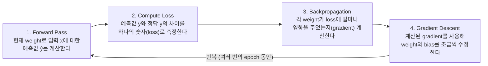
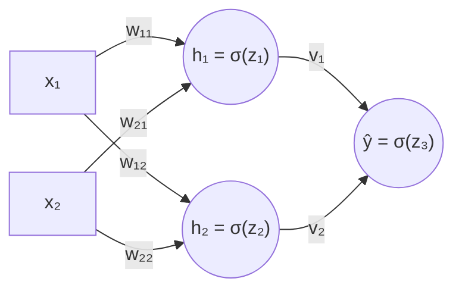
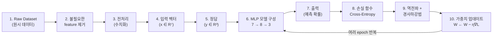

# 강의 05 — 비선형 모델과 MLP

> **최종 수정일:** 2026-10-08
>
> Data Mining: Practical Machine Learning Tools and Techniques, Witten and Frank - Ch 7, 10

> **학습 목표**:
> 1. 선형 모델의 한계를 설명하고, 여러 선형 경계와 비선형 activation을 조합한 MLP가 비선형 결정 영역을 만드는 원리를 설명할 수 있다
> 2. activation function이 없으면 층을 쌓아도 선형 함수에 머무는 이유를 식으로 보일 수 있다
> 3. forward pass, loss, backpropagation, gradient descent로 이어지는 MLP의 학습 과정을 설명하고 작은 예제를 직접 계산할 수 있다
> 4. chain rule로 출력층과 은닉층의 오차 δ를 유도하고, sigmoid의 미분 σ'(z) = σ(z)(1 − σ(z))를 이용해 정리할 수 있다
> 5. 이진 분류, 다중 분류, 회귀에 맞는 출력층과 손실함수를 고르고, softmax와 cross entropy의 관계를 설명할 수 있다
> 6. 원시 데이터를 MLP 입력으로 바꾸고 구조를 설계하는 과정과, 깊은 신경망의 feature 학습과 vanishing gradient 문제를 설명할 수 있다

---

## 목차

- [1. 선형 모델의 한계와 비선형 모델의 필요성](#1-선형-모델의-한계와-비선형-모델의-필요성)
  - [1.1 선형 모델과 그 한계](#11-선형-모델과-그-한계)
  - [1.2 여러 선형 경계의 조합](#12-여러-선형-경계의-조합)
- [2. 여러 선형 경계를 조합하는 MLP의 구조와 동작](#2-여러-선형-경계를-조합하는-mlp의-구조와-동작)
  - [2.1 세 개의 hidden unit이 만드는 삼각형 영역](#21-세-개의-hidden-unit이-만드는-삼각형-영역)
  - [2.2 새로운 입력값 예측](#22-새로운-입력값-예측)
- [3. Activation function이 필요한 이유](#3-activation-function이-필요한-이유)
- [4. MLP의 표현 능력과 복잡도](#4-mlp의-표현-능력과-복잡도)
  - [4.1 hidden unit 수와 결정 영역](#41-hidden-unit-수와-결정-영역)
  - [4.2 MLP의 복잡도와 overfitting](#42-mlp의-복잡도와-overfitting)
- [5. MLP는 어떻게 학습하는가](#5-mlp는-어떻게-학습하는가)
  - [5.1 이 많은 weight를 어떻게 정할까](#51-이-많은-weight를-어떻게-정할까)
  - [5.2 Forward pass와 loss](#52-forward-pass와-loss)
  - [5.3 Loss 함수: MSE와 Binary Cross Entropy](#53-loss-함수-mse와-binary-cross-entropy)
  - [5.4 Gradient descent로 weight 바꾸기](#54-gradient-descent로-weight-바꾸기)
- [6. Backpropagation](#6-backpropagation)
  - [6.1 왜 backpropagation이 필요한가](#61-왜-backpropagation이-필요한가)
  - [6.2 2-2-1 MLP에서의 backpropagation](#62-2-2-1-mlp에서의-backpropagation)
  - [6.3 일반적인 유도: 오차를 줄이는 방향 찾기](#63-일반적인-유도-오차를-줄이는-방향-찾기)
  - [6.4 출력층 weight의 gradient](#64-출력층-weight의-gradient)
  - [6.5 은닉층 weight의 gradient](#65-은닉층-weight의-gradient)
  - [6.6 sigmoid의 미분과 최종 학습 규칙](#66-sigmoid의-미분과-최종-학습-규칙)
  - [6.7 작은 예제로 보는 한 번의 학습](#67-작은-예제로-보는-한-번의-학습)
- [7. Perceptron의 한계에서 Backpropagation까지](#7-perceptron의-한계에서-backpropagation까지)
- [8. MLP의 Loss Landscape와 학습의 어려움](#8-mlp의-loss-landscape와-학습의-어려움)
- [9. MLP 구조 설계](#9-mlp-구조-설계)
- [10. 문제 유형에 따른 출력층과 손실함수](#10-문제-유형에-따른-출력층과-손실함수)
- [11. Softmax](#11-softmax)
  - [11.1 Sigmoid와 Softmax](#111-sigmoid와-softmax)
  - [11.2 Softmax와 Cross Entropy의 조합](#112-softmax와-cross-entropy의-조합)
  - [11.3 Sigmoid를 정규화하면 Softmax와 같은가](#113-sigmoid를-정규화하면-softmax와-같은가)
- [12. 예시 데이터셋을 MLP 문제로 바꾸기](#12-예시-데이터셋을-mlp-문제로-바꾸기)
  - [12.1 원시 데이터와 feature 분석](#121-원시-데이터와-feature-분석)
  - [12.2 전처리와 feature vector](#122-전처리와-feature-vector)
  - [12.3 MLP 구조 정하기와 전체 흐름](#123-mlp-구조-정하기와-전체-흐름)
- [13. Hidden unit과 hidden layer가 많아지면](#13-hidden-unit과-hidden-layer가-많아지면)
- [14. DNN (Deep Neural Network)](#14-dnn-deep-neural-network)
  - [14.1 Hidden layer가 만드는 새로운 feature space](#141-hidden-layer가-만드는-새로운-feature-space)
  - [14.2 깊게 만들면 더 강력하지 않을까](#142-깊게-만들면-더-강력하지-않을까)
  - [14.3 Vanishing gradient](#143-vanishing-gradient)
  - [14.4 Vanishing gradient를 줄이는 방법들](#144-vanishing-gradient를-줄이는-방법들)
  - [14.5 MLP에서 DNN으로](#145-mlp에서-dnn으로)
- [요약](#요약)
- [점검 문제](#점검-문제)

---

 

## 1. 선형 모델의 한계와 비선형 모델의 필요성

### 1.1 선형 모델과 그 한계

**선형 모델(Linear Model)** 은 입력 x의 선형 결합으로 출력을 계산하는 모델이다. 대표적인 예가 Linear Regression, Logistic Regression, Perceptron이다.

$$
z = \mathbf{w}^T\mathbf{x} + b = \sum_{i=1}^{d} w_i x_i + b
$$

결정 경계(decision boundary)는 wᵀx + b = 0이며, 입력 공간에서 하나의 직선(2차원) 또는 초평면(고차원)이다. 하나의 직선으로 두 class를 잘 구분할 수 있는 경우에는 선형 모델로 충분하다.

하지만 현실의 데이터는 항상 선형적으로 나누어지지 않는다. 선형 모델로는 구분할 수 없는 경우가 많다.

| 형태 | 데이터의 모양 | 필요한 경계 |
|:-----|:--------------|:------------|
| XOR 형태 | 같은 class가 대각선으로 엇갈려 있다. | 하나의 직선으로는 구분할 수 없다. |
| 원형 형태 | 한 class가 가운데, 다른 class가 바깥을 둘러싼다. | 직선이 아닌 곡선의 경계가 필요하다. |
| 복잡한 형태 | 두 class가 여러 덩어리로 섞여 있다. | 더 복잡한 경계가 필요하다. |

현실 세계의 데이터는 매우 다양한 형태의 분포와 패턴을 가지며, 선형 모델은 이러한 복잡한 패턴을 표현할 수 없다. 여러 개의 선형 경계를 조합하거나 비선형 변환을 사용하면 더 복잡한 결정 영역을 표현할 수 있으므로, **더 복잡한 결정 경계를 표현할 수 있는 비선형 모델(예: MLP)이 필요하다.**

> **핵심:** 선형 모델은 중요한 출발점이지만, 현실의 다양한 문제를 해결하기 위해서는 비선형 모델이 필요하다.

### 1.2 여러 선형 경계의 조합

하나의 perceptron은 하나의 선형 경계 wᵀx + b = 0을 만들고, 입력 공간을 하나의 직선(또는 초평면)으로 나눈다. 여러 개의 선형 경계를 조합하면 더 복잡한 모양의 결정 영역을 만들 수 있다.

| 경계의 수 | 만들 수 있는 영역 |
|:----------|:------------------|
| 1개 (직선) | 하나의 직선으로 두 영역을 나눈다. |
| 2개 (교차하는 직선) | 두 개의 직선으로 네 개의 영역을 만들 수 있다. |
| 여러 개 (다각형 영역) | 여러 개의 직선으로 삼각형 같은 영역을 표현할 수 있다. |
| 더 복잡한 영역 | 여러 개의 직선을 조합하면 임의의 복잡한 모양의 영역도 표현할 수 있다. |

그래서 **여러 perceptron의 출력을 조합하는 MLP(다층 퍼셉트론)** 를 사용한다. 여러 개의 선형 경계를 조합하면, 하나의 선형 모델로는 표현할 수 없는 비선형적인 결정 영역을 만들 수 있다. MLP는 여러 개의 선형 경계를 조합하여 복잡한 패턴을 표현하는 비선형 모델이다.

---

 

## 2. 여러 선형 경계를 조합하는 MLP의 구조와 동작

### 2.1 세 개의 hidden unit이 만드는 삼각형 영역

**문제 상황.** 2차원 평면에서 가운데 삼각형 부분에 class 1이 모여 있고, 바깥쪽은 class 0이다. 하나의 직선(선형 경계)으로는 이 데이터를 잘 구분할 수 없다.

**세 개의 선형 경계.** 각 hidden unit은 하나의 선형 perceptron으로, 하나의 선형 경계를 만든다. 활성화 함수로는 sigmoid를 사용한다.

$$
\begin{aligned}
h_1 &= \sigma(z_1), & z_1 &= 2x_1 - x_2 - 2.5 \\
h_2 &= \sigma(z_2), & z_2 &= -2x_1 - x_2 + 17.5 \\
h_3 &= \sigma(z_3), & z_3 &= x_2 - 2.5
\end{aligned}
\qquad\qquad \sigma(z) = \frac{1}{1 + e^{-z}}
$$

**MLP 구조(hidden unit 3개).** 입력층 x₁, x₂가 세 hidden unit h₁, h₂, h₃에 모두 연결되고, output layer가 세 hidden unit의 출력을 조합한다.

$$
z = 4h_1 + 4h_2 + 4h_3 - 10, \qquad \hat{y} = \sigma(z)
$$

*그림 1. 세 hidden unit의 경계 h1, h2, h3와 그 조합으로 만들어지는 삼각형 모양의 class 1 영역 (2쪽)*

세 경계의 안쪽(z₁ > 0, z₂ > 0, z₃ > 0)에서는 세 hidden unit이 모두 1에 가까워 z ≈ 4 × 3 − 10 = 2 > 0이 되고, 바깥에서는 하나 이상이 0에 가까워 z < 0이 된다. 즉 **각 hidden unit은 하나의 선형 경계를 만들고, output layer가 이를 조합하여 비선형 결정 영역을 만든다.**

### 2.2 새로운 입력값 예측

| | 예시 1: class 1인 점 (안쪽) | 예시 2: class 0인 점 (바깥쪽) |
|:--|:--|:--|
| 입력 | x* = (5.0, 4.0) | x* = (2.0, 3.5) |
| h₁ | z₁ = 2(5.0) − 4.0 − 2.5 = 3.5 → h₁ = σ(3.5) ≈ 0.97 | z₁ = 2(2.0) − 3.5 − 2.5 = −2.0 → h₁ = σ(−2.0) ≈ 0.12 |
| h₂ | z₂ = −2(5.0) − 4.0 + 17.5 = 3.5 → h₂ = σ(3.5) ≈ 0.97 | z₂ = −2(2.0) − 3.5 + 17.5 = 10.0 → h₂ = σ(10.0) ≈ 1.00 |
| h₃ | z₃ = 4.0 − 2.5 = 1.5 → h₃ = σ(1.5) ≈ 0.82 | z₃ = 3.5 − 2.5 = 1.0 → h₃ = σ(1.0) ≈ 0.73 |
| 출력 | z = 4h₁ + 4h₂ + 4h₃ − 10 ≈ 1.04 → ŷ = σ(1.04) ≈ 0.74 | z ≈ 4(0.12) + 4(1.00) + 4(0.73) − 10 ≈ −2.60 → ŷ = σ(−2.60) ≈ 0.07 |
| 결과 | 예측 class = 1 (임계값 0.5) | 예측 class = 0 (임계값 0.5) |

예시 2는 h₂와 h₃의 경계 안쪽에 있지만 h₁의 경계 밖에 있으므로 h₁ ≈ 0.12가 되어 출력이 0으로 분류된다.

---

 

## 3. Activation function이 필요한 이유

층을 여러 개 쌓는 것만으로는 비선형이 되지 않는다.

**활성화 함수가 없으면.** 여러 개의 선형층을 쌓아도 결국 하나의 선형 변환일 뿐이다. x → Linear(W₁, b₁) → Linear(W₂, b₂) → y라면

$$
\begin{aligned}
h &= W_1 x + b_1 \\
y &= W_2 h + b_2 = W_2(W_1 x + b_1) + b_2 = (W_2 W_1)x + (W_2 b_1 + b_2) = W'x + b'
\end{aligned}
$$

이다. 결국 하나의 선형 함수와 같으며, 표현 가능한 경계는 직선 하나이다. 하나의 직선으로만 데이터를 구분할 수 있다.

**활성화 함수가 있으면.** 선형 변환 뒤에 비선형 활성화 함수를 적용하면 비선형 함수를 만들 수 있다. x → Linear(W₁, b₁) → Sigmoid σ → Linear(W₂, b₂) → Sigmoid σ → y라면

$$
h(x) = \text{sigmoid}(W_1 x + b_1), \qquad y = \text{sigmoid}(W_2 h(x) + b_2) = \text{sigmoid}\bigl(W_2\,\text{sigmoid}(W_1 x + b_1) + b_2\bigr)
$$

이다. sigmoid 함수가 중첩(nested)된 하나의 함수이며, MLP는 y(h(x)) 형태의 **합성함수(composite function)** 이다. 이 합성함수는 비선형 함수이므로, 여러 개의 직선 경계가 모여 비선형적인 결정 영역을 만든다.

| | Activation 없음 | Activation 있음 (sigmoid) |
|:--|:--|:--|
| 모델 구조 | 선형층의 반복 (Linear → Linear → …) | 선형층 + 활성화 함수의 반복 |
| 전체 함수의 형태 | 선형 함수 (y = W'x + b') | 비선형 합성함수 (sigmoid가 여러 번 중첩된 하나의 함수) |
| 결정 경계 | 직선 경계 (하나의 직선) | 복잡한 결정 영역 (여러 선형 경계의 조합) |
| 표현력 | 표현력 제한 (단순한 패턴만 가능) | MLP 가능 (다양하고 복잡한 패턴 표현 가능) |

> **핵심:** Activation function이 MLP에 비선형성을 부여한다. 따라서 MLP는 단순한 선형 모델의 반복이 아니라, sigmoid가 중첩된 하나의 비선형 함수이다.

---

 

## 4. MLP의 표현 능력과 복잡도

### 4.1 hidden unit 수와 결정 영역

여러 개의 단순한 선형 경계가 모이면 아주 복잡한 모양도 만들 수 있다.

- **hidden unit이 적을 때:** 적은 수의 hidden unit으로도 비선형 결정 영역을 만들 수 있다. 3개의 hidden unit이 각각 하나의 선형 경계(직선 경계 1, 2, 3)를 만들고, 이들이 조합되어 삼각형 모양의 비선형 결정 영역이 만들어진다.
- **hidden unit을 더 많이 쓰면:** hidden unit의 수가 많아질수록 더 복잡한 결정 경계를 만들 수 있다. 3개이면 삼각형, 6개이면 육각형, 많은 hidden unit이면 원에 가까운 부드러운 결정 영역이 된다. 많은 hidden unit을 사용하면 여러 개의 직선 경계를 조합하여 곡선과 같은 복잡한 모양도 근사할 수 있다.
- **함수 근사의 관점:** MLP는 비선형 함수를 근사하는 함수 근사기이다. 목표 함수 y = g(x)가 물결 모양이라면, hidden unit이 적은 MLP는 대략적으로만 따라가고 hidden unit이 많은 MLP는 목표 함수에 더 가깝게 근사한다.

$$
\hat{y} = f(x) = \sigma\bigl(W_2\,\sigma(W_1 x + b_1) + b_2\bigr)
$$

> **핵심 메시지**
> 1. 각 hidden unit은 하나의 선형 경계를 만든다.
> 2. 여러 hidden unit을 조합하면 비선형 결정 영역이 만들어진다.
> 3. hidden unit 수가 많아질수록 더 복잡한 함수를 표현할 수 있다.
> 4. 충분한 hidden unit과 비선형 activation function이 있으면, MLP는 매우 다양한 연속 함수를 근사할 수 있다.
>
> **Universal Approximation:** MLP는 충분히 많은 hidden unit이 있으면 연속적인 함수는 거의 모두 근사할 수 있는 강력한 모델이다. MLP는 여러 개의 단순한 선형 경계를 비선형 activation과 함께 조합하여, 매우 복잡한 비선형 함수를 근사할 수 있다.

### 4.2 MLP의 복잡도와 overfitting

hidden unit이 많다고 항상 좋은 것은 아니다.

| 경우 | hidden unit 수 | 결과 |
|:-----|:---------------|:-----|
| 너무 적을 때 (Underfitting) | 적음 | 경계가 단순해서, 모델의 표현력이 부족하여 데이터 구조를 충분히 설명하지 못한다. |
| 적절한 복잡도 (Good fit) | 적절 | 적절한 경계로 데이터의 전반적인 구조를 잘 설명한다. |
| 너무 많을 때 (Overfitting) | 많음 | 너무 복잡한 경계로 훈련 데이터에 너무 맞추어 일반화 성능이 떨어질 수 있다. |

**모델 복잡도와 일반화.** 복잡도가 너무 낮아도, 너무 높아도 문제가 된다. Model Complexity를 가로축, Error를 세로축으로 놓으면 training error는 복잡도가 커질수록 계속 줄어들지만, validation/test error는 U자 모양으로 줄었다가 다시 커진다. 그 최저점이 적절한 복잡도이다. 복잡도가 너무 낮으면(underfitting) 에러가 높고, 너무 높으면(overfitting) 일반화 에러가 높다.

**어떻게 줄일까?** 적절한 일반화를 위해 다음과 같은 방법을 사용할 수 있다.

| 방법 | 설명 |
|:-----|:-----|
| 더 많은 데이터 | 더 다양한 데이터를 모아 일반화 성능을 향상한다. |
| Regularization (L2) | 가중치가 너무 커지지 않도록 제한한다. |
| Dropout | 일부 뉴런을 랜덤하게 꺼서 과적합을 방지한다. |
| Early Stopping | 검증 성능이 나빠지기 전에 훈련을 멈춘다. |
| 적절한 hidden unit / layer 선택 | 문제에 맞는 모델 크기를 선택한다. |

> **핵심:** hidden unit이 많아질수록 표현력은 커지지만, 필요 이상으로 복잡해지면 overfitting이 발생할 수 있다. 따라서 적절한 모델 복잡도와 regularization이 중요하다.

---

 

## 5. MLP는 어떻게 학습하는가

### 5.1 이 많은 weight를 어떻게 정할까

지금까지 MLP가 어떤 함수를 표현할 수 있는지 보았다. 이제 남은 질문은 **"이 수많은 weight와 bias는 어떻게 정하는가?"** 이다.

입력층 2개, 은닉층 3 units, 출력층 1 unit인 2-3-1 MLP만 해도 파라미터가 많다.

| 파라미터 | 개수 |
|:---------|:----:|
| 입력 → 은닉층의 weight w⁽¹⁾ᵢⱼ | 2 × 3 = 6개 |
| 은닉층의 bias b⁽¹⁾ⱼ | 3개 |
| 은닉층 → 출력층의 weight w⁽²⁾ⱼ | 3개 |
| 출력층의 bias b⁽²⁾ | 1개 |
| 합계 | **13개** |

이 예시만 해도 13개이고, 실제 MLP는 훨씬 더 많은 weight와 bias를 가진다. 이 많은 값을 사람이 하나하나 정하는 것은 불가능하므로, **데이터를 사용해서 자동으로 학습** 해야 한다.

**MLP 학습의 전체 과정.** 데이터를 사용해서 예측과 정답의 차이를 줄이도록 weight와 bias를 반복적으로 수정한다.

데이터를 사용해서 loss를 줄이도록 weight를 반복적으로 업데이트하는 것, 이것이 MLP의 학습이다.

### 5.2 Forward pass와 loss

데이터를 입력했을 때 예측값을 계산하고, 정답과의 차이를 loss로 측정한다. 예제로 2-2-1 MLP(이진 분류)를 보자. 입력은 x₁ = 5, x₂ = 4이고, 은닉층에 2 units, 출력층에 1 unit이 있다.

**Forward pass(예측값 계산).**

1. 은닉층의 입력(가중합): z₁ = w₁₁x₁ + w₂₁x₂ + b₁, z₂ = w₁₂x₁ + w₂₂x₂ + b₂
2. 은닉층의 출력(활성화 함수): h₁ = σ(z₁), h₂ = σ(z₂)
3. 출력층의 입력(가중합): z = w₁h₁ + w₂h₂ + b
4. 출력층의 출력(예측값): ŷ = σ(z)는 0과 1 사이의 값이며, class 1일 확률이다.

**Loss 계산(이진 분류).** Binary Cross-Entropy Loss를 사용한다.

$$
L = -\bigl[y \log(\hat{y}) + (1 - y)\log(1 - \hat{y})\bigr]
$$

| | 예 1) 정답이 1인 경우 | 예 2) 정답이 0인 경우 |
|:--|:--|:--|
| 값 | y = 1, ŷ = 0.74 | y = 0, ŷ = 0.07 |
| Loss | L = −log(0.74) ≈ 0.30 | L = −log(1 − 0.07) ≈ 0.073 |
| 해석 | 예측이 정답에 가까우므로 loss가 작다. | 역시 예측이 정답에 가까우므로 loss가 작다. |

**좋은 예측과 나쁜 예측.** ŷ ≈ y인 좋은 예측에서는 loss가 작고, ŷ가 정답과 반대인 나쁜 예측에서는 loss가 커진다. 정답에 가까울수록 loss가 작고, 정답에서 멀어질수록 loss가 커진다. Loss는 예측이 얼마나 틀렸는지를 나타내는 **하나의 숫자** 이며, 이 값을 **최소화** 하는 방향으로 weight와 bias를 학습한다.

### 5.3 Loss 함수: MSE와 Binary Cross Entropy

이진 분류에서 MSE를 사용해도 되지만, 일반적으로는 BCE를 사용한다. 입력 x에 대해 모델(MLP)이 z를 계산하고 ŷ = σ(z)를 출력한다. ŷ는 0과 1 사이의 값으로 class 1일 확률이며, 정답은 y ∈ {0, 1}이다.

| | 1) MSE (Mean Squared Error) | 2) Binary Cross-Entropy (BCE) |
|:--|:--|:--|
| 식 | L_MSE = ½(y − ŷ)² | L_BCE = −[y log(ŷ) + (1 − y)log(1 − ŷ)] |
| 특징 | 회귀에서 주로 사용하는 손실함수이며, 이진 분류에도 사용할 수 있다. | 이진 분류에서 일반적으로 사용하며, Bernoulli 확률모델의 likelihood와 일치한다(확률적 해석 가능). |

**Loss 값의 비교 (y = 1인 경우).** 정답이 y = 1이라 하자. MSE를 L_MSE = ½(y − ŷ)²로 정의했다면 L_MSE = ½(1 − ŷ)²이다. 따라서 ŷ = 0일 때 최대값은 L_MSE = ½ = 0.5이고, ŷ = 1일 때 L_MSE = 0이다. 즉 MSE 곡선은 정확히 0.5에서 시작해서 0으로 내려간다. 반면 BCE는 L_BCE = −log(ŷ) (y = 1)이므로, ŷ → 0이면 −log(ŷ) → ∞이다. 즉 BCE는 어떤 유한한 값에서 시작하는 것이 아니라 무한대로 발산한다.

*그림 2. 정답이 y = 1일 때 예측값 ŷ에 따른 MSE와 BCE의 loss 곡선 (7쪽)*

| ŷ | MSE ½(1 − ŷ)² | BCE −ln ŷ |
|:-:|:-------------:|:---------:|
| 0.01 | 0.490 | 4.605 |
| 0.1 | 0.405 | 2.303 |
| 0.135 | 0.374 | 약 2.00 |
| 0.5 | 0.125 | 0.693 |
| 0.9 | 0.005 | 0.105 |
| 0.99 | 0.00005 | 0.010 |

예를 들어 그래프를 ŷ = 0.135 부근에서부터 그리면 BCE가 약 2에서 시작하는 것처럼 보이지만, 실제로는 ŷ → 0에서 무한대로 커진다. 두 loss의 가장 큰 차이는 이것이다. **MSE는 틀려도 loss가 최대 0.5인 데 반해, BCE는 자신 있게 틀릴수록 loss가 매우 크게 증가한다.** ŷ가 1에 가까울수록 두 loss 모두 작아지지만, BCE는 0에 가까운 예측에 대해 훨씬 큰 손실을 준다.

**Gradient(z에 대한 미분)의 비교.**

| | 1) MSE + sigmoid | 2) BCE + sigmoid |
|:--|:--|:--|
| Loss | L = ½(y − ŷ)², ŷ = σ(z) | L = −[y log(ŷ) + (1 − y)log(1 − ŷ)] |
| ∂L/∂z | (ŷ − y) × ŷ(1 − ŷ) | ŷ − y |
| 특징 | sigmoid의 미분이 한 번 더 곱해진다. ŷ가 0이나 1에 가까우면 ŷ(1 − ŷ) ≈ 0이 되어 gradient가 매우 작아질 수 있다. | 아주 간단한 형태이다. 예측이 많이 틀려도 gradient가 작아지지 않고, 크게 수정하는 방향으로 학습이 잘 된다. |

**수치 예시 (y = 1인 경우).**

| 예측값 ŷ | 0.01 (매우 틀림) | 0.5 | 0.7 | 0.99 (거의 맞음) |
|:---------|:----------------:|:---:|:---:|:----------------:|
| MSE Loss | 0.490 | 0.125 | 0.045 | 0.00005 |
| BCE Loss | 4.605 | 0.693 | 0.357 | 0.010 |
| MSE의 ∂L/∂z | −0.0098 | −0.125 | −0.063 | −0.0001 |
| BCE의 ∂L/∂z | −0.99 | −0.5 | −0.3 | −0.01 |

ŷ = 0.01처럼 완전히 틀렸는데도 MSE의 gradient는 −0.0098로 매우 작다. 반면 BCE의 gradient는 −0.99로, 크게 틀렸으므로 크게 고치라는 신호를 준다.

> **정리**
> - MSE도 사용할 수 있지만, 이진 분류에서는 보통 BCE를 사용한다.
> - BCE는 확률모델과 자연스럽게 대응하고, 학습 시 더 효과적인 gradient를 제공한다.
> - 특히 sigmoid 출력과 함께 사용할 때 BCE의 gradient는 ∂L/∂z = ŷ − y로 매우 간단하다.
> - 따라서 실무와 대부분의 딥러닝 모델에서는 이진 분류에 Sigmoid + Binary Cross-Entropy를 사용한다.
>
> Loss 함수의 선택은 단순한 수식의 문제가 아니라, 학습의 효율성과 확률적 해석까지 고려한 중요한 설계 결정이다.

### 5.4 Gradient descent로 weight 바꾸기

현재 가중치에서 loss의 기울기(gradient)를 계산하고, 기울기의 반대 방향으로 가중치를 조금씩 수정한다.

**가중치 하나의 경우(1차원 예시).** Loss L(w)가 U자 모양이라 하자. 기울기(gradient)는 현재 위치에서 loss가 어느 방향으로 얼마나 변하는지를 알려준다. 기울기 < 0이면 w를 증가시키고(오른쪽으로), 기울기 > 0이면 w를 감소시키며(왼쪽으로), 기울기 = 0인 곳이 최솟값이다.

**Gradient descent 업데이트 규칙.**

$$
w_{\text{new}} = w_{\text{old}} - \eta \frac{\partial L}{\partial w}
$$

η는 learning rate(얼마나 크게 이동할지), ∂L/∂w는 기울기(어느 방향으로 갈지)이다.

- 기울기의 반대 방향으로 가중치를 조금씩 수정하면 loss가 줄어든다.
- η가 너무 크면 최솟값을 지나쳐서 발산할 수 있다.
- η가 너무 작으면 수렴이 매우 느리다.
- 모든 가중치에 대해 같은 규칙을 적용한다.

**신경망(MLP)의 학습 과정(전체 흐름).** 입력 x → MLP(가중치 W) → 예측값 ŷ = σ(z) → Loss 계산 L(ŷ, y)(BCE) → 각 가중치의 기울기 ∂L/∂W 계산(Backpropagation) → 가중치 업데이트 W ← W − η∇L. 이 과정을 여러 번 반복하면 loss가 점점 작아진다.

**이진 분류에서의 loss 함수.** L_BCE = −[y log(ŷ) + (1 − y)log(1 − ŷ)]에서 y ∈ {0, 1}은 정답(class 1일 확률), ŷ = σ(z)는 모델이 예측한 class 1의 확률이다. BCE는 Bernoulli 확률모델의 음의 로그우도(NLL)와 같으며, 예측이 많이 틀릴수록(loss가 크다) 크게 벌점을 준다. 확률을 다루는 이진 분류 문제에서 자연스럽고 효과적인 loss이다. y = 1일 때 loss 곡선을 보면, ŷ → 0이면 loss → ∞(자신 있게 틀리면 매우 큰 벌점)이고, ŷ → 1이면 loss → 0(정답에 가까우면 loss가 0에 수렴)이다.

**MLP의 loss는 2차 방정식인가?** 아니다. MLP의 loss 함수(BCE)는 가중치들에 대해 일반적으로 **매우 복잡한 비선형 함수** 이다. 따라서 2차 방정식처럼 단순한 포물선 형태가 아니며, 여러 개의 local minima가 존재할 수 있다. 하지만 실제로는 좋은 해 근처에 많은 해들이 존재하여, gradient descent로도 충분히 좋은 해를 찾을 수 있다. MLP의 loss surface는 복잡하지만, 좋은 성능을 내는 해가 여러 곳에 존재하므로 gradient descent로도 충분히 좋은 해를 찾을 수 있다.

---

 

## 6. Backpropagation

### 6.1 왜 backpropagation이 필요한가

신경망의 모든 가중치를 학습하려면, 각 가중치가 loss에 미치는 영향을 계산해야 한다. 특히 hidden layer의 가중치는 loss와 직접 연결되어 있지 않아서 계산이 어렵다.

1. **먼저, 가중치 업데이트 식.** w_new = w_old − η(∂L/∂w)이다. η는 learning rate(학습률), ∂L/∂w는 이 가중치가 loss에 얼마나 영향을 주는지 나타내는 기울기이다. 학습이란 결국 **loss를 줄이는 방향으로 weight를 바꾸는 것** 이다(gradient의 반대 방향으로 이동, 손실이 줄어드는 방향).
2. **출력층의 weight는 비교적 쉽다.** 출력층 weight vᵢ는 hᵢ → ŷ → L로 직접 연결되어 있어서 비교적 계산이 쉽다. 예를 들어 v₁의 경우 h₁이 변하면 ŷ가 변하고, 이로 인해 loss가 바로 변하므로 ∂L/∂v₁을 비교적 직접적으로 계산할 수 있다. 경로가 짧고 직접적이다.
3. **hidden layer의 weight는 계산이 어렵다.** loss는 오직 최종 출력값 ŷ에서만 계산된다. 하지만 w₁₁은 최종 출력 ŷ가 아니라 h₁에 직접적인 영향을 준다. 즉 hidden layer의 가중치는 loss에 간접적으로 영향을 준다(w₁₁ → h₁ → ŷ → L). 그래서 "최종 오차 중에서 이 hidden weight가 얼마나 책임이 있는가?"라는 문제(**credit assignment problem**)가 생긴다. 여러 단계를 거쳐서 영향을 주기 때문에 ∂L/∂w₁₁을 계산하기가 어렵다.
4. **그래서 backpropagation이 필요하다.** Forward pass(순전파)는 입력에서 출력까지 값을 계산한다(x → h → ŷ → L, 예측값 계산). Backward pass(역전파)는 오차의 영향을 뒤로 전달하여(L → ŷ → h → w) 각 가중치의 gradient를 계산한다. 연쇄법칙(chain rule)에 의해 hidden layer의 weight도 여러 단계를 거쳐 loss에 미치는 영향을 계산할 수 있다.

$$
\frac{\partial L}{\partial w_{11}} = \frac{\partial L}{\partial \hat{y}} \cdot \frac{\partial \hat{y}}{\partial z_3} \cdot \frac{\partial z_3}{\partial h_1} \cdot \frac{\partial h_1}{\partial z_1} \cdot \frac{\partial z_1}{\partial w_{11}}
$$

오차를 뒤로 전달하면 모든 가중치의 gradient를 구할 수 있다. 가중치 업데이트 식 자체는 단순하지만, hidden layer의 weight는 loss와 직접 연결되어 있지 않기 때문에 backpropagation이 필요하다.

### 6.2 2-2-1 MLP에서의 backpropagation

출력층에서 계산된 오차를 뒤로 전달하여, 각 weight가 loss에 얼마나 책임이 있는지 계산한다. 신경망은 이렇게 계산한 오차를 이용해 weight를 수정하며 학습한다.

**MLP 구조(2-2-1).** 입력층(x₁, x₂), 은닉층(h₁, h₂), 출력층(ŷ)으로 이루어진다. 순전파(Forward)는 왼쪽 → 오른쪽(입력 → 출력, 예측), 역전파(Backward)는 오른쪽 → 왼쪽(오차 전달, 학습)이다.

**Forward pass(순전파).** 먼저 순전파로 예측값 ŷ와 loss를 계산한다. 입력으로부터 예측값 ŷ를 계산하고, 실제 정답 y와의 차이인 loss를 구한다.

1. z₁ = w₁₁x₁ + w₂₁x₂ + b₁
2. h₁ = σ(z₁)
3. z₂ = w₁₂x₁ + w₂₂x₂ + b₂
4. h₂ = σ(z₂)
5. z₃ = v₁h₁ + v₂h₂ + b₃
6. ŷ = σ(z₃)
7. BCE loss: L = −[y log(ŷ) + (1 − y)log(1 − ŷ)]

**Backward pass(역전파): 오차항(delta) 계산.** 출력층의 오차가 hidden layer로 전달된다.

$$
\delta_3 = \frac{\partial L}{\partial z_3} = \hat{y} - y
$$

이것이 출력층 오차이다(BCE + sigmoid). BCE와 sigmoid의 조합에서는 계산이 매우 간단해진다. 은닉층 오차는 연쇄 법칙으로 구한다.

$$
\delta_1 = \frac{\partial L}{\partial z_1} = v_1 \cdot \delta_3 \cdot h_1(1 - h_1), \qquad \delta_2 = \frac{\partial L}{\partial z_2} = v_2 \cdot \delta_3 \cdot h_2(1 - h_2)
$$

**Gradients(기울기) 계산과 weight 업데이트.** 각 weight의 gradient는 연쇄 법칙에 의해 다음과 같다.

| 출력층 weight | 은닉층 weight |
|:--------------|:--------------|
| ∂L/∂v₁ = δ₃h₁ | ∂L/∂w₁₁ = δ₁x₁ |
| ∂L/∂v₂ = δ₃h₂ | ∂L/∂w₂₁ = δ₁x₂ |
| ∂L/∂b₃ = δ₃ | ∂L/∂w₁₂ = δ₂x₁ |
| | ∂L/∂w₂₂ = δ₂x₂ |

업데이트 규칙(gradient descent)은 w ← w − η(∂L/∂w)이며, η는 learning rate로 보통 작은 값이다. bias도 동일한 방식으로 업데이트한다. 계산된 gradient만큼 weight를 조금씩 조정한다.

> **전체 과정 요약:** ① 순전파로 ŷ와 loss를 계산한다 → ② 출력층 오차 δ₃ = ŷ − y를 계산한다 → ③ hidden layer 오차 δ₁, δ₂를 계산한다 → ④ 각 weight의 gradient를 구해 gradient descent로 업데이트한다.
>
> **Backpropagation은 최종 오차를 각 weight의 책임으로 나누어 계산하는 알고리즘이다.**

### 6.3 일반적인 유도: 오차를 줄이는 방향 찾기

이제 층의 수와 unit 수가 일반적인 경우의 학습 규칙을 유도해 보자. 입력층 i(x₁, x₂, …), 은닉층 j(h₁, h₂, …), 출력층 k(y₁, y₂, …)로 이루어진 신경망에서, 입력에서 출력으로 값을 계산하는 것이 **feed forward**, 출력의 오차를 거꾸로 전달하며 weight를 고치는 것이 **back propagation** 이다.

**신경망을 함수로 보기.** Neural Network(NN)를 함수로 생각해 보면 Y = f(X, W)라 할 수 있다. 함수 f(X, W)가 MLP이다. Y는 output vector, X는 input vector, W는 weight vector이며, 이 함수에서는 W의 값에 따라서 다른 Y가 나온다. 우리의 목적은 Y = f(X, W)에서 T − Y = 0이 되게 하는(즉 Y가 목표값 T와 같게 나오게 하는) W를 구하는 것이다. 이것이 **backpropagation 알고리즘(역전파 알고리즘)** 이다.

**오차 함수.** 어떤 W가 주어졌을 때의 error e(W)를 다음과 같이 정의하자(출력 unit이 두 개인 경우).

$$
e(W) = \frac{1}{2}\lVert T - y(W) \rVert^2 = \frac{1}{2}\sum_{k=1}^{2}\bigl(T_k - y_k(W)\bigr)^2
$$

우리는 e(W)를 0으로 만드는, 즉 e(W) = 0인 W를 찾고 싶다. 그것이 어렵다면 최소한 이 식을 어떤 허용 오차 이내로 작게 만들고 싶다.

**미분이 0인 점과 반복적 접근.** 미적분에서 배웠듯이, 함수 f(x)의 도함수(derivative)를 0으로 두면 극값을 찾을 수 있다. f'(x) = 0인 점은 극소 또는 극대이며, "Take the derivative and set it equal to zero"가 minimum 또는 maximum point를 찾는 기본 방법이다. 오차 곡선에서도 ΔE/ΔW = 0인 곳의 W 값을 찾으면 된다.

그러나 신경망의 오차 함수는 너무 복잡해서 이 방법을 바로 적용하지 못한다. 또한 오차 곡선에는 여러 개의 골짜기가 있어서, 어떤 W(예: X₁)에서는 **local minima**, 다른 W(예: X₂)에서는 **global minima** 가 나타날 수 있다. 그래서 **반복적 접근(iterative approach)** 을 이용한다. 즉 임의의 점에서 출발하여, 반복할 때마다 아래로 내려가는 방향으로 이동한다.

도함수의 음수 방향은 아래쪽을 가리키므로, 매 반복마다 음의 도함수 방향으로 조금씩 움직여 간다. 그래서 업데이트 식에 − 부호가 붙는다. 벡터 함수에서는 이 도함수를 **gradient** 라 부르고, 이러한 반복적인 절차를 **gradient descent(혹은 steepest descent)** 라 부른다. 이 절차를 정리하면 다음과 같다.

$$
W = W + \Delta W, \qquad \Delta W = -\eta \frac{\partial E}{\partial W}
$$

즉 error를 줄이는 방향으로 W의 변화량이 계산된다. 이제 각 층의 weight에 대해 ∂E/∂W를 구하면 된다.

**표기.** 이후의 유도에서 쓰는 기호는 다음과 같다.

| 기호 | 의미 |
|:-----|:-----|
| xᵢ, hⱼ, y_k | 입력층 unit i의 입력, 은닉층 unit j의 출력, 출력층 unit k의 출력 |
| W_ji, W_kj | 입력 i → 은닉 j의 weight, 은닉 j → 출력 k의 weight |
| net_j = Σᵢ W_ji xᵢ, net_k = Σⱼ W_kj hⱼ | 각 unit의 가중합(net input) |
| F | 활성화 함수. hⱼ = F(net_j), y_k = F(net_k) |
| T_k | 출력 unit k의 목표값(target) |
| E = ½Σ_k (T_k − y_k)² | 오차 함수 |

하나의 unit은 입력 xᵢ와 weight wᵢ의 가중합 net = Σxw에 활성화 함수를 적용해 y = F(Σᵢ xᵢwᵢ) = F(net)를 출력한다. bias는 항상 −1(또는 1)인 입력에 붙은 weight w₀로 볼 수 있다.

### 6.4 출력층 weight의 gradient

출력층 unit k로 들어가는 weight W_kj에 대해 연쇄 법칙을 적용한다.

$$
\frac{\partial E}{\partial W_{kj}} = \frac{\partial E}{\partial y_k} \cdot \frac{\partial y_k}{\partial W_{kj}}
$$

첫 번째 항은 오차 함수를 출력 y_k로 미분한 것이다. 특정한 k에 대해서 미분했으므로 Σ는 사라진다.

$$
\frac{\partial E}{\partial y_k} = \frac{\partial \left(\frac{1}{2}\sum_k (T_k - y_k)^2\right)}{\partial y_k} = \frac{1}{2} \cdot 2(T_k - y_k)(-1) = -(T_k - y_k)
$$

두 번째 항은 y_k = F(net_k), net_k = Σⱼ W_kj hⱼ이므로 다음과 같다. 특정한 W_kj에 대해 미분했으므로 Σ가 빠진다.

$$
\frac{\partial y_k}{\partial W_{kj}} = \frac{\partial y_k}{\partial net_k} \cdot \frac{\partial net_k}{\partial W_{kj}} = \frac{\partial F(net_k)}{\partial net_k} \cdot \frac{\partial \sum_j W_{kj} h_j}{\partial W_{kj}} = F'(net_k) \cdot h_j
$$

따라서 다음과 같다.

$$
\frac{\partial E}{\partial W_{kj}} = -(T_k - y_k) \cdot F'(net_k) \cdot h_j = -\delta_k h_j, \qquad \delta_k = (T_k - y_k)F'(net_k)
$$

$$
\Delta W_{kj} = -\eta \frac{\partial E}{\partial W_{kj}} = \eta (T_k - y_k)F'(net_k)\,h_j = \eta\,\delta_k h_j
$$

### 6.5 은닉층 weight의 gradient

은닉층 unit j로 들어가는 weight W_ji는 오차에 직접 연결되어 있지 않다. W_ji는 hⱼ를 바꾸고, hⱼ는 모든 출력 unit y_k에 영향을 준다. 그래서 연쇄 법칙을 두 단계로 적용한다.

$$
\frac{\partial E}{\partial W_{ji}} = \frac{\partial E}{\partial h_j} \cdot \frac{\partial h_j}{\partial W_{ji}}
$$

먼저 hⱼ에 대한 미분은 hⱼ가 영향을 주는 모든 출력 unit k에 대해 더해야 한다.

$$
\frac{\partial E}{\partial h_j} = \sum_k \frac{\partial E}{\partial y_k} \cdot \frac{\partial y_k}{\partial h_j}
$$

여기서 ∂y_k/∂hⱼ는 다음과 같다.

$$
\frac{\partial y_k}{\partial h_j} = \frac{\partial F(net_k)}{\partial net_k} \cdot \frac{\partial net_k}{\partial h_j} = \frac{\partial F(net_k)}{\partial net_k} \cdot \frac{\partial \sum_j W_{kj} h_j}{\partial h_j} = F'(net_k) \cdot W_{kj}
$$

그리고 ∂E/∂y_k는 6.4절에서 −(T_k − y_k)였으므로

$$
\frac{\partial E}{\partial h_j} = \sum_k \frac{\partial E}{\partial y_k} \cdot \frac{\partial y_k}{\partial h_j} = -\sum_k (T_k - y_k)F'(net_k)W_{kj}
$$

가 된다. 다음으로 hⱼ = F(net_j), net_j = Σᵢ W_ji xᵢ이므로

$$
\frac{\partial h_j}{\partial W_{ji}} = \frac{\partial h_j}{\partial net_j} \cdot \frac{\partial net_j}{\partial W_{ji}} = \frac{\partial F(net_j)}{\partial net_j} \cdot \frac{\partial \sum_i W_{ji} x_i}{\partial W_{ji}} = F'(net_j) \cdot x_i
$$

이다. 두 결과를 합치면 다음과 같다.

$$
\begin{aligned}
\frac{\partial E}{\partial W_{ji}} = \frac{\partial E}{\partial h_j} \cdot \frac{\partial h_j}{\partial W_{ji}}
&= -\sum_k (T_k - y_k)F'(net_k)W_{kj} \cdot F'(net_j) \cdot x_i \\
&= -\sum_k \delta_k W_{kj} \cdot F'(net_j) \cdot x_i \\
&= -\delta_j \cdot x_i
\end{aligned}
\qquad\qquad
\delta_j = F'(net_j)\sum_k \delta_k W_{kj}
$$

즉 은닉 unit의 오차 δⱼ는 그 unit이 연결된 출력 unit들의 오차 δ_k를 weight W_kj로 가중하여 거꾸로 모은 값이다. 이것이 "오차를 뒤로 전달한다"는 말의 정확한 의미이다.

### 6.6 sigmoid의 미분과 최종 학습 규칙

이제 식을 더 간단하게 만들기 위하여 F'(net)을 구해 보자. F(net)이 sigmoid 함수라고 한다면 다음과 같다.

$$
\begin{aligned}
F'(net) = \frac{\partial F(net)}{\partial net} &= \left(\frac{1}{1 + e^{-net}}\right)' = \frac{1'(1 + e^{-net}) - 1(1 + e^{-net})'}{(1 + e^{-net})^2} = \frac{0 - (1 + e^{-net})'}{(1 + e^{-net})^2} = \frac{0 - (0 - e^{-net})}{(1 + e^{-net})^2} \\
&= \frac{e^{-net}}{(1 + e^{-net})^2} = \frac{(1 + e^{-net}) - 1}{(1 + e^{-net})^2} = \frac{\frac{1}{F(net)} - 1}{\frac{1}{F(net)^2}} \\
&= F(net) - F(net)^2 = F(net)\bigl(1 - F(net)\bigr)
\end{aligned}
$$

여기서 1 + e^(−net) = 1/F(net)을 이용했다. 따라서 F가 sigmoid일 때에는 sigmoid의 미분을 그 출력값만으로 쓸 수 있다. y_k = F(net_k), hⱼ = F(net_j)이므로 두 오차항은 다음과 같이 간단해진다.

$$
\delta_k = (T_k - y_k)F'(net_k) = (T_k - y_k)\,y_k' = (T_k - y_k) \cdot y_k \cdot (1 - y_k)
$$

$$
\delta_j = F'(net_j)\sum_k \delta_k W_{kj} = h_j(1 - h_j) \cdot \sum_k \delta_k W_{kj}
$$

**최종 학습 규칙(backpropagation learning).** 학습률을 r(= η)이라 하면, 출력층 weight와 은닉층 weight를 다음과 같이 반복해서 수정한다.

| 층 | 오차항 | weight 수정 |
|:---|:-------|:------------|
| 출력층 k | δ_k = y_k(1 − y_k)(T_k − y_k) | W_kj = W_kj + r × δ_k × hⱼ |
| 은닉층 j | δⱼ = hⱼ(1 − hⱼ) Σ_k δ_k W_kj | W_ji = W_ji + r × δⱼ × xᵢ |

출력층 weight의 수정량을 쓰면 ΔW_kj = η(T_k − y_k) × Sig(net_k)(1 − Sig(net_k)) × hⱼ이며, η는 보통 0.1처럼 작은 값을 쓴다. 이 계산을 매 데이터마다 반복하는 것이 backpropagation 학습이다.

> **참고:** 6.2절의 BCE + sigmoid에서는 출력층 오차가 δ₃ = ∂L/∂z₃ = ŷ − y로, sigmoid의 미분 ŷ(1 − ŷ)이 곱해지지 않는다. 또 6.2절은 δ를 ∂L/∂z로 정의해 업데이트에서 빼고(w ← w − ηδx), 이 절은 δ를 (T − y)F'(net)로 정의해 더한다(W ← W + rδx). 부호를 정의하는 방식만 다를 뿐 같은 방향으로 수정한다.

### 6.7 작은 예제로 보는 한 번의 학습

하나의 데이터로 신경망이 어떻게 학습되는지 직접 계산해 보자.

**1. 학습 데이터.** 4개의 데이터 중 첫 번째 샘플 (x₁, x₂, y) = (1.0, 0.5, 1)을 선택하여 한 번의 학습을 진행한다.

| x₁ | x₂ | y |
|:--:|:--:|:-:|
| **1.0** | **0.5** | **1** |
| 0.2 | 0.1 | 0 |
| 0.8 | 0.2 | 1 |
| 0.1 | 0.7 | 0 |

**2. 초기 가중치와 MLP 구조.** 입력층 2개, 은닉층 2개(sigmoid), 출력층 1개(sigmoid)이며, 모든 활성화 함수는 sigmoid이다. loss는 이진 분류의 BCE이며, 여기서는 y = 1이므로 L = −log(ŷ)이다.

| 가중치 | 값 | 가중치 | 값 |
|:-------|:--:|:-------|:--:|
| w₁₁ | 0.1 | w₂₁ | 0.4 |
| w₁₂ | −0.2 | w₂₂ | 0.2 |
| b₁, b₂ | 0 | | |
| v₁ | 0.3 | v₂ | −0.1 |
| b₃ | 0 | | |

**3. 순전파(출력값 계산).** 현재 샘플 x₁ = 1.0, x₂ = 0.5, y = 1을 사용한다.

1. z₁ = 0.1 × 1.0 + 0.4 × 0.5 + 0 = 0.3 → h₁ = σ(0.3) = 0.574
2. z₂ = (−0.2) × 1.0 + 0.2 × 0.5 + 0 = −0.1 → h₂ = σ(−0.1) = 0.475
3. z₃ = 0.3 × 0.574 + (−0.1) × 0.475 + 0 = 0.1247 → ŷ = σ(0.1247) = 0.531
4. L = −log(0.531) = 0.634

예측값 0.531은 정답 1과 차이가 크므로 loss가 크다.

**4. 역전파(기울기 계산).** 출력층 오차를 먼저 계산하고, 그것을 뒤로 전달하여 hidden layer의 책임을 계산한다.

1. 출력층 오차(delta): δ₃ = ∂L/∂z₃ = ŷ − y = 0.531 − 1 = −0.469
2. 출력층 가중치의 gradient: ∂L/∂v₁ = δ₃h₁ = (−0.469) × 0.574 = −0.269, ∂L/∂v₂ = δ₃h₂ = (−0.469) × 0.475 = −0.223, ∂L/∂b₃ = δ₃ = −0.469
3. 은닉층 오차(delta): δ₁ = v₁ × δ₃ × h₁(1 − h₁) = 0.3 × (−0.469) × 0.574 × 0.426 = −0.0344, δ₂ = v₂ × δ₃ × h₂(1 − h₂) = (−0.1) × (−0.469) × 0.475 × 0.525 = 0.0117
4. 입력층 → 은닉층 가중치의 gradient: ∂L/∂w₁₁ = δ₁x₁ = −0.0344, ∂L/∂w₂₁ = δ₁x₂ = −0.0172, ∂L/∂w₁₂ = δ₂x₁ = 0.0117, ∂L/∂w₂₂ = δ₂x₂ = 0.00585, ∂L/∂b₁ = δ₁ = −0.0344, ∂L/∂b₂ = δ₂ = 0.0117

**5. 가중치 업데이트.** w_new = w_old − η(∂L/∂w)이며, η = 0.1(learning rate, 한 번에 얼마나 수정할지 정하는 값)이다. 계산된 기울기를 이용해 가중치를 조금씩 수정한다.

| 파라미터 | old | gradient | new | 파라미터 | old | gradient | new |
|:---------|:---:|:--------:|:---:|:---------|:---:|:--------:|:---:|
| v₁ | 0.300 | −0.269 | 0.327 | w₁₂ | −0.200 | 0.0117 | −0.201 |
| v₂ | −0.100 | −0.223 | −0.078 | w₂₂ | 0.200 | 0.00585 | 0.199 |
| b₃ | 0.000 | −0.469 | 0.047 | b₁ | 0.000 | −0.0344 | 0.003 |
| w₁₁ | 0.100 | −0.0344 | 0.103 | b₂ | 0.000 | 0.0117 | −0.001 |
| w₂₁ | 0.400 | −0.0172 | 0.402 | | | | |

가중치가 조금씩 변하면서 신경망이 정답에 더 가까워진다. 한 번의 학습 step은 (1) 데이터 선택 → (2) 순전파 → (3) loss 계산 → (4) 역전파 → (5) weight 업데이트의 순서로 이루어진다. 이 과정을 반복하면 loss가 점점 줄어들고, 신경망이 학습된다.

---

 

## 7. Perceptron의 한계에서 Backpropagation까지

Backpropagation은 신경망을 다시 살린 중요한 전환점이었다.

| 시기 | 사건 | 내용 |
|:-----|:-----|:-----|
| 1950년대: 초기의 신경망 모델 | McCulloch & Pitts (1943) | 신경세포의 간단한 수학적 모델 |
| | Rosenblatt (1957) | Perceptron 제안, 학습 가능한 신경망 모델(가중합 + 계단 함수). 단층 perceptron은 선형 분류 문제를 학습할 수 있다. |
| 1960년대: 단층 Perceptron의 한계 | Minsky & Papert (1969) | 단층 perceptron은 XOR과 같은 비선형 문제를 학습할 수 없음을 이론적으로 증명했다. 이에 따라 신경망 연구는 큰 침체기("AI 겨울")를 맞이했다. 단층 구조로는 복잡한 비선형 경계를 표현할 수 없다. |
| 1970년대: 다층 신경망을 위한 탐색 | 여러 연구자 | 다층 신경망의 가능성을 제시했지만, 문제는 hidden layer의 weight를 어떻게 학습할 것인가였다("다층 신경망은 더 복잡한 문제를 해결할 수 있을 것 같은데, hidden layer의 weight는 어떻게 학습하지?"). 일부 아이디어들이 제안되었으나 효과적인 학습 방법이 확립되지 못하였다. |
| 1986년: Backpropagation의 부활 | Rumelhart, Hinton, Williams (1986) | "Learning Representations by Back-propagating Errors"에서 오차역전파(Backpropagation) 알고리즘을 체계적으로 정리하고 널리 알렸다. 출력층의 오차를 뒤로 전달하여 모든 가중치의 기울기를 계산할 수 있는 방법을 제시했다. 다층 신경망을 실제로 학습할 수 있게 되면서 신경망 연구가 다시 활기를 띠게 되었다. |
| 이후의 발전 | | 더 깊은 신경망(Deep Neural Network), 다양한 활성화 함수(ReLU 등), 대규모 데이터와 GPU, 정규화 기법과 최적화 알고리즘의 발전, 오늘날의 딥러닝(CNN, RNN, Transformer 등). 이미지 인식은 CNN, 자연어 처리는 RNN과 Transformer, 음성 인식은 Deep Neural Network로 이어졌다. |

> **핵심:** Backpropagation은 hidden layer까지 학습할 수 있게 해 주어, 단순한 선형 모델을 넘어 복잡한 비선형 문제를 해결하는 신경망 시대를 열었다. Backpropagation은 현대 딥러닝의 기초가 된 핵심 아이디어이다.

---

 

## 8. MLP의 Loss Landscape와 학습의 어려움

신경망의 학습은 평평하지 않은 산을 내려가는 과정에 비유할 수 있다.

**1) 선형 모델(로지스틱 회귀)의 손실함수: Convex.** 로지스틱 회귀의 손실함수는 가중치에 대해 볼록(convex)한 형태를 가진다. 한 개의 전역 최소값(global minimum)이 존재하며, 기울기 하강법으로 안정적으로 찾을 수 있다.

**2) MLP의 손실함수: Non-convex.** MLP는 여러 층의 비선형 함수가 합성되어 손실함수가 매우 복잡한 형태(non-convex)를 가진다. 여러 개의 local minimum, saddle point, 평평한 영역이 존재하며, 초기값에 따라 서로 다른 해에 수렴할 수 있다.

*그림 3. 로지스틱 회귀의 convex 손실함수(전역 최소값에 수렴)와 MLP의 non-convex 손실함수(local minimum, saddle point, 평평한 영역, global minimum), 그리고 각각의 등고선 (20쪽)*

등고선(contour)으로 보면 convex 손실함수는 하나의 최소값을 중심으로 한 동심 타원이지만, non-convex 손실함수는 여러 개의 최소값, 안장점, 평평한 영역이 섞인 복잡한 모양이다.

**3) 학습이 어려운 이유.**

1. **여러 개의 local minimum:** 초기값에 따라 서로 다른 해에 수렴할 수 있다.
2. **안장점(saddle point):** 기울기가 0이지만 최소값이 아닌 지점이다. 고차원 공간에서는 안장점이 매우 많다.
3. **평평한 영역(flat region):** 기울기가 매우 작아 학습이 매우 느리다.
4. **비대칭한 기울기 크기:** 층이 깊어질수록 기울기가 매우 작아지거나 커지는 문제가 발생할 수 있다(vanishing / exploding gradient).

**4) 실제 학습에서의 양상**

- 이론적으로는 non-convex이지만, 실제로는 기울기 하강법(특히 SGD, Adam 등)으로 좋은 해에 도달하는 경우가 많다.
- 좋은 해가 많이 존재하고, 정확한 전역 최소값이 아니어도 좋은 성능을 낼 수 있다.
- 대규모 데이터와 적절한 초기화, 정규화 기법이 학습을 안정화시킨다.

즉 신경망의 손실함수는 복잡하지만 좋은 해에 이르는 경로가 많다. 초기값에 따라 다른 해에 수렴할 수 있지만, 그 해들 중 많은 것이 좋은 해(good solution)이다.

**5) 학습을 잘 하기 위한 실무적 방법들.**

| 초기화와 최적화 | 정규화와 데이터 |
|:----------------|:----------------|
| 적절한 가중치 초기화 (Xavier, He 초기화) | 배치 정규화 (Batch Normalization) |
| 적절한 학습률 설정 (learning rate scheduling) | 정규화 기법 (L2, Dropout 등) |
| 최신 최적화 알고리즘 사용 (SGD, Adam 등) | 충분한 데이터와 데이터 증강 |
| 모델 구조의 적절한 설계 | 조기 종료 (Early Stopping) |

복잡한 지형이지만, 올바른 도구와 전략을 사용하면 충분히 좋은 해를 찾을 수 있다.

---

 

## 9. MLP 구조 설계

MLP의 구조와 크기는 문제의 형태와 데이터의 특성에 맞게 선택한다.

**1) 기본 구조(Fully Connected MLP).** 입력층(input layer) x₁, …, xₙ → 은닉층(hidden layer) → 출력층(output layer) y₁, …, y_k이며, 이웃한 층의 unit은 모두 연결된다. 설계할 값은 입력 차원 n(특징 개수), 은닉층 L개(층의 수), 각 은닉층의 유닛 수 h₁, h₂, …, h_L, 출력 차원 k(클래스 수 등)이다.

**2) 각 구성요소는 어떻게 정할까?**

| 구성요소 | 정하는 방법 |
|:---------|:------------|
| 입력층 (입력 차원) | 입력 데이터의 feature 수와 동일하다. 예) 학생 성적 예측: 4개(공부시간, 출석률, 과제점수, 중간고사) |
| 출력층 (출력 차원) | 문제의 종류에 따라 결정한다. 이진 분류: 1, 다중 분류: 클래스 수, 회귀: 예측할 값의 수 |
| 은닉층의 수 (L) | 보통 1~수십 개(문제에 따라 다름)이며, 너무 깊으면 학습이 어려울 수 있다. |
| 각 은닉층의 유닛 수 (h) | 정해진 정답은 없다(하이퍼파라미터). 너무 적으면 underfitting, 너무 많으면 overfitting이 가능하다. |

**3) 하이퍼파라미터 선택 방법.**

- 경험과 실험이 중요하다.
- 작은 모델부터 시작하여 점차 늘려가며 성능을 확인한다.
- 검증 데이터(Validation set)로 일반화 성능을 평가한다.
- AutoML, 하이퍼파라미터 탐색 기법(예: grid search, random search, Bayesian optimization)을 사용할 수 있다.

모델의 복잡도는 데이터의 크기와 문제의 난이도에 맞추어야 한다.

**4) 모델 크기에 따른 성능 변화.** 모델의 크기(파라미터 수)를 키우면 훈련 데이터(Training)의 성능(정확도)은 계속 올라가지만, 검증 데이터(Validation)의 성능은 올라가다가 어느 지점부터 내려간다. 너무 작으면 underfitting, 너무 크면 overfitting이며, 그 사이가 적절한 크기이다.

**5) 층의 구성 예시.**

| 구성 | 예 |
|:-----|:---|
| 얕은 MLP (Shallow MLP) | 4 − 8 − 1 |
| 중간 크기 MLP | 4 − 16 − 8 − 1 |
| 깊은 MLP = DNN (Deep Neural Network) | 4 − 128 − 64 − 32 − 1 |

은닉층을 여러 개 쌓은 MLP를 보통 **Deep Neural Network(DNN)** 라고 한다.

**6) 추가로 고려할 요소들.** 활성화 함수(ReLU, tanh, sigmoid 등), 정규화(Batch Normalization, Layer Normalization), 정규화 기법(L2(가중치 감쇠), Dropout 등), 학습률, 배치 크기, 학습 에폭 수, 가중치 초기화 방법(예: Xavier, He 초기화), 데이터 전처리(스케일링(표준화, 정규화), 결측치 처리 등), 조기 종료(Early Stopping). 구조뿐만 아니라 학습 설정과 데이터 전처리도 성능에 큰 영향을 미친다.

**7) 실제 설계 예시: 학생 성적 분류(다중 분류 문제).**

| 입력 (4개 feature) | MLP 구조 | 출력 (3개 클래스) |
|:-------------------|:---------|:------------------|
| x₁: 공부 시간(시간), x₂: 출석률(%), x₃: 과제 점수(점), x₄: 중간고사 점수(점) | 4 − 16 − 8 − 3 | y₁: 우수(A), y₂: 보통(B), y₃: 미흡(C). 손실함수는 Cross-Entropy(다중 분류) |

문제의 특성을 이해하고, 적절한 구조와 하이퍼파라미터를 설계하는 것이 좋은 성능의 첫걸음이다.

---

 

## 10. 문제 유형에 따른 출력층과 손실함수

MLP는 하나의 모델이지만, 마지막 출력층과 손실함수를 어떻게 설계하느냐에 따라 다양한 문제를 해결할 수 있다.

| | 1) 이진 분류 (Binary Classification) | 2) 다중 분류 (Multi-class Classification) | 3) 회귀 (Regression) |
|:--|:--|:--|:--|
| 문제 | 두 개의 클래스(0 또는 1)를 예측하는 문제. 예: 스팸 메일 분류, 질병 여부 판단, 합격/불합격 | 세 개 이상의 클래스 중 하나를 예측하는 문제. 예: 손글씨 숫자(0~9) 분류, 이미지 객체 분류, 과목 분류 | 연속적인 수치를 예측하는 문제. 예: 집값 예측, 시험 점수 예측, 온도 예측, 주가 예측 |
| 구조 | 입력(n개의 특징) → 은닉층(ReLU 등) → 출력층(sigmoid) → ŷ = P(y = 1 \| x) | 입력(n개의 특징) → 은닉층(ReLU 등) → 출력층(softmax) → ŷ₁ = P(class 1), …, ŷ_K = P(class K) | 입력(n개의 특징) → 은닉층(ReLU 등) → 출력층(linear) → ŷ(연속값) |
| 출력 함수 | Sigmoid: ŷ = σ(z) = 1/(1 + e^(−z)) | Softmax: ŷ_k = e^(z_k) / Σⱼ e^(z_j), Σ_k ŷ_k = 1 | 선형 함수(Linear): ŷ = z = wᵀh + b |
| 손실함수 | Binary Cross Entropy: L = −[y log(ŷ) + (1 − y)log(1 − ŷ)] | Cross-Entropy(다중 분류): L = −Σ_k y_k log(ŷ_k). y_k는 정답을 one-hot 벡터로 표현한 것(정답 클래스만 1, 나머지는 0). 예: class 2가 정답이면 y = [0, 1, 0] | 평균제곱오차(MSE): L = (1/n)Σᵢ(ŷᵢ − yᵢ)². 예측값과 실제값의 차이를 제곱한 뒤 평균한 값 |
| 예측 예시 | 스팸 분류. 입력: 이메일의 특징 4개, 출력: ŷ = 0.82, 결과: 0.82 > 0.5 → 스팸(클래스 1) | 숫자 이미지 분류(K = 3). 입력: 이미지의 특징(픽셀 등), 출력: ŷ = [0.1, 0.7, 0.2], 결과: 가장 큰 값인 class 2로 분류 | 집값 예측. 입력: 집 크기, 방 개수, 위치, 연식(4개 특징), 출력: ŷ = 7.3(억원), 실제값: y = 7.0(억원), 손실: (7.3 − 7.0)² = 0.09 |

> **핵심 메시지:** MLP는 특정한 알고리즘 하나가 아니라, 문제에 맞게 출력층과 손실함수를 선택하여 다양한 문제를 해결할 수 있는 범용적인 모델이다.

---

 

## 11. Softmax

Sigmoid를 여러 클래스로 일반화한 것이 softmax이며, cross-entropy와 함께 쓰면 확률분포를 효과적으로 학습할 수 있다.

### 11.1 Sigmoid와 Softmax

| | Sigmoid (시그모이드) | Softmax (소프트맥스) |
|:--|:--|:--|
| 식 | σ(z) = 1/(1 + e^(−z)) | ŷ_k = e^(z_k) / Σⱼ e^(z_j) |
| 역할 | 출력 하나를 0~1 사이 값으로 변환한다. | 여러 score를 서로 비교하여 합이 1인 확률분포로 변환한다. |
| 용도 | 이진 분류(Binary classification)에 적합 | 다중 분류(Multi-class classification)에 적합 |
| 예 (z = [2, 1, 0]) | σ(2) = 0.88, σ(1) = 0.73, σ(0) = 0.50. 각 출력이 독립적이며, 합이 1이 될 필요는 없다. | ŷ = [0.665, 0.245, 0.090]. 출력들이 서로 경쟁하며, 합이 1이다. |

여러 클래스 중 정확히 하나를 선택할 때는 softmax가 자연스럽다. 참고로 여러 클래스가 동시에 참일 수 있는 multi-label 문제는 sigmoid를 여러 개 사용한다.

**Softmax 식은 어떻게 나왔을까?** 이진 분류의 관점(확률 비율)에서 보면, 두 class의 score z₀, z₁에 대해

$$
P(y = 1 \mid x) = \frac{e^{z_1}}{e^{z_0} + e^{z_1}}
$$

이다. 분모와 분자를 e^(z₁)로 나누면 1/(1 + e^(−(z₁ − z₀)))이므로, sigmoid는 2-class softmax로 볼 수 있다(두 클래스 중 하나를 고르는 상황). 이를 여러 클래스로 일반화하면, 클래스가 K개라면 각 클래스 score z_k를 양수로 만들기 위해 e^(z_k)를 사용한 뒤 전체 합으로 나누어 확률분포를 만든다.

$$
P(y = k \mid x) = \frac{e^{z_k}}{\sum_{j=1}^{K} e^{z_j}}
$$

**log-odds 직관.** 두 클래스의 확률 비는 p_i/p_j = e^(z_i − z_j), 즉 log(p_i/p_j) = z_i − z_j이다. 두 클래스의 상대적 score 차이가 확률비를 결정한다.

**숫자로 보는 softmax.** z = [2, 1, 0]이라 하자.

1. 지수 계산: e² = 7.389, e¹ = 2.718, e⁰ = 1이고, 합은 11.107이다.
2. 확률 계산: ŷ₁ = 7.389/11.107 = 0.665, ŷ₂ = 2.718/11.107 = 0.245, ŷ₃ = 1/11.107 = 0.090이다.

가장 큰 확률을 가진 class 1을 예측한다.

### 11.2 Softmax와 Cross Entropy의 조합

손실함수(cross-entropy)는 L = −Σ_k y_k log(ŷ_k)이며, one-hot 정답에서는 L = −log(ŷ_true)이다.

| | 예시 1: 좋은 예측 | 예시 2: 나쁜 예측 |
|:--|:--|:--|
| 정답 | y = [1, 0, 0] (class 1이 정답) | y = [1, 0, 0] (class 1이 정답) |
| 예측 | ŷ = [0.665, 0.245, 0.090] | ŷ = [0.10, 0.70, 0.20] |
| Loss | L = −log(0.665) ≈ 0.408 | L = −log(0.10) = 2.303 |

정답 클래스 확률이 작을수록 loss가 크게 증가한다.

**Softmax와 Cross-Entropy가 잘 맞는 이유.**

1. Softmax는 출력들을 하나의 확률분포로 만든다.
2. Cross-Entropy는 정답 분포와 예측 분포의 차이를 측정한다.
3. 정답 클래스의 확률을 키우고, 나머지 클래스의 확률을 줄이도록 학습한다.
4. 미분 결과가 깔끔하다: ∂L/∂z_k = ŷ_k − y_k.

> **핵심 정리**
> 1. Sigmoid는 출력 하나를 0~1로 바꾸는 함수이고, 주로 이진 분류에 사용한다.
> 2. Softmax는 여러 score를 합이 1인 확률분포로 바꾸며, 다중 분류에 적합하다.
> 3. Sigmoid는 2-class softmax로 볼 수 있다.
> 4. Softmax + Cross-Entropy는 확률분포 학습에 자연스럽고, gradient도 단순하여 학습이 효과적이다.
>
> 즉 Softmax는 클래스들이 서로 경쟁하는 확률을 만들고, Cross-Entropy는 그 확률이 정답과 얼마나 다른지를 잰다.

### 11.3 Sigmoid를 정규화하면 Softmax와 같은가

합이 1이 되도록 만들 수는 있지만, softmax와는 중요한 차이가 있다.

**아이디어: 정규화된 sigmoid.** 각 score에 sigmoid를 적용한 뒤 합으로 나누면

$$
s_i = \sigma(z_i) = \frac{1}{1 + e^{-z_i}}, \qquad p_i = \frac{s_i}{\sum_j s_j}
$$

이고, 이렇게 하면 p₁ + p₂ + ⋯ + p_K = 1이므로 겉보기에는 확률분포처럼 보인다. 그렇다면 이것은 softmax(zᵢ) = e^(zᵢ)/Σⱼ e^(zⱼ)와 같은가? 그렇지 않다.

| | 정규화된 sigmoid | Softmax |
|:--|:--|:--|
| 예시 1: z = [2, 1, 0] | σ(2) = 0.881, σ(1) = 0.731, σ(0) = 0.500, 합 = 2.112. 정규화하면 p = [0.881, 0.731, 0.500]/2.112 = [0.417, 0.346, 0.237] | e² = 7.389, e¹ = 2.718, e⁰ = 1, 합 = 11.107. softmax(z) = [7.389, 2.718, 1]/11.107 = [0.665, 0.245, 0.090] |
| 예시 2: z = [10, 9, 8] | σ(10) ≈ 0.99995, σ(9) ≈ 0.99988, σ(8) ≈ 0.99966, 합 ≈ 2.99949. 정규화하면 p ≈ [0.333, 0.333, 0.333] | softmax([10, 9, 8]) = softmax([2, 1, 0]) = [0.665, 0.245, 0.090] |

예시 1에서 softmax는 class 1을 훨씬 더 강하게 선택한다. 예시 2에서 정규화된 sigmoid는 모두 1에 가까워져 차이가 거의 사라지지만, softmax는 score의 상대적 차이를 그대로 반영한다. 모든 score에 같은 값을 더해도 확률은 변하지 않는다: softmax(z + c) = softmax(z).

| 구분 | A. 정규화된 sigmoid | B. Softmax |
|:-----|:--------------------|:-----------|
| 작동 방식 | 각 score를 먼저 0~1로 압축한 뒤 비교한다. | score들을 직접 상대 비교하여 확률분포를 생성한다. |
| 특징 | 큰 양수에서는 모두 1 근처로 포화(saturation)되며, 클래스 간 차이가 왜곡될 수 있다. | 클래스 간 경쟁 구조이며, log-odds 관점에서 p_i/p_j = e^(z_i − z_j), log(p_i/p_j) = z_i − z_j이다. |
| 적용 상황 | | 하나의 클래스를 선택하는 다중 분류에 더 자연스럽다. |

> **정리:** normalized sigmoid도 합이 1인 값을 만들 수 있지만, score 차이를 보존하지 못한다. Softmax는 클래스 간 상대적 score 차이를 직접 확률로 바꾸므로 multi-class classification에 더 적합하다. 참고로 여러 클래스가 동시에 참일 수 있는 multi-label 문제에서는 sigmoid 여러 개를 사용한다.

---

 

## 12. 예시 데이터셋을 MLP 문제로 바꾸기

### 12.1 원시 데이터와 feature 분석

원래 데이터는 바로 MLP에 넣을 수 없다. 다음 원본 데이터셋(raw data)을 보자.

| 이름 | 나이 | 성별 | 연봉(백만원) | 좋아하는 색 | Class |
|:-----|:----:|:----:|:------------:|:-----------:|:-----:|
| 김민수 | 25 | M | 35 | Blue | A |
| 이지영 | 42 | F | 68 | Red | C |
| 박수진 | 31 | F | 45 | Green | B |
| 최현우 | 28 | M | 50 | Blue | B |
| 정유진 | 51 | F | 82 | Red | C |
| 한동준 | 23 | M | 30 | Green | A |

**무엇을 먼저 생각해야 할까?** 어떤 feature를 사용할 것인가? 어떤 feature는 제거해야 하는가? class는 무엇을 예측하는가?

| feature | 특징 / 설명 | 비고 |
|:--------|:------------|:-----|
| 이름 | 값의 종류가 너무 많고 일반화에 도움이 적음 | 보통 제외 |
| 나이, 연봉 | 연속형 feature | 수치형 |
| 성별, 좋아하는 색 | 범주형 feature | 범주형(원-핫 인코딩 등) |
| Class | A / B / C의 3개 범주 | 예측해야 하는 타깃 |

원래 데이터 그대로는 MLP가 이해하기 어려우므로 전처리가 필요하다. 이 문제는 **3개 class 중 하나를 예측하는 다중 분류(multi-class classification) 문제** 이다.

### 12.2 전처리와 feature vector

MLP가 이해할 수 있도록 데이터를 다시 표현한다. 전처리를 거쳐 feature vector를 만든다.

| 원래 feature | 처리 방법 | 이유 |
|:-------------|:----------|:-----|
| 이름 | 제거 | 값의 종류가 너무 많고 일반화에 도움이 적음 |
| 나이 | normalization | 연속형 수치, 크기(scale)를 맞춤 |
| 성별 | one-hot encoding | 범주형 feature |
| 연봉 | normalization | 연속형 수치, 값의 범위가 큼 |
| 좋아하는 색 | one-hot encoding | 범주형 feature |
| Class | one-hot label 또는 class index | 예측할 target |

**중요한 점.**

- 모든 입력을 binary로 바꾸는 것은 아니다.
- 연속형 feature(예: 나이, 연봉)는 보통 정규화/표준화한 실수값으로 사용한다.
- 범주형 feature(예: 성별, 좋아하는 색)는 one-hot encoding을 하면 0/1 입력이 된다.

**하나의 샘플이 어떻게 바뀌는지 보자.** 원래 데이터(raw sample)는 (김민수, 25, M, 35, Blue, A)이다.

| 이름 | 나이 | 성별 | 연봉 | 좋아하는 색 | Class |
|:----:|:----:|:----:|:----:|:-----------:|:-----:|
| 제거 | 25 → 0.13 | M → [1, 0] | 35 → 0.08 | Blue → [1, 0, 0] | A → [1, 0, 0] |

여기서 0.13과 0.08은 정규화한 값의 예시이다. 최종 입력 vector와 정답 label은 다음과 같다.

$$
\mathbf{x} = [0.13,\ 1,\ 0,\ 0.08,\ 1,\ 0,\ 0], \qquad \mathbf{y} = [1,\ 0,\ 0]
$$

전체 흐름은 Raw sample(예: 한 사람) → 전처리(정규화, one-hot 등) → 숫자 벡터(feature vector, 예: 7차원) → MLP 입력이다. **입력 unit 수는 원래 열(column) 수가 아니라, 전처리 후 feature vector의 차원이다.** 최종적으로 이 예시의 입력은 7차원 vector가 되고, class A/B/C는 다중 분류를 위한 target이 된다.

### 12.3 MLP 구조 정하기와 전체 흐름

입력 차원, 출력 차원, hidden layer를 결정한다.

1. **입력층(Input layer):** 전처리한 데이터를 하나의 벡터로 만들었으며, 이 벡터의 차원은 7이다. 입력 unit 수 = 전처리 후 feature vector의 차원이므로 **Input units = 7** 이다.
2. **출력층(Output layer):** 예시 데이터의 class는 A/B/C, 즉 3개의 class가 있다. A → [1, 0, 0], B → [0, 1, 0], C → [0, 0, 1]의 one-hot vector로 표현하므로 **Output units = 3** 이다. 모델의 출력은 각 class에 대한 확률 [P(A), P(B), P(C)]이며, 출력 함수는 softmax, 손실 함수는 cross-entropy이다.
3. **hidden layer는 어떻게 정할까?** hidden layer의 unit 수와 layer 수는 데이터로부터 정해지지 않는다. 이들은 우리가 직접 정하는 **하이퍼파라미터(hyperparameter)** 이다. 예시 구조로 7 − 8 − 3, 7 − 12 − 3, 7 − 16 − 8 − 3(더 깊은 MLP = DNN)을 생각할 수 있다. 너무 적으면 underfitting, 너무 많으면 overfitting 가능성이 있으므로, validation set으로 비교하여 정한다.
4. **예시로 하나 정해 보자.** 먼저 간단한 모델 7 → 8 → 3에서 시작한다. hidden layer의 활성화 함수는 sigmoid(또는 ReLU도 가능), 출력층의 활성화 함수는 softmax, 손실 함수는 cross-entropy이다. 처음에는 작은 모델로 시작하고, 성능을 보며 조정한다.

이 예시에서는 입력 7개, 출력 3개가 데이터로부터 결정되고, hidden layer의 크기와 개수는 실험적으로 선택한다.

**원시 데이터에서 MLP 학습까지 전체 흐름.**

1. **Raw Dataset:** 다양한 형태의 원시 데이터(숫자, 범주형, 문자열 등)이다.
2. **불필요한 feature 제거:** 이름을 제거한다(일반화에 도움이 적음).
3. **전처리(수치화):** 연속형 feature(나이, 연봉)는 normalization, 범주형 feature(성별, 색)는 one-hot encoding을 한다.
4. **입력 벡터:** 7개의 feature로 변환된 입력 벡터이다. 예: x = [0.13, 1, 0, 0.08, 1, 0, 0]
5. **정답:** 3개의 class에 대한 one-hot label이다. A = [1, 0, 0], B = [0, 1, 0], C = [0, 0, 1]
6. **MLP 모델 구성:** 입력층 → 은닉층 → 출력층, 7 → 8 → 3(입력 7개, 은닉 8개, 출력 3개)
7. **출력(예측 확률):** ŷ = [0.70, 0.20, 0.10](softmax 결과), 예측 class = A
8. **손실 함수:** Cross-Entropy Loss로 예측과 정답의 차이를 수치로 계산한다.
9. **역전파 + 경사하강법:** Backpropagation과 Gradient Descent로 손실을 줄이기 위해 가중치의 기울기를 계산하고 갱신 방향을 결정한다.
10. **가중치 업데이트:** W ← W − η∇L로 가중치를 업데이트하고 다시 학습한다(반복). 이 과정을 여러 epoch 동안 반복하면서 모델이 점점 더 잘 예측하게 된다.

**핵심 질문에 대한 답.**

| 질문 | 답 |
|:-----|:---|
| 왜 이름을 빼는가? | 일반화에 도움이 적다. |
| 입력은 모두 binary인가? | 아니다. 연속형은 실수값, 범주형은 one-hot이다. |
| 출력 unit은 어떻게 정하는가? | class 수에 맞춘다(여기서는 3개). |
| hidden unit은 어떻게 정하는가? | 데이터에 따라 다르며, validation으로 조정한다. |

> **핵심:** MLP 구조 설계는 단순히 층을 그리는 일이 아니라, 데이터 전처리, 입력/출력 차원 결정, 손실함수 선택, 그리고 학습 방법까지 함께 설계하는 과정이다. 그렇다면 이미지나 텍스트처럼 feature를 사람이 직접 만들기 어려운 데이터는 어떻게 할까? 이 질문이 Feature Learning, 즉 Deep Learning으로 이어진다.

---

 

## 13. Hidden unit과 hidden layer가 많아지면

같은 데이터에서 width와 depth를 바꾸어 표현력이 어떻게 달라지는지 살펴보자. 실험 데이터는 원형 분류 문제(Circle Dataset)이다. 가운데는 class 1(빨간색), 바깥쪽은 class 0(파란색)이며, 2개의 입력 feature (x₁, x₂)를 가진 비선형 경계가 필요한 문제이다.

**먼저 개념을 정리하자: Width와 Depth.**

- **Width(너비) = hidden unit 수:** 한 층에 있는 hidden unit의 개수이다. hidden unit 수가 늘어날수록 한 층에서 더 다양한 패턴을 표현할 수 있다.
- **Depth(깊이) = hidden layer 수:** hidden layer의 개수이다. 여러 층을 거치면서 앞에서 만든 패턴을 다시 조합하여 더 복잡한 표현을 만들 수 있다.
- 예: 2 → 4 → 1은 너비 4, 깊이 1이다.

*그림 4. Width 변화(hidden unit 1, 2, 4, 8개)와 Depth 변화(hidden layer 1, 2, 3개 이상)에 따른 원형 데이터의 결정 경계 (26쪽)*

**Width 변화: hidden unit 수에 따른 결정 경계(한 개의 hidden layer).**

| 구조 | 결정 경계 |
|:-----|:----------|
| 1개의 hidden unit (2 → 1 → 1) | 직선 1개를 이용한 선형 경계만 표현 가능하다. |
| 2개의 hidden unit (2 → 2 → 1) | 직선 2개를 조합하여 V자 형태의 경계를 표현한다. |
| 4개의 hidden unit (2 → 4 → 1) | 직선 4개를 조합하여 사각형 형태의 경계를 표현한다. |
| 8개의 hidden unit (2 → 8 → 1) | 직선 8개를 조합하여 원형에 가까운 경계를 표현한다. |

**Depth 변화: hidden layer 수에 따른 표현의 조합(hidden unit 수는 고정).**

| 구조 | 결정 경계 |
|:-----|:----------|
| 1개의 hidden layer (2 → 6 → 1) | 하나의 hidden layer로 단순한 패턴(6개의 조합)의 조합만 표현 가능하다. |
| 2개의 hidden layers (2 → 4 → 4 → 1) | 두 개의 hidden layer로 여러 패턴을 조합하여 더 복잡한 경계를 만든다. |
| 3개 이상의 hidden layers (2 → 4 → 4 → 4 → 1) | 더 깊은 hidden layer로 더 복잡하고 부드러운 경계를 표현한다. |

**계층적으로 표현하는 과정(Hierarchical Composition).** 1층은 하나의 직선 경계로 단순한 패턴을 감지하고(선형 조건), 2층은 여러 개의 패턴을 조합하여 곡선 형태의 경계를 표현하며, 더 깊은 층은 앞 층의 출력을 다시 조합하여 더 복잡하고 부드러운 표현이 가능하다.

> **핵심 메시지**
> 1. hidden unit 수가 증가하면 한 층의 표현력(width)이 증가한다.
> 2. hidden layer 수가 증가하면 표현을 여러 단계로 조합하는 능력(depth)이 생긴다.
> 3. 깊은 MLP를 보통 DNN(Deep Neural Network)이라고 부른다.
> 4. 표현력이 커진다고 해서 항상 일반화 성능이 좋아지는 것은 아니다.
>
> 정리하면 Width는 한 층의 표현력을, Depth는 표현을 단계적으로 조합하는 능력을 키운다.

**학습활동: TensorFlow Playground로 MLP 구조를 직접 바꿔 보자.** TensorFlow Playground를 사용하여 hidden unit 수와 hidden layer 수가 결정 경계, 표현력, 그리고 과적합에 어떤 영향을 미치는지 직접 실험해 볼 수 있다. 별도 설치 없이 브라우저에서 바로 실행된다(PC, 태블릿 가능): [playground.tensorflow.org](https://playground.tensorflow.org)

| 공통 실험 설정 (예시) | 값 |
|:----------------------|:---|
| 데이터셋 | Circle |
| Problem type | Classification |
| activation | tanh 또는 sigmoid |
| learning rate | 0.03 정도 |
| regularization | 처음에는 없음 |
| noise | 낮게 또는 0 |

중요한 점은 **한 번에 하나의 조건만 바꾸는 것** 이다. 다른 조건은 가능한 한 동일하게 유지하고, 한 가지 요인만 바꿔 본다.

| 실험 | 방법 | 관찰할 것 |
|:-----|:-----|:----------|
| 실험 1. Width 바꾸기 (hidden unit 수 변화) | hidden unit 수를 1 → 2 → 4 → 8로 바꿔 본다. | hidden unit 수가 늘어날수록 어떤 결정 경계가 만들어지는지, 모델의 표현력이 어떻게 달라지는지 관찰한다. |
| 실험 2. Depth 바꾸기 (hidden layers 수 변화) | hidden layers 수를 1 → 2 → 3으로 바꿔 본다. | 층이 깊어질수록 표현이 어떻게 단계적으로 조합되는지 결정 경계를 통해 관찰한다. |
| 실험 3. 너무 크게 만들기 (과적합 관찰) | hidden unit 수와 layer 수를 크게 늘리고, noise도 추가해 본다(예: 적절한 크기 2층 8 units, 너무 큰 모델 4층 50 units). | train loss와 test loss를 비교하고, 과적합의 징후(복잡한 경계, test loss 증가)를 관찰한다. |

**토의 질문**

1. hidden unit이 많으면 항상 더 좋은가?
2. width 증가와 depth 증가는 어떻게 다른가?
3. test loss가 다시 커지는 시점은 언제인가?
4. 깊은 층의 출력은 새로운 feature라고 볼 수 있을까?

---

 

## 14. DNN (Deep Neural Network)

### 14.1 Hidden layer가 만드는 새로운 feature space

**Hidden layer가 늘어나면 새로운 feature space가 만들어진다.** 깊어질수록 입력은 새로운 표현공간으로 반복 변환된다.

- Hidden layer는 단순히 계산을 하나 더 하는 것이 아니라, **입력을 새로운 feature 공간으로 변환하는 과정** 이다.
- 각 층은 가중치와 비선형 함수를 통해 입력을 다른 관점에서 표현한다(다른 feature를 추출한다).

$$
h^{(1)} = \sigma(W_1 x + b_1), \qquad h^{(2)} = \sigma(W_2 h^{(1)} + b_2), \qquad h^{(3)} = \sigma(W_3 h^{(2)} + b_3)
$$

입력 x → h⁽¹⁾ → h⁽²⁾ → h⁽³⁾ → 출력 y의 순서로, 각 층의 출력은 다음 층의 입력이 되며 **새로운 feature** 가 된다.

*그림 5. 원래 입력공간 x, 첫 번째 hidden layer의 공간 h(1), 두 번째 hidden layer의 공간 h(2)에서 두 class가 점점 분리되는 모습 (27쪽)*

| 공간 | 데이터의 모습 |
|:-----|:--------------|
| 원래 입력공간 x | 클래스가 서로 얽혀 있어(나선 모양) 선형으로는 분리가 불가능하다(비선형 판단). |
| 첫 번째 hidden layer의 공간 h⁽¹⁾ | 일부 구조가 드러나면서 클래스가 더 분리되기 시작한다(더 좋은 feature 표현). |
| 두 번째 hidden layer의 공간 h⁽²⁾ | 거의 선형으로 분리 가능한 구조가 만들어진다(더 단순한 결정 경계). |

Layer가 깊어질수록 더 좋은 표현공간이 만들어지고, 깊이가 늘어나면 더 풍부한 feature space가 만들어진다.

**새로운 feature가 만들어지는 과정(3단계로 이해하기).**

1. **1단계(단순한 비선형 변환):** 가중치와 비선형 함수를 통해 입력을 새로운 형태로 변환한다.
2. **2단계(feature들의 재조합):** 이전 층에서 만들어진 여러 feature를 다시 조합하여 더 복잡한 패턴을 표현한다.
3. **3단계(더 분리하기 쉬운 표현 생성):** 여러 층을 거치며 클래스가 더 잘 분리되는 새로운 표현공간을 만들어 낸다.

> **핵심 메시지:** Depth가 증가하면 앞 층이 만든 표현을 다음 층에서 다시 변환하여, 더 유용한 새로운 feature를 만들 수 있다.

### 14.2 깊게 만들면 더 강력하지 않을까

단순한 패턴을 여러 단계로 조합하면 더 복잡한 표현을 만들 수 있다.

**왜 layer를 더 쌓으려고 했을까?**

- 한 층은 입력을 새로운 feature 공간으로 변환한다.
- 그렇다면 여러 층을 쌓으면 더 복잡한 관계를 표현할 수 있을 것 같다.
- 연구자들은 shallow network보다 deeper network가 더 강력할 것이라고 기대했다.

**계층적 표현의 아이디어.** 사람의 특징값(나이 25, 연봉 4000, 성별 남, 좋아하는 색 파란색 등)처럼 원래 입력 feature는 낮은 수준의 개별 변수이다. 1층 hidden layer는 "나이 > 30", 연봉(정규화), 성별(수치화), 좋아하는 색(원핫 인코딩) 같은 각 feature의 변환, 임계값, 가중합 등의 단순 조합인 **기본 관계** 를 만든다. 2층 hidden layer는 나이와 연봉의 관계, 연봉과 좋아하는 색상의 상호작용 같은 여러 feature들의 조합으로 상호작용과 패턴 같은 **feature들의 재조합** 을 만든다. 더 깊은 layer는 이를 다시 조합해 분리하기 쉬운 새로운 feature space를 만들며, 복잡한 관계가 반영된 새로운 표현 공간이 된다. 앞 층이 만든 feature를 다음 층이 다시 조합하면서, 원래 데이터에서도 더 유용한 새로운 feature space가 만들어진다.

**깊은 신경망에 대한 기대.** shallow network(2 − 4 − 1)보다 deeper network(2 − 4 − 4 − 1), very deep network(2 − 4 − 4 − 4 − 1)가 더 많은 층, 더 풍부한 표현, 더 복잡한 결정 경계를 가능하게 할 것이다. 더 깊은 network는 더 강력한 표현력을 가질 것이라고 기대되었다.

그래서 자연스럽게 1 layer, 2 layers, 5 layers, 10 layers로 layer를 더 늘리면 성능이 계속 좋아지는가라는 질문이 생긴다. 그러나 실제로는 다음과 같은 문제가 있었다.

- 층을 깊게 쌓으면 학습이 잘 되지 않았다.
- 특히 앞쪽 layer의 weight가 잘 업데이트되지 않았다.
- 그 원인은 다음 절의 vanishing gradient이다.

> **핵심 메시지:** Depth는 더 강한 표현력을 약속하지만, 깊은 network는 생각보다 쉽게 학습되지 않았다.

### 14.3 Vanishing gradient

**왜 깊은 신경망은 학습이 어려웠을까?** Backpropagation의 오차 신호가 여러 층을 거치며 점점 약해질 수 있다.

**Backpropagation을 다시 떠올려 보자.** forward에서는 입력 x에서 Hidden Layer 1, 2, 3을 거쳐 출력 y로 값을 계산하고, backward에서는 출력에서 입력 쪽으로 gradient를 계산한다. 앞쪽 weight의 gradient는 **여러 미분값의 곱** 으로 계산된다.

**Chain rule(연쇄 법칙).** w₁이 입력층에 가까운 가중치(앞쪽 layer의 가중치)라면

$$
\frac{\partial L}{\partial w_1} = \frac{\partial L}{\partial \hat{y}} \cdot \frac{\partial \hat{y}}{\partial h^{(L)}} \cdot \frac{\partial h^{(L)}}{\partial h^{(L-1)}} \cdots \frac{\partial h^{(1)}}{\partial w_1}
$$

이다. 여러 개의 미분값이 곱해진 형태이며, h는 각 layer의 활성화 함수의 출력(예: h = σ(z), 즉 sigmoid의 출력)이다.

**sigmoid의 미분은 항상 작은 값이다.**

$$
\sigma(z) = \frac{1}{1 + e^{-z}}, \qquad \sigma'(z) = \sigma(z)\bigl(1 - \sigma(z)\bigr)
$$

σ'(z)의 **최댓값은 0.25** 이다(z = 0일 때 0.5 × 0.5). sigmoid의 미분은 항상 0.25 이하의 작은 값이며, 이것이 여러 layer를 거치며 계속 곱해지면 gradient가 0에 가까운 매우 작은 값이 된다.

**오차 신호의 전달.** 출력 쪽에서는 큰 gradient였던 오차 신호가 Hidden Layer 3, 2, 1을 거치며 점점 작아지고, 앞쪽 layer는 작은 gradient만 받는다.

**수치 예로 확인해 보자.** 각 layer의 미분값이 0.2 정도라고 가정하면

$$
0.2 \times 0.2 \times 0.2 \times 0.2 \times 0.2 = 0.00032
$$

이다. 여러 번 곱할수록 급격히 작아진다.

**그래서 무슨 일이 생길까?**

- 출력층에 가까운 weight는 비교적 잘 학습된다.
- 하지만 입력층에 가까운 앞쪽 weight w₁은 매우 작은 gradient만 받아서 거의 업데이트되지 않는다.
- 이것이 바로 **vanishing gradient(기울기 소실)** 이다.

> **핵심 메시지:** 깊은 network에서는 작은 미분값들이 반복해서 곱해지며, 앞쪽 layer의 gradient가 거의 0에 가까워질 수 있다.

**Vanishing gradient를 숫자로 직접 보자.** 오차 신호가 앞쪽 layer에 도달하기 전에 거의 사라질 수 있다. 각 layer를 거칠 때 gradient가 0.2배가 된다고 가정해 보자. 실제 값은 다르지만, 현상을 이해하기 위한 예시이다.

| 거친 layer 수 | gradient의 크기 |
|:-------------:|:----------------|
| 1 layer | 0.2 |
| 2 layers | 0.2² = 0.04 |
| 5 layers | 0.2⁵ = 0.00032 |
| 10 layers | 0.2¹⁰ ≈ 0.0000001 |

층이 깊어질수록 gradient가 급격히 감소한다. Weight update 식 w_new = w_old − η(∂L/∂w)에서 문제는 앞쪽 layer에서 ∂L/∂w ≈ 0이 되어 weight가 거의 바뀌지 않는다는 점이다.

**출력층에서 입력층으로 갈수록.** 출력층이 1.0의 큰 학습 신호를 받는다면, Hidden Layer 4는 0.2, Hidden Layer 3은 0.04, Hidden Layer 2는 0.008, Hidden Layer 1은 0.0016을 받는다. 앞쪽 layer는 거의 학습 신호를 받지 못한다.

| 결과 | 직관 |
|:-----|:-----|
| 출력층 가까운 weight는 업데이트된다. 앞쪽 hidden layer의 weight는 거의 바뀌지 않는다. 깊은 network를 만들수록 학습이 멈춘 것처럼 보일 수 있다. | 큰 소리(오차 신호)가 여러 겹의 벽을 지나며 점점 약해져, 아주 작은 소리(거의 들리지 않음)가 되는 것과 비슷하다. 오차 신호가 여러 층을 지나며 점점 약해진다. |

> **핵심 메시지:** Vanishing gradient 때문에 깊은 network의 앞쪽 layer는 거의 학습되지 않을 수 있다.

### 14.4 Vanishing gradient를 줄이는 방법들

깊은 network를 실제로 학습 가능하게 만든 도구들이다.

**1. 좋은 Weight Initialization.** 초기 가중치의 크기에 따라 신호가 어떻게 변하는지 살펴보자.

| 초기화 | 신호의 변화 |
|:-------|:------------|
| 너무 작은 가중치 | 신호가 점점 작아짐. layer를 지날수록 활성화 크기가 점점 0에 가까워진다(vanishing). |
| 너무 큰 가중치 | 신호가 폭발하거나 포화. layer를 지날수록 점점 커지거나 포화된다(saturation). |
| 좋은 초기화 | 신호가 안정적으로 유지. 활성화 크기가 적절한 크기로 안정적으로 유지된다. |

- Xavier initialization: 주로 sigmoid, tanh에서 사용한다(가중치 분산을 적절히 설정).
- He initialization: 주로 ReLU에서 사용한다(가중치 분산을 크게 설정).

목표는 layer를 지나도 신호의 크기가 너무 작아지거나 커지지 않게 하는 것이다.

**2. Sigmoid 대신 ReLU.** Sigmoid는 출력이 포화되어 gradient가 작아지지만, ReLU는 양의 영역에서 gradient가 잘 전달된다.

*그림 6. Sigmoid와 그 미분(최댓값 0.25), ReLU와 그 미분(양의 영역에서 1) (29쪽)*

| | Sigmoid (σ) | ReLU |
|:--|:--|:--|
| 식 | σ(z) = 1/(1 + e^(−z)), σ'(z) = σ(z)(1 − σ(z)) ≤ 0.25 | f(z) = max(0, z), f'(z) = 0 (z ≤ 0), 1 (z > 0) |
| gradient | 출력이 0 또는 1로 포화되면 gradient가 매우 작아진다. | 양의 영역(z > 0)에서 gradient가 1로 잘 전달된다. |

ReLU는 양의 영역에서 gradient가 잘 전달되어 깊은 network 학습에 유리하다.

**3. Batch Normalization.** 각 layer의 입력 분포를 정규화하여 학습을 더 안정적으로 만든다. z → Batch Norm → 활성화 함수 → a의 순서로 적용한다.

- 각 layer 입력의 **분포를 안정화** 한다(평균 0, 분산 1로 정규화). 적용 전에는 분포가 치우쳐 있지만, 적용 후에는 평균 0, 분산 1로 정규화된다.
- saturation을 줄여 학습을 쉽게 한다.
- 더 큰 learning rate 사용에도 도움이 된다.

**4. 더 나은 Optimization / Architecture.** 최적화 방법과 네트워크 구조의 발전도 vanishing gradient 문제를 완화한다.

- (1) Adam / SGD 개선: Adam(적응적 학습률), SGD + Momentum, 학습률 스케줄링 등. 파라미터 업데이트를 더 안정적으로 진행하여 학습이 잘 이루어지도록 한다.
- (2) Residual / Skip Connection: 입력을 그대로 더해 주는 skip connection(x → F(x) → F(x) + x → y)은 더 깊은 network에서도 gradient 전달을 도와준다.

공통 목표는 **오차 신호가 깊은 network에서도 앞쪽 layer까지 잘 전달되도록 만들기** 이다.

> **핵심 메시지:** Good initialization + ReLU + Normalization + Better optimization 덕분에, 깊은 신경망을 실제로 학습시키는 것이 가능해졌다.

### 14.5 MLP에서 DNN으로

이제 우리는 layer를 깊게 쌓을 수 있을 뿐만 아니라, 그 깊은 layer들을 실제로 학습시킬 수도 있게 되었다. 그러면 앞에서 이야기했던 것처럼 x → h⁽¹⁾ → h⁽²⁾ → h⁽³⁾ → ⋯에서 각 layer가 새로운 feature space를 만들고, 그 feature들을 다시 조합하면서 점점 더 복잡한 표현을 학습할 수 있다. 이것이 바로 **MLP에서 DNN, 그리고 Deep Learning으로 넘어가는 중요한 기술적 전환** 이다.

**MLP에서 DNN으로: 새로운 feature space를 학습한다.** 각 hidden layer는 이전 layer의 feature들을 조합하여 새로운 feature를 만들고, 데이터를 분류하기에 더 적합한 새로운 feature space로 변환한다. Hidden layer는 새로운 feature를 만드는 층이다.

| 단계 | 공간 | 데이터의 모습 |
|:----:|:-----|:--------------|
| ① | 원래 입력 feature space (사람이 정의한 feature, 예: x₁ 나이, x₂ 연봉) | 두 class가 복잡하게 섞여 있어 선형으로 구분하기 어렵다. |
| ② | 첫 번째 hidden layer의 feature space h⁽¹⁾ | 원래 feature들의 조합으로 새로운 feature가 만들어지고, 조금 더 잘 분리되는 구조가 된다. |
| ③ | 두 번째 hidden layer의 feature space h⁽²⁾ | 더 복잡한 조합의 feature가 만들어지면서 class가 더 잘 분리된다. |
| ④ | 더 깊은 layer의 feature space h⁽³⁾ | 이제는 단순한 직선으로도 구분이 가능한 feature space가 된다. |

복잡한 결정 경계를 만든다는 것과 분류하기 쉬운 새로운 feature space로 변환한다는 것은 같은 현상을 다른 관점에서 본 것이다.

**신경망의 계층적 표현(Feature Transformation).** 입력층(x)에는 사람이 정의한 feature x₁(나이), x₂(연봉), x₃(성별), x₄(취향) 등이 들어간다. 은닉층 1의 h⁽¹⁾은 입력 feature들을 조합한 새로운 feature, 은닉층 2의 h⁽²⁾는 더 복잡한 조합의 feature, 은닉층 3의 h⁽³⁾는 더 추상적이고 고수준의 feature이며, 마지막에 출력층(y)이 이를 사용한다.

> **핵심 정리**
> - DNN의 깊이는 단순히 계산을 더 많이 한다는 의미가 아니다.
> - 각 hidden layer가 이전 feature를 새로운 feature로 변환하면서, 문제를 해결하기에 더 유용한 feature space를 단계적으로 학습한다.
> - 복잡한 결정 경계를 만드는 것과, 분류하기 쉬운 새로운 feature space를 만드는 것은 같은 현상이다.

지금까지는 입력 feature를 사람이 정해 주었다. 그렇다면 데이터로부터 유용한 feature 자체를 신경망이 학습하게 할 수 있을까? 이 질문이 **Feature Engineering → Feature / Representation Learning** 으로의 전환이며, 다음 주제인 Deep Learning(feature를 어떻게 학습하는가)으로 이어진다.

---

 

## 요약

| 개념 | 핵심 요약 |
|:-----|:----------|
| 선형 모델의 한계 | 결정 경계가 wᵀx + b = 0인 직선(초평면) 하나라서 XOR, 원형, 복잡한 형태를 구분할 수 없다. |
| MLP의 아이디어 | 각 hidden unit이 하나의 선형 경계를 만들고 output layer가 이를 조합해 비선형 결정 영역을 만든다. 예: 세 직선으로 삼각형 영역. |
| Activation function | 없으면 y = (W₂W₁)x + (W₂b₁ + b₂)로 하나의 선형 함수가 된다. 비선형 activation이 MLP를 sigmoid가 중첩된 비선형 합성함수로 만든다. |
| 표현 능력 | hidden unit이 많을수록 더 복잡한 경계를 표현한다. 충분한 unit과 비선형 activation이 있으면 연속 함수를 근사할 수 있다(Universal Approximation). |
| 복잡도 | 너무 작으면 underfitting, 너무 크면 overfitting이다. 더 많은 데이터, L2, Dropout, Early Stopping, 적절한 크기 선택으로 조절한다. |
| 학습 과정 | Forward pass → loss 계산 → backpropagation → gradient descent를 여러 epoch 반복한다. 2-3-1 MLP만 해도 파라미터가 13개이다. |
| MSE와 BCE | y = 1일 때 MSE는 최대 0.5, BCE는 ŷ → 0에서 무한대이다. sigmoid와 함께 쓰면 BCE의 ∂L/∂z = ŷ − y로 크게 틀릴수록 큰 gradient를 준다. |
| Backpropagation | 출력층 오차를 chain rule로 뒤로 전달해 모든 weight의 gradient를 구한다. δ_k = (T_k − y_k)y_k(1 − y_k), δⱼ = hⱼ(1 − hⱼ)Σ_k δ_k W_kj, ΔW = ηδ × (입력). |
| Sigmoid의 미분 | σ'(z) = σ(z)(1 − σ(z))이며 최댓값은 0.25이다. |
| Loss landscape | MLP의 손실함수는 non-convex로 local minimum, saddle point, 평평한 영역이 있지만, 좋은 해가 많아 SGD나 Adam으로 잘 학습된다. |
| 출력층과 손실함수 | 이진 분류: sigmoid + BCE, 다중 분류: softmax + Cross-Entropy, 회귀: linear + MSE. |
| Softmax | e^(z_k)/Σⱼ e^(z_j)로 score의 상대적 차이를 확률로 바꾼다. sigmoid는 2-class softmax이고, softmax + CE의 gradient는 ŷ_k − y_k이다. 정규화된 sigmoid는 score 차이를 보존하지 못한다. |
| 데이터 전처리 | 불필요한 feature 제거, 연속형은 정규화, 범주형은 one-hot. 입력 unit 수는 전처리 후 feature vector의 차원이다. |
| Width와 Depth | Width는 한 층의 표현력을, Depth는 표현을 단계적으로 조합하는 능력을 키운다. |
| DNN | 각 hidden layer가 새로운 feature space를 만들어 class를 점점 분리하기 쉽게 바꾼다. |
| Vanishing gradient | 작은 미분값이 층마다 곱해져 앞쪽 layer의 gradient가 0에 가까워진다. 좋은 초기화, ReLU, Batch Normalization, Adam, skip connection으로 완화한다. |

---

 

## 점검 문제

1. **Activation의 필요성:** 활성화 함수 없이 두 선형층 h = W₁x + b₁, y = W₂h + b₂를 쌓으면 왜 하나의 선형 모델과 같은지 보여라.

   > **정답:** y = W₂(W₁x + b₁) + b₂ = (W₂W₁)x + (W₂b₁ + b₂) = W'x + b'이다. 층을 몇 개 쌓아도 하나의 선형 변환으로 합쳐지므로 결정 경계는 여전히 직선(초평면) 하나이다.

2. **삼각형 영역:** 2.1절의 MLP에서 점 (5.0, 3.0)의 예측 class를 구하라.

   > **정답:** z₁ = 10 − 3 − 2.5 = 4.5 → h₁ ≈ 0.989, z₂ = −10 − 3 + 17.5 = 4.5 → h₂ ≈ 0.989, z₃ = 3 − 2.5 = 0.5 → h₃ ≈ 0.622이다. z = 4(0.989 + 0.989 + 0.622) − 10 ≈ 0.40이므로 ŷ = σ(0.40) ≈ 0.60 > 0.5이고 class 1로 분류한다.

3. **파라미터 수:** 7 − 8 − 3 MLP의 weight와 bias는 모두 몇 개인가?

   > **정답:** 입력 → 은닉 weight 7 × 8 = 56개, 은닉 bias 8개, 은닉 → 출력 weight 8 × 3 = 24개, 출력 bias 3개로 모두 91개이다.

4. **MSE와 BCE:** 정답이 y = 1이고 ŷ = 0.01일 때 두 loss의 ∂L/∂z를 비교하고, 어느 쪽이 학습에 유리한지 설명하라.

   > **정답:** MSE + sigmoid는 (ŷ − y)ŷ(1 − ŷ) = (−0.99)(0.01)(0.99) ≈ −0.0098, BCE + sigmoid는 ŷ − y = −0.99이다. 완전히 틀린 예측에서 MSE는 sigmoid의 미분 때문에 gradient가 거의 0이 되지만, BCE는 크게 고치라는 신호를 주므로 학습에 유리하다.

5. **은닉층 오차:** 6.7절의 예제에서 δ₁ = −0.0344가 나오는 과정을 설명하라.

   > **정답:** 출력층 오차는 δ₃ = ŷ − y = 0.531 − 1 = −0.469이다. 은닉 unit 1의 오차는 δ₁ = v₁ × δ₃ × h₁(1 − h₁) = 0.3 × (−0.469) × 0.574 × 0.426 ≈ −0.0344이다. 출력층 오차가 weight v₁과 sigmoid의 미분을 거쳐 뒤로 전달된 값이다.

6. **sigmoid의 미분:** σ'(z) = σ(z)(1 − σ(z))임을 보이고, 최댓값을 구하라.

   > **정답:** σ'(z) = e^(−z)/(1 + e^(−z))²이고, 1 + e^(−z) = 1/σ(z)를 이용하면 (1/σ − 1)σ² = σ − σ² = σ(1 − σ)이다. σ(1 − σ)는 σ = 0.5, 즉 z = 0에서 최대이며 최댓값은 0.25이다.

7. **Softmax:** z = [1, 1, 3]일 때 softmax 출력을 구하고, 모든 score에 5를 더하면 결과가 어떻게 되는지 말하라.

   > **정답:** e¹ ≈ 2.718, e³ ≈ 20.086이므로 합은 25.522이고, 출력은 [0.107, 0.107, 0.787]이다. softmax(z + c) = softmax(z)이므로 5를 더해도 같은 확률이 나온다.

8. **출력층 설계:** 손글씨 숫자 0~9 분류, 질병 여부 판단, 집값 예측에 알맞은 출력층 unit 수, 출력 함수, 손실함수를 각각 말하라.

   > **정답:** 숫자 분류는 10 units, softmax, Cross-Entropy이다. 질병 여부는 1 unit, sigmoid, Binary Cross Entropy이다. 집값 예측은 1 unit, linear, MSE이다.

9. **전처리:** 12장의 데이터에서 입력 unit 수가 원래 열 수(5개 feature)가 아니라 7인 이유를 설명하라.

   > **정답:** 이름은 제거하고, 나이와 연봉은 정규화해 각각 1차원, 성별은 one-hot으로 2차원, 좋아하는 색은 one-hot으로 3차원이 된다. 1 + 2 + 1 + 3 = 7이며, 입력 unit 수는 전처리 후 feature vector의 차원이다.

10. **Vanishing gradient:** 각 layer를 지날 때 gradient가 0.25배가 된다면 6개 layer를 거친 뒤의 크기는 얼마이며, 이를 완화하는 방법 두 가지를 말하라.

    > **정답:** 0.25⁶ ≈ 0.000244로 앞쪽 layer는 거의 학습되지 않는다. 양의 영역에서 미분이 1인 ReLU를 쓰거나, 입력을 그대로 더해 gradient의 지름길을 만드는 residual/skip connection을 쓰면 완화된다. 좋은 초기화(He, Xavier), Batch Normalization, Adam도 도움이 된다.

---
