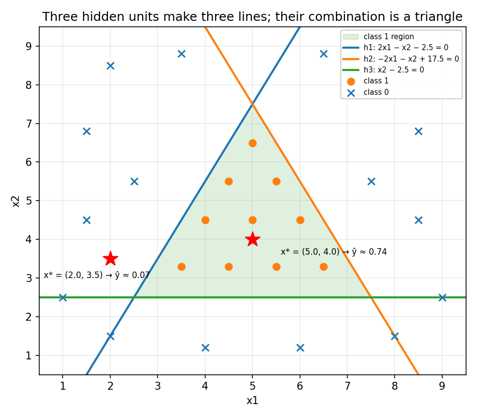
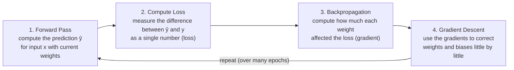
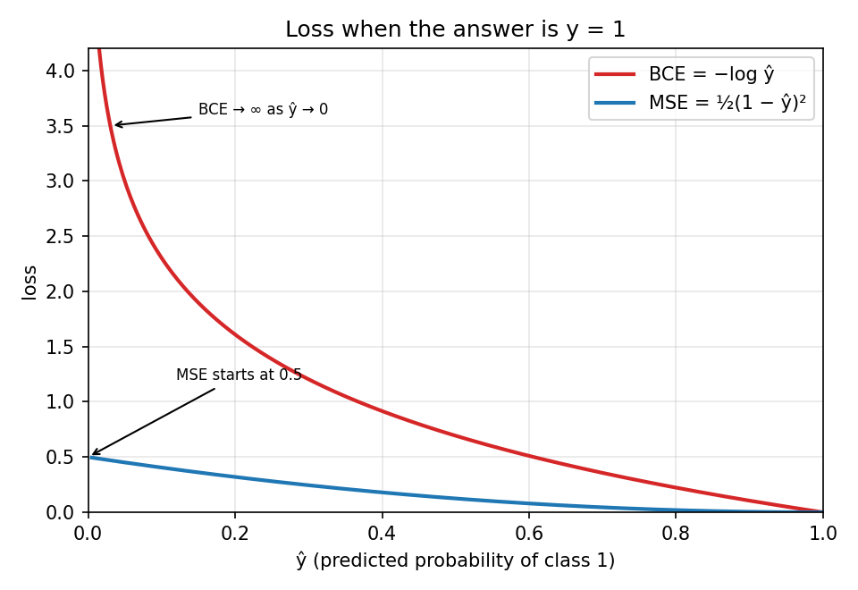
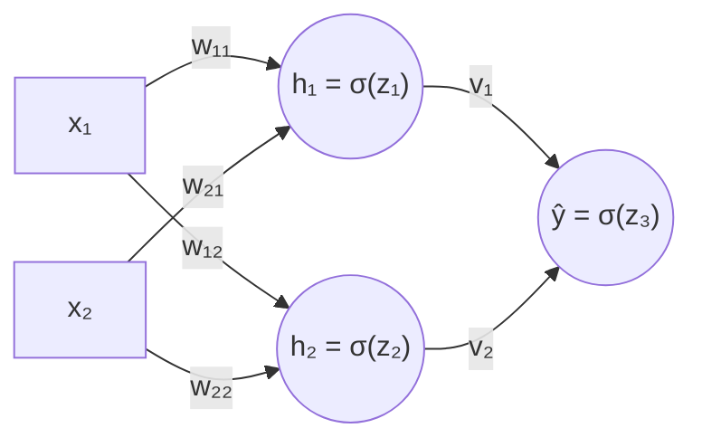
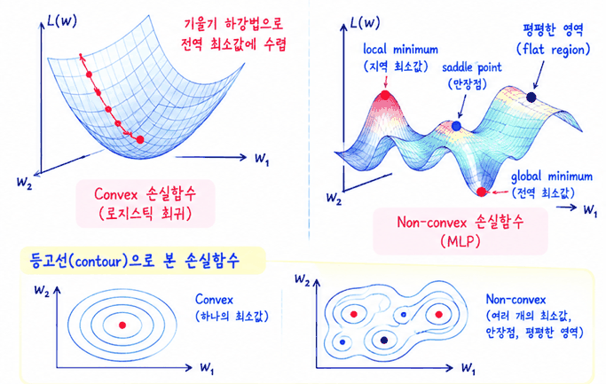
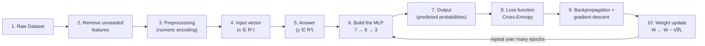
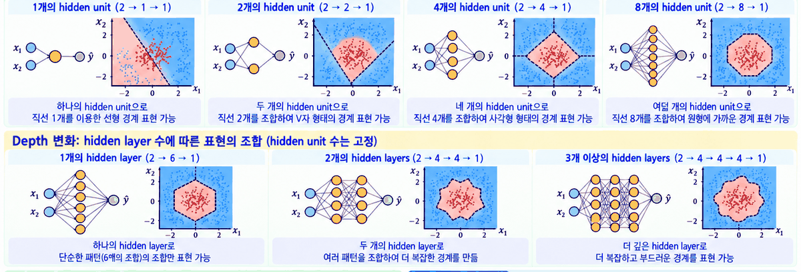
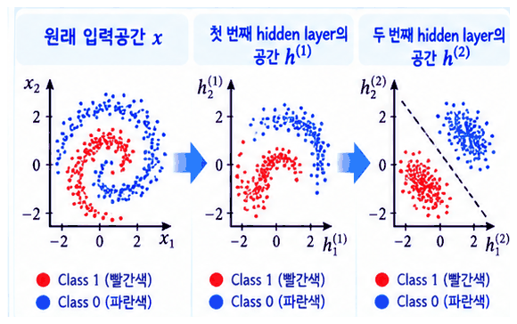
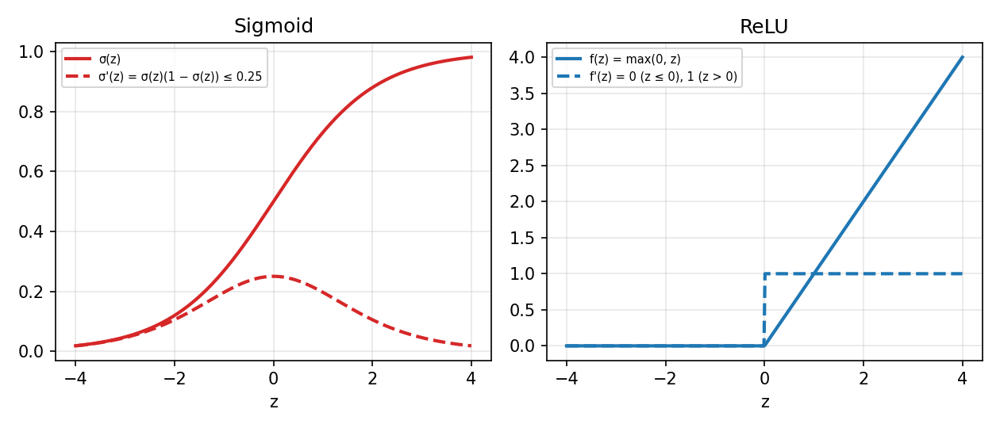

# Lecture 05 — Non-Linear Models and the MLP

> **Last Updated:** 2026-10-08
>
> Data Mining: Practical Machine Learning Tools and Techniques, Witten and Frank - Ch 7, 10

> **Learning Objectives**:
> 1. Explain the limits of linear models and how an MLP creates nonlinear decision regions by combining several linear boundaries with nonlinear activations
> 2. Show with equations why stacking layers without an activation function stays a linear function
> 3. Explain the MLP learning process of forward pass, loss, backpropagation, and gradient descent, and compute a small example by hand
> 4. Derive the error terms δ of the output and hidden layers with the chain rule, and simplify them using the sigmoid derivative σ'(z) = σ(z)(1 − σ(z))
> 5. Choose the output layer and loss function for binary classification, multi-class classification, and regression, and explain the relationship between softmax and cross entropy
> 6. Explain how raw data is turned into MLP input and how the structure is designed, as well as feature learning in deep networks and the vanishing gradient problem

---

## Table of Contents

- [1. Limits of Linear Models and the Need for Nonlinear Models](#1-limits-of-linear-models-and-the-need-for-nonlinear-models)
  - [1.1 Linear Models and Their Limits](#11-linear-models-and-their-limits)
  - [1.2 Combining Several Linear Boundaries](#12-combining-several-linear-boundaries)
- [2. Structure and Operation of an MLP That Combines Linear Boundaries](#2-structure-and-operation-of-an-mlp-that-combines-linear-boundaries)
  - [2.1 The Triangular Region Made by Three Hidden Units](#21-the-triangular-region-made-by-three-hidden-units)
  - [2.2 Predicting New Inputs](#22-predicting-new-inputs)
- [3. Why an Activation Function Is Needed](#3-why-an-activation-function-is-needed)
- [4. Expressive Power and Complexity of the MLP](#4-expressive-power-and-complexity-of-the-mlp)
  - [4.1 Number of Hidden Units and Decision Regions](#41-number-of-hidden-units-and-decision-regions)
  - [4.2 MLP Complexity and Overfitting](#42-mlp-complexity-and-overfitting)
- [5. How Does an MLP Learn?](#5-how-does-an-mlp-learn)
  - [5.1 How Are So Many Weights Decided?](#51-how-are-so-many-weights-decided)
  - [5.2 Forward Pass and Loss](#52-forward-pass-and-loss)
  - [5.3 Loss Functions: MSE and Binary Cross Entropy](#53-loss-functions-mse-and-binary-cross-entropy)
  - [5.4 Changing Weights with Gradient Descent](#54-changing-weights-with-gradient-descent)
- [6. Backpropagation](#6-backpropagation)
  - [6.1 Why Backpropagation Is Needed](#61-why-backpropagation-is-needed)
  - [6.2 Backpropagation in a 2-2-1 MLP](#62-backpropagation-in-a-2-2-1-mlp)
  - [6.3 General Derivation: Finding the Direction That Reduces the Error](#63-general-derivation-finding-the-direction-that-reduces-the-error)
  - [6.4 Gradient of the Output Layer Weights](#64-gradient-of-the-output-layer-weights)
  - [6.5 Gradient of the Hidden Layer Weights](#65-gradient-of-the-hidden-layer-weights)
  - [6.6 The Sigmoid Derivative and the Final Learning Rule](#66-the-sigmoid-derivative-and-the-final-learning-rule)
  - [6.7 One Learning Step on a Small Example](#67-one-learning-step-on-a-small-example)
- [7. From the Limits of the Perceptron to Backpropagation](#7-from-the-limits-of-the-perceptron-to-backpropagation)
- [8. The MLP Loss Landscape and the Difficulty of Learning](#8-the-mlp-loss-landscape-and-the-difficulty-of-learning)
- [9. Designing the MLP Structure](#9-designing-the-mlp-structure)
- [10. Output Layer and Loss Function by Problem Type](#10-output-layer-and-loss-function-by-problem-type)
- [11. Softmax](#11-softmax)
  - [11.1 Sigmoid and Softmax](#111-sigmoid-and-softmax)
  - [11.2 Combining Softmax and Cross Entropy](#112-combining-softmax-and-cross-entropy)
  - [11.3 Is a Normalized Sigmoid the Same as Softmax?](#113-is-a-normalized-sigmoid-the-same-as-softmax)
- [12. Turning an Example Dataset into an MLP Problem](#12-turning-an-example-dataset-into-an-mlp-problem)
  - [12.1 Raw Data and Feature Analysis](#121-raw-data-and-feature-analysis)
  - [12.2 Preprocessing and the Feature Vector](#122-preprocessing-and-the-feature-vector)
  - [12.3 Deciding the MLP Structure and the Whole Flow](#123-deciding-the-mlp-structure-and-the-whole-flow)
- [13. More Hidden Units and Hidden Layers](#13-more-hidden-units-and-hidden-layers)
- [14. DNN (Deep Neural Network)](#14-dnn-deep-neural-network)
  - [14.1 The New Feature Space Made by Hidden Layers](#141-the-new-feature-space-made-by-hidden-layers)
  - [14.2 Wouldn't a Deeper Network Be More Powerful?](#142-wouldnt-a-deeper-network-be-more-powerful)
  - [14.3 Vanishing Gradient](#143-vanishing-gradient)
  - [14.4 Ways to Reduce the Vanishing Gradient](#144-ways-to-reduce-the-vanishing-gradient)
  - [14.5 From MLP to DNN](#145-from-mlp-to-dnn)
- [Summary](#summary)
- [Review Questions](#review-questions)

---

 

## 1. Limits of Linear Models and the Need for Nonlinear Models

### 1.1 Linear Models and Their Limits

A **linear model** computes its output as a linear combination of the input x. Representative examples are linear regression, logistic regression, and the perceptron.

$$
z = \mathbf{w}^T\mathbf{x} + b = \sum_{i=1}^{d} w_i x_i + b
$$

The decision boundary is wᵀx + b = 0, which is a single line (in two dimensions) or hyperplane (in higher dimensions) in the input space. When a single line separates the two classes well, a linear model is enough.

However, real data is not always linearly separable. There are many cases a linear model cannot separate.

| Shape | Appearance of the data | Boundary needed |
|:------|:-----------------------|:----------------|
| XOR shape | The same classes cross along the diagonals. | A single line cannot separate them. |
| Circular shape | One class is in the middle and the other surrounds it. | A curved boundary, not a line, is needed. |
| Complex shape | The two classes are mixed in several clusters. | A more complex boundary is needed. |

Real-world data has very diverse distributions and patterns, and a linear model cannot express such complex patterns. Combining several linear boundaries or using nonlinear transformations can express more complex decision regions, so **a nonlinear model that can express more complex decision boundaries (for example, an MLP) is needed.**

> **Key point:** Linear models are an important starting point, but nonlinear models are needed to solve the diverse problems of the real world.

### 1.2 Combining Several Linear Boundaries

A single perceptron makes one linear boundary wᵀx + b = 0 and divides the input space with one line (or hyperplane). Combining several linear boundaries can make decision regions of more complex shapes.

| Number of boundaries | Region that can be made |
|:---------------------|:------------------------|
| 1 (a line) | One line divides the space into two regions. |
| 2 (crossing lines) | Two lines can make four regions. |
| Several (a polygonal region) | Several lines can express a region such as a triangle. |
| More complex regions | Combining several lines can express a region of any complex shape. |

That is why we use the **MLP (multi-layer perceptron), which combines the outputs of several perceptrons**. Combining several linear boundaries creates nonlinear decision regions that a single linear model cannot express. The MLP is a nonlinear model that expresses complex patterns by combining several linear boundaries.

---

 

## 2. Structure and Operation of an MLP That Combines Linear Boundaries

### 2.1 The Triangular Region Made by Three Hidden Units

**Problem setting.** In a two-dimensional plane, class 1 gathers in a triangular region in the middle, and the outside is class 0. A single line (linear boundary) cannot separate this data well.

**Three linear boundaries.** Each hidden unit is a single linear perceptron that makes one linear boundary. The sigmoid is used as the activation function.

$$
\begin{aligned}
h_1 &= \sigma(z_1), & z_1 &= 2x_1 - x_2 - 2.5 \\
h_2 &= \sigma(z_2), & z_2 &= -2x_1 - x_2 + 17.5 \\
h_3 &= \sigma(z_3), & z_3 &= x_2 - 2.5
\end{aligned}
\qquad\qquad \sigma(z) = \frac{1}{1 + e^{-z}}
$$

**MLP structure (3 hidden units).** The inputs x₁ and x₂ connect to all three hidden units h₁, h₂, and h₃, and the output layer combines the outputs of the three hidden units.

$$
z = 4h_1 + 4h_2 + 4h_3 - 10, \qquad \hat{y} = \sigma(z)
$$

*Lecture 05, Page 2: The boundaries h1, h2, h3 of the three hidden units and the triangular class 1 region made by combining them*

Inside the three boundaries (z₁ > 0, z₂ > 0, z₃ > 0), all three hidden units are close to 1, so z ≈ 4 × 3 − 10 = 2 > 0; outside, at least one is close to 0, so z < 0. In other words, **each hidden unit makes one linear boundary, and the output layer combines them to make a nonlinear decision region.**

### 2.2 Predicting New Inputs

| | Example 1: a class 1 point (inside) | Example 2: a class 0 point (outside) |
|:--|:--|:--|
| Input | x* = (5.0, 4.0) | x* = (2.0, 3.5) |
| h₁ | z₁ = 2(5.0) − 4.0 − 2.5 = 3.5 → h₁ = σ(3.5) ≈ 0.97 | z₁ = 2(2.0) − 3.5 − 2.5 = −2.0 → h₁ = σ(−2.0) ≈ 0.12 |
| h₂ | z₂ = −2(5.0) − 4.0 + 17.5 = 3.5 → h₂ = σ(3.5) ≈ 0.97 | z₂ = −2(2.0) − 3.5 + 17.5 = 10.0 → h₂ = σ(10.0) ≈ 1.00 |
| h₃ | z₃ = 4.0 − 2.5 = 1.5 → h₃ = σ(1.5) ≈ 0.82 | z₃ = 3.5 − 2.5 = 1.0 → h₃ = σ(1.0) ≈ 0.73 |
| Output | z = 4h₁ + 4h₂ + 4h₃ − 10 ≈ 1.04 → ŷ = σ(1.04) ≈ 0.74 | z ≈ 4(0.12) + 4(1.00) + 4(0.73) − 10 ≈ −2.60 → ŷ = σ(−2.60) ≈ 0.07 |
| Result | Predicted class = 1 (threshold 0.5) | Predicted class = 0 (threshold 0.5) |

Example 2 is inside the boundaries of h₂ and h₃ but outside the boundary of h₁, so h₁ ≈ 0.12 and the output is classified as 0.

---

 

## 3. Why an Activation Function Is Needed

Stacking several layers alone does not make the model nonlinear.

**Without an activation function.** Stacking several linear layers is still just one linear transformation. For x → Linear(W₁, b₁) → Linear(W₂, b₂) → y,

$$
\begin{aligned}
h &= W_1 x + b_1 \\
y &= W_2 h + b_2 = W_2(W_1 x + b_1) + b_2 = (W_2 W_1)x + (W_2 b_1 + b_2) = W'x + b'
\end{aligned}
$$

In the end it is the same as a single linear function, and the only boundary it can express is a single line. It can separate the data only with one line.

**With an activation function.** Applying a nonlinear activation function after a linear transformation makes a nonlinear function. For x → Linear(W₁, b₁) → Sigmoid σ → Linear(W₂, b₂) → Sigmoid σ → y,

$$
h(x) = \text{sigmoid}(W_1 x + b_1), \qquad y = \text{sigmoid}(W_2 h(x) + b_2) = \text{sigmoid}\bigl(W_2\,\text{sigmoid}(W_1 x + b_1) + b_2\bigr)
$$

This is a single function with nested sigmoids, and the MLP is a **composite function** of the form y(h(x)). This composite function is nonlinear, so several line boundaries come together to make a nonlinear decision region.

| | No activation | With activation (sigmoid) |
|:--|:--|:--|
| Model structure | Repetition of linear layers (Linear → Linear → …) | Repetition of linear layer + activation function |
| Form of the whole function | A linear function (y = W'x + b') | A nonlinear composite function (a single function with sigmoids nested many times) |
| Decision boundary | A line boundary (one line) | A complex decision region (a combination of several linear boundaries) |
| Expressive power | Limited (only simple patterns) | MLP possible (diverse and complex patterns) |

> **Key point:** The activation function gives the MLP its nonlinearity. The MLP is therefore not a mere repetition of simple linear models but a single nonlinear function with nested sigmoids.

---

 

## 4. Expressive Power and Complexity of the MLP

### 4.1 Number of Hidden Units and Decision Regions

When many simple linear boundaries come together, even very complex shapes can be made.

- **With few hidden units:** Even a small number of hidden units can make a nonlinear decision region. Three hidden units each make one linear boundary (line boundaries 1, 2, and 3), and combining them makes a triangular nonlinear decision region.
- **With more hidden units:** The more hidden units, the more complex the decision boundary. Three give a triangle, six give a hexagon, and many hidden units give a smooth region close to a circle. With many hidden units, combining many line boundaries can approximate complex shapes such as curves.
- **The function approximation view:** The MLP is a function approximator that approximates nonlinear functions. If the target function y = g(x) is wave-shaped, an MLP with few hidden units follows it only roughly, while an MLP with many hidden units approximates it more closely.

$$
\hat{y} = f(x) = \sigma\bigl(W_2\,\sigma(W_1 x + b_1) + b_2\bigr)
$$

> **Key messages**
> 1. Each hidden unit makes one linear boundary.
> 2. Combining several hidden units makes a nonlinear decision region.
> 3. The more hidden units, the more complex the functions that can be expressed.
> 4. With enough hidden units and a nonlinear activation function, the MLP can approximate a wide variety of continuous functions.
>
> **Universal approximation:** With enough hidden units, the MLP is a powerful model that can approximate almost any continuous function. The MLP combines many simple linear boundaries with nonlinear activations to approximate very complex nonlinear functions.

### 4.2 MLP Complexity and Overfitting

More hidden units are not always better.

| Case | Number of hidden units | Result |
|:-----|:-----------------------|:-------|
| Too few (underfitting) | Few | The boundary is too simple; the model lacks expressive power and cannot explain the data structure well enough. |
| Appropriate complexity (good fit) | Appropriate | An appropriate boundary explains the overall structure of the data well. |
| Too many (overfitting) | Many | An overly complex boundary fits the training data too closely, and the generalization performance may drop. |

**Model complexity and generalization.** Both too low and too high complexity cause problems. With model complexity on the horizontal axis and error on the vertical axis, the training error keeps decreasing as the complexity grows, but the validation/test error is U-shaped, decreasing and then increasing again. Its lowest point is the appropriate complexity. Too low a complexity (underfitting) gives a high error, and too high a complexity (overfitting) gives a high generalization error.

**How can we reduce it?** The following methods can be used for appropriate generalization.

| Method | Description |
|:-------|:------------|
| More data | Collect more diverse data to improve generalization performance. |
| Regularization (L2) | Keep the weights from growing too large. |
| Dropout | Randomly turn off some neurons to prevent overfitting. |
| Early stopping | Stop training before the validation performance gets worse. |
| Appropriate hidden units / layers | Choose a model size suited to the problem. |

> **Key point:** The more hidden units, the larger the expressive power, but if the model becomes more complex than needed, overfitting can occur. An appropriate model complexity and regularization are therefore important.

---

 

## 5. How Does an MLP Learn?

### 5.1 How Are So Many Weights Decided?

So far we have seen what functions an MLP can express. The remaining question is **"how are all these weights and biases decided?"**

Even a 2-3-1 MLP, with 2 inputs, 3 hidden units, and 1 output unit, has many parameters.

| Parameter | Count |
|:----------|:-----:|
| Input → hidden weights w⁽¹⁾ᵢⱼ | 2 × 3 = 6 |
| Hidden biases b⁽¹⁾ⱼ | 3 |
| Hidden → output weights w⁽²⁾ⱼ | 3 |
| Output bias b⁽²⁾ | 1 |
| Total | **13** |

This example alone has 13, and real MLPs have far more weights and biases. It is impossible for a person to set all of these values one by one, so they must be **learned automatically from data**.

**The whole MLP learning process.** Using data, the weights and biases are corrected repeatedly to reduce the difference between the prediction and the answer.

Using data to repeatedly update the weights so that the loss decreases: this is how an MLP learns.

### 5.2 Forward Pass and Loss

When data is input, the model computes a prediction and measures its difference from the answer as the loss. Consider a 2-2-1 MLP (binary classification) as an example. The inputs are x₁ = 5 and x₂ = 4, with 2 hidden units and 1 output unit.

**Forward pass (computing the prediction).**

1. Input of the hidden layer (weighted sum): z₁ = w₁₁x₁ + w₂₁x₂ + b₁, z₂ = w₁₂x₁ + w₂₂x₂ + b₂
2. Output of the hidden layer (activation function): h₁ = σ(z₁), h₂ = σ(z₂)
3. Input of the output layer (weighted sum): z = w₁h₁ + w₂h₂ + b
4. Output of the output layer (prediction): ŷ = σ(z) is a value between 0 and 1, the probability of class 1.

**Computing the loss (binary classification).** The binary cross-entropy loss is used.

$$
L = -\bigl[y \log(\hat{y}) + (1 - y)\log(1 - \hat{y})\bigr]
$$

| | Example 1) answer is 1 | Example 2) answer is 0 |
|:--|:--|:--|
| Values | y = 1, ŷ = 0.74 | y = 0, ŷ = 0.07 |
| Loss | L = −log(0.74) ≈ 0.30 | L = −log(1 − 0.07) ≈ 0.073 |
| Interpretation | The prediction is close to the answer, so the loss is small. | Again the prediction is close to the answer, so the loss is small. |

**Good predictions and bad predictions.** A good prediction with ŷ ≈ y gives a small loss, and a bad prediction with ŷ opposite to the answer gives a large loss. The closer to the answer, the smaller the loss; the farther from it, the larger the loss. The loss is **a single number** that shows how wrong the prediction is, and the weights and biases are learned in the direction that **minimizes** it.

### 5.3 Loss Functions: MSE and Binary Cross Entropy

MSE can be used for binary classification, but BCE is generally used. For an input x, the model (MLP) computes z and outputs ŷ = σ(z). ŷ is a value between 0 and 1, the probability of class 1, and the answer is y ∈ {0, 1}.

| | 1) MSE (Mean Squared Error) | 2) Binary Cross-Entropy (BCE) |
|:--|:--|:--|
| Formula | L_MSE = ½(y − ŷ)² | L_BCE = −[y log(ŷ) + (1 − y)log(1 − ŷ)] |
| Characteristics | The loss mainly used for regression; it can also be used for binary classification. | Generally used for binary classification; it matches the likelihood of the Bernoulli probability model (allowing a probabilistic interpretation). |

**Comparing loss values (when y = 1).** Let the answer be y = 1. If MSE is defined as L_MSE = ½(y − ŷ)², then L_MSE = ½(1 − ŷ)². The maximum at ŷ = 0 is therefore L_MSE = ½ = 0.5, and at ŷ = 1, L_MSE = 0. That is, the MSE curve starts exactly at 0.5 and goes down to 0. BCE, on the other hand, is L_BCE = −log(ŷ) (y = 1), so as ŷ → 0, −log(ŷ) → ∞. BCE does not start from some finite value; it diverges to infinity.

*Lecture 05, Page 7: MSE and BCE loss curves over the prediction ŷ when the answer is y = 1*

| ŷ | MSE ½(1 − ŷ)² | BCE −ln ŷ |
|:-:|:-------------:|:---------:|
| 0.01 | 0.490 | 4.605 |
| 0.1 | 0.405 | 2.303 |
| 0.135 | 0.374 | about 2.00 |
| 0.5 | 0.125 | 0.693 |
| 0.9 | 0.005 | 0.105 |
| 0.99 | 0.00005 | 0.010 |

For example, if the graph is drawn starting from around ŷ = 0.135, BCE seems to start at about 2, but it actually grows to infinity as ŷ → 0. This is the biggest difference between the two losses. **MSE gives a loss of at most 0.5 even when wrong, while BCE grows very large the more confidently it is wrong.** Both losses shrink as ŷ approaches 1, but BCE gives a far larger loss to predictions close to 0.

**Comparing the gradients (derivatives with respect to z).**

| | 1) MSE + sigmoid | 2) BCE + sigmoid |
|:--|:--|:--|
| Loss | L = ½(y − ŷ)², ŷ = σ(z) | L = −[y log(ŷ) + (1 − y)log(1 − ŷ)] |
| ∂L/∂z | (ŷ − y) × ŷ(1 − ŷ) | ŷ − y |
| Characteristics | The sigmoid derivative is multiplied once more. When ŷ is close to 0 or 1, ŷ(1 − ŷ) ≈ 0, so the gradient can become very small. | A very simple form. Even when the prediction is far off, the gradient does not shrink, and learning proceeds well in the direction of a large correction. |

**Numerical example (when y = 1).**

| Prediction ŷ | 0.01 (very wrong) | 0.5 | 0.7 | 0.99 (almost right) |
|:-------------|:-----------------:|:---:|:---:|:-------------------:|
| MSE loss | 0.490 | 0.125 | 0.045 | 0.00005 |
| BCE loss | 4.605 | 0.693 | 0.357 | 0.010 |
| MSE ∂L/∂z | −0.0098 | −0.125 | −0.063 | −0.0001 |
| BCE ∂L/∂z | −0.99 | −0.5 | −0.3 | −0.01 |

Even when completely wrong, as at ŷ = 0.01, the MSE gradient is very small at −0.0098. The BCE gradient, in contrast, is −0.99, a signal to correct a lot because the prediction is very wrong.

> **Summary**
> - MSE can be used, but binary classification usually uses BCE.
> - BCE corresponds naturally to the probability model and provides more effective gradients during learning.
> - In particular, with a sigmoid output the BCE gradient is very simple: ∂L/∂z = ŷ − y.
> - In practice and in most deep learning models, binary classification therefore uses sigmoid + binary cross-entropy.
>
> Choosing the loss function is not just a matter of formulas but an important design decision that considers learning efficiency and probabilistic interpretation.

### 5.4 Changing Weights with Gradient Descent

At the current weights, compute the slope (gradient) of the loss and correct the weights little by little in the direction opposite to the gradient.

**The case of a single weight (one-dimensional example).** Suppose the loss L(w) is U-shaped. The gradient tells us in which direction and by how much the loss changes at the current position. If the gradient < 0, increase w (to the right); if the gradient > 0, decrease w (to the left); the minimum is where the gradient = 0.

**Gradient descent update rule.**

$$
w_{\text{new}} = w_{\text{old}} - \eta \frac{\partial L}{\partial w}
$$

η is the learning rate (how far to move), and ∂L/∂w is the gradient (which direction to go).

- Correcting the weights little by little in the direction opposite to the gradient reduces the loss.
- If η is too large, the update can overshoot the minimum and diverge.
- If η is too small, convergence is very slow.
- The same rule is applied to every weight.

**Learning process of a neural network (MLP) (the whole flow).** Input x → MLP (weights W) → prediction ŷ = σ(z) → loss L(ŷ, y) (BCE) → gradient ∂L/∂W of each weight (backpropagation) → weight update W ← W − η∇L. Repeating this process many times makes the loss smaller and smaller.

**The loss function for binary classification.** In L_BCE = −[y log(ŷ) + (1 − y)log(1 − ŷ)], y ∈ {0, 1} is the answer (the probability of class 1) and ŷ = σ(z) is the model's predicted probability of class 1. BCE equals the negative log-likelihood (NLL) of the Bernoulli probability model, and it penalizes predictions more heavily the more wrong they are (large loss). It is a natural and effective loss for binary classification problems that deal with probabilities. Looking at the loss curve for y = 1, as ŷ → 0 the loss → ∞ (a large penalty for being confidently wrong), and as ŷ → 1 the loss → 0 (the loss converges to 0 near the answer).

**Is the MLP loss a quadratic function?** No. The MLP loss function (BCE) is generally **a very complex nonlinear function** of the weights. It is therefore not a simple parabola like a quadratic, and several local minima can exist. In practice, however, many solutions exist near good solutions, so gradient descent can find a good enough solution. The MLP loss surface is complex, but solutions with good performance exist in many places, so gradient descent can find a good enough solution.

---

 

## 6. Backpropagation

### 6.1 Why Backpropagation Is Needed

To learn all the weights of a neural network, we must compute how each weight affects the loss. The hidden layer weights in particular are not directly connected to the loss, which makes the computation difficult.

1. **First, the weight update formula.** w_new = w_old − η(∂L/∂w). η is the learning rate, and ∂L/∂w is the gradient that shows how much this weight affects the loss. Learning is ultimately **changing the weights in the direction that reduces the loss** (moving opposite to the gradient, in the direction the loss decreases).
2. **Output layer weights are relatively easy.** An output layer weight vᵢ is directly connected through hᵢ → ŷ → L, so its gradient is relatively easy to compute. For v₁, a change in h₁ changes ŷ, which directly changes the loss, so ∂L/∂v₁ can be computed relatively directly. The path is short and direct.
3. **Hidden layer weights are hard to compute.** The loss is computed only from the final output ŷ. But w₁₁ directly affects h₁, not the final output ŷ. That is, a hidden layer weight affects the loss only indirectly (w₁₁ → h₁ → ŷ → L). This raises the question "how much is this hidden weight responsible for the final error?" (the **credit assignment problem**). Because it affects the loss through several steps, ∂L/∂w₁₁ is hard to compute.
4. **That is why backpropagation is needed.** The forward pass computes values from the input to the output (x → h → ŷ → L, computing the prediction). The backward pass sends the effect of the error backward (L → ŷ → h → w) to compute the gradient of each weight. By the chain rule, we can compute how even a hidden layer weight affects the loss through several steps.

$$
\frac{\partial L}{\partial w_{11}} = \frac{\partial L}{\partial \hat{y}} \cdot \frac{\partial \hat{y}}{\partial z_3} \cdot \frac{\partial z_3}{\partial h_1} \cdot \frac{\partial h_1}{\partial z_1} \cdot \frac{\partial z_1}{\partial w_{11}}
$$

Sending the error backward gives the gradients of all weights. The weight update formula itself is simple, but because the hidden layer weights are not directly connected to the loss, backpropagation is needed.

### 6.2 Backpropagation in a 2-2-1 MLP

The error computed at the output layer is sent backward to compute how responsible each weight is for the loss. A neural network learns by using these computed errors to correct its weights.

**MLP structure (2-2-1).** It consists of an input layer (x₁, x₂), a hidden layer (h₁, h₂), and an output layer (ŷ). The forward pass goes left → right (input → output, prediction), and the backward pass goes right → left (error propagation, learning).

**Forward pass.** First, the forward pass computes the prediction ŷ and the loss. It computes ŷ from the input and finds the loss, the difference from the actual answer y.

1. z₁ = w₁₁x₁ + w₂₁x₂ + b₁
2. h₁ = σ(z₁)
3. z₂ = w₁₂x₁ + w₂₂x₂ + b₂
4. h₂ = σ(z₂)
5. z₃ = v₁h₁ + v₂h₂ + b₃
6. ŷ = σ(z₃)
7. BCE loss: L = −[y log(ŷ) + (1 − y)log(1 − ŷ)]

**Backward pass: computing the error terms (deltas).** The output layer error is passed to the hidden layer.

$$
\delta_3 = \frac{\partial L}{\partial z_3} = \hat{y} - y
$$

This is the output layer error (BCE + sigmoid). With the combination of BCE and sigmoid, the computation becomes very simple. The hidden layer errors follow from the chain rule.

$$
\delta_1 = \frac{\partial L}{\partial z_1} = v_1 \cdot \delta_3 \cdot h_1(1 - h_1), \qquad \delta_2 = \frac{\partial L}{\partial z_2} = v_2 \cdot \delta_3 \cdot h_2(1 - h_2)
$$

**Computing the gradients and updating the weights.** By the chain rule, the gradient of each weight is as follows.

| Output layer weights | Hidden layer weights |
|:---------------------|:---------------------|
| ∂L/∂v₁ = δ₃h₁ | ∂L/∂w₁₁ = δ₁x₁ |
| ∂L/∂v₂ = δ₃h₂ | ∂L/∂w₂₁ = δ₁x₂ |
| ∂L/∂b₃ = δ₃ | ∂L/∂w₁₂ = δ₂x₁ |
| | ∂L/∂w₂₂ = δ₂x₂ |

The update rule (gradient descent) is w ← w − η(∂L/∂w), where η is the learning rate, usually a small value. The biases are updated in the same way. Each weight is adjusted little by little by its computed gradient.

> **Whole process summary:** ① Compute ŷ and the loss with the forward pass → ② compute the output layer error δ₃ = ŷ − y → ③ compute the hidden layer errors δ₁ and δ₂ → ④ find the gradient of each weight and update it by gradient descent.
>
> **Backpropagation is an algorithm that divides the final error into the responsibility of each weight.**

### 6.3 General Derivation: Finding the Direction That Reduces the Error

Now let us derive the learning rule for a general number of layers and units. In a network consisting of an input layer i (x₁, x₂, …), a hidden layer j (h₁, h₂, …), and an output layer k (y₁, y₂, …), computing values from the input to the output is the **feed forward**, and sending the output error backward to correct the weights is **back propagation**.

**Seeing the network as a function.** Thinking of a neural network (NN) as a function, we can write Y = f(X, W). The function f(X, W) is the MLP. Y is the output vector, X is the input vector, and W is the weight vector, and this function gives a different Y depending on the value of W. Our goal is to find the W that makes T − Y = 0 in Y = f(X, W) (that is, that makes Y equal the target T). This is the **backpropagation algorithm**.

**The error function.** Define the error e(W) for a given W as follows (for two output units).

$$
e(W) = \frac{1}{2}\lVert T - y(W) \rVert^2 = \frac{1}{2}\sum_{k=1}^{2}\bigl(T_k - y_k(W)\bigr)^2
$$

We want to find the W that makes e(W) zero, that is, e(W) = 0. If that is not possible, we at least want to minimize this expression to within some tolerance.

**Points where the derivative is zero, and the iterative approach.** As learned in calculus, setting the derivative of a function f(x) to zero finds its extrema. A point where f'(x) = 0 is a local minimum or maximum, and "take the derivative and set it equal to zero" is the basic method for finding a minimum or maximum point. On the error curve too, we would look for the value of W where ΔE/ΔW = 0.

However, the error function of a neural network is too complex for this method to be applied directly. The error curve also has several valleys, so a **local minimum** may appear at one W (for example, X₁) and the **global minimum** at another (for example, X₂). We therefore use an **iterative approach**. That is, start from some random point, and at each step of the iteration, move in a downward direction.

Since the negative of the derivative points downward, at each iteration we move a little in the negative derivative direction, which is why the update formula has a − sign. For a vector function this derivative is called the **gradient**, and this iterative procedure is called **gradient descent (or steepest descent)**. The procedure can be summarized as follows.

$$
W = W + \Delta W, \qquad \Delta W = -\eta \frac{\partial E}{\partial W}
$$

That is, the change in W is computed in the direction that reduces the error. Now we just need ∂E/∂W for the weights of each layer.

**Notation.** The following symbols are used in the derivation.

| Symbol | Meaning |
|:-------|:--------|
| xᵢ, hⱼ, y_k | Input of input unit i, output of hidden unit j, output of output unit k |
| W_ji, W_kj | Weight from input i → hidden j, weight from hidden j → output k |
| net_j = Σᵢ W_ji xᵢ, net_k = Σⱼ W_kj hⱼ | Weighted sum (net input) of each unit |
| F | Activation function. hⱼ = F(net_j), y_k = F(net_k) |
| T_k | Target value of output unit k |
| E = ½Σ_k (T_k − y_k)² | Error function |

A single unit applies the activation function to the weighted sum net = Σxw of its inputs xᵢ and weights wᵢ and outputs y = F(Σᵢ xᵢwᵢ) = F(net). The bias can be seen as a weight w₀ attached to an input that is always −1 (or 1).

### 6.4 Gradient of the Output Layer Weights

Apply the chain rule to the weight W_kj that enters output unit k.

$$
\frac{\partial E}{\partial W_{kj}} = \frac{\partial E}{\partial y_k} \cdot \frac{\partial y_k}{\partial W_{kj}}
$$

The first term is the derivative of the error function with respect to the output y_k. Since we differentiate with respect to a particular k, the Σ disappears.

$$
\frac{\partial E}{\partial y_k} = \frac{\partial \left(\frac{1}{2}\sum_k (T_k - y_k)^2\right)}{\partial y_k} = \frac{1}{2} \cdot 2(T_k - y_k)(-1) = -(T_k - y_k)
$$

The second term follows from y_k = F(net_k) and net_k = Σⱼ W_kj hⱼ. Since we differentiate with respect to a particular W_kj, the Σ drops out.

$$
\frac{\partial y_k}{\partial W_{kj}} = \frac{\partial y_k}{\partial net_k} \cdot \frac{\partial net_k}{\partial W_{kj}} = \frac{\partial F(net_k)}{\partial net_k} \cdot \frac{\partial \sum_j W_{kj} h_j}{\partial W_{kj}} = F'(net_k) \cdot h_j
$$

Therefore, we have the following.

$$
\frac{\partial E}{\partial W_{kj}} = -(T_k - y_k) \cdot F'(net_k) \cdot h_j = -\delta_k h_j, \qquad \delta_k = (T_k - y_k)F'(net_k)
$$

$$
\Delta W_{kj} = -\eta \frac{\partial E}{\partial W_{kj}} = \eta (T_k - y_k)F'(net_k)\,h_j = \eta\,\delta_k h_j
$$

### 6.5 Gradient of the Hidden Layer Weights

The weight W_ji that enters hidden unit j is not directly connected to the error. W_ji changes hⱼ, and hⱼ affects every output unit y_k. So we apply the chain rule in two stages.

$$
\frac{\partial E}{\partial W_{ji}} = \frac{\partial E}{\partial h_j} \cdot \frac{\partial h_j}{\partial W_{ji}}
$$

First, the derivative with respect to hⱼ must be summed over every output unit k that hⱼ affects.

$$
\frac{\partial E}{\partial h_j} = \sum_k \frac{\partial E}{\partial y_k} \cdot \frac{\partial y_k}{\partial h_j}
$$

Here ∂y_k/∂hⱼ is as follows.

$$
\frac{\partial y_k}{\partial h_j} = \frac{\partial F(net_k)}{\partial net_k} \cdot \frac{\partial net_k}{\partial h_j} = \frac{\partial F(net_k)}{\partial net_k} \cdot \frac{\partial \sum_j W_{kj} h_j}{\partial h_j} = F'(net_k) \cdot W_{kj}
$$

And ∂E/∂y_k was −(T_k − y_k) in Section 6.4, so

$$
\frac{\partial E}{\partial h_j} = \sum_k \frac{\partial E}{\partial y_k} \cdot \frac{\partial y_k}{\partial h_j} = -\sum_k (T_k - y_k)F'(net_k)W_{kj}
$$

This gives the first factor. Next, since hⱼ = F(net_j) and net_j = Σᵢ W_ji xᵢ,

$$
\frac{\partial h_j}{\partial W_{ji}} = \frac{\partial h_j}{\partial net_j} \cdot \frac{\partial net_j}{\partial W_{ji}} = \frac{\partial F(net_j)}{\partial net_j} \cdot \frac{\partial \sum_i W_{ji} x_i}{\partial W_{ji}} = F'(net_j) \cdot x_i
$$

This gives the second factor. Combining the two results gives the following.

$$
\begin{aligned}
\frac{\partial E}{\partial W_{ji}} = \frac{\partial E}{\partial h_j} \cdot \frac{\partial h_j}{\partial W_{ji}}
&= -\sum_k (T_k - y_k)F'(net_k)W_{kj} \cdot F'(net_j) \cdot x_i \\
&= -\sum_k \delta_k W_{kj} \cdot F'(net_j) \cdot x_i \\
&= -\delta_j \cdot x_i
\end{aligned}
\qquad\qquad
\delta_j = F'(net_j)\sum_k \delta_k W_{kj}
$$

That is, the error δⱼ of a hidden unit is the errors δ_k of the output units it connects to, gathered backward and weighted by W_kj. This is the precise meaning of "sending the error backward".

### 6.6 The Sigmoid Derivative and the Final Learning Rule

To simplify the formulas further, let us find F'(net). If F(net) is the sigmoid function, then

$$
\begin{aligned}
F'(net) = \frac{\partial F(net)}{\partial net} &= \left(\frac{1}{1 + e^{-net}}\right)' = \frac{1'(1 + e^{-net}) - 1(1 + e^{-net})'}{(1 + e^{-net})^2} = \frac{0 - (1 + e^{-net})'}{(1 + e^{-net})^2} = \frac{0 - (0 - e^{-net})}{(1 + e^{-net})^2} \\
&= \frac{e^{-net}}{(1 + e^{-net})^2} = \frac{(1 + e^{-net}) - 1}{(1 + e^{-net})^2} = \frac{\frac{1}{F(net)} - 1}{\frac{1}{F(net)^2}} \\
&= F(net) - F(net)^2 = F(net)\bigl(1 - F(net)\bigr)
\end{aligned}
$$

Here we used 1 + e^(−net) = 1/F(net). So when F is the sigmoid, its derivative can be written using its output alone. Since y_k = F(net_k) and hⱼ = F(net_j), the two error terms simplify as follows.

$$
\delta_k = (T_k - y_k)F'(net_k) = (T_k - y_k)\,y_k' = (T_k - y_k) \cdot y_k \cdot (1 - y_k)
$$

$$
\delta_j = F'(net_j)\sum_k \delta_k W_{kj} = h_j(1 - h_j) \cdot \sum_k \delta_k W_{kj}
$$

**The final learning rule (backpropagation learning).** With learning rate r (= η), the output layer weights and hidden layer weights are corrected repeatedly as follows.

| Layer | Error term | Weight correction |
|:------|:-----------|:------------------|
| Output layer k | δ_k = y_k(1 − y_k)(T_k − y_k) | W_kj = W_kj + r × δ_k × hⱼ |
| Hidden layer j | δⱼ = hⱼ(1 − hⱼ) Σ_k δ_k W_kj | W_ji = W_ji + r × δⱼ × xᵢ |

Written out, the correction of an output layer weight is ΔW_kj = η(T_k − y_k) × Sig(net_k)(1 − Sig(net_k)) × hⱼ, and η is usually a small value such as 0.1. Repeating this computation for each data point is backpropagation learning.

> **Note:** With BCE + sigmoid in Section 6.2, the output layer error is δ₃ = ∂L/∂z₃ = ŷ − y, without the factor ŷ(1 − ŷ) of the sigmoid derivative. Also, Section 6.2 defines δ as ∂L/∂z and subtracts it in the update (w ← w − ηδx), while this section defines δ as (T − y)F'(net) and adds it (W ← W + rδx). Only the sign convention differs; both correct in the same direction.

### 6.7 One Learning Step on a Small Example

Let us compute by hand how a neural network learns from one data point.

**1. Training data.** Of 4 data points, the first sample (x₁, x₂, y) = (1.0, 0.5, 1) is chosen for one learning step.

| x₁ | x₂ | y |
|:--:|:--:|:-:|
| **1.0** | **0.5** | **1** |
| 0.2 | 0.1 | 0 |
| 0.8 | 0.2 | 1 |
| 0.1 | 0.7 | 0 |

**2. Initial weights and MLP structure.** There are 2 inputs, 2 hidden units (sigmoid), and 1 output unit (sigmoid); all activation functions are sigmoid. The loss is BCE for binary classification, and since y = 1 here, L = −log(ŷ).

| Weight | Value | Weight | Value |
|:-------|:-----:|:-------|:-----:|
| w₁₁ | 0.1 | w₂₁ | 0.4 |
| w₁₂ | −0.2 | w₂₂ | 0.2 |
| b₁, b₂ | 0 | | |
| v₁ | 0.3 | v₂ | −0.1 |
| b₃ | 0 | | |

**3. Forward pass (computing the output).** The current sample x₁ = 1.0, x₂ = 0.5, y = 1 is used.

1. z₁ = 0.1 × 1.0 + 0.4 × 0.5 + 0 = 0.3 → h₁ = σ(0.3) = 0.574
2. z₂ = (−0.2) × 1.0 + 0.2 × 0.5 + 0 = −0.1 → h₂ = σ(−0.1) = 0.475
3. z₃ = 0.3 × 0.574 + (−0.1) × 0.475 + 0 = 0.1247 → ŷ = σ(0.1247) = 0.531
4. L = −log(0.531) = 0.634

The prediction 0.531 is far from the answer 1, so the loss is large.

**4. Backward pass (computing the gradients).** The output layer error is computed first and then sent backward to compute the responsibility of the hidden layer.

1. Output layer error (delta): δ₃ = ∂L/∂z₃ = ŷ − y = 0.531 − 1 = −0.469
2. Gradients of the output layer weights: ∂L/∂v₁ = δ₃h₁ = (−0.469) × 0.574 = −0.269, ∂L/∂v₂ = δ₃h₂ = (−0.469) × 0.475 = −0.223, ∂L/∂b₃ = δ₃ = −0.469
3. Hidden layer errors (deltas): δ₁ = v₁ × δ₃ × h₁(1 − h₁) = 0.3 × (−0.469) × 0.574 × 0.426 = −0.0344, δ₂ = v₂ × δ₃ × h₂(1 − h₂) = (−0.1) × (−0.469) × 0.475 × 0.525 = 0.0117
4. Gradients of the input → hidden weights: ∂L/∂w₁₁ = δ₁x₁ = −0.0344, ∂L/∂w₂₁ = δ₁x₂ = −0.0172, ∂L/∂w₁₂ = δ₂x₁ = 0.0117, ∂L/∂w₂₂ = δ₂x₂ = 0.00585, ∂L/∂b₁ = δ₁ = −0.0344, ∂L/∂b₂ = δ₂ = 0.0117

**5. Weight update.** w_new = w_old − η(∂L/∂w), with η = 0.1 (the learning rate, which decides how much to correct at once). The computed gradients are used to correct the weights little by little.

| Parameter | old | gradient | new | Parameter | old | gradient | new |
|:----------|:---:|:--------:|:---:|:----------|:---:|:--------:|:---:|
| v₁ | 0.300 | −0.269 | 0.327 | w₁₂ | −0.200 | 0.0117 | −0.201 |
| v₂ | −0.100 | −0.223 | −0.078 | w₂₂ | 0.200 | 0.00585 | 0.199 |
| b₃ | 0.000 | −0.469 | 0.047 | b₁ | 0.000 | −0.0344 | 0.003 |
| w₁₁ | 0.100 | −0.0344 | 0.103 | b₂ | 0.000 | 0.0117 | −0.001 |
| w₂₁ | 0.400 | −0.0172 | 0.402 | | | | |

As the weights change little by little, the network moves closer to the answer. One learning step consists of (1) selecting data → (2) forward pass → (3) computing the loss → (4) backward pass → (5) updating the weights. Repeating this process makes the loss smaller and smaller, and the network learns.

---

 

## 7. From the Limits of the Perceptron to Backpropagation

Backpropagation was the important turning point that revived neural networks.

| Period | Event | Content |
|:-------|:------|:--------|
| 1950s: early neural network models | McCulloch & Pitts (1943) | A simple mathematical model of a neuron |
| | Rosenblatt (1957) | Proposed the perceptron, a neural network model that can learn (weighted sum + step function). A single-layer perceptron can learn linear classification problems. |
| 1960s: the limits of the single-layer perceptron | Minsky & Papert (1969) | Proved theoretically that a single-layer perceptron cannot learn nonlinear problems such as XOR. As a result, neural network research entered a deep slump (the "AI winter"). A single-layer structure cannot express complex nonlinear boundaries. |
| 1970s: the search for multilayer networks | Various researchers | They suggested the potential of multilayer networks, but the problem was how to learn the hidden layer weights ("multilayer networks seem able to solve more complex problems, but how do we learn the hidden layer weights?"). Some ideas were proposed, but no effective learning method was established. |
| 1986: the revival through backpropagation | Rumelhart, Hinton, Williams (1986) | In "Learning Representations by Back-propagating Errors", they systematically organized and widely publicized the backpropagation algorithm. They presented a way to send the output layer error backward and compute the gradients of all weights. As multilayer networks became actually trainable, neural network research came back to life. |
| Later developments | | Deeper neural networks (deep neural networks), diverse activation functions (ReLU and others), large-scale data and GPUs, advances in regularization and optimization algorithms, and today's deep learning (CNN, RNN, Transformer, and more). Image recognition led to CNNs, natural language processing to RNNs and Transformers, and speech recognition to deep neural networks. |

> **Key point:** Backpropagation made it possible to train even hidden layers, opening the era of neural networks that go beyond simple linear models to solve complex nonlinear problems. Backpropagation is the core idea that became the foundation of modern deep learning.

---

 

## 8. The MLP Loss Landscape and the Difficulty of Learning

Training a neural network can be compared to descending an uneven mountain.

**1) Loss function of a linear model (logistic regression): convex.** The loss function of logistic regression is convex with respect to the weights. A single global minimum exists, and gradient descent can find it stably.

**2) Loss function of the MLP: non-convex.** In an MLP, many layers of nonlinear functions are composed, so the loss function has a very complex (non-convex) shape. Several local minima, saddle points, and flat regions exist, and the training can converge to different solutions depending on the initial values.

*Lecture 05, Page 20: The convex loss of logistic regression (converging to the global minimum) and the non-convex loss of the MLP (local minimum, saddle point, flat region, global minimum), with the contours of each*

Seen as contours, a convex loss function is a set of concentric ellipses around a single minimum, while a non-convex loss function has a complex shape that mixes several minima, saddle points, and flat regions.

**3) Why learning is hard.**

1. **Several local minima:** Training can converge to different solutions depending on the initial values.
2. **Saddle points:** Points where the gradient is 0 but which are not minima. In high-dimensional spaces there are very many saddle points.
3. **Flat regions:** The gradient is very small, so learning is very slow.
4. **Uneven gradient magnitudes:** As layers get deeper, gradients can become very small or very large (vanishing / exploding gradient).

**4) Behavior in actual training**

- Theoretically it is non-convex, but in practice gradient descent (especially SGD, Adam, and others) often reaches good solutions.
- There are many good solutions, and good performance is possible even without the exact global minimum.
- Large-scale data, appropriate initialization, and regularization techniques stabilize learning.

In short, the loss function of a neural network is complex, but there are many paths to good solutions. Training can converge to different solutions depending on the initial values, but many of those solutions are good solutions.

**5) Practical methods for learning well.**

| Initialization and optimization | Regularization and data |
|:--------------------------------|:------------------------|
| Appropriate weight initialization (Xavier, He initialization) | Batch normalization |
| Appropriate learning rate setting (learning rate scheduling) | Regularization techniques (L2, Dropout, and others) |
| Modern optimization algorithms (SGD, Adam, and others) | Enough data and data augmentation |
| Appropriate design of the model structure | Early stopping |

It is complex terrain, but with the right tools and strategies, a good enough solution can be found.

---

 

## 9. Designing the MLP Structure

The structure and size of an MLP are chosen to fit the form of the problem and the characteristics of the data.

**1) Basic structure (fully connected MLP).** Input layer x₁, …, xₙ → hidden layers → output layer y₁, …, y_k, with every unit connected to every unit of the neighboring layer. The values to design are the input dimension n (number of features), the L hidden layers (number of layers), the units h₁, h₂, …, h_L of each hidden layer, and the output dimension k (number of classes, etc.).

**2) How is each component decided?**

| Component | How to decide |
|:----------|:--------------|
| Input layer (input dimension) | Equal to the number of features of the input data. E.g., student grade prediction: 4 (study time, attendance, assignment score, midterm) |
| Output layer (output dimension) | Decided by the type of problem. Binary classification: 1, multi-class classification: number of classes, regression: number of values to predict |
| Number of hidden layers (L) | Usually 1 to dozens (depending on the problem); too deep can make learning hard. |
| Units per hidden layer (h) | There is no fixed answer (a hyperparameter). Too few can underfit, and too many can overfit. |

**3) How to choose hyperparameters.**

- Experience and experimentation are important.
- Start from a small model and grow it gradually while checking performance.
- Evaluate the generalization performance with validation data (a validation set).
- AutoML and hyperparameter search techniques (e.g., grid search, random search, Bayesian optimization) can be used.

The model complexity must match the size of the data and the difficulty of the problem.

**4) Performance change with model size.** As the model size (number of parameters) grows, the performance (accuracy) on the training data keeps rising, but the performance on the validation data rises and then falls from some point. Too small is underfitting, too large is overfitting, and the appropriate size lies in between.

**5) Examples of layer configurations.**

| Configuration | Example |
|:--------------|:--------|
| Shallow MLP | 4 − 8 − 1 |
| Medium-sized MLP | 4 − 16 − 8 − 1 |
| Deep MLP = DNN (Deep Neural Network) | 4 − 128 − 64 − 32 − 1 |

An MLP with many hidden layers is usually called a **Deep Neural Network (DNN)**.

**6) Additional factors to consider.** Activation functions (ReLU, tanh, sigmoid, etc.), normalization (batch normalization, layer normalization), regularization techniques (L2 (weight decay), dropout, etc.), learning rate, batch size, number of training epochs, weight initialization method (e.g., Xavier, He initialization), data preprocessing (scaling (standardization, normalization), handling missing values, etc.), and early stopping. Not only the structure but also the training settings and data preprocessing strongly affect performance.

**7) A real design example: student grade classification (a multi-class classification problem).**

| Input (4 features) | MLP structure | Output (3 classes) |
|:-------------------|:--------------|:-------------------|
| x₁: study time (hours), x₂: attendance (%), x₃: assignment score (points), x₄: midterm score (points) | 4 − 16 − 8 − 3 | y₁: excellent (A), y₂: average (B), y₃: poor (C). The loss function is cross-entropy (multi-class). |

Understanding the characteristics of the problem and designing an appropriate structure and hyperparameters is the first step toward good performance.

---

 

## 10. Output Layer and Loss Function by Problem Type

The MLP is a single model, but depending on how its final output layer and loss function are designed, it can solve many kinds of problems.

| | 1) Binary classification | 2) Multi-class classification | 3) Regression |
|:--|:--|:--|:--|
| Problem | Predicting one of two classes (0 or 1). E.g., spam filtering, disease diagnosis, pass/fail | Predicting one of three or more classes. E.g., handwritten digit (0 to 9) classification, image object classification, subject classification | Predicting a continuous number. E.g., house prices, exam scores, temperature, stock prices |
| Structure | Input (n features) → hidden layers (ReLU, etc.) → output layer (sigmoid) → ŷ = P(y = 1 \| x) | Input (n features) → hidden layers (ReLU, etc.) → output layer (softmax) → ŷ₁ = P(class 1), …, ŷ_K = P(class K) | Input (n features) → hidden layers (ReLU, etc.) → output layer (linear) → ŷ (continuous value) |
| Output function | Sigmoid: ŷ = σ(z) = 1/(1 + e^(−z)) | Softmax: ŷ_k = e^(z_k) / Σⱼ e^(z_j), Σ_k ŷ_k = 1 | Linear: ŷ = z = wᵀh + b |
| Loss function | Binary cross entropy: L = −[y log(ŷ) + (1 − y)log(1 − ŷ)] | Cross-entropy (multi-class): L = −Σ_k y_k log(ŷ_k). y_k is the answer as a one-hot vector (1 only for the correct class, 0 for the rest). E.g., if class 2 is correct, y = [0, 1, 0] | Mean squared error (MSE): L = (1/n)Σᵢ(ŷᵢ − yᵢ)². The average of the squared differences between predictions and actual values |
| Prediction example | Spam classification. Input: 4 features of an email, output: ŷ = 0.82, result: 0.82 > 0.5 → spam (class 1) | Digit image classification (K = 3). Input: image features (pixels, etc.), output: ŷ = [0.1, 0.7, 0.2], result: classified as class 2, the largest value | House price prediction. Input: size, rooms, location, age (4 features), output: ŷ = 7.3 (100M KRW), actual: y = 7.0 (100M KRW), loss: (7.3 − 7.0)² = 0.09 |

> **Key message:** The MLP is not a single specific algorithm but a general-purpose model that can solve many problems by choosing the output layer and loss function to fit each problem.

---

 

## 11. Softmax

Softmax is the generalization of the sigmoid to several classes, and used with cross-entropy it learns probability distributions effectively.

### 11.1 Sigmoid and Softmax

| | Sigmoid | Softmax |
|:--|:--|:--|
| Formula | σ(z) = 1/(1 + e^(−z)) | ŷ_k = e^(z_k) / Σⱼ e^(z_j) |
| Role | Converts a single output into a value between 0 and 1. | Compares several scores with each other and converts them into a probability distribution that sums to 1. |
| Use | Suited to binary classification | Suited to multi-class classification |
| Example (z = [2, 1, 0]) | σ(2) = 0.88, σ(1) = 0.73, σ(0) = 0.50. Each output is independent, and they need not sum to 1. | ŷ = [0.665, 0.245, 0.090]. The outputs compete with each other and sum to 1. |

When exactly one of several classes must be chosen, softmax is natural. Note that multi-label problems, where several classes can be true at once, use several sigmoids.

**Where does the softmax formula come from?** From the viewpoint of binary classification (a probability ratio), for the two class scores z₀ and z₁,

$$
P(y = 1 \mid x) = \frac{e^{z_1}}{e^{z_0} + e^{z_1}}
$$

Dividing the numerator and denominator by e^(z₁) gives 1/(1 + e^(−(z₁ − z₀))), so the sigmoid can be seen as a 2-class softmax (choosing one of two classes). Generalizing to several classes, with K classes we use e^(z_k) to make each class score z_k positive and divide by the total to make a probability distribution.

$$
P(y = k \mid x) = \frac{e^{z_k}}{\sum_{j=1}^{K} e^{z_j}}
$$

**The log-odds intuition.** The probability ratio of two classes is p_i/p_j = e^(z_i − z_j), that is, log(p_i/p_j) = z_i − z_j. The relative score difference of two classes decides their probability ratio.

**Softmax in numbers.** Let z = [2, 1, 0].

1. Exponentials: e² = 7.389, e¹ = 2.718, e⁰ = 1, and the sum is 11.107.
2. Probabilities: ŷ₁ = 7.389/11.107 = 0.665, ŷ₂ = 2.718/11.107 = 0.245, ŷ₃ = 1/11.107 = 0.090.

Class 1, with the largest probability, is predicted.

### 11.2 Combining Softmax and Cross Entropy

The loss function (cross-entropy) is L = −Σ_k y_k log(ŷ_k), and with a one-hot answer it is L = −log(ŷ_true).

| | Example 1: a good prediction | Example 2: a bad prediction |
|:--|:--|:--|
| Answer | y = [1, 0, 0] (class 1 is correct) | y = [1, 0, 0] (class 1 is correct) |
| Prediction | ŷ = [0.665, 0.245, 0.090] | ŷ = [0.10, 0.70, 0.20] |
| Loss | L = −log(0.665) ≈ 0.408 | L = −log(0.10) = 2.303 |

The smaller the probability of the correct class, the more the loss grows.

**Why softmax and cross-entropy fit well together.**

1. Softmax turns the outputs into a single probability distribution.
2. Cross-entropy measures the difference between the answer distribution and the predicted distribution.
3. Learning increases the probability of the correct class and decreases the probabilities of the other classes.
4. The derivative is clean: ∂L/∂z_k = ŷ_k − y_k.

> **Key summary**
> 1. The sigmoid turns a single output into a value between 0 and 1 and is mainly used for binary classification.
> 2. Softmax turns several scores into a probability distribution that sums to 1 and suits multi-class classification.
> 3. The sigmoid can be seen as a 2-class softmax.
> 4. Softmax + cross-entropy is natural for learning probability distributions, and its gradient is simple, so learning is effective.
>
> In other words, softmax produces probabilities through which the classes compete, and cross-entropy measures how different those probabilities are from the answer.

### 11.3 Is a Normalized Sigmoid the Same as Softmax?

It can be made to sum to 1, but it differs from softmax in an important way.

**Idea: a normalized sigmoid.** Applying a sigmoid to each score and dividing by the sum gives

$$
s_i = \sigma(z_i) = \frac{1}{1 + e^{-z_i}}, \qquad p_i = \frac{s_i}{\sum_j s_j}
$$

and then p₁ + p₂ + ⋯ + p_K = 1, so it looks like a probability distribution. Is it, then, the same as softmax(zᵢ) = e^(zᵢ)/Σⱼ e^(zⱼ)? It is not.

| | Normalized sigmoid | Softmax |
|:--|:--|:--|
| Example 1: z = [2, 1, 0] | σ(2) = 0.881, σ(1) = 0.731, σ(0) = 0.500, sum = 2.112. Normalizing gives p = [0.881, 0.731, 0.500]/2.112 = [0.417, 0.346, 0.237] | e² = 7.389, e¹ = 2.718, e⁰ = 1, sum = 11.107. softmax(z) = [7.389, 2.718, 1]/11.107 = [0.665, 0.245, 0.090] |
| Example 2: z = [10, 9, 8] | σ(10) ≈ 0.99995, σ(9) ≈ 0.99988, σ(8) ≈ 0.99966, sum ≈ 2.99949. Normalizing gives p ≈ [0.333, 0.333, 0.333] | softmax([10, 9, 8]) = softmax([2, 1, 0]) = [0.665, 0.245, 0.090] |

In example 1, softmax chooses class 1 much more strongly. In example 2, the normalized sigmoid values all approach 1 and the differences almost vanish, while softmax reflects the relative score differences as they are. Adding the same value to every score does not change the probabilities: softmax(z + c) = softmax(z).

| Aspect | A. Normalized sigmoid | B. Softmax |
|:-------|:----------------------|:-----------|
| How it works | Squeezes each score into 0 to 1 first, then compares them. | Compares the scores directly with each other to produce a probability distribution. |
| Characteristics | For large positive values, all saturate near 1, and the differences between classes can be distorted. | A competitive structure between classes; in log-odds terms, p_i/p_j = e^(z_i − z_j), log(p_i/p_j) = z_i − z_j. |
| When it applies | | More natural for multi-class classification that chooses a single class. |

> **Summary:** A normalized sigmoid can also produce values that sum to 1, but it does not preserve the score differences. Softmax turns the relative score differences between classes directly into probabilities, so it is better suited to multi-class classification. Note that multi-label problems, where several classes can be true at once, use several sigmoids.

---

 

## 12. Turning an Example Dataset into an MLP Problem

### 12.1 Raw Data and Feature Analysis

Original data cannot be fed to an MLP directly. Consider the following raw dataset.

| Name | Age | Sex | Income (1M KRW) | Favorite color | Class |
|:-----|:---:|:---:|:---------------:|:--------------:|:-----:|
| Kim Minsu | 25 | M | 35 | Blue | A |
| Lee Jiyoung | 42 | F | 68 | Red | C |
| Park Sujin | 31 | F | 45 | Green | B |
| Choi Hyunwoo | 28 | M | 50 | Blue | B |
| Jung Yujin | 51 | F | 82 | Red | C |
| Han Dongjun | 23 | M | 30 | Green | A |

**What should we think about first?** Which features should be used? Which features should be removed? What does the class predict?

| Feature | Characteristics / description | Note |
|:--------|:------------------------------|:-----|
| Name | Too many distinct values and little help for generalization | Usually excluded |
| Age, income | Continuous features | Numeric |
| Sex, favorite color | Categorical features | Categorical (one-hot encoding, etc.) |
| Class | 3 categories A / B / C | The target to predict |

The original data as is would be hard for an MLP to understand, so preprocessing is needed. This problem is **a multi-class classification problem that predicts one of 3 classes**.

### 12.2 Preprocessing and the Feature Vector

The data is re-expressed so that the MLP can understand it. Preprocessing produces a feature vector.

| Original feature | Processing | Reason |
|:-----------------|:-----------|:-------|
| Name | Removed | Too many distinct values and little help for generalization |
| Age | Normalization | Continuous value; aligns the scale |
| Sex | One-hot encoding | Categorical feature |
| Income | Normalization | Continuous value with a large range |
| Favorite color | One-hot encoding | Categorical feature |
| Class | One-hot label or class index | The target to predict |

**Important points.**

- Not every input is turned into a binary value.
- Continuous features (e.g., age, income) are usually used as normalized or standardized real values.
- Categorical features (e.g., sex, favorite color) become 0/1 inputs after one-hot encoding.

**Let us see how one sample is transformed.** The raw sample is (Kim Minsu, 25, M, 35, Blue, A).

| Name | Age | Sex | Income | Favorite color | Class |
|:----:|:---:|:---:|:------:|:--------------:|:-----:|
| Removed | 25 → 0.13 | M → [1, 0] | 35 → 0.08 | Blue → [1, 0, 0] | A → [1, 0, 0] |

Here 0.13 and 0.08 are example normalized values. The final input vector and answer label are as follows.

$$
\mathbf{x} = [0.13,\ 1,\ 0,\ 0.08,\ 1,\ 0,\ 0], \qquad \mathbf{y} = [1,\ 0,\ 0]
$$

The whole flow is raw sample (e.g., one person) → preprocessing (normalization, one-hot, etc.) → numeric vector (feature vector, e.g., 7 dimensions) → MLP input. **The number of input units is not the number of original columns but the dimension of the feature vector after preprocessing.** In the end, the input of this example becomes a 7-dimensional vector, and the classes A/B/C become the target for multi-class classification.

### 12.3 Deciding the MLP Structure and the Whole Flow

We decide the input dimension, output dimension, and hidden layers.

1. **Input layer:** The preprocessed data was made into a single vector, and its dimension is 7. Since the number of input units equals the dimension of the feature vector after preprocessing, **input units = 7**.
2. **Output layer:** The example data has 3 classes, A/B/C. They are represented as one-hot vectors A → [1, 0, 0], B → [0, 1, 0], C → [0, 0, 1], so **output units = 3**. The model outputs the probability of each class [P(A), P(B), P(C)]; the output function is softmax and the loss function is cross-entropy.
3. **How are the hidden layers decided?** The number of hidden units and layers is not determined by the data. They are **hyperparameters** that we decide ourselves. Example structures are 7 − 8 − 3, 7 − 12 − 3, and 7 − 16 − 8 − 3 (a deeper MLP = DNN). Too few may underfit and too many may overfit, so they are compared on a validation set.
4. **Let us pick one example.** Start with the simple model 7 → 8 → 3. The hidden layer activation is sigmoid (ReLU is also possible), the output layer activation is softmax, and the loss function is cross-entropy. Start with a small model and adjust while watching performance.

In this example, the 7 inputs and 3 outputs are determined from the data, and the size and number of hidden layers are chosen experimentally.

**The whole flow from raw data to MLP training.**

1. **Raw dataset:** Raw data in many forms (numbers, categories, strings, etc.).
2. **Remove unneeded features:** Remove the name (little help for generalization).
3. **Preprocessing (numeric encoding):** Normalize the continuous features (age, income) and one-hot encode the categorical features (sex, color).
4. **Input vector:** The input vector converted into 7 features. E.g., x = [0.13, 1, 0, 0.08, 1, 0, 0]
5. **Answer:** One-hot labels for the 3 classes. A = [1, 0, 0], B = [0, 1, 0], C = [0, 0, 1]
6. **Build the MLP:** Input layer → hidden layer → output layer, 7 → 8 → 3 (7 inputs, 8 hidden units, 3 outputs)
7. **Output (predicted probabilities):** ŷ = [0.70, 0.20, 0.10] (softmax result), predicted class = A
8. **Loss function:** The cross-entropy loss computes the difference between the prediction and the answer as a number.
9. **Backpropagation + gradient descent:** Backpropagation and gradient descent compute the gradients of the weights to reduce the loss and decide the update direction.
10. **Weight update:** Update the weights by W ← W − η∇L and train again (repeat). Repeating this process over many epochs makes the model predict better and better.

**Answers to the key questions.**

| Question | Answer |
|:---------|:-------|
| Why remove the name? | It does little for generalization. |
| Are all inputs binary? | No. Continuous features are real values, and categorical features are one-hot. |
| How is the number of output units decided? | Match it to the number of classes (3 here). |
| How is the number of hidden units decided? | It depends on the data and is tuned with validation. |

> **Key point:** Designing an MLP structure is not just drawing layers; it is designing data preprocessing, the input/output dimensions, the loss function, and the learning method together. Then what about data such as images or text, where it is hard for people to make features by hand? This question leads to feature learning, that is, deep learning.

---

 

## 13. More Hidden Units and Hidden Layers

Let us see how the expressive power changes when the width and depth are varied on the same data. The experimental data is a circle classification problem (circle dataset). The center is class 1 (red) and the outside is class 0 (blue); it has 2 input features (x₁, x₂) and needs a nonlinear boundary.

**First, let us define the concepts: width and depth.**

- **Width = number of hidden units:** The number of hidden units in one layer. The more hidden units, the more diverse patterns a single layer can express.
- **Depth = number of hidden layers:** The number of hidden layers. Passing through several layers recombines the patterns made earlier to create more complex representations.
- Example: 2 → 4 → 1 has width 4 and depth 1.

*Lecture 05, Page 26: Decision boundaries on the circle data as the width (1, 2, 4, 8 hidden units) and depth (1, 2, 3 or more hidden layers) change*

**Changing the width: decision boundaries by number of hidden units (one hidden layer).**

| Structure | Decision boundary |
|:----------|:------------------|
| 1 hidden unit (2 → 1 → 1) | Only a linear boundary with one line can be expressed. |
| 2 hidden units (2 → 2 → 1) | Combines 2 lines to express a V-shaped boundary. |
| 4 hidden units (2 → 4 → 1) | Combines 4 lines to express a square-shaped boundary. |
| 8 hidden units (2 → 8 → 1) | Combines 8 lines to express a boundary close to a circle. |

**Changing the depth: composing representations by number of hidden layers (number of hidden units fixed).**

| Structure | Decision boundary |
|:----------|:------------------|
| 1 hidden layer (2 → 6 → 1) | One hidden layer can express only combinations of simple patterns (6 of them). |
| 2 hidden layers (2 → 4 → 4 → 1) | Two hidden layers combine several patterns to make a more complex boundary. |
| 3 or more hidden layers (2 → 4 → 4 → 4 → 1) | Deeper hidden layers express more complex and smoother boundaries. |

**The process of hierarchical composition.** The first layer detects simple patterns with a single line boundary (linear conditions), the second layer combines several patterns to express curved boundaries, and deeper layers recombine the outputs of earlier layers for even more complex and smoother representations.

> **Key messages**
> 1. More hidden units increase the expressive power of a single layer (width).
> 2. More hidden layers add the ability to compose representations in several stages (depth).
> 3. A deep MLP is usually called a DNN (Deep Neural Network).
> 4. Greater expressive power does not always mean better generalization.
>
> In summary, width grows the expressive power of a single layer, and depth grows the ability to compose representations step by step.

**Learning activity: change the MLP structure yourself with TensorFlow Playground.** With TensorFlow Playground, you can experiment directly with how the number of hidden units and hidden layers affects the decision boundary, expressive power, and overfitting. It runs right in the browser without installation (PC or tablet): [playground.tensorflow.org](https://playground.tensorflow.org)

| Common experiment settings (example) | Value |
|:-------------------------------------|:------|
| Dataset | Circle |
| Problem type | Classification |
| Activation | tanh or sigmoid |
| Learning rate | about 0.03 |
| Regularization | none at first |
| Noise | low or 0 |

The important point is **to change only one condition at a time**. Keep the other conditions as identical as possible and vary a single factor.

| Experiment | Method | What to observe |
|:-----------|:-------|:----------------|
| Experiment 1. Change the width (number of hidden units) | Change the number of hidden units 1 → 2 → 4 → 8. | Observe what decision boundaries appear as the hidden units increase and how the model's expressive power changes. |
| Experiment 2. Change the depth (number of hidden layers) | Change the number of hidden layers 1 → 2 → 3. | Observe through the decision boundary how representations are composed step by step as the layers deepen. |
| Experiment 3. Make it too large (observe overfitting) | Greatly increase the number of hidden units and layers, and add noise (e.g., an appropriate size of 2 layers, 8 units versus a too-large model of 4 layers, 50 units). | Compare the train loss and test loss, and observe signs of overfitting (complex boundaries, rising test loss). |

**Discussion questions**

1. Are more hidden units always better?
2. How do increasing the width and increasing the depth differ?
3. When does the test loss start to rise again?
4. Can the output of a deep layer be seen as a new feature?

---

 

## 14. DNN (Deep Neural Network)

### 14.1 The New Feature Space Made by Hidden Layers

**More hidden layers create new feature spaces.** As the network gets deeper, the input is transformed repeatedly into new representation spaces.

- A hidden layer is not just one more computation; it is **a process that transforms the input into a new feature space**.
- Each layer expresses the input from a different viewpoint through weights and a nonlinear function (extracting different features).

$$
h^{(1)} = \sigma(W_1 x + b_1), \qquad h^{(2)} = \sigma(W_2 h^{(1)} + b_2), \qquad h^{(3)} = \sigma(W_3 h^{(2)} + b_3)
$$

In the order input x → h⁽¹⁾ → h⁽²⁾ → h⁽³⁾ → output y, the output of each layer becomes the input of the next and is a **new feature**.

*Lecture 05, Page 27: The two classes becoming more and more separated in the original input space x, the space h(1) of the first hidden layer, and the space h(2) of the second hidden layer*

| Space | Appearance of the data |
|:------|:-----------------------|
| Original input space x | The classes are intertwined (in a spiral) and cannot be separated linearly (a nonlinear decision). |
| Space of the first hidden layer h⁽¹⁾ | Some structure appears and the classes begin to separate (a better feature representation). |
| Space of the second hidden layer h⁽²⁾ | A nearly linearly separable structure is formed (a simpler decision boundary). |

The deeper the layers, the better the representation space; more depth creates a richer feature space.

**How new features are made (in three stages).**

1. **Stage 1 (a simple nonlinear transformation):** Weights and a nonlinear function transform the input into a new form.
2. **Stage 2 (recombining features):** The features made in the previous layer are recombined to express more complex patterns.
3. **Stage 3 (creating an easier-to-separate representation):** Passing through several layers produces a new representation space in which the classes are better separated.

> **Key message:** As the depth grows, each layer transforms the representation made by the layer before it, creating more useful new features.

### 14.2 Wouldn't a Deeper Network Be More Powerful?

Combining simple patterns over several stages can create more complex representations.

**Why did researchers want to stack more layers?**

- One layer transforms the input into a new feature space.
- Then stacking several layers seems able to express more complex relationships.
- Researchers expected deeper networks to be more powerful than shallow networks.

**The idea of hierarchical representation.** Original input features, such as a person's attributes (age 25, income 4000, male, favorite color blue), are low-level individual variables. The first hidden layer makes **basic relations**, simple combinations such as transformations, thresholds, and weighted sums of each feature, for example "age > 30", income (normalized), sex (encoded), and favorite color (one-hot). The second hidden layer makes **recombinations of features**, combinations of several features such as interactions and patterns, for example the relation between age and income or the interaction between income and favorite color. Deeper layers recombine these again into a new, easily separable feature space, a new representation space that reflects complex relationships. As each layer recombines the features made by the layer before it, a more useful new feature space emerges even from the original data.

**Expectations of deep networks.** Compared with a shallow network (2 − 4 − 1), a deeper network (2 − 4 − 4 − 1) and a very deep network (2 − 4 − 4 − 4 − 1) should allow more layers, richer representations, and more complex decision boundaries. Deeper networks were expected to have more powerful expressive power.

This naturally raises the question of whether performance keeps improving when the layers go from 1 to 2, 5, and 10. In practice, however, there was a problem.

- Stacking layers deeply made learning go poorly.
- In particular, the weights of the early layers were not updated well.
- The cause is the vanishing gradient, described in the next section.

> **Key message:** Depth promises stronger expressive power, but deep networks were not as easy to train as expected.

### 14.3 Vanishing Gradient

**Why were deep networks hard to train?** The error signal of backpropagation can weaken as it passes through many layers.

**Recall backpropagation.** The forward pass computes values from the input x through hidden layers 1, 2, and 3 to the output y, and the backward pass computes gradients from the output toward the input. The gradient of an early weight is computed as **a product of many derivatives**.

**The chain rule.** If w₁ is a weight close to the input layer (a weight of an early layer),

$$
\frac{\partial L}{\partial w_1} = \frac{\partial L}{\partial \hat{y}} \cdot \frac{\partial \hat{y}}{\partial h^{(L)}} \cdot \frac{\partial h^{(L)}}{\partial h^{(L-1)}} \cdots \frac{\partial h^{(1)}}{\partial w_1}
$$

It is a product of many derivatives, where h is the output of each layer's activation function (e.g., h = σ(z), the output of the sigmoid).

**The derivative of the sigmoid is always small.**

$$
\sigma(z) = \frac{1}{1 + e^{-z}}, \qquad \sigma'(z) = \sigma(z)\bigl(1 - \sigma(z)\bigr)
$$

The **maximum of σ'(z) is 0.25** (0.5 × 0.5 at z = 0). The derivative of the sigmoid is always a small value of at most 0.25, and multiplying such values again and again through many layers makes the gradient a very small value close to 0.

**Propagation of the error signal.** The error signal, a large gradient at the output, grows smaller and smaller as it passes through hidden layers 3, 2, and 1, and the early layers receive only small gradients.

**Let us check with numbers.** If the derivative of each layer is about 0.2,

$$
0.2 \times 0.2 \times 0.2 \times 0.2 \times 0.2 = 0.00032
$$

The more times it is multiplied, the more sharply it shrinks.

**So what happens?**

- Weights close to the output layer learn relatively well.
- But the early weight w₁, close to the input layer, receives only a very small gradient and is hardly updated.
- This is exactly the **vanishing gradient**.

> **Key message:** In a deep network, small derivatives are multiplied repeatedly, and the gradients of the early layers can approach 0.

**Let us look at the vanishing gradient in numbers.** The error signal can almost disappear before it reaches the early layers. Suppose the gradient becomes 0.2 times as large at each layer. The actual values differ, but this example helps understand the phenomenon.

| Layers passed | Gradient magnitude |
|:-------------:|:-------------------|
| 1 layer | 0.2 |
| 2 layers | 0.2² = 0.04 |
| 5 layers | 0.2⁵ = 0.00032 |
| 10 layers | 0.2¹⁰ ≈ 0.0000001 |

The deeper the network, the more sharply the gradient decreases. In the weight update formula w_new = w_old − η(∂L/∂w), the problem is that ∂L/∂w ≈ 0 in the early layers, so the weights hardly change.

**From the output layer toward the input layer.** If the output layer receives a large learning signal of 1.0, hidden layer 4 receives 0.2, hidden layer 3 receives 0.04, hidden layer 2 receives 0.008, and hidden layer 1 receives 0.0016. The early layers receive almost no learning signal.

| Result | Intuition |
|:-------|:----------|
| Weights close to the output layer are updated. The weights of the early hidden layers hardly change. The deeper the network, the more it can look as if learning has stopped. | It is like a loud sound (the error signal) passing through many walls and weakening into a very faint sound (barely audible). The error signal weakens as it passes through many layers. |

> **Key message:** Because of the vanishing gradient, the early layers of a deep network may hardly learn.

### 14.4 Ways to Reduce the Vanishing Gradient

These are the tools that made deep networks actually trainable.

**1. Good weight initialization.** Let us see how the signal changes depending on the size of the initial weights.

| Initialization | Change of the signal |
|:---------------|:---------------------|
| Weights too small | The signal shrinks. The activation magnitude approaches 0 layer by layer (vanishing). |
| Weights too large | The signal explodes or saturates. It grows or saturates layer by layer (saturation). |
| Good initialization | The signal stays stable. The activation magnitude stays at an appropriate size. |

- Xavier initialization: mainly used with sigmoid and tanh (sets the weight variance appropriately).
- He initialization: mainly used with ReLU (sets a larger weight variance).

The goal is to keep the signal from becoming too small or too large as it passes through the layers.

**2. ReLU instead of the sigmoid.** The sigmoid saturates and its gradient becomes small, while ReLU passes gradients well in the positive region.

*Lecture 05, Page 29: The sigmoid and its derivative (maximum 0.25), and ReLU and its derivative (1 in the positive region)*

| | Sigmoid (σ) | ReLU |
|:--|:--|:--|
| Formula | σ(z) = 1/(1 + e^(−z)), σ'(z) = σ(z)(1 − σ(z)) ≤ 0.25 | f(z) = max(0, z), f'(z) = 0 (z ≤ 0), 1 (z > 0) |
| Gradient | When the output saturates at 0 or 1, the gradient becomes very small. | In the positive region (z > 0), the gradient of 1 passes through well. |

ReLU passes gradients well in the positive region, which helps train deep networks.

**3. Batch normalization.** It normalizes the input distribution of each layer to make learning more stable. It is applied in the order z → batch norm → activation function → a.

- It **stabilizes the distribution** of each layer's input (normalizing to mean 0 and variance 1). Before it is applied the distribution is skewed, and after it is applied it is normalized to mean 0 and variance 1.
- It reduces saturation and makes learning easier.
- It also helps when using a larger learning rate.

**4. Better optimization / architecture.** Advances in optimization methods and network structures also ease the vanishing gradient problem.

- (1) Improved Adam / SGD: Adam (adaptive learning rates), SGD + momentum, learning rate scheduling, and so on. They make parameter updates more stable so that learning proceeds well.
- (2) Residual / skip connection: A skip connection that adds the input as is (x → F(x) → F(x) + x → y) helps gradients flow even in deeper networks.

The common goal is **making the error signal reach the early layers well even in deep networks**.

> **Key message:** Thanks to good initialization + ReLU + normalization + better optimization, it became possible to actually train deep neural networks.

### 14.5 From MLP to DNN

Now we can not only stack layers deeply but also actually train those deep layers. Then, as discussed earlier, in x → h⁽¹⁾ → h⁽²⁾ → h⁽³⁾ → ⋯ each layer creates a new feature space and recombines those features to learn more and more complex representations. This is exactly **the important technical transition from MLP to DNN, and then to deep learning**.

**From MLP to DNN: learning new feature spaces.** Each hidden layer combines the features of the previous layer to create new features and transforms the data into a new feature space better suited for classification. A hidden layer is a layer that creates new features.

| Stage | Space | Appearance of the data |
|:-----:|:------|:-----------------------|
| ① | Original input feature space (features defined by people, e.g., x₁ age, x₂ income) | The two classes are intricately mixed and hard to separate linearly. |
| ② | Feature space of the first hidden layer h⁽¹⁾ | New features are made from combinations of the original features, giving a slightly better separated structure. |
| ③ | Feature space of the second hidden layer h⁽²⁾ | Features of more complex combinations are made, and the classes are better separated. |
| ④ | Feature space of a deeper layer h⁽³⁾ | It now becomes a feature space that even a simple straight line can separate. |

Creating a complex decision boundary and transforming the data into a new, easier-to-classify feature space are the same phenomenon seen from different viewpoints.

**Hierarchical representation of a neural network (feature transformation).** The input layer (x) receives features defined by people, such as x₁ (age), x₂ (income), x₃ (sex), and x₄ (preference). h⁽¹⁾ of hidden layer 1 is new features that combine the input features, h⁽²⁾ of hidden layer 2 is features of more complex combinations, h⁽³⁾ of hidden layer 3 is more abstract, higher-level features, and finally the output layer (y) uses them.

> **Key summary**
> - The depth of a DNN does not simply mean more computation.
> - Each hidden layer transforms the previous features into new ones, learning step by step a feature space more useful for solving the problem.
> - Creating a complex decision boundary and creating a new feature space that is easy to classify are the same phenomenon.

So far, people have decided the input features. Can a neural network learn useful features themselves from the data? This question is the transition from **feature engineering → feature / representation learning**, and it leads to the next topic, deep learning (how features are learned).

---

 

## Summary

| Concept | Key Points |
|:--------|:-----------|
| Limits of linear models | The decision boundary is a single line (hyperplane) wᵀx + b = 0, so XOR, circular, and complex shapes cannot be separated. |
| The MLP idea | Each hidden unit makes one linear boundary, and the output layer combines them into a nonlinear decision region. E.g., a triangular region from three lines. |
| Activation function | Without it, y = (W₂W₁)x + (W₂b₁ + b₂) is a single linear function. A nonlinear activation makes the MLP a nonlinear composite function with nested sigmoids. |
| Expressive power | More hidden units express more complex boundaries. With enough units and nonlinear activations, it can approximate continuous functions (universal approximation). |
| Complexity | Too small underfits and too large overfits. It is controlled by more data, L2, dropout, early stopping, and choosing an appropriate size. |
| Learning process | Forward pass → loss → backpropagation → gradient descent, repeated over many epochs. Even a 2-3-1 MLP has 13 parameters. |
| MSE and BCE | When y = 1, MSE is at most 0.5, while BCE goes to infinity as ŷ → 0. With a sigmoid, BCE's ∂L/∂z = ŷ − y gives larger gradients the more wrong the prediction is. |
| Backpropagation | Sends the output layer error backward with the chain rule to find the gradients of all weights. δ_k = (T_k − y_k)y_k(1 − y_k), δⱼ = hⱼ(1 − hⱼ)Σ_k δ_k W_kj, ΔW = ηδ × (input). |
| Sigmoid derivative | σ'(z) = σ(z)(1 − σ(z)), with a maximum of 0.25. |
| Loss landscape | The MLP loss is non-convex with local minima, saddle points, and flat regions, but there are many good solutions, so SGD and Adam train it well. |
| Output layer and loss | Binary: sigmoid + BCE; multi-class: softmax + cross-entropy; regression: linear + MSE. |
| Softmax | e^(z_k)/Σⱼ e^(z_j) turns relative score differences into probabilities. The sigmoid is a 2-class softmax, and the gradient of softmax + CE is ŷ_k − y_k. A normalized sigmoid does not preserve score differences. |
| Data preprocessing | Remove unneeded features, normalize continuous ones, and one-hot encode categorical ones. The number of input units is the dimension of the preprocessed feature vector. |
| Width and depth | Width grows the expressive power of a single layer, and depth grows the ability to compose representations step by step. |
| DNN | Each hidden layer creates a new feature space, making the classes easier and easier to separate. |
| Vanishing gradient | Small derivatives multiplied at every layer drive the gradients of early layers toward 0. Good initialization, ReLU, batch normalization, Adam, and skip connections ease it. |

---

 

## Review Questions

1. **The need for activation:** Show why stacking two linear layers h = W₁x + b₁ and y = W₂h + b₂ without an activation function is the same as a single linear model.

   > **Answer:** y = W₂(W₁x + b₁) + b₂ = (W₂W₁)x + (W₂b₁ + b₂) = W'x + b'. However many layers are stacked, they merge into a single linear transformation, so the decision boundary is still a single line (hyperplane).

2. **Triangular region:** For the MLP of Section 2.1, find the predicted class of the point (5.0, 3.0).

   > **Answer:** z₁ = 10 − 3 − 2.5 = 4.5 → h₁ ≈ 0.989, z₂ = −10 − 3 + 17.5 = 4.5 → h₂ ≈ 0.989, z₃ = 3 − 2.5 = 0.5 → h₃ ≈ 0.622. z = 4(0.989 + 0.989 + 0.622) − 10 ≈ 0.40, so ŷ = σ(0.40) ≈ 0.60 > 0.5 and the point is classified as class 1.

3. **Number of parameters:** How many weights and biases does a 7 − 8 − 3 MLP have in total?

   > **Answer:** 7 × 8 = 56 input → hidden weights, 8 hidden biases, 8 × 3 = 24 hidden → output weights, and 3 output biases, for 91 in total.

4. **MSE and BCE:** When the answer is y = 1 and ŷ = 0.01, compare ∂L/∂z for the two losses and explain which is better for learning.

   > **Answer:** MSE + sigmoid gives (ŷ − y)ŷ(1 − ŷ) = (−0.99)(0.01)(0.99) ≈ −0.0098, and BCE + sigmoid gives ŷ − y = −0.99. For a completely wrong prediction, the MSE gradient is almost 0 because of the sigmoid derivative, while BCE gives a signal to correct a lot, so BCE is better for learning.

5. **Hidden layer error:** Explain how δ₁ = −0.0344 is obtained in the example of Section 6.7.

   > **Answer:** The output layer error is δ₃ = ŷ − y = 0.531 − 1 = −0.469. The error of hidden unit 1 is δ₁ = v₁ × δ₃ × h₁(1 − h₁) = 0.3 × (−0.469) × 0.574 × 0.426 ≈ −0.0344. It is the output layer error sent backward through the weight v₁ and the sigmoid derivative.

6. **The sigmoid derivative:** Show that σ'(z) = σ(z)(1 − σ(z)) and find its maximum.

   > **Answer:** σ'(z) = e^(−z)/(1 + e^(−z))², and using 1 + e^(−z) = 1/σ(z) gives (1/σ − 1)σ² = σ − σ² = σ(1 − σ). σ(1 − σ) is largest at σ = 0.5, that is, z = 0, and the maximum is 0.25.

7. **Softmax:** Compute the softmax output for z = [1, 1, 3], and state what happens when 5 is added to every score.

   > **Answer:** e¹ ≈ 2.718 and e³ ≈ 20.086, so the sum is 25.522 and the output is [0.107, 0.107, 0.787]. Since softmax(z + c) = softmax(z), adding 5 gives the same probabilities.

8. **Output layer design:** State the number of output units, the output function, and the loss function suited to handwritten digit (0 to 9) classification, disease diagnosis, and house price prediction.

   > **Answer:** Digit classification uses 10 units, softmax, and cross-entropy. Disease diagnosis uses 1 unit, sigmoid, and binary cross entropy. House price prediction uses 1 unit, linear, and MSE.

9. **Preprocessing:** In the data of Chapter 12, explain why the number of input units is 7 rather than the number of original columns (5 features).

   > **Answer:** The name is removed, age and income are normalized to 1 dimension each, sex becomes 2 dimensions by one-hot encoding, and favorite color becomes 3 dimensions by one-hot encoding. 1 + 2 + 1 + 3 = 7, and the number of input units is the dimension of the feature vector after preprocessing.

10. **Vanishing gradient:** If the gradient becomes 0.25 times as large at each layer, what is its size after 6 layers, and what are two ways to ease this?

    > **Answer:** 0.25⁶ ≈ 0.000244, so the early layers hardly learn. Using ReLU, whose derivative is 1 in the positive region, or residual/skip connections, which add the input as is and create a shortcut for the gradient, eases the problem. Good initialization (He, Xavier), batch normalization, and Adam also help.

---
